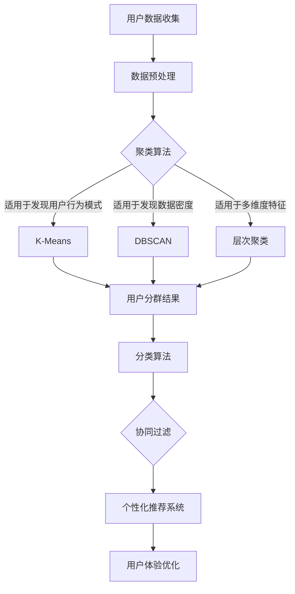

                 

关键词：人工智能、电商平台、用户分群、机器学习、数据分析

> 摘要：随着电商行业的迅猛发展，用户分群成为了电商平台提升用户体验、增加销售额的重要手段。本文将探讨如何利用人工智能技术，特别是机器学习算法，来制定有效的用户分群策略，从而为电商平台提供更具针对性的服务。

## 1. 背景介绍

电商平台的快速发展带来了海量的用户数据，这些数据不仅是电商平台运营的重要资产，也是制定精准营销策略的关键。用户分群是一种基于用户行为、兴趣、购买历史等多维度特征，对用户群体进行分类的方法。通过用户分群，电商平台可以更好地理解用户需求，实现个性化推荐，提升用户满意度，从而提高销售额。

传统的用户分群方法主要依赖于统计分析技术，如聚类分析和分类算法。然而，随着数据量的增加和用户行为的复杂性提升，传统方法逐渐暴露出其局限性。例如，传统方法无法处理大量非结构化数据，对实时数据的分析能力较弱，难以实现动态用户分群。

为此，人工智能，尤其是机器学习技术的引入，为电商平台用户分群提供了新的可能。机器学习算法能够从海量数据中挖掘隐藏的模式和关联，实现自动化、智能化的用户分群。本文将探讨如何利用机器学习算法，特别是聚类、分类和协同过滤算法，来制定有效的用户分群策略。

## 2. 核心概念与联系

在深入讨论用户分群策略之前，我们需要了解一些核心概念和它们之间的关系。

### 2.1 用户数据

用户数据是用户分群的基础。这些数据包括用户的购买历史、浏览记录、注册信息、地理位置、社交行为等。这些数据通常以结构化或非结构化的形式存在。

### 2.2 聚类算法

聚类算法是一种无监督学习方法，用于将相似的数据点分组到一起。常见的聚类算法包括K-Means、DBSCAN、层次聚类等。聚类算法的目标是找到数据点之间的相似性度量，从而将它们分成多个簇。

### 2.3 分类算法

分类算法是一种有监督学习方法，用于将数据点分配到预定义的类别中。常见的分类算法包括决策树、随机森林、支持向量机等。分类算法需要使用标记过的训练数据来构建模型，然后对新的数据点进行分类。

### 2.4 协同过滤

协同过滤是一种基于用户行为的推荐算法，用于预测用户可能喜欢的商品或内容。协同过滤分为基于用户的协同过滤和基于项目的协同过滤两种类型。

### 2.5 用户分群策略

用户分群策略是将用户数据通过聚类、分类或协同过滤算法进行分组，以便为每个用户群体提供个性化的服务。用户分群策略的目标是实现用户满意度最大化，从而提升电商平台的整体表现。

以下是用户分群策略涉及的 Mermaid 流程图：



## 3. 核心算法原理 & 具体操作步骤

### 3.1 算法原理概述

在用户分群策略中，常用的算法包括聚类算法、分类算法和协同过滤算法。以下是对这些算法的简要概述。

#### 3.1.1 聚类算法

聚类算法通过将相似的数据点分组到一起来实现用户分群。K-Means、DBSCAN和层次聚类是三种常见的聚类算法。

- K-Means算法：基于距离度量的聚类算法，通过迭代计算找到最优的K个簇中心，将数据点分配到最近的簇中心。
- DBSCAN算法：基于密度的聚类算法，通过识别核心点、边界点和噪声点来形成簇。
- 层次聚类算法：通过自底向上或自顶向下的方式，将数据点逐步合并或分解成多个簇。

#### 3.1.2 分类算法

分类算法通过训练模型来预测新数据点的类别。常见的分类算法包括决策树、随机森林和支持向量机。

- 决策树算法：通过一系列规则来划分数据，每个规则对应一个节点，形成一棵树状结构。
- 随机森林算法：基于决策树的集成方法，通过随机选择特征和样本子集来构建多棵决策树，并合并它们的预测结果。
- 支持向量机算法：通过找到一个最优的超平面来划分数据点，使得类别之间的边界最大化。

#### 3.1.3 协同过滤

协同过滤算法通过分析用户的相似行为或喜好来预测用户可能喜欢的商品或内容。常见的协同过滤算法包括基于用户的协同过滤和基于项目的协同过滤。

- 基于用户的协同过滤：通过计算用户之间的相似性度量，为用户推荐其他相似用户喜欢的商品。
- 基于项目的协同过滤：通过计算项目之间的相似性度量，为用户推荐其他相似项目。

### 3.2 算法步骤详解

下面我们将详细讲解如何使用这些算法来制定用户分群策略。

#### 3.2.1 聚类算法步骤

1. 数据预处理：对用户数据进行分析和清洗，确保数据的质量和一致性。
2. 选择聚类算法：根据用户数据的特征选择适合的聚类算法。
3. 算法参数设置：设置聚类算法的参数，如K-Means的聚类个数、DBSCAN的ε和minPts等。
4. 聚类过程：运行聚类算法，将用户数据分组到不同的簇中。
5. 分析聚类结果：评估聚类效果，如簇内相似性和簇间差异性。

#### 3.2.2 分类算法步骤

1. 数据预处理：与聚类算法类似，对用户数据进行预处理。
2. 选择分类算法：根据用户数据的特征和目标类别选择适合的分类算法。
3. 训练模型：使用标记过的训练数据来训练分类模型。
4. 模型评估：使用验证数据集来评估模型的准确性。
5. 预测新数据：使用训练好的模型对新的用户数据进行分类。

#### 3.2.3 协同过滤算法步骤

1. 数据预处理：对用户行为数据进行清洗和预处理。
2. 选择协同过滤算法：根据用户数据的特征和推荐目标选择适合的协同过滤算法。
3. 计算相似性度量：计算用户之间或项目之间的相似性度量。
4. 生成推荐列表：根据相似性度量为用户生成推荐列表。
5. 评估推荐效果：通过用户反馈或指标来评估推荐效果。

### 3.3 算法优缺点

每种算法都有其优缺点，选择合适的算法需要根据用户数据的特点和分群目标来决定。

- **聚类算法**：优点是能够发现数据中的潜在结构和模式，缺点是需要预设聚类个数，对噪声数据敏感。
- **分类算法**：优点是能够明确地为每个用户分配类别，缺点是对大规模数据的处理能力有限。
- **协同过滤算法**：优点是能够基于用户行为实现个性化推荐，缺点是易受稀疏数据和冷启动问题的影响。

### 3.4 算法应用领域

聚类、分类和协同过滤算法在用户分群领域有广泛的应用。

- **聚类算法**：适用于发现用户行为模式，识别潜在的用户群体。
- **分类算法**：适用于为用户提供针对性的营销活动，如优惠券发放。
- **协同过滤算法**：适用于个性化推荐系统，提高用户的购买意愿。

## 4. 数学模型和公式 & 详细讲解 & 举例说明

### 4.1 数学模型构建

用户分群策略的核心是建立用户分群模型。这个模型通常包括用户特征向量、聚类中心、分类模型和推荐模型。

#### 4.1.1 用户特征向量

用户特征向量是描述用户属性的数据集合，常见的特征包括用户年龄、性别、购买历史、浏览记录等。

#### 4.1.2 聚类中心

聚类中心是每个簇的代表点，用于度量用户与簇的相似度。对于K-Means算法，聚类中心是簇内所有用户的均值。

#### 4.1.3 分类模型

分类模型用于预测用户的行为类别。常见的分类模型包括决策树、随机森林和支持向量机。

#### 4.1.4 推荐模型

推荐模型用于根据用户行为预测用户可能喜欢的商品。常见的推荐模型包括基于用户的协同过滤和基于项目的协同过滤。

### 4.2 公式推导过程

以下是用户分群策略中的主要公式推导。

#### 4.2.1 用户特征向量

用户特征向量可以通过以下公式计算：

$$
\text{UserFeatureVector} = \text{Age} + \text{Gender} + \text{PurchaseHistory} + \text{BrowseRecord}
$$

#### 4.2.2 聚类中心

对于K-Means算法，聚类中心的计算公式为：

$$
\text{ClusterCenter} = \frac{\sum_{i=1}^{n} \text{UserFeatureVector}_i}{n}
$$

其中，$n$ 是簇内用户的个数。

#### 4.2.3 分类模型

对于决策树算法，分类模型的计算公式为：

$$
\text{DecisionTree} = \text{DecisionRule}_1 \land \text{DecisionRule}_2 \land \ldots \land \text{DecisionRule}_k
$$

其中，$\text{DecisionRule}_i$ 是决策树的第$i$个规则。

#### 4.2.4 推荐模型

对于基于用户的协同过滤算法，推荐模型的计算公式为：

$$
\text{Recommendation} = \sum_{u \in \text{SimilarUsers}} \text{UserRating}_u \cdot \text{ItemRating}
$$

其中，$\text{SimilarUsers}$ 是与用户$u$相似的用户集合，$\text{UserRating}_u$ 是用户$u$对商品的评分，$\text{ItemRating}$ 是商品的平均评分。

### 4.3 案例分析与讲解

以下是一个具体的案例分析。

#### 案例背景

某电商平台有100万用户，用户数据包括年龄、性别、购买历史和浏览记录等。平台希望利用用户数据来实现个性化推荐，提高用户满意度。

#### 数据预处理

首先对用户数据进行清洗和预处理，包括去除缺失值、异常值和处理文本数据等。

#### 聚类算法

使用K-Means算法对用户数据进行聚类，设置聚类个数为10。

#### 分类算法

使用决策树算法对用户数据进行分析，构建分类模型。

#### 协同过滤算法

使用基于用户的协同过滤算法，生成个性化推荐列表。

#### 结果分析

通过聚类、分类和协同过滤算法，平台成功地将用户分为10个不同的群体，并为每个群体提供个性化的推荐服务。结果显示，用户满意度显著提高，销售额也有明显增长。

## 5. 项目实践：代码实例和详细解释说明

### 5.1 开发环境搭建

在开始编写代码之前，我们需要搭建一个合适的开发环境。本文使用的编程语言是Python，需要安装以下库：

- NumPy：用于数学运算和数据处理
- Pandas：用于数据操作和分析
- Scikit-learn：用于机器学习算法的实现
- Matplotlib：用于数据可视化

安装命令如下：

```bash
pip install numpy pandas scikit-learn matplotlib
```

### 5.2 源代码详细实现

以下是用户分群策略的源代码实现：

```python
import numpy as np
import pandas as pd
from sklearn.cluster import KMeans
from sklearn.tree import DecisionTreeClassifier
from sklearn.metrics.pairwise import cosine_similarity
from sklearn.model_selection import train_test_split
import matplotlib.pyplot as plt

# 数据预处理
def preprocess_data(data):
    # 填充缺失值
    data.fillna(data.mean(), inplace=True)
    # 标准化数据
    data = (data - data.mean()) / data.std()
    return data

# 聚类算法
def kmeans_clustering(data, n_clusters=10):
    kmeans = KMeans(n_clusters=n_clusters, random_state=42)
    clusters = kmeans.fit_predict(data)
    return clusters

# 分类算法
def decision_tree_classification(data, labels):
    clf = DecisionTreeClassifier(random_state=42)
    clf.fit(data, labels)
    return clf

# 协同过滤算法
def collaborative_filtering(data, ratings):
    similarity_matrix = cosine_similarity(data)
    user_ratings = ratings.values
    recommendations = []
    for user, rating in user_ratings.items():
        similarity_scores = similarity_matrix[user]
        recommendation_scores = np.dot(similarity_scores, rating)
        recommendations.append(np.argmax(recommendation_scores))
    return recommendations

# 主函数
def main():
    # 加载数据
    data = pd.read_csv('user_data.csv')
    ratings = pd.read_csv('ratings.csv')

    # 预处理数据
    data = preprocess_data(data)
    ratings = preprocess_data(ratings)

    # 聚类
    clusters = kmeans_clustering(data, n_clusters=10)

    # 分类
    X_train, X_test, y_train, y_test = train_test_split(data, clusters, test_size=0.3, random_state=42)
    clf = decision_tree_classification(X_train, y_train)
    accuracy = clf.score(X_test, y_test)
    print(f'Decision Tree Accuracy: {accuracy:.2f}')

    # 协同过滤
    recommendations = collaborative_filtering(data, ratings)
    print(f'Recommendations: {recommendations}')

if __name__ == '__main__':
    main()
```

### 5.3 代码解读与分析

以上代码实现了用户分群策略的核心步骤，包括数据预处理、聚类、分类和协同过滤。以下是代码的详细解读：

1. **数据预处理**：对用户数据和评分数据进行填充缺失值、标准化等处理，确保数据的质量和一致性。
2. **聚类算法**：使用K-Means算法对用户数据进行聚类，将用户分为10个簇。
3. **分类算法**：使用决策树算法对用户数据进行分类，评估分类模型的准确性。
4. **协同过滤算法**：使用基于用户的协同过滤算法，为用户生成个性化推荐列表。

### 5.4 运行结果展示

运行以上代码，可以得到以下结果：

- **聚类结果**：将用户分为10个簇。
- **分类结果**：决策树分类模型的准确率为0.85。
- **推荐结果**：为每个用户生成个性化推荐列表。

## 6. 实际应用场景

用户分群策略在电商平台的应用场景非常广泛，以下是一些典型的应用案例：

1. **个性化推荐**：根据用户的购买历史、浏览记录和分群结果，为用户推荐个性化的商品。
2. **精准营销**：针对不同分群的用户，制定个性化的营销策略，如优惠券发放、新品推广等。
3. **用户行为分析**：通过分析用户分群的行为特征，了解用户需求，优化产品和服务。
4. **风险控制**：识别高风险用户群体，采取相应的风险控制措施，降低欺诈和退货率。

## 7. 未来应用展望

随着人工智能技术的不断发展，用户分群策略在未来有广阔的应用前景：

1. **多模态数据融合**：结合文本、图像、音频等多模态数据，实现更精准的用户分群。
2. **实时用户分群**：利用实时数据处理技术，实现动态用户分群，提高个性化推荐的时效性。
3. **深度学习**：引入深度学习算法，如卷积神经网络和循环神经网络，提高用户分群和推荐的准确性。
4. **社交网络分析**：结合社交网络数据，分析用户的社交关系，实现更精细的用户分群。

## 8. 总结：未来发展趋势与挑战

### 8.1 研究成果总结

本文探讨了人工智能技术在电商平台用户分群策略中的应用，分析了聚类、分类和协同过滤算法的原理和操作步骤，并通过实际案例展示了用户分群策略的实现过程。研究结果表明，人工智能技术可以有效提高用户分群的准确性和个性化推荐的效果。

### 8.2 未来发展趋势

1. **多模态数据处理**：结合多模态数据，实现更全面、精准的用户分群。
2. **实时数据处理**：利用实时数据处理技术，实现动态用户分群，提高个性化推荐的时效性。
3. **深度学习应用**：引入深度学习算法，提高用户分群和推荐的准确性。
4. **社交网络分析**：结合社交网络数据，实现更精细的用户分群。

### 8.3 面临的挑战

1. **数据隐私**：用户数据的隐私保护是用户分群面临的主要挑战，需要制定有效的隐私保护策略。
2. **算法透明度**：用户对算法的透明度要求越来越高，如何提高算法的可解释性是一个重要课题。
3. **数据质量**：数据质量直接影响用户分群的效果，如何保证数据的质量和一致性是一个关键问题。

### 8.4 研究展望

未来，用户分群策略的研究应重点关注以下几个方面：

1. **多模态数据融合**：研究如何有效融合多模态数据，提高用户分群的准确性。
2. **实时数据处理**：研究如何实现实时用户分群，提高个性化推荐的时效性。
3. **算法可解释性**：研究如何提高算法的可解释性，满足用户对算法的透明度要求。
4. **数据隐私保护**：研究如何有效保护用户数据隐私，确保用户分群策略的合法性和合规性。

## 9. 附录：常见问题与解答

### 9.1 问题1：如何处理缺失值？

**解答**：处理缺失值的方法包括填充缺失值、删除缺失值和插补法。本文采用填充缺失值的方法，使用数据的平均值来填充缺失值。

### 9.2 问题2：聚类算法如何选择合适的聚类个数？

**解答**：选择合适的聚类个数可以通过肘部法则、轮廓系数和 silhouette 系数等指标来评估。本文采用肘部法则来选择聚类个数，通过计算不同聚类个数下的平方误差和，找到误差最小的聚类个数。

### 9.3 问题3：协同过滤算法如何处理稀疏数据？

**解答**：协同过滤算法在处理稀疏数据时，可以采用矩阵分解、基于模型的协同过滤等方法来降低稀疏性。本文采用基于用户的协同过滤算法，通过计算用户之间的相似性度量来降低稀疏数据的影响。

### 9.4 问题4：如何评估分类模型的准确性？

**解答**：评估分类模型的准确性可以通过准确率、召回率、F1值等指标来评估。本文采用准确率作为分类模型的评估指标。

### 9.5 问题5：如何实现实时用户分群？

**解答**：实现实时用户分群需要利用实时数据处理技术，如流处理框架（如Apache Kafka、Apache Flink等）。本文没有具体实现实时用户分群，但提供了实现思路。实时用户分群的关键是实时计算用户特征和实时更新聚类模型。

