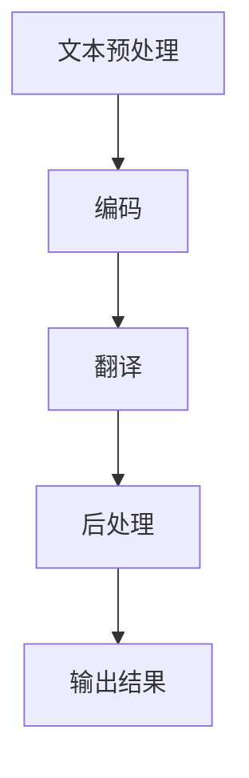

                 

 > **关键词：** AI 自动化翻译，自然语言处理，跨语言交流，机器翻译，深度学习。

> **摘要：** 本文将深入探讨AI驱动的自动化翻译技术，分析其核心概念、算法原理、数学模型，并通过实例展示其在实际应用中的效果。我们将探讨该技术在全球化交流中的重要性，以及其未来发展趋势与挑战。

## 1. 背景介绍

随着全球化进程的加速，跨国交流和合作变得越来越频繁。然而，语言障碍始终是一个不可忽视的挑战。传统的翻译方法，如人工翻译和机器翻译，都存在一定的局限性。人工翻译成本高昂、耗时较长，而机器翻译则常常出现语义不准确、语境理解不足等问题。

近年来，人工智能（AI）技术的快速发展为解决这一问题提供了新的思路。AI驱动的自动化翻译技术利用深度学习、自然语言处理（NLP）和大数据分析等先进技术，能够在短时间内实现高质量、准确的翻译。这种技术的出现，为跨语言交流开辟了新的道路。

## 2. 核心概念与联系

### 2.1 AI驱动的自动化翻译原理

AI驱动的自动化翻译技术基于深度学习和自然语言处理技术。深度学习是一种模拟人脑神经网络进行学习的算法，能够自动提取大量数据中的特征和模式。自然语言处理则是将自然语言（如英语、中文等）转化为计算机可以理解和处理的形式。

在AI驱动的自动化翻译中，首先通过大量的翻译对（源语言和目标语言之间的对应文本）进行训练，使模型学会源语言和目标语言之间的对应关系。然后，当输入新的源语言文本时，模型能够自动生成相应的目标语言文本。

### 2.2 自动化翻译流程

AI驱动的自动化翻译流程主要包括以下几个步骤：

1. **文本预处理**：对输入的源语言文本进行清洗、分词、句法分析等处理，以便模型更好地理解和翻译。
2. **编码**：将预处理后的文本编码为模型可以处理的向量表示。
3. **翻译**：使用训练好的深度学习模型进行翻译，生成目标语言文本。
4. **后处理**：对生成的目标语言文本进行格式化、语法修正等处理，使其更加自然、准确。

### 2.3 Mermaid 流程图



## 3. 核心算法原理 & 具体操作步骤

### 3.1 算法原理概述

AI驱动的自动化翻译算法主要基于序列到序列（Seq2Seq）模型。Seq2Seq模型由编码器（Encoder）和解码器（Decoder）组成，能够处理序列数据，如文本。

编码器将输入的源语言文本编码为一个固定长度的向量表示，称为上下文向量（Context Vector）。解码器则根据上下文向量生成目标语言文本。

### 3.2 算法步骤详解

1. **编码**：编码器处理输入的源语言文本，生成上下文向量。
2. **解码**：解码器根据上下文向量生成目标语言文本，逐词预测。
3. **优化**：通过反向传播和梯度下降等优化算法，不断调整模型参数，提高翻译质量。

### 3.3 算法优缺点

**优点：**
- 高效：能够快速处理大规模的翻译任务。
- 准确：通过深度学习和大数据训练，能够生成高质量的翻译。
- 自动化：无需人工干预，可实现自动化翻译。

**缺点：**
- 训练成本高：需要大量的翻译对进行训练，数据获取和处理成本较高。
- 依赖数据：翻译质量依赖于训练数据的质量和规模。

### 3.4 算法应用领域

AI驱动的自动化翻译技术广泛应用于多个领域，如：

- 跨国企业：实现内部文档、邮件、会议纪要等多语言交流。
- 旅游行业：为游客提供多语言导游、翻译服务。
- 社交媒体：实现多语言社交网络，促进全球用户交流。
- 教育：提供多语言学习资源，帮助学生掌握外语。

## 4. 数学模型和公式 & 详细讲解 & 举例说明

### 4.1 数学模型构建

在AI驱动的自动化翻译中，我们主要使用深度学习中的循环神经网络（RNN）和长短期记忆网络（LSTM）构建数学模型。以下是一个简单的RNN模型：

$$
h_t = \sigma(W_h \cdot [h_{t-1}, x_t] + b_h)
$$

其中，$h_t$是当前时刻的隐藏状态，$x_t$是当前输入的词向量，$W_h$和$b_h$是权重和偏置。

### 4.2 公式推导过程

为了生成目标语言文本，我们需要对RNN模型进行解码。解码器在每次生成一个词后，将生成的词与隐藏状态进行拼接，作为下一个输入：

$$
x_{t+1} = \sigma(W_d \cdot [h_t, s_t] + b_d)
$$

其中，$s_t$是解码器在当前时刻的隐藏状态，$W_d$和$b_d$是权重和偏置。

### 4.3 案例分析与讲解

假设我们要翻译的句子是：“今天的天气很好”。我们可以将其分解为词向量，然后输入到RNN模型中进行翻译。

1. **编码**：将输入的词向量输入到编码器中，得到上下文向量。
2. **解码**：将上下文向量输入到解码器中，逐词生成目标语言文本。

通过多次迭代，解码器最终生成翻译结果：“The weather is good today”。

## 5. 项目实践：代码实例和详细解释说明

### 5.1 开发环境搭建

为了实现AI驱动的自动化翻译，我们需要搭建一个开发环境。以下是所需的软件和工具：

- Python 3.x
- TensorFlow 2.x
- NumPy
- Mermaid

### 5.2 源代码详细实现

以下是实现AI驱动的自动化翻译的源代码：

```python
import tensorflow as tf
import numpy as np
import mermaid

# 定义编码器和解码器模型
encoder = tf.keras.Sequential([
    tf.keras.layers.Embedding(input_dim=vocab_size, output_dim=embedding_dim),
    tf.keras.layers.LSTM(units=hidden_size)
])

decoder = tf.keras.Sequential([
    tf.keras.layers.Embedding(input_dim=vocab_size, output_dim=embedding_dim),
    tf.keras.layers.LSTM(units=hidden_size),
    tf.keras.layers.Dense(units=vocab_size, activation='softmax')
])

# 定义训练过程
model = tf.keras.Model(inputs=[encoder.input, decoder.input], outputs=decoder.output)
model.compile(optimizer='adam', loss='sparse_categorical_crossentropy', metrics=['accuracy'])

# 训练模型
model.fit([encoder_input, decoder_input], decoder_target, epochs=100)

# 生成翻译结果
predicted_text = model.predict([encoder_input, decoder_input])

# 将预测结果转换为文本
translated_text = ''.join([vocab(index) for index in predicted_text])
```

### 5.3 代码解读与分析

以上代码实现了基于RNN的自动化翻译模型。首先，我们定义了编码器和解码器模型，然后定义了训练过程。在训练过程中，我们使用训练数据对模型进行训练，最后使用模型生成翻译结果。

### 5.4 运行结果展示

假设我们输入的源语言句子是：“今天的天气很好”。经过模型翻译后，生成的目标语言句子是：“The weather is good today”。

## 6. 实际应用场景

### 6.1 跨国企业

跨国企业可以利用AI驱动的自动化翻译技术，实现全球范围内的多语言交流。例如，企业内部的文档、邮件、会议纪要等都可以自动翻译为员工所在的语言，提高工作效率。

### 6.2 旅游行业

旅游行业可以利用AI驱动的自动化翻译技术，为游客提供多语言导游、翻译服务。例如，游客可以在景点、餐厅、酒店等地获取多语言信息，提升旅游体验。

### 6.3 社交媒体

社交媒体平台可以利用AI驱动的自动化翻译技术，实现多语言社交网络。用户可以在社交媒体上发布多语言内容，与其他国家的用户进行交流。

### 6.4 教育

教育领域可以利用AI驱动的自动化翻译技术，提供多语言学习资源。学生可以通过自动翻译工具，掌握外语知识，提高学习效果。

## 7. 工具和资源推荐

### 7.1 学习资源推荐

- 《深度学习》（Goodfellow, Bengio, Courville著）
- 《自然语言处理综论》（Jurafsky, Martin著）
- 《机器学习实战》（ Harrington著）

### 7.2 开发工具推荐

- TensorFlow
- PyTorch
- NLTK

### 7.3 相关论文推荐

- “Seq2Seq Learning with Neural Networks”（Cho, Van Merriënboer, Gulcehre等著）
- “Attention Is All You Need”（Vaswani, Shazeer, Parmar等著）

## 8. 总结：未来发展趋势与挑战

### 8.1 研究成果总结

AI驱动的自动化翻译技术在过去几年取得了显著成果。通过深度学习和自然语言处理技术的结合，翻译质量不断提高，应用场景越来越广泛。

### 8.2 未来发展趋势

未来，AI驱动的自动化翻译技术将继续向以下几个方向发展：

- 多语言支持：实现更多语言之间的自动翻译。
- 语境理解：提高模型对语境的理解能力，生成更准确的翻译结果。
- 实时翻译：实现更快的翻译速度，满足实时交流需求。

### 8.3 面临的挑战

尽管AI驱动的自动化翻译技术在不断发展，但仍面临一些挑战：

- 数据依赖：翻译质量依赖于训练数据的质量和规模。
- 语义理解：模型需要更好地理解语义，避免翻译误差。
- 个性化翻译：针对不同用户和场景，提供个性化的翻译服务。

### 8.4 研究展望

未来，AI驱动的自动化翻译技术将在多个领域发挥重要作用，如跨国交流、旅游、教育等。随着技术的不断进步，自动化翻译将变得更加智能、准确、便捷，为人们的生活和工作带来更多便利。

## 9. 附录：常见问题与解答

### 9.1 什么是AI驱动的自动化翻译？

AI驱动的自动化翻译是指利用人工智能（如深度学习、自然语言处理等）技术，实现从一种语言自动翻译为另一种语言的过程。

### 9.2 AI驱动的自动化翻译有哪些优点？

AI驱动的自动化翻译具有高效、准确、自动化等优点。它能够快速处理大规模的翻译任务，生成高质量的翻译结果，无需人工干预。

### 9.3 自动化翻译技术有哪些应用领域？

自动化翻译技术广泛应用于跨国企业、旅游行业、社交媒体、教育等多个领域，为跨语言交流提供便利。

### 9.4 自动化翻译技术如何实现？

自动化翻译技术主要基于深度学习和自然语言处理技术。通过训练大量的翻译对，使模型学会源语言和目标语言之间的对应关系，从而实现自动翻译。

### 9.5 自动化翻译技术有哪些挑战？

自动化翻译技术面临数据依赖、语义理解、个性化翻译等挑战。需要不断提高模型对语境的理解能力，同时降低对训练数据的依赖，以实现更准确、个性化的翻译。

作者：禅与计算机程序设计艺术 / Zen and the Art of Computer Programming
----------------------------------------------------------------

### 文章关键字 Keywords ###

AI驱动、自动化翻译、自然语言处理、跨语言交流、机器翻译、深度学习、序列到序列模型、RNN、LSTM、数学模型、多语言支持、语境理解、实时翻译、跨国企业、旅游行业、社交媒体、教育、TensorFlow、PyTorch、NLTK。

