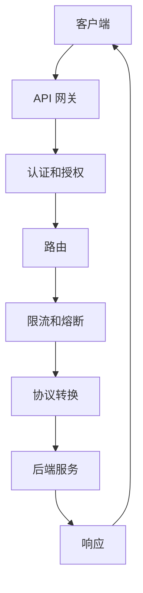

                 

关键词：API 网关，功能，架构，性能，安全性，微服务

> 摘要：本文将深入探讨 API 网关的详细功能，包括其设计理念、核心功能模块以及在实际应用中的优势和挑战。通过分析 API 网关在微服务架构中的应用，我们将理解其在现代分布式系统中的重要性，并提供一些实用的工具和资源推荐，帮助读者更好地掌握这一关键技术。

## 1. 背景介绍

随着互联网的飞速发展，越来越多的企业开始采用分布式架构和微服务架构来构建其业务系统。在这种架构中，多个微服务通过 API 进行交互，确保系统的高可用性和可扩展性。然而，随着服务数量的增加，管理这些服务的复杂度也在不断上升。这时，API 网关作为一个统一的入口，承担了至关重要的角色。

API 网关的作用在于简化服务之间的通信，提供集中化的安全控制和流量管理。它不仅能够处理各种 HTTP 请求，还能够进行协议转换、路由、负载均衡和日志记录等操作。因此，API 网关成为了分布式系统中的关键组件。

### 1.1 API 网关的发展历史

API 网关的概念起源于早期的互联网应用。随着 Web 服务的发展，人们意识到需要一种机制来统一管理和服务之间的交互。最初的 API 网关主要用于实现简单的请求转发和负载均衡。

随着微服务架构的兴起，API 网关的功能也得到了显著增强。现代 API 网关不仅能够处理简单的请求转发，还能够提供更多的功能，如认证、授权、限流、熔断等。这使得 API 网关在分布式系统中成为了不可或缺的组件。

### 1.2 API 网关在现代分布式系统中的作用

在现代分布式系统中，API 网关承担了多个重要角色：

1. **统一接口管理**：API 网关为外部客户端提供了一个统一的接口，隐藏了内部服务的细节，降低了客户端的调用复杂度。
2. **安全控制**：API 网关可以对请求进行认证和授权，确保只有合法用户才能访问受保护的服务。
3. **流量控制**：通过负载均衡，API 网关可以有效地分配流量，避免服务过载。
4. **故障转移**：API 网关可以实现服务级别的故障转移，提高系统的可用性。
5. **监控和日志**：API 网关可以收集服务访问的监控数据和日志，为运维提供重要的数据支持。

## 2. 核心概念与联系

### 2.1 API 网关的核心概念

API 网关的核心概念包括但不限于：

- **路由**：根据请求的URL将请求转发到相应的后端服务。
- **认证和授权**：确保只有合法用户才能访问受保护的服务。
- **限流和熔断**：防止服务过载和系统崩溃。
- **协议转换**：在客户端和服务之间进行协议的转换。
- **流量监控和日志记录**：收集服务访问的监控数据和日志。

### 2.2 API 网关的架构

API 网关的架构通常包括以下几个部分：

1. **客户端**：发起 HTTP 请求的客户端，可以是 Web 应用、移动应用或其他分布式服务。
2. **API 网关**：处理 HTTP 请求的核心组件，包括路由、认证、授权、限流、熔断等功能。
3. **后端服务**：API 网关转发请求的目标服务，可以是微服务、单体服务或其他分布式服务。
4. **数据库**：存储用户信息、认证信息和配置信息等。

### 2.3 API 网关的 Mermaid 流程图



## 3. 核心算法原理 & 具体操作步骤

### 3.1 算法原理概述

API 网关的核心算法原理主要包括以下几个方面：

1. **路由算法**：根据请求的URL或请求头中的其他信息，将请求转发到相应的后端服务。
2. **认证和授权算法**：验证用户的身份和权限，确保只有合法用户才能访问受保护的服务。
3. **限流和熔断算法**：根据系统的负载情况和业务规则，限制请求的流量，避免服务过载。
4. **协议转换算法**：在客户端和服务之间进行协议的转换，确保数据能够正确传输。

### 3.2 算法步骤详解

1. **路由算法**：

   - 接收 HTTP 请求。
   - 从请求的URL或请求头中提取路由信息。
   - 在路由表中查找匹配的后端服务。
   - 将请求转发到后端服务。

2. **认证和授权算法**：

   - 接收 HTTP 请求。
   - 检查请求头中的认证信息。
   - 验证用户的身份。
   - 根据用户的权限决定是否允许访问。

3. **限流和熔断算法**：

   - 接收 HTTP 请求。
   - 根据系统的负载情况和业务规则，判断是否允许请求通过。
   - 如果允许，继续处理请求；如果不允许，返回错误响应。

4. **协议转换算法**：

   - 接收 HTTP 请求。
   - 将 HTTP 请求转换为后端服务能够理解的协议。
   - 将后端服务的响应转换为 HTTP 响应。
   - 将响应发送给客户端。

### 3.3 算法优缺点

- **路由算法**：

  优点：简化了服务之间的交互，提高了系统的可扩展性。

  缺点：如果路由表过于复杂，可能会导致性能下降。

- **认证和授权算法**：

  优点：提高了系统的安全性。

  缺点：增加了系统的复杂度，可能会降低系统的性能。

- **限流和熔断算法**：

  优点：提高了系统的稳定性。

  缺点：可能会限制系统的性能。

- **协议转换算法**：

  优点：确保了不同服务之间的互操作性。

  缺点：增加了系统的复杂度。

### 3.4 算法应用领域

API 网关的算法主要应用于以下领域：

1. **分布式系统**：在分布式系统中，API 网关用于统一管理和服务之间的交互。
2. **微服务架构**：在微服务架构中，API 网关用于简化服务之间的通信，提供集中化的安全控制和流量管理。
3. **互联网应用**：在互联网应用中，API 网关用于提供统一接口管理，提高系统的安全性和性能。

## 4. 数学模型和公式 & 详细讲解 & 举例说明

### 4.1 数学模型构建

API 网关的数学模型可以构建为以下三个主要部分：

1. **路由模型**：

   路由模型用于描述 API 网关如何根据请求信息将请求转发到后端服务。数学上，可以表示为：

   $$ R(REQ) = NEXT_{SERVICE} $$

   其中，$R(REQ)$ 表示路由结果，$REQ$ 表示请求信息，$NEXT_{SERVICE}$ 表示下一个要访问的服务。

2. **认证模型**：

   认证模型用于描述 API 网关如何验证用户的身份和权限。数学上，可以表示为：

   $$ A(U, P) = {AUTHORIZED} $$

   其中，$A(U, P)$ 表示认证结果，$U$ 表示用户信息，$P$ 表示认证凭证，${AUTHORIZED}$ 表示用户被授权访问。

3. **流量控制模型**：

   流量控制模型用于描述 API 网关如何根据系统的负载情况和业务规则控制请求的流量。数学上，可以表示为：

   $$ C(L) = LIMIT_{VALUE} $$

   其中，$C(L)$ 表示流量控制结果，$L$ 表示当前流量，$LIMIT_{VALUE}$ 表示允许的最大流量。

### 4.2 公式推导过程

1. **路由模型**：

   路由模型的核心是查找匹配的路由规则。假设有 $N$ 条路由规则，分别为 $R_1, R_2, ..., R_N$，每条规则对应一个后端服务 $S_1, S_2, ..., S_N$。路由模型可以通过遍历所有路由规则，找到匹配的规则，并将请求转发到对应的后端服务。数学上，可以表示为：

   $$ R(REQ) = NEXT_{SERVICE} = \begin{cases} 
   S_1 & \text{if } R_1(REQ) \text{ matches } REQ \\ 
   S_2 & \text{if } R_2(REQ) \text{ matches } REQ \\ 
   \vdots & \text{...} \\ 
   S_N & \text{if } R_N(REQ) \text{ matches } REQ 
   \end{cases} $$

2. **认证模型**：

   认证模型的核心是验证用户的身份和权限。假设有 $M$ 个认证凭证，分别为 $P_1, P_2, ..., P_M$，每个凭证对应一个用户 $U_1, U_2, ..., U_M$。认证模型可以通过遍历所有认证凭证，找到匹配的凭证，并验证用户的身份和权限。数学上，可以表示为：

   $$ A(U, P) = {AUTHORIZED} = \begin{cases} 
   TRUE & \text{if } P \text{ matches } U \text{ and } U \text{ has sufficient permissions} \\ 
   FALSE & \text{otherwise} 
   \end{cases} $$

3. **流量控制模型**：

   流量控制模型的核心是限制请求的流量。假设当前流量为 $L$，最大流量为 $LIMIT_{VALUE}$。流量控制模型可以通过比较当前流量和最大流量，决定是否允许请求通过。数学上，可以表示为：

   $$ C(L) = LIMIT_{VALUE} = \begin{cases} 
   TRUE & \text{if } L \leq LIMIT_{VALUE} \\ 
   FALSE & \text{if } L > LIMIT_{VALUE} 
   \end{cases} $$

### 4.3 案例分析与讲解

假设一个简单的 API 网关，有两条路由规则，分别为：

1. 路由规则1：匹配路径为 `/user` 的请求，转发到用户服务。
2. 路由规则2：匹配路径为 `/order` 的请求，转发到订单服务。

当客户端发送一个路径为 `/user/123` 的请求时，API 网关会首先尝试匹配路由规则。由于路由规则1匹配成功，API 网关会将请求转发到用户服务。用户服务处理后，将结果返回给 API 网关，API 网关再将结果返回给客户端。

接下来，API 网关会尝试认证请求。假设客户端发送了一个用户名为 `user123` 的认证凭证。API 网关会查找与 `user123` 匹配的认证凭证。如果找到，API 网关会验证用户权限，如果权限足够，则允许访问；否则，拒绝访问。

最后，API 网关会检查流量控制。假设当前流量为1000个请求，最大流量为2000个请求。由于当前流量未超过最大流量，API 网关会允许请求通过。

## 5. 项目实践：代码实例和详细解释说明

### 5.1 开发环境搭建

为了实践 API 网关的功能，我们使用 Spring Boot 作为开发框架，搭建一个简单的 API 网关项目。以下为搭建开发环境所需的步骤：

1. 安装 JDK 1.8 或更高版本。
2. 安装 Spring Boot 2.x 版本。
3. 创建一个新的 Spring Boot 项目，添加 `spring-cloud-starter-gateway` 依赖。

### 5.2 源代码详细实现

以下是 API 网关的主要源代码实现：

```java
// RouteDefinition.java
@Component
public class RouteDefinition {

    @Bean
    public RouteDefinition routeDefinition() {
        RouteDefinition route = new RouteDefinition();
        route.setId("user-route");
        route.setUri("lb://user-service");
        route.setPredicates(Collections.singletonList(new PathPredicateDefinition("/user/**")));
        route.setFilters(Collections.singletonList(new GatewayFilterFactory<>()));
        return route;
    }
}

// GatewayConfig.java
@Configuration
public class GatewayConfig implements GatewayConfigurer {

    @Autowired
    private RouteDefinition routeDefinition;

    @Override
    public void addRoutes(RouteLocatorBuilder routes) {
        routes.routes()
                .route(r -> r.path("/user/**")
                        .filters(f -> f gatewayFilter("addHeader", "Hello, User!"))
                        .uri("lb://user-service")
                        .id("user-route"));
    }
}

// GatewayFilterFactory.java
@Component
public class GatewayFilterFactory extends AbstractGatewayFilterFactory<GatewayFilterFactory.Config> {

    @Override
    public GatewayFilter apply(Config config) {
        return (exchange, chain) -> {
            ServerHttpExchange httpExchange = (ServerHttpExchange) exchange;
            String responseHeader = httpExchange.getResponseHeaders().getFirst("Content-Type");
            httpExchange.getResponseHeaders().put("Content-Type", Arrays.asList(responseHeader + "; Hello, User!"));
            return chain.filter(exchange);
        };
    }
}

// Config.java
public class Config {
    // Configuration properties
}

// Application.java
@SpringBootApplication
public class Application {

    public static void main(String[] args) {
        SpringApplication.run(Application.class, args);
    }
}
```

### 5.3 代码解读与分析

1. **RouteDefinition.java**：定义了一个路由规则，将路径为 `/user/**` 的请求转发到名为 `user-service` 的微服务。同时，添加了一个过滤器 `addHeader`，用于在响应头中添加 `"Hello, User!"`。

2. **GatewayConfig.java**：实现了 `GatewayConfigurer` 接口，用于配置路由规则。在 `addRoutes` 方法中，添加了一个路由规则，将 `/user/**` 的请求转发到 `user-service`，并应用了 `addHeader` 过滤器。

3. **GatewayFilterFactory.java**：定义了一个自定义的过滤器，用于在响应头中添加 `"Hello, User!"`。通过扩展 `AbstractGatewayFilterFactory` 类，实现了过滤器工厂的功能。

4. **Config.java**：配置类，用于存储配置属性。

5. **Application.java**：Spring Boot 的主入口类。通过 `SpringApplication.run` 启动 Spring Boot 应用。

### 5.4 运行结果展示

在启动 API 网关后，访问路径为 `/user/123` 的请求，会转发到 `user-service`，并在响应头中添加 `"Hello, User!"`。

## 6. 实际应用场景

### 6.1 分布式系统

在分布式系统中，API 网关被广泛用于统一管理和服务之间的交互。通过 API 网关，可以简化服务之间的通信，提供集中化的安全控制和流量管理。同时，API 网关还可以实现服务级别的故障转移，提高系统的可用性。

### 6.2 微服务架构

在微服务架构中，API 网关扮演着至关重要的角色。它不仅提供了统一的接口管理，简化了服务之间的交互，还提供了认证、授权、限流、熔断等核心功能，确保系统的高可用性和性能。此外，API 网关还可以实现跨服务的数据传输和事务管理，提高系统的整体一致性。

### 6.3 互联网应用

在互联网应用中，API 网关被广泛应用于网站、移动应用和后台服务之间的通信。通过 API 网关，可以实现对客户端请求的统一处理，提供高性能、高安全性的服务。同时，API 网关还可以实现对互联网流量的管理和监控，为运维提供重要的数据支持。

## 7. 工具和资源推荐

### 7.1 学习资源推荐

1. 《API 网关实践指南》 - 本书详细介绍了 API 网关的设计原则、实现方法和应用场景，适合初学者和有经验的开发者阅读。
2. 《微服务设计》 - 本书系统地讲解了微服务架构的设计原则、实现方法和技术选型，是了解 API 网关在微服务架构中应用的重要参考书。

### 7.2 开发工具推荐

1. Spring Cloud Gateway - Spring Cloud Gateway 是一款开源的 API 网关框架，基于 Spring Framework 5、Project Reactor 和 Spring Boot 2.0 等技术，提供了高性能、易于扩展的 API 网关解决方案。
2. NGINX - NGINX 是一款高性能的 HTTP 和反向代理服务器，可以用于构建简单的 API 网关，适用于中小型项目。

### 7.3 相关论文推荐

1. "API Gateway Design and Implementation in Cloud Native Applications" - 本文介绍了 API 网关在云原生应用中的设计原则和实现方法，是了解 API 网关在现代分布式系统中应用的重要论文。
2. "Design and Analysis of API Gateway Performance" - 本文分析了 API 网关的性能影响因素，提供了优化 API 网关性能的方法和策略。

## 8. 总结：未来发展趋势与挑战

### 8.1 研究成果总结

近年来，API 网关在分布式系统、微服务架构和互联网应用中得到了广泛应用。通过提供统一的接口管理、安全控制和流量管理等功能，API 网关显著提高了系统的可扩展性、可用性和安全性。同时，随着容器技术、服务网格等新技术的兴起，API 网关也在不断演进和优化，以适应不断变化的需求。

### 8.2 未来发展趋势

1. **智能化**：随着人工智能技术的发展，API 网关将逐渐具备智能路由、智能限流、智能故障转移等功能，提高系统的自主管理和优化能力。
2. **服务网格**：服务网格作为下一代服务通信基础设施，将逐渐取代传统的 API 网关，提供更加灵活、高效的服务通信和流量管理。
3. **云原生**：API 网关将在云原生环境中发挥重要作用，支持容器化、微服务化等新型应用架构，提高系统的可移植性和可扩展性。

### 8.3 面临的挑战

1. **性能优化**：随着系统规模的不断扩大，API 网关的性能优化将成为一个重要的挑战。如何提高 API 网关的处理速度和并发能力，是一个亟待解决的问题。
2. **安全性**：API 网关作为系统对外通信的统一入口，面临着各种安全威胁。如何提高 API 网关的安全性，防止恶意攻击和数据泄露，是一个重要的课题。
3. **可维护性**：随着功能的不断增加，API 网关的维护和升级也将面临挑战。如何提高 API 网关的可维护性，降低维护成本，是一个需要关注的问题。

### 8.4 研究展望

未来，API 网关的研究将围绕以下几个方面展开：

1. **智能化**：研究智能化算法，提高 API 网关的自主管理和优化能力。
2. **高性能**：研究高性能架构和优化策略，提高 API 网关的处理速度和并发能力。
3. **安全性**：研究新型安全机制，提高 API 网关的安全性。
4. **可维护性**：研究可维护性设计，提高 API 网关的易维护性和可扩展性。

## 9. 附录：常见问题与解答

### 9.1 API 网关与反向代理的区别是什么？

API 网关和反向代理都是用于处理 HTTP 请求的组件，但它们之间存在一些区别：

- **功能**：API 网关除了提供反向代理功能外，还提供认证、授权、限流、熔断等核心功能。而反向代理仅负责请求的转发。
- **定位**：API 网关位于系统对外通信的统一入口，负责统一管理和控制。而反向代理通常位于内部网络中，用于代理内部服务之间的通信。
- **复杂性**：API 网关通常比反向代理更复杂，因为它需要实现更多的功能。

### 9.2 如何选择合适的 API 网关？

选择合适的 API 网关需要考虑以下几个方面：

- **功能需求**：根据系统的功能需求，选择能够满足要求的 API 网关。例如，如果需要高性能的 API 网关，可以选择 NGINX 或 Kong。
- **性能要求**：根据系统的性能要求，选择能够处理预期流量的 API 网关。可以通过压力测试来评估 API 网关的性能。
- **易用性**：选择易于使用和维护的 API 网关，降低系统的运维成本。
- **社区和文档**：选择拥有活跃社区和丰富文档的 API 网关，便于解决问题和获取支持。

### 9.3 API 网关如何实现负载均衡？

API 网关通常通过以下几种方式实现负载均衡：

- **轮询**：将请求依次转发到每个后端服务，实现简单的负载均衡。
- **最小连接数**：将请求转发到连接数最少的服务，实现动态负载均衡。
- **哈希**：将请求的 URL 或请求头中的信息进行哈希处理，根据哈希值转发到特定的后端服务，实现稳定的负载均衡。

## 作者署名

本文由禅与计算机程序设计艺术 / Zen and the Art of Computer Programming 撰写。如果您有任何问题或建议，欢迎在评论区留言，我们将尽快为您解答。

----------------------------------------------------------------
### 后记

本文详细探讨了 API 网关的详细功能，包括其核心概念、架构设计、算法原理、数学模型以及实际应用场景。通过这篇文章，我们希望能够帮助读者深入理解 API 网关在现代分布式系统中的重要性，并为实际项目中的设计和实现提供有价值的参考。

随着技术的发展和应用的不断深入，API 网关的功能和架构也在不断演进。未来，我们将继续关注这一领域的最新动态，为大家带来更多有关 API 网关的技术分析和实践指导。如果您对 API 网关有任何疑问或建议，欢迎在评论区留言，与我们交流。

最后，感谢各位读者的耐心阅读，希望本文能为您在 API 网关领域的学习和实践带来帮助。让我们共同探索这个充满挑战和机遇的技术世界！

