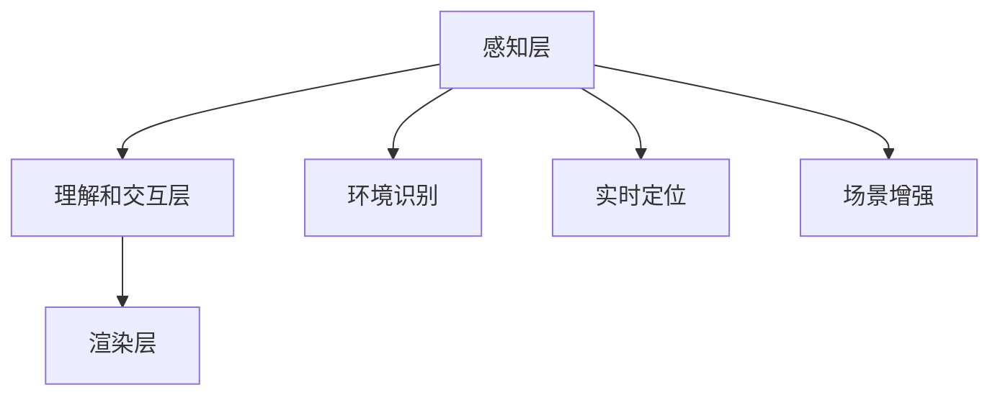

                 

关键词：增强现实（AR）、ARCore、Android开发、AR应用、开发工具

> 摘要：本文将深入探讨Google的ARCore开发工具，它为Android开发者提供了一个创建增强现实（AR）应用的强大平台。本文将介绍ARCore的核心概念、架构设计、算法原理以及如何通过具体实例来实践和优化AR应用开发。

## 1. 背景介绍

随着智能手机和处理器的性能不断提升，增强现实（AR）技术在移动设备上的应用越来越广泛。ARCore是Google推出的一款专为Android设备设计的增强现实开发平台，它为开发者提供了一套丰富的API和工具，使他们能够轻松地创建令人惊叹的AR应用。

ARCore的出现，极大地简化了AR应用的开发流程，使得开发者在没有深厚的计算机视觉背景的情况下也能快速上手。ARCore的核心优势在于它能够利用设备的摄像头、传感器和处理器，实现环境识别、实时定位和场景增强等功能。

本文将围绕ARCore的核心概念、架构设计、算法原理以及实际开发实践，为开发者提供全面的技术指导。

## 2. 核心概念与联系

### 2.1 ARCore的核心概念

- **环境识别（Environmental Recognition）**：通过摄像头捕捉周围环境，并识别和标记出特定的特征点，如纹理、形状等。
- **实时定位（Real-Time Location）**：利用设备内置的传感器，如GPS、加速度计和陀螺仪，实现对设备的精确位置和运动跟踪。
- **场景增强（Scene Augmentation）**：将虚拟物体叠加到现实环境中，实现与现实世界的无缝交互。

### 2.2 ARCore的架构设计

ARCore的架构设计分为三个主要层次：感知层、理解和交互层、渲染层。

- **感知层（Perception Layer）**：负责捕捉和处理设备周围的环境信息，如摄像头图像和传感器数据。
- **理解和交互层（Understanding and Interaction Layer）**：利用感知层获取的信息，实现环境识别和实时定位功能，并处理用户的交互输入。
- **渲染层（Rendering Layer）**：将理解和交互层生成的虚拟物体渲染到屏幕上，实现最终的用户界面。

### 2.3 Mermaid流程图

下面是一个简单的Mermaid流程图，展示了ARCore的核心概念和架构设计。



## 3. 核心算法原理 & 具体操作步骤

### 3.1 算法原理概述

ARCore的核心算法主要分为环境识别、实时定位和场景增强三个部分。

- **环境识别**：基于图像处理和计算机视觉技术，通过识别图像中的特征点，实现对环境的理解和标记。
- **实时定位**：利用传感器融合算法，对设备的位置和运动进行实时跟踪和预测，确保虚拟物体与现实世界的位置相对应。
- **场景增强**：通过渲染技术，将虚拟物体叠加到现实环境中，实现增强现实效果。

### 3.2 算法步骤详解

#### 3.2.1 环境识别

1. **图像捕获**：通过摄像头实时捕获周围环境图像。
2. **特征提取**：利用SIFT、SURF等算法提取图像中的关键特征点。
3. **特征匹配**：将当前图像中的特征点与已有特征点库进行匹配，识别出环境中的关键区域。

#### 3.2.2 实时定位

1. **传感器数据融合**：将GPS、加速度计、陀螺仪等传感器数据融合，计算出设备的实时位置和运动状态。
2. **运动预测**：利用卡尔曼滤波等算法，对设备的未来位置和运动进行预测。
3. **位置修正**：根据环境识别结果，对传感器数据中的位置信息进行修正，提高定位精度。

#### 3.2.3 场景增强

1. **虚拟物体建模**：根据开发者的需求，创建虚拟物体的三维模型。
2. **渲染引擎**：利用Unity、OpenGL等渲染引擎，将虚拟物体渲染到摄像头捕获的图像上。
3. **叠加显示**：将虚拟物体叠加到现实环境中，实现增强现实效果。

### 3.3 算法优缺点

- **优点**：ARCore提供了强大的API和工具，简化了AR应用的开发流程；支持多种设备，兼容性好。
- **缺点**：对设备性能有一定要求，较老旧的设备可能无法流畅运行AR应用。

### 3.4 算法应用领域

ARCore的应用领域广泛，包括但不限于：

- **教育**：通过AR技术，提供互动式的教学体验，使学生更好地理解和掌握知识。
- **医疗**：利用AR技术进行手术导航、病人教育等，提高医疗服务的质量和效率。
- **娱乐**：开发AR游戏、互动视频等，提供全新的娱乐体验。

## 4. 数学模型和公式 & 详细讲解 & 举例说明

### 4.1 数学模型构建

在ARCore中，数学模型主要涉及以下几个方面：

- **图像处理**：包括图像滤波、特征提取、特征匹配等。
- **传感器融合**：利用卡尔曼滤波、传感器数据融合算法等，实现设备的实时定位和运动跟踪。
- **三维建模和渲染**：涉及三维几何、纹理映射、光照模型等。

### 4.2 公式推导过程

以下是一个简单的卡尔曼滤波公式的推导：

$$
\hat{x}_{k|k} = \hat{x}_{k|k-1} + K_k (z_k - \hat{z}_k)
$$

其中，$\hat{x}_{k|k}$ 表示状态估计值，$K_k$ 表示卡尔曼增益，$z_k$ 表示观测值，$\hat{z}_k$ 表示预测值。

### 4.3 案例分析与讲解

假设我们开发一个简单的AR应用，用于在桌子上放置一个虚拟的茶杯。以下是一个简单的案例：

1. **环境识别**：通过摄像头捕捉桌子的图像，并使用特征提取算法找到桌面的边缘。
2. **实时定位**：利用传感器数据，计算设备的姿态和位置，确保茶杯放置在桌子的正确位置。
3. **场景增强**：创建一个茶杯的三维模型，并使用渲染引擎将其叠加到桌面上。

通过上述步骤，我们就可以实现一个简单的AR茶杯放置应用。

## 5. 项目实践：代码实例和详细解释说明

### 5.1 开发环境搭建

1. **安装Android Studio**：从[Android Studio官网](https://developer.android.com/studio)下载并安装Android Studio。
2. **创建ARCore项目**：打开Android Studio，创建一个新的Android项目，选择ARCore模板。
3. **配置ARCore SDK**：在项目的`build.gradle`文件中添加ARCore SDK依赖。

```gradle
dependencies {
    implementation 'com.google.ar:arcore-client:1.19.1'
}
```

### 5.2 源代码详细实现

以下是一个简单的ARCore应用，用于在摄像头视野中显示一个虚拟的立方体。

```java
import com.google.ar.core.Anchor;
import com.google.ar.core.AnchorNode;
import com.google.ar.core.ArSceneView;
import com.google.ar.core.Session;
import com.google.ar.core.Trackable;
import com.google.ar.core.TrackingState;
import com.google.ar.sceneform.AnchorNode;
import com.google.ar.sceneform.rendering.ModelRenderable;

public class ARCoreDemoActivity extends Activity {
    private ArSceneView arSceneView;
    private ModelRenderable renderable;

    @Override
    protected void onCreate(Bundle savedInstanceState) {
        super.onCreate(savedInstanceState);
        setContentView(R.layout.activity_ar_core_demo);

        arSceneView = (ArSceneView) findViewById(R.id.ar_scene_view);
        arSceneView.setRenderer(new SceneRenderer());

        // 创建模型
        ModelRenderable.builder()
                .setSource(this, R.raw.cube)
                .build()
                .thenAccept(this::onModelReady)
                .exceptionally(throwable -> {
                    Toast.makeText(this, "模型加载失败", Toast.LENGTH_SHORT).show();
                    return null;
                });
    }

    private void onModelReady(ModelRenderable model) {
        renderable = model;

        // 设置渲染器
        arSceneView.getScene().setRenderMode(ArSceneView.RENDER_MODE_CONTINUOUSLY);

        // 创建锚点并添加到场景中
        Anchor anchor = arSceneView.getSession().createAnchor(arSceneView.getTransform().getTranslation());
        AnchorNode anchorNode = new AnchorNode(anchor);
        anchorNode.setRenderable(renderable);
        arSceneView.getScene().addChild(anchorNode);
    }

    private class SceneRenderer implements ArSceneView.OnUpdateListener {
        @Override
        public void onUpdated oko
```t
            Session session = arSceneView.getSession();
            if (session == null) {
                return;
            }

            for (Trackable trackable : session.getAllTrackables()) {
                if (trackable.getTrackingState() == TrackingState.TRACKING) {
                    // 处理跟踪成功的trackable
                } else if (trackable.getTrackingState() == TrackingState.PAUSED) {
                    // 处理跟踪暂停的trackable
                } else if (trackable.getTrackingState() == TrackingState.STOPPED) {
                    // 处理跟踪停止的trackable
                }
            }
        }
    }
}
```

### 5.3 代码解读与分析

1. **创建ARSceneView**：在Activity中添加ARSceneView组件，并设置其Renderer为自定义的SceneRenderer。
2. **加载模型**：使用ModelRenderable.builder()加载立方体模型。
3. **创建锚点**：在onModelReady()方法中，创建一个锚点并添加到场景中。
4. **渲染场景**：在SceneRenderer的onUpdated()方法中，处理各种跟踪状态，确保虚拟立方体能够正确显示。

### 5.4 运行结果展示

运行该应用后，摄像头视野中会出现一个虚拟的立方体，随着设备的运动，立方体也会随之移动，实现增强现实效果。

## 6. 实际应用场景

ARCore在多个实际应用场景中展现出强大的功能，以下是一些典型的应用案例：

- **零售业**：通过ARCore，零售商可以在店内展示虚拟商品，让消费者能够实时看到商品的真实效果，提高购买决策的准确性。
- **教育**：ARCore可以用于开发互动教育应用，如虚拟实验室、虚拟历史场景等，让学生在虚拟环境中学习，增强学习体验。
- **医疗**：ARCore在医疗领域的应用也非常广泛，如手术导航、病人教育等，通过AR技术，医生可以更直观地了解患者的身体状况，提高手术的准确性和安全性。

## 7. 工具和资源推荐

### 7.1 学习资源推荐

- **官方文档**：[ARCore官方文档](https://developer.android.com/arcore)是学习ARCore的最佳起点，提供了详尽的API和教程。
- **在线课程**：多个在线教育平台提供了ARCore相关的课程，如Udacity、Coursera等，适合不同水平的开发者。

### 7.2 开发工具推荐

- **Android Studio**：官方推荐的Android开发环境，提供了强大的ARCore开发插件。
- **Unity**：流行的游戏开发引擎，支持ARCore，可用于开发复杂的AR应用。

### 7.3 相关论文推荐

- **"Augmented Reality on Mobile Devices: A Survey"**：对移动设备上AR技术的研究进行了全面的综述。
- **"ARCore: Building Augmented Reality Apps for Android"**：Google官方发布的ARCore技术指南。

## 8. 总结：未来发展趋势与挑战

### 8.1 研究成果总结

ARCore自推出以来，已经取得了显著的成果。它简化了AR应用的开发流程，使得更多开发者能够参与AR领域。同时，ARCore也在不断更新和优化，支持更多设备和功能。

### 8.2 未来发展趋势

- **设备兼容性**：随着ARCore的普及，越来越多的设备将支持ARCore，为开发者提供更广阔的平台。
- **算法优化**：计算机视觉和传感器融合算法的优化，将进一步提高AR应用的性能和精度。
- **多样化应用**：ARCore将在更多领域得到应用，如智能制造、智慧城市等。

### 8.3 面临的挑战

- **性能优化**：随着AR应用的复杂度增加，对设备性能的要求也不断提高，需要优化算法以降低资源消耗。
- **用户隐私**：AR应用可能会涉及用户的敏感信息，如何保护用户隐私是一个重要的问题。

### 8.4 研究展望

未来，ARCore将在以下几个方面有更多研究：

- **多传感器融合**：利用更多类型的传感器，提高AR应用的精度和可靠性。
- **云计算**：将部分计算任务转移到云端，减轻设备负担，提高用户体验。
- **智能交互**：通过自然语言处理和机器学习等技术，实现更智能的AR交互体验。

## 9. 附录：常见问题与解答

### Q：如何解决ARCore应用在老旧设备上运行缓慢的问题？

A：可以尝试降低应用的渲染质量和特效，减少对设备性能的消耗。另外，可以针对老旧设备进行优化，如简化渲染流程、减少计算任务等。

### Q：如何确保ARCore应用的隐私安全？

A：在开发过程中，遵循隐私保护原则，不收集或传输用户隐私信息。同时，定期更新应用，修复潜在的安全漏洞。

### Q：如何优化ARCore应用的性能？

A：通过以下方法可以优化ARCore应用的性能：

- 减少渲染帧率，降低对设备性能的消耗。
- 使用多线程技术，并行处理计算任务。
- 使用硬件加速，提高渲染效率。

作者：禅与计算机程序设计艺术 / Zen and the Art of Computer Programming

----------------------------------------------------------------

以上就是本文的完整内容。希望这篇文章能够为开发者提供有价值的参考，帮助他们在ARCore平台上开发出更加出色的AR应用。在未来的AR领域，我们期待看到更多创新和突破，为人们的生活带来更多的便利和乐趣。

