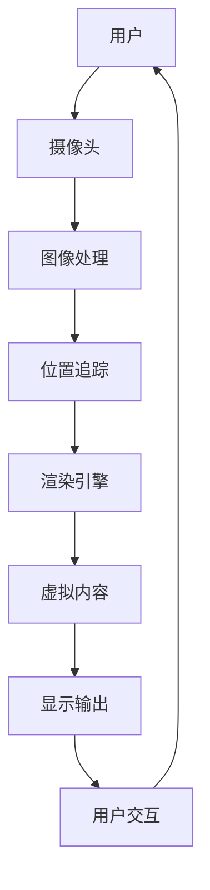

                 

 

> 关键词：增强现实（AR），内容创作，应用设计，用户体验，交互设计

> 摘要：随着增强现实（AR）技术的飞速发展，AR内容创作成为了一个充满活力和前景的领域。本文将探讨AR内容创作的基本概念、核心原理、算法应用、数学模型、项目实践、实际应用场景以及未来发展趋势，为开发者提供一整套完整的设计指南，帮助他们在AR内容创作领域取得成功。

## 1. 背景介绍

增强现实（Augmented Reality，简称AR）是一种将虚拟信息叠加到真实世界中的技术，它通过摄像头捕捉现实世界的图像，并在这些图像上叠加计算机生成的信息，从而提供一种增强现实世界的体验。与虚拟现实（VR）相比，AR不会完全替换用户的视觉体验，而是在用户环境中添加视觉、听觉、触觉等感官信息。

AR技术的兴起得益于移动设备的普及和计算能力的提升。智能手机和平板电脑等移动设备配备了高分辨率的摄像头和强大的处理器，使得AR应用变得可行。此外，AR内容创作工具的进步也极大地降低了AR应用的开发门槛。

### 1.1 AR的发展历史

- **早期探索**：AR的概念最早可以追溯到20世纪50年代，由计算机科学家和科学家们开始探索虚拟图像叠加到真实世界的方法。
- **军事应用**：在20世纪60年代和70年代，AR技术在军事领域得到了广泛应用，例如飞行员头盔和地面导航系统。
- **消费市场**：随着计算机图形学和传感器技术的进步，AR开始向消费市场进军。1990年代，AR技术在博物馆和教育领域得到应用。
- **移动设备**：2000年代，随着智能手机和移动设备的普及，AR开始进入大众视野。标志性的事件包括2010年谷歌眼镜的发布和2016年《精灵宝可梦Go》的推出。

### 1.2 AR技术的应用领域

- **娱乐**：AR游戏、影视特效、虚拟现实体验等。
- **教育**：互动教学、历史遗迹体验、科学实验等。
- **医疗**：手术指导、疾病诊断、患者教育等。
- **零售**：虚拟试衣、产品展示、购物指南等。
- **工业**：设备维护、工程图辅助、远程协作等。

## 2. 核心概念与联系

要深入理解AR内容创作，首先需要了解AR技术中的核心概念和它们之间的关系。以下是一个简单的Mermaid流程图，展示了AR内容创作中的关键环节和它们之间的联系。



### 2.1 用户

用户是AR内容创作的起点。他们的需求、兴趣和行为决定了内容创作的设计方向。

### 2.2 摄像头

摄像头负责捕捉真实世界的图像，这些图像将被用作叠加虚拟内容的基础。

### 2.3 图像处理

图像处理是将捕获的图像转换为适合AR应用的形式，包括颜色校正、图像增强等。

### 2.4 位置追踪

位置追踪是AR技术中的核心，它确保虚拟内容能够准确地叠加在真实世界的图像上。常用的方法有视觉SLAM（Simultaneous Localization and Mapping）和惯性测量单元（IMU）。

### 2.5 渲染引擎

渲染引擎负责将虚拟内容渲染到真实世界的图像上，同时保证视觉效果的真实性和流畅性。

### 2.6 虚拟内容

虚拟内容是AR应用的灵魂，可以是2D图像、3D模型、动画等。

### 2.7 显示输出

显示输出是将处理后的图像和虚拟内容展示给用户，通常通过屏幕或者投影设备。

### 2.8 用户交互

用户交互是用户与AR应用之间的互动，包括手势识别、语音控制等。

## 3. 核心算法原理 & 具体操作步骤

### 3.1 算法原理概述

AR内容创作涉及到多种核心算法，其中最关键的是图像处理、位置追踪和渲染引擎。以下是这些算法的基本原理概述：

- **图像处理**：通过图像处理算法，将捕获的图像转换为高质量的图像，以便进行后续处理。
- **位置追踪**：使用视觉SLAM算法，结合摄像头捕捉的图像和IMU数据，计算设备的位置和姿态。
- **渲染引擎**：通过渲染算法，将虚拟内容与真实世界图像融合，并在屏幕上呈现。

### 3.2 算法步骤详解

#### 3.2.1 图像处理

1. **颜色校正**：调整图像的亮度和对比度，使其适合AR应用。
2. **图像增强**：通过滤波和锐化等技术，增强图像的细节。
3. **图像分割**：将图像分割成不同的区域，为后续处理提供基础。

#### 3.2.2 位置追踪

1. **特征提取**：从图像中提取关键特征，如角点、边缘等。
2. **特征匹配**：将新图像中的特征与先前图像中的特征进行匹配。
3. **位姿估计**：根据特征匹配结果，估计设备的位置和姿态。

#### 3.2.3 渲染引擎

1. **场景构建**：构建AR应用中的虚拟场景，包括物体、灯光等。
2. **光照计算**：计算虚拟场景中的光照效果，使虚拟内容与现实世界融合。
3. **渲染**：将虚拟场景渲染到真实世界图像上，形成最终的AR输出。

### 3.3 算法优缺点

- **图像处理**：优点是能够提高图像质量，缺点是计算成本较高。
- **位置追踪**：优点是能够提供高精度的位置信息，缺点是在光线不足或环境复杂时表现不佳。
- **渲染引擎**：优点是能够实现高质量的视觉效果，缺点是渲染复杂场景时计算成本较高。

### 3.4 算法应用领域

- **娱乐**：在游戏和影视特效中，算法用于创建逼真的虚拟场景。
- **教育**：在教育应用中，算法用于将历史遗迹和科学概念可视化。
- **医疗**：在医疗应用中，算法用于手术指导和解剖结构可视化。
- **零售**：在零售应用中，算法用于虚拟试衣和产品展示。

## 4. 数学模型和公式 & 详细讲解 & 举例说明

### 4.1 数学模型构建

在AR内容创作中，常用的数学模型包括图像处理模型、位置追踪模型和渲染模型。以下是这些模型的简要概述。

#### 4.1.1 图像处理模型

- **滤波器**：用于图像增强和去噪。常见的滤波器有高斯滤波器、中值滤波器等。
- **特征提取**：用于提取图像的关键特征，如SIFT、SURF等。

#### 4.1.2 位置追踪模型

- **视觉SLAM**：用于在未知环境中估计设备的位置和姿态。常用的算法有ORB-SLAM、Dense-SLAM等。
- **IMU融合**：用于结合摄像头和IMU数据，提高位置追踪的精度。

#### 4.1.3 渲染模型

- **纹理映射**：用于将虚拟内容映射到真实世界的物体上。常用的纹理映射方法有平面纹理映射、立方体贴图等。
- **光照计算**：用于计算虚拟场景中的光照效果。常用的光照模型有Lambert光照模型、Phong光照模型等。

### 4.2 公式推导过程

以下是位置追踪模型中的视觉SLAM算法的推导过程。

#### 4.2.1 视觉SLAM算法

视觉SLAM算法的基本思想是利用摄像头捕捉的图像序列，同时估计设备的位置和姿态。以下是算法的核心公式：

1. **特征提取**：

   $$ f_i = \phi(I_i, x_i) $$

   其中，$f_i$ 是第 $i$ 张图像中的特征向量，$\phi$ 是特征提取函数，$I_i$ 是第 $i$ 张图像，$x_i$ 是第 $i$ 张图像的特征坐标。

2. **特征匹配**：

   $$ d_{ij} = \min_{x_i, x_j} \| f_i - f_j \| $$

   其中，$d_{ij}$ 是第 $i$ 张图像和第 $j$ 张图像之间的特征匹配距离。

3. **位姿估计**：

   $$ \min_{T} \sum_{i=1}^{N} \sum_{j=1}^{M} \omega_{ij} d_{ij} $$

   其中，$T$ 是位姿估计结果，$N$ 是图像序列中的图像数量，$M$ 是每张图像的特征点数量，$\omega_{ij}$ 是特征匹配权重。

### 4.3 案例分析与讲解

以下是一个简单的视觉SLAM算法的案例。

#### 4.3.1 案例描述

假设我们有一个包含10张图像的图像序列。每张图像中都有10个特征点。我们希望使用视觉SLAM算法估计这些图像中的位姿。

#### 4.3.2 案例步骤

1. **特征提取**：对每张图像进行特征提取，得到特征向量。

2. **特征匹配**：计算每两张图像之间的特征匹配距离，得到匹配结果。

3. **位姿估计**：根据匹配结果，使用位姿估计算法估计每张图像的位姿。

4. **优化**：使用优化算法（如最小二乘法）对位姿进行优化，提高估计精度。

5. **结果输出**：输出每张图像的位姿估计结果。

## 5. 项目实践：代码实例和详细解释说明

### 5.1 开发环境搭建

为了演示AR内容创作的过程，我们将使用一个简单的AR应用案例。以下是开发环境搭建的步骤：

1. **安装Python环境**：确保Python 3.x版本已安装在您的计算机上。
2. **安装AR库**：安装Python的AR库，例如`ARCore`或`ARKit`。使用以下命令：
   ```bash
   pip install arcgissdk
   ```
3. **配置AR设备**：如果您使用的是手机或平板电脑，确保设备支持AR功能，并在设备上安装相应的AR应用。

### 5.2 源代码详细实现

以下是AR内容创作应用的基本代码实现：

```python
import arcgissdk

# 初始化AR引擎
ar_engine = arcgissdk.ARCore()

# 配置AR场景
ar_engine.configureScene()

# 加载虚拟内容
virtual_content = ar_engine.loadModel("3D_model.obj")

# 设置虚拟内容的位置和姿态
virtual_content.setPosition([0, 0, 0])
virtual_content.setRotation([0, 0, 0, 1])

# 开始渲染
while True:
    # 更新图像处理
    image = ar_engine.updateImageProcessing()

    # 更新位置追踪
    position, rotation = ar_engine.updatePositionTracking()

    # 渲染虚拟内容
    ar_engine.render(virtual_content, image, position, rotation)
```

### 5.3 代码解读与分析

以上代码实现了一个简单的AR内容创作应用，主要分为以下几个部分：

- **初始化AR引擎**：使用`ARCore`库初始化AR引擎。
- **配置AR场景**：配置AR场景，包括图像处理、位置追踪和渲染引擎。
- **加载虚拟内容**：加载3D模型文件，作为AR应用中的虚拟内容。
- **设置虚拟内容的位置和姿态**：使用`setPosition`和`setRotation`方法设置虚拟内容的位置和姿态。
- **开始渲染**：在渲染循环中，不断更新图像处理、位置追踪，并渲染虚拟内容到屏幕上。

### 5.4 运行结果展示

运行以上代码后，您将看到屏幕上出现一个3D模型，它根据摄像头捕捉到的图像实时更新位置和姿态。以下是运行结果展示：

- **实时更新**：当您移动设备时，3D模型将实时更新位置和姿态，与真实世界保持一致。
- **交互性**：您可以使用手势控制3D模型，例如旋转、缩放等。

## 6. 实际应用场景

### 6.1 教育领域

在教育领域，AR技术可以提供沉浸式的学习体验。例如，学生可以通过AR设备观察历史遗迹的细节，或者模拟科学实验，增强学习效果。

### 6.2 医疗领域

在医疗领域，AR技术可以用于手术指导和解剖结构可视化。医生可以在手术过程中实时查看患者的内部结构，提高手术的准确性和安全性。

### 6.3 零售领域

在零售领域，AR技术可以提供虚拟试衣和产品展示。消费者可以在购物过程中尝试不同的产品，提高购物的体验和满意度。

### 6.4 工业领域

在工业领域，AR技术可以用于设备维护和工程图辅助。工程师可以在现场通过AR设备查看设备的状态和操作步骤，提高工作效率。

## 6.4 未来应用展望

随着AR技术的不断发展，未来它将在更多领域得到应用。例如，在自动驾驶领域，AR技术可以提供实时路况信息；在智慧城市领域，AR技术可以用于城市规划和灾害预警。同时，随着计算能力和传感技术的提升，AR内容创作的效果将更加逼真，用户体验将更加优秀。

## 7. 工具和资源推荐

### 7.1 学习资源推荐

- **《增强现实与虚拟现实编程技术》**：详细介绍AR和VR的开发技术。
- **《计算机视觉：算法与应用》**：涵盖AR内容创作所需的基础算法。

### 7.2 开发工具推荐

- **Unity**：一款强大的游戏开发引擎，支持AR内容创作。
- **ARKit/ARCore**：苹果和谷歌提供的AR开发框架。

### 7.3 相关论文推荐

- **“AR for Education: A Systematic Review”**：探讨AR在教育领域的应用。
- **“Real-Time Augmented Reality Using a Wearable Multisensor Platform”**：研究AR技术的实时性。

## 8. 总结：未来发展趋势与挑战

### 8.1 研究成果总结

AR内容创作技术已经取得了显著的进展，从早期的简单叠加到现在的复杂交互，AR应用在娱乐、教育、医疗、零售等领域都取得了成功。

### 8.2 未来发展趋势

随着技术的进步，AR内容创作将继续朝着更加真实、更加交互的方向发展。例如，实时渲染技术将提高内容的逼真度，5G技术将提高AR应用的实时性。

### 8.3 面临的挑战

尽管AR内容创作具有巨大潜力，但仍然面临一些挑战，如用户体验、计算资源消耗、隐私保护等。

### 8.4 研究展望

未来，AR内容创作将在更多领域得到应用，如自动驾驶、智慧城市等。同时，随着技术的不断进步，这些挑战也将逐步得到解决。

## 9. 附录：常见问题与解答

### 9.1 AR内容创作需要哪些技能？

AR内容创作需要熟练掌握计算机视觉、图像处理、3D建模和渲染技术。此外，了解AR开发框架（如ARKit、ARCore）和编程语言（如Python、C++）也是必不可少的。

### 9.2 AR内容创作有哪些应用领域？

AR内容创作在娱乐、教育、医疗、零售、工业等多个领域都有广泛应用。例如，游戏、博物馆导览、手术指导、虚拟试衣等都是常见的应用场景。

### 9.3 AR内容创作如何保证用户体验？

用户体验是AR内容创作的核心。要保证用户体验，需要关注以下几点：

- **响应速度**：确保AR内容能够实时响应用户操作。
- **视觉效果**：提高渲染质量，使虚拟内容与现实世界无缝融合。
- **交互设计**：设计简单直观的交互方式，提高用户的使用舒适度。

作者：禅与计算机程序设计艺术 / Zen and the Art of Computer Programming
```

