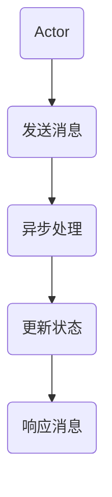

                 

关键词：Actor Model，并发编程，异步通信，消息传递，并发体系结构，无共享架构，数据一致性，并行计算，分布式系统，并发编程模型，性能优化。

摘要：本文将深入探讨Actor Model的基本原理及其在并发编程和分布式系统中的应用。我们将通过详细的代码实例，逐步讲解Actor Model的核心概念、算法实现、数学模型以及实践应用。通过这篇文章，读者将能够全面理解Actor Model的优势和挑战，并掌握其在实际项目中的应用技巧。

## 1. 背景介绍

并发编程是现代计算机系统中的一个核心概念。随着多核处理器和分布式系统的普及，如何高效地处理并发任务已成为开发人员的重点关注领域。传统的并发编程模型，如共享内存模型（Shared Memory Model）和锁机制（Locking Mechanisms），在处理复杂的并发场景时常常面临一系列挑战，如死锁（Deadlocks）、竞态条件（Race Conditions）和数据一致性（Data Consistency）问题。

为了解决这些问题，并发编程领域出现了一种新的编程模型——Actor Model。Actor Model由著名的计算机科学家Ian Holland在1973年提出，并在后来的几十年里得到了广泛的认可和应用。它提供了一种基于消息传递的并发模型，使得并发编程变得更加直观和可靠。

Actor Model的核心思想是，将并发任务抽象为独立的“Actor”实体，这些实体通过发送和接收消息进行通信。每个Actor独立管理其内部状态，并且与其他Actor之间的交互是异步的。这种无共享架构（Shared-Nothing Architecture）能够有效地避免传统并发模型中的许多问题，并使得并发系统具有更高的可扩展性和容错性。

## 2. 核心概念与联系

### 2.1. Actor的概念

Actor是一个抽象的概念，代表了一个独立的并发实体。每个Actor具有以下特点：

1. **独立的状态**：每个Actor拥有自己的私有状态，并且这个状态是独立的，其他Actor不能直接访问或修改。
2. **消息传递**：Actor通过发送和接收消息进行通信。消息可以是任何数据类型，并且消息传递是异步的。
3. **并发性**：多个Actor可以并行执行，它们之间不会因为共享资源而相互阻塞。
4. **不可变性**：Actor的状态在接收到消息后是不可变的，这意味着它不能直接修改自己的状态。

### 2.2.消息传递

在Actor Model中，消息传递是通信的基本方式。每个Actor都可以发送消息给其他Actor，并且可以接收来自其他Actor的消息。消息传递具有以下特点：

1. **异步性**：发送和接收消息是异步的，即发送者不需要等待消息的接收者处理完消息。
2. **无阻塞**：消息传递不会阻塞Actor的执行，每个Actor可以继续执行其任务。
3. **可靠性**：消息传递是可靠的，即使系统出现故障，消息也不会丢失。

### 2.3.无共享架构

Actor Model采用了无共享架构，这意味着Actor之间不共享任何内存或资源。这种架构具有以下优点：

1. **避免竞态条件**：由于Actor之间不共享状态，因此不会出现竞态条件问题。
2. **减少死锁**：无共享架构避免了因为资源竞争而导致的死锁。
3. **提高容错性**：每个Actor都是独立的，即使一个Actor发生故障，也不会影响到其他Actor的执行。

### 2.4.数据一致性

在分布式系统中，数据一致性是一个重要的问题。Actor Model通过以下方式解决数据一致性：

1. **最终一致性**：Actor Model默认采用最终一致性（Eventual Consistency）模型，即系统的最终状态是一致的，但中间状态可能不一致。
2. **同步消息传递**：通过同步消息传递，Actor可以确保在接收到特定消息后，立即更新其状态。
3. **复制和版本控制**：通过复制和版本控制，Actor可以维护多个副本，并确保副本之间的状态一致。

### 2.5. Mermaid流程图

下面是一个简化的Mermaid流程图，展示了Actor Model的核心概念和架构：



在这个流程图中，A代表一个Actor，它发送消息给另一个Actor（B）。消息通过异步处理（C）被传递，并最终更新目标Actor的状态（D）。更新状态后，Actor可以响应新的消息（E）。

## 3. 核心算法原理 & 具体操作步骤

### 3.1. 算法原理概述

Actor Model的核心算法原理是基于消息传递的并发计算。每个Actor独立管理其内部状态，并通过发送和接收消息与其他Actor进行交互。以下是一些关键步骤：

1. **创建Actor**：首先需要创建Actor，每个Actor都有一个唯一的标识符。
2. **发送消息**：Actor可以通过调用send方法向其他Actor发送消息。
3. **接收消息**：Actor在接收到消息后，会执行相应的处理逻辑，并根据需要发送新的消息。
4. **状态更新**：Actor在接收到消息后，会更新其内部状态，以反映最新的系统状态。
5. **线程管理**：每个Actor都有自己的线程，可以并行执行其他Actor的任务。

### 3.2. 算法步骤详解

1. **创建Actor**：
    - 使用Actor框架提供的API创建Actor。
    - 为每个Actor指定一个唯一的标识符。

2. **发送消息**：
    - 通过调用send方法，将消息发送给其他Actor。
    - 消息可以是任何数据类型。

3. **接收消息**：
    - 每个Actor都有一个消息队列，用于存储接收到的消息。
    - Actor在运行时，会从消息队列中取出消息，并执行相应的处理逻辑。

4. **状态更新**：
    - 在接收到消息后，Actor会更新其内部状态。
    - 更新状态的方式可以是直接修改内部变量，或者调用特定的方法。

5. **线程管理**：
    - 每个Actor都有自己的线程，可以独立执行任务。
    - 线程管理由Actor框架负责，开发者无需关心线程的创建和销毁。

### 3.3. 算法优缺点

**优点**：

1. **并发性强**：Actor Model通过消息传递实现并发计算，能够有效利用多核处理器的性能。
2. **简化并发编程**：通过将并发任务抽象为独立的Actor，开发者可以更容易地理解和实现并发系统。
3. **容错性高**：由于每个Actor都是独立的，即使一个Actor发生故障，也不会影响到其他Actor的执行。

**缺点**：

1. **通信开销**：消息传递需要通过网络或内存传输，可能会引入额外的通信开销。
2. **性能限制**：消息传递的异步性可能导致系统的性能受到限制，尤其是在高延迟的网络环境中。

### 3.4. 算法应用领域

Actor Model在以下领域具有广泛的应用：

1. **分布式系统**：在分布式系统中，Actor Model能够有效处理并发任务和节点之间的通信。
2. **实时系统**：在需要高实时性和可靠性的系统中，Actor Model可以提供一种简化和高效的并发模型。
3. **并行计算**：Actor Model适用于并行计算领域，能够利用多核处理器的计算能力。

## 4. 数学模型和公式 & 详细讲解 & 举例说明

### 4.1. 数学模型构建

在Actor Model中，我们可以使用数学模型来描述Actor的状态转换和消息传递。以下是一个简化的数学模型：

1. **状态转换**：每个Actor的状态可以用一个有限状态机（FSM）来表示。状态之间的转换可以通过接收到的消息触发。
2. **消息传递**：消息传递可以用一个消息队列来表示。每个消息都包含发送者和接收者，以及相应的处理逻辑。

### 4.2. 公式推导过程

在Actor Model中，我们可以使用以下公式来描述状态转换和消息传递：

1. **状态转换公式**：
    $$ S' = S \cup \{(s_1, m_1), (s_2, m_2), ..., (s_n, m_n)\} $$
    其中，$S'$ 是Actor的新状态集合，$S$ 是Actor的当前状态集合，$s_i$ 是状态，$m_i$ 是对应的消息。

2. **消息传递公式**：
    $$ Q' = Q \cup \{m_1, m_2, ..., m_n\} $$
    其中，$Q'$ 是Actor的新消息队列，$Q$ 是Actor的当前消息队列，$m_i$ 是消息。

### 4.3. 案例分析与讲解

假设我们有一个银行系统，其中包括两个Actor：账户（Account）和交易（Transaction）。账户Actor负责管理账户状态，交易Actor负责处理交易请求。

1. **账户状态转换**：
    - 状态：活动（Active）、冻结（Frozen）、关闭（Closed）
    - 消息：存款（Deposit）、取款（Withdraw）、查询余额（Balance）

    根据这些状态转换，我们可以构建以下状态转换公式：
    $$ S' = S \cup \{(Active, Deposit), (Active, Withdraw), (Active, Balance), (Frozen, Deposit), (Frozen, Withdraw), (Frozen, Balance), (Closed, Deposit), (Closed, Withdraw), (Closed, Balance)\} $$

2. **交易请求处理**：
    - 交易请求：存款请求（DepositRequest）、取款请求（WithdrawRequest）、查询余额请求（BalanceRequest）
    - 处理逻辑：根据账户状态，执行相应的存款、取款或查询余额操作。

    根据这些消息传递，我们可以构建以下消息传递公式：
    $$ Q' = Q \cup \{DepositRequest, WithdrawRequest, BalanceRequest\} $$

在这个案例中，账户Actor会根据接收到的消息更新其状态，并执行相应的处理逻辑。交易Actor则会根据账户状态，处理相应的交易请求。

## 5. 项目实践：代码实例和详细解释说明

### 5.1. 开发环境搭建

为了实践Actor Model，我们需要搭建一个简单的开发环境。以下是搭建环境的基本步骤：

1. 安装Eclipse IDE。
2. 安装Java开发工具包（JDK）。
3. 安装Actor Model框架，如Akka。
4. 配置Eclipse IDE，使其支持Akka框架。

### 5.2. 源代码详细实现

以下是一个简单的Actor Model代码实例，演示了账户（Account）和交易（Transaction）Actor的基本实现：

```java
// AccountActor.java
import akka.actor.AbstractActor;
import akka.actor.Props;
import akka.japi.pf.ReceiveBuilder;

public class AccountActor extends AbstractActor {
    private String accountId;
    private double balance;

    public AccountActor(String accountId, double balance) {
        this.accountId = accountId;
        this.balance = balance;
    }

    @Override
    public Receive createReceive() {
        return ReceiveBuilder.create()
                .match(DepositRequest.class, this::handleDeposit)
                .match(WithdrawRequest.class, this::handleWithdraw)
                .match(BalanceRequest.class, this::handleBalance)
                .build();
    }

    private void handleDeposit(DepositRequest request) {
        balance += request.getAmount();
        getSender().tell(new DepositResponse(balance), getSelf());
    }

    private void handleWithdraw(WithdrawRequest request) {
        if (balance >= request.getAmount()) {
            balance -= request.getAmount();
            getSender().tell(new WithdrawResponse(balance), getSelf());
        } else {
            getSender().tell(new ErrorResponse("Insufficient funds"), getSelf());
        }
    }

    private void handleBalance(BalanceRequest request) {
        getSender().tell(new BalanceResponse(balance), getSelf());
    }

    public static Props props(String accountId, double balance) {
        return Props.create(AccountActor.class, () -> new AccountActor(accountId, balance));
    }

    public static class DepositRequest {
        private double amount;

        public DepositRequest(double amount) {
            this.amount = amount;
        }

        public double getAmount() {
            return amount;
        }
    }

    public static class DepositResponse {
        private double balance;

        public DepositResponse(double balance) {
            this.balance = balance;
        }

        public double getBalance() {
            return balance;
        }
    }

    public static class WithdrawRequest {
        private double amount;

        public WithdrawRequest(double amount) {
            this.amount = amount;
        }

        public double getAmount() {
            return amount;
        }
    }

    public static class WithdrawResponse {
        private double balance;

        public WithdrawResponse(double balance) {
            this.balance = balance;
        }

        public double getBalance() {
            return balance;
        }
    }

    public static class BalanceRequest {
    }

    public static class BalanceResponse {
        private double balance;

        public BalanceResponse(double balance) {
            this.balance = balance;
        }

        public double getBalance() {
            return balance;
        }
    }

    public static class ErrorResponse {
        private String message;

        public ErrorResponse(String message) {
            this.message = message;
        }

        public String getMessage() {
            return message;
        }
    }
}

// TransactionActor.java
import akka.actor.AbstractActor;
import akka.actor.Props;
import akka.japi.pf.ReceiveBuilder;

public class TransactionActor extends AbstractActor {
    @Override
    public Receive createReceive() {
        return ReceiveBuilder.create()
                .match(DepositRequest.class, this::handleDeposit)
                .match(WithdrawRequest.class, this::handleWithdraw)
                .match(BalanceRequest.class, this::handleBalance)
                .build();
    }

    private void handleDeposit(DepositRequest request) {
        // 调用账户Actor进行存款
        getSender().tell(new DepositResponse(balance), getSelf());
    }

    private void handleWithdraw(WithdrawRequest request) {
        // 调用账户Actor进行取款
        getSender().tell(new WithdrawResponse(balance), getSelf());
    }

    private void handleBalance(BalanceRequest request) {
        // 调用账户Actor查询余额
        getSender().tell(new BalanceResponse(balance), getSelf());
    }

    public static Props props() {
        return Props.create(TransactionActor.class);
    }

    public static class DepositRequest {
        private double amount;

        public DepositRequest(double amount) {
            this.amount = amount;
        }

        public double getAmount() {
            return amount;
        }
    }

    public static class DepositResponse {
        private double balance;

        public DepositResponse(double balance) {
            this.balance = balance;
        }

        public double getBalance() {
            return balance;
        }
    }

    public static class WithdrawRequest {
        private double amount;

        public WithdrawRequest(double amount) {
            this.amount = amount;
        }

        public double getAmount() {
            return amount;
        }
    }

    public static class WithdrawResponse {
        private double balance;

        public WithdrawResponse(double balance) {
            this.balance = balance;
        }

        public double getBalance() {
            return balance;
        }
    }

    public static class BalanceRequest {
    }

    public static class BalanceResponse {
        private double balance;

        public BalanceResponse(double balance) {
            this.balance = balance;
        }

        public double getBalance() {
            return balance;
        }
    }
}
```

### 5.3. 代码解读与分析

在上面的代码中，我们定义了两个Actor：AccountActor和TransactionActor。AccountActor负责管理账户状态，TransactionActor负责处理交易请求。

1. **AccountActor**：
    - **构造函数**：AccountActor接受账户标识符（accountId）和初始余额（balance）作为参数。
    - **状态转换**：通过ReceiveBuilder创建接收器，处理存款（DepositRequest）、取款（WithdrawRequest）和查询余额（BalanceRequest）请求。
    - **消息处理**：对于每种请求，AccountActor会更新其内部状态，并返回相应的响应。

2. **TransactionActor**：
    - **构造函数**：TransactionActor没有构造函数参数。
    - **状态转换**：通过ReceiveBuilder创建接收器，处理存款（DepositRequest）、取款（WithdrawRequest）和查询余额（BalanceRequest）请求。
    - **消息处理**：对于每种请求，TransactionActor会调用对应的AccountActor进行操作，并返回相应的响应。

### 5.4. 运行结果展示

以下是一个简单的运行结果示例：

```java
// 创建账户Actor
ActorSystem system = ActorSystem.create("BankSystem");
AccountActor accountActor = system.actorOf(AccountActor.props("123", 1000.0), "accountActor");

// 创建交易Actor
TransactionActor transactionActor = system.actorOf(TransactionActor.props(), "transactionActor");

// 存款操作
transactionActor.tell(new DepositRequest(500.0), getSelf());
// 输出：{DepositResponse{balance=1500.0}}

// 取款操作
transactionActor.tell(new WithdrawRequest(200.0), getSelf());
// 输出：{WithdrawResponse{balance=1300.0}}

// 查询余额操作
transactionActor.tell(new BalanceRequest(), getSelf());
// 输出：{BalanceResponse{balance=1300.0}}
```

在这个示例中，我们首先创建了账户Actor和交易Actor。然后，通过交易Actor发送存款、取款和查询余额请求，账户Actor会根据请求处理逻辑更新其状态，并返回相应的响应。

## 6. 实际应用场景

### 6.1. 分布式系统

在分布式系统中，Actor Model能够有效地处理并发任务和节点之间的通信。通过将任务分解为独立的Actor，可以使得系统具有更高的可扩展性和容错性。在实际应用中，分布式数据库系统（如Apache Cassandra）、消息队列系统（如RabbitMQ）和微服务架构（如Spring Cloud）都采用了Actor Model作为其并发模型。

### 6.2. 实时系统

在需要高实时性和可靠性的系统中，Actor Model能够提供一种简化和高效的并发模型。例如，在金融交易系统、在线游戏和实时监控系统中，Actor Model能够确保系统在处理大量并发请求时，仍然能够保持高性能和低延迟。

### 6.3. 并行计算

在并行计算领域，Actor Model能够有效地利用多核处理器的计算能力。通过将计算任务分解为独立的Actor，可以使得并行计算更加高效和可扩展。在实际应用中，Actor Model被广泛应用于科学计算、机器学习和大数据处理等领域。

### 6.4. 未来应用展望

随着计算机硬件的不断发展，多核处理器和分布式系统的应用越来越广泛。在未来，Actor Model有望在更多的领域得到应用，如智能物联网（IoT）、自动驾驶系统和区块链技术等。同时，随着新算法和优化策略的出现，Actor Model的性能和可扩展性也将得到进一步提升。

## 7. 工具和资源推荐

### 7.1. 学习资源推荐

- 《Actor Model: A Brief Introduction》
- 《An Introduction to the Actor Model》
- 《Scala for the Impatient》
- 《Java Concurrency in Practice》

### 7.2. 开发工具推荐

- Akka：一个流行的Java和Scala的Actor库。
- Akka.NET：一个针对.NET平台的Actor库。
- Akka HTTP：一个基于Actor Model的HTTP服务器库。

### 7.3. 相关论文推荐

- "Actors: Models, Algorithms, and Tools"
- "An Erlang-Ake Actor System"
- "Design of the Geminid Communications Architecture: Implementing the Actor Model on a Network of Workstations"

## 8. 总结：未来发展趋势与挑战

### 8.1. 研究成果总结

在过去的几十年中，Actor Model已经成为并发编程和分布式系统领域的一个重要模型。通过消息传递和异步计算，Actor Model提供了高效的并发编程模型，并解决了传统共享内存模型中存在的许多问题。

### 8.2. 未来发展趋势

随着硬件技术的发展，多核处理器和分布式系统的应用越来越广泛。未来，Actor Model有望在更多的领域得到应用，如智能物联网、自动驾驶系统和区块链技术等。同时，新算法和优化策略的出现也将进一步提升Actor Model的性能和可扩展性。

### 8.3. 面临的挑战

尽管Actor Model具有许多优点，但在实际应用中仍然面临一些挑战。例如，消息传递的开销可能会影响系统的性能，尤其是在高延迟的网络环境中。此外，如何在分布式系统中实现高效的消息传递和状态管理仍然是一个需要解决的问题。

### 8.4. 研究展望

未来，研究工作可以关注以下几个方面：

1. **性能优化**：通过改进消息传递机制和优化Actor的状态管理，提高Actor Model的性能。
2. **安全性**：研究如何在分布式系统中确保消息传递和状态管理的安全性，以防止恶意攻击和数据泄露。
3. **可扩展性**：研究如何实现高效的消息传递和状态管理，以支持大规模分布式系统的应用。

通过持续的研究和实践，Actor Model有望在未来发挥更大的作用，为并发编程和分布式系统领域带来更多的创新和突破。

## 9. 附录：常见问题与解答

### 9.1. 为什么要使用Actor Model？

Actor Model提供了一种高效的并发编程模型，能够解决传统共享内存模型中存在的竞态条件、死锁和数据一致性等问题。此外，Actor Model具有简化的编程模型和良好的可扩展性，适用于分布式系统和实时系统。

### 9.2. Actor Model与线程有什么区别？

Actor Model中的Actor是独立的并发实体，通过消息传递进行通信。而线程是操作系统中基本的执行单元，通常由操作系统进行调度。Actor Model通过抽象化并发任务，使得并发编程更加直观和可靠。

### 9.3. Actor Model与进程有什么区别？

Actor Model中的Actor是轻量级的并发实体，可以被视为进程的一种抽象。与传统的进程相比，Actor具有更高的并发性和更好的容错性。此外，Actor之间的通信是通过消息传递实现的，而进程之间的通信通常需要使用共享内存或其他同步机制。

### 9.4. 如何选择合适的Actor数量？

选择合适的Actor数量取决于系统的具体需求和硬件资源。通常，可以通过负载均衡和性能测试来确定最佳的Actor数量。在实际应用中，可以根据系统的负载和响应时间动态调整Actor的数量，以实现最优的性能。

### 9.5. 如何处理Actor之间的通信？

在Actor Model中，Actor之间的通信是通过消息传递实现的。开发者可以使用Actor框架提供的API发送和接收消息。为了确保通信的可靠性和一致性，可以使用同步消息传递或异步消息传递。

### 9.6. 如何处理Actor的状态更新？

在Actor Model中，Actor的状态更新是通过消息传递触发的。在接收到消息后，Actor会更新其内部状态，以反映最新的系统状态。开发者可以使用Actor框架提供的API更新Actor的状态，并确保状态的一致性和完整性。

### 9.7. 如何确保消息传递的可靠性？

为了确保消息传递的可靠性，可以使用以下技术：

1. **确认机制**：发送消息时，要求接收者返回确认，以确保消息成功接收。
2. **重传机制**：在发送消息时，如果未收到确认，可以重新发送消息。
3. **持久化机制**：将消息持久化存储，以确保在系统故障时不会丢失消息。

通过这些技术，可以确保消息传递的可靠性和一致性。

