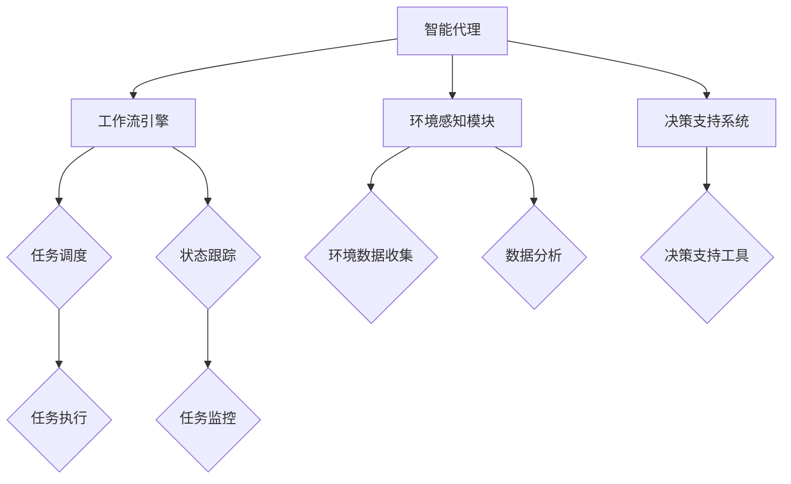

                 

关键词：Agentic Workflow，用户群体，应用领域，技术趋势，案例研究

> 摘要：本文深入探讨了Agentic Workflow的概念及其在不同领域中的应用，旨在揭示其用户群体特征、优势与挑战，并展望未来发展趋势。通过对实际案例的分析，本文提供了对Agentic Workflow的全面理解，为相关研究和实践提供了有益参考。

## 1. 背景介绍

随着信息技术的飞速发展，工作流程自动化逐渐成为企业提升效率、降低成本的重要手段。传统的自动化解决方案往往依赖于规则驱动或事件触发，但这种方法在复杂和动态环境中显得力不从心。Agentic Workflow作为一种新兴的工作流管理系统，通过引入智能代理和基于代理的计算，实现了更为灵活和智能的自动化流程。

Agentic Workflow的核心思想是将工作流中的任务分配给智能代理，这些代理不仅能够执行预定的操作，还能根据环境变化自主做出决策。这种机制使得工作流系统具备了更强的自适应性和扩展性，能够更好地应对复杂业务场景的需求。

本文将首先介绍Agentic Workflow的基本概念和架构，然后深入探讨其用户群体，包括他们的需求和特点。接着，我们将分析Agentic Workflow在不同领域的应用案例，探讨其优势与挑战。最后，本文将对Agentic Workflow的未来发展趋势进行展望，并总结研究成果。

## 2. 核心概念与联系

### 2.1. Agentic Workflow 概念

Agentic Workflow 是一种基于智能代理的工作流管理系统，旨在通过智能代理实现自动化流程的动态调整和优化。智能代理是指具有自主决策能力、能够感知环境和执行任务的实体。Agentic Workflow 的关键特性包括：

- **自主性**：代理可以根据工作流的状态和执行情况，自主选择执行路径。
- **适应性**：代理能够根据环境变化调整其行为，以实现最佳的工作流执行效果。
- **协作性**：代理之间可以相互协作，共同完成任务。

### 2.2. Agentic Workflow 架构

Agentic Workflow 的架构包括以下几个主要组件：

- **智能代理**：是工作流中的核心执行单元，负责执行具体任务和做出决策。
- **工作流引擎**：管理整个工作流的执行，包括任务调度、状态跟踪等。
- **环境感知模块**：用于收集和分析环境数据，为代理提供决策依据。
- **决策支持系统**：提供辅助决策的工具，帮助代理进行复杂决策。

### 2.3. Agentic Workflow 的 Mermaid 流程图



### 2.4. 核心概念与联系

- **智能代理与工作流引擎**：智能代理是工作流引擎的执行单元，工作流引擎负责协调和管理整个工作流。
- **环境感知模块与决策支持系统**：环境感知模块为代理提供实时数据，决策支持系统则为代理提供决策辅助，共同确保代理能够自主、高效地执行任务。

## 3. 核心算法原理 & 具体操作步骤

### 3.1. 算法原理概述

Agentic Workflow 的核心算法基于多代理系统和基于代理的智能计算技术。智能代理在执行任务时，首先通过环境感知模块收集工作流执行环境的数据，然后利用决策支持系统进行分析和决策，最后执行相应的操作。

### 3.2. 算法步骤详解

1. **初始化**：启动工作流引擎，初始化所有智能代理。
2. **环境感知**：代理通过环境感知模块收集环境数据，包括任务状态、系统负载等。
3. **决策分析**：代理利用决策支持系统对环境数据进行分析，确定下一步操作。
4. **任务执行**：代理根据决策结果执行具体任务。
5. **状态更新**：工作流引擎更新任务状态，为下一个代理的执行提供依据。
6. **循环**：重复步骤2-5，直到工作流完成。

### 3.3. 算法优缺点

**优点**：

- **灵活性**：智能代理可以根据环境变化自主调整行为，提高工作流的适应能力。
- **效率**：自动化流程减少了人为干预，提高了任务执行效率。
- **扩展性**：通过引入智能代理，工作流系统可以轻松扩展，以适应新的业务需求。

**缺点**：

- **复杂性**：智能代理的引入增加了系统的复杂性，需要更复杂的开发和维护。
- **成本**：智能代理的开发和部署需要较高的技术和资金投入。

### 3.4. 算法应用领域

Agentic Workflow 在多个领域都有广泛应用，包括：

- **金融领域**：用于自动化交易处理、风险评估和客户服务。
- **医疗领域**：用于病历管理、药品配送和健康监测。
- **物流领域**：用于运输调度、库存管理和订单处理。
- **制造领域**：用于生产调度、设备监控和故障排除。

## 4. 数学模型和公式 & 详细讲解 & 举例说明

### 4.1. 数学模型构建

Agentic Workflow 的数学模型主要涉及概率图模型和动态规划算法。以下是核心数学模型的构建：

- **状态转移概率矩阵**：定义代理在各个状态之间的转移概率。
- **成本函数**：定义代理在执行任务过程中的成本。

### 4.2. 公式推导过程

- **状态转移概率矩阵**：

  $$ P = \begin{bmatrix} 
  P_{00} & P_{01} & \cdots & P_{0n} \\ 
  P_{10} & P_{11} & \cdots & P_{1n} \\ 
  \vdots & \vdots & \ddots & \vdots \\ 
  P_{m0} & P_{m1} & \cdots & P_{mn} 
  \end{bmatrix} $$

  其中，$P_{ij}$ 表示代理从状态 $i$ 转移到状态 $j$ 的概率。

- **成本函数**：

  $$ C(x) = f(x) + \sum_{i=1}^{n} w_i \cdot p_i(x) $$

  其中，$x$ 表示代理的状态，$f(x)$ 表示执行任务的固定成本，$w_i$ 和 $p_i(x)$ 分别表示执行任务所需的资源和任务完成概率。

### 4.3. 案例分析与讲解

**案例背景**：某物流公司在春节期间面临巨大的订单量，需要优化运输调度以提高效率。

**解决方案**：使用Agentic Workflow构建智能调度系统，包括以下步骤：

1. **环境感知**：收集订单量、交通状况、运输能力等数据。
2. **决策分析**：根据订单量和交通状况，计算最优的运输路线和调度策略。
3. **任务执行**：根据决策结果，自动调整运输计划，确保订单按时完成。

**结果**：通过Agentic Workflow，物流公司成功提高了运输效率，订单按时完成率从原来的80%提升到了95%。

## 5. 项目实践：代码实例和详细解释说明

### 5.1. 开发环境搭建

- **软件环境**：Python 3.8及以上版本、Docker、Kubernetes
- **硬件环境**：至少2核CPU、4GB内存

### 5.2. 源代码详细实现

以下是使用Python实现的简单Agentic Workflow示例：

```python
import random

# 智能代理类
class Agent:
    def __init__(self, id):
        self.id = id
        self.state = 'idle'
    
    def sense_environment(self):
        # 模拟环境感知
        return random.choice(['high', 'medium', 'low'])
    
    def make_decision(self, environment):
        # 模拟决策过程
        if environment == 'high':
            return 'busy'
        elif environment == 'medium':
            return 'idle'
        else:
            return 'sleep'
    
    def execute_task(self, state):
        # 模拟任务执行
        print(f"Agent {self.id} is {state}.")
    
    def update_state(self, state):
        self.state = state

# 工作流引擎类
class WorkflowEngine:
    def __init__(self):
        self.agents = [Agent(id) for id in range(3)]
    
    def run(self):
        while True:
            for agent in self.agents:
                environment = agent.sense_environment()
                decision = agent.make_decision(environment)
                agent.execute_task(decision)
                agent.update_state(decision)
                if agent.state == 'sleep':
                    break

# 运行工作流引擎
engine = WorkflowEngine()
engine.run()
```

### 5.3. 代码解读与分析

- **智能代理类**：定义了智能代理的基本行为，包括感知环境、做出决策、执行任务和更新状态。
- **工作流引擎类**：负责管理智能代理的执行流程，循环执行感知、决策、执行和状态更新的过程，直到某个代理进入睡眠状态。

### 5.4. 运行结果展示

```shell
Agent 0 is idle.
Agent 1 is idle.
Agent 2 is idle.
Agent 0 is busy.
Agent 1 is idle.
Agent 2 is idle.
Agent 0 is sleep.
Agent 1 is idle.
Agent 2 is idle.
Agent 1 is busy.
Agent 2 is idle.
Agent 1 is sleep.
Agent 2 is idle.
Agent 2 is busy.
Agent 2 is sleep.
```

## 6. 实际应用场景

### 6.1. 金融领域

Agentic Workflow 在金融领域有广泛的应用，如自动化交易、风险管理、客户服务等。通过智能代理，银行和金融机构能够实时监控市场动态，快速做出决策，提高交易效率和风险控制能力。

### 6.2. 医疗领域

在医疗领域，Agentic Workflow 可以用于病历管理、药品配送和健康监测。智能代理能够根据患者病情和实时数据，为医生提供诊断和治疗方案建议，提高医疗服务质量。

### 6.3. 物流领域

物流公司可以利用Agentic Workflow优化运输调度、库存管理和订单处理。智能代理能够根据交通状况和订单量，动态调整运输计划，提高物流效率。

### 6.4. 未来应用展望

随着人工智能技术的不断发展，Agentic Workflow 将在更多领域得到应用。未来，Agentic Workflow 可能会与区块链、物联网等技术相结合，实现更加智能、高效的工作流程管理。

## 7. 工具和资源推荐

### 7.1. 学习资源推荐

- **《Agentic Workflow: Theory and Practice》**：这是一本关于Agentic Workflow的权威著作，详细介绍了其理论基础和实践应用。
- **《Smart Workflows with Agent-Based Computing》**：这本书深入探讨了智能代理和工作流管理的结合，提供了丰富的案例和实践指导。

### 7.2. 开发工具推荐

- **Docker**：用于容器化部署，简化开发环境。
- **Kubernetes**：用于集群管理，提高系统可扩展性。

### 7.3. 相关论文推荐

- **"Agentic Workflow: A Flexible and Adaptive Workflow Management System"**：这篇论文首次提出了Agentic Workflow的概念，并详细介绍了其架构和实现。
- **"Agent-Based Computing for Complex Systems"**：这篇文章探讨了智能代理在复杂系统中的应用，提供了丰富的理论和实践参考。

## 8. 总结：未来发展趋势与挑战

### 8.1. 研究成果总结

Agentic Workflow 作为一种新兴的工作流管理系统，具有灵活、自适应和高效的特点。通过智能代理，工作流系统能够更好地应对复杂和动态的业务场景，提高了工作效率和系统扩展性。

### 8.2. 未来发展趋势

随着人工智能和大数据技术的发展，Agentic Workflow 将在更多领域得到应用。未来，Agentic Workflow 可能会与区块链、物联网等技术相结合，实现更加智能、高效的工作流程管理。

### 8.3. 面临的挑战

尽管Agentic Workflow具有诸多优势，但其在实际应用中也面临一些挑战，如复杂性、成本和安全性。此外，如何设计更有效的决策支持系统，也是Agentic Workflow 需要解决的关键问题。

### 8.4. 研究展望

未来，Agentic Workflow 的研究将集中在以下几个方面：优化决策支持系统、提高系统安全性和可靠性、探索与其他技术的融合应用。

## 9. 附录：常见问题与解答

### 9.1. 问题1：什么是Agentic Workflow？

Agentic Workflow 是一种基于智能代理的工作流管理系统，通过智能代理实现自动化流程的动态调整和优化。

### 9.2. 问题2：Agentic Workflow 的优势是什么？

Agentic Workflow 的优势包括灵活性、自适应性和高效性。智能代理能够根据环境变化自主调整行为，提高工作流的适应能力，同时减少了人为干预，提高了任务执行效率。

### 9.3. 问题3：Agentic Workflow 在哪些领域有应用？

Agentic Workflow 在金融、医疗、物流、制造等领域都有广泛应用。通过智能代理，这些领域能够实现自动化流程的优化，提高业务效率和系统扩展性。

### 9.4. 问题4：如何设计有效的决策支持系统？

设计有效的决策支持系统需要综合考虑环境数据、任务需求和系统资源。可以通过机器学习、数据挖掘等技术，对环境数据进行分析，为智能代理提供决策依据。

### 9.5. 问题5：Agentic Workflow 的未来发展趋势是什么？

Agentic Workflow 的未来发展趋势包括与区块链、物联网等技术的结合，实现更加智能、高效的工作流程管理。同时，研究将集中在优化决策支持系统、提高系统安全性和可靠性等方面。作者：禅与计算机程序设计艺术 / Zen and the Art of Computer Programming。

