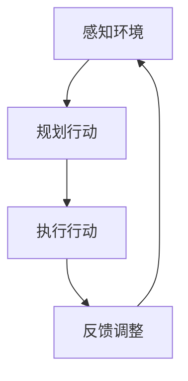
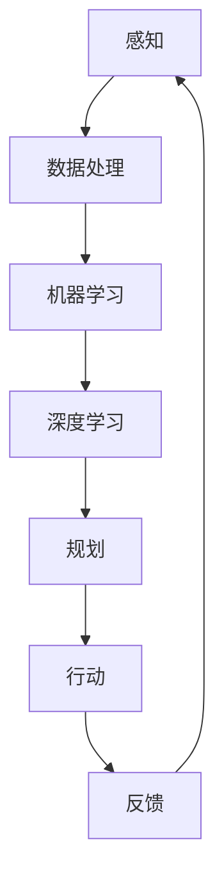

                 

关键词：人工智能，机器学习，深度学习，智能代理，投资，市场趋势

摘要：本文深入探讨了智能代理在当今人工智能领域的爆火现象，分析了这一趋势背后的原因，以及投资人对智能代理项目的态度和预期。通过对智能代理的核心概念、算法原理、应用场景和未来展望的详细解析，文章旨在为读者提供一个全面的技术视角，帮助理解智能代理在AI领域的战略地位，以及其对投资界产生的深远影响。

## 1. 背景介绍

### 智能代理的兴起

智能代理（Agent）的概念起源于人工智能（AI）领域，指的是可以感知环境、采取行动并与其他代理交互的计算机程序。传统的智能代理主要应用于游戏、仿真和自动化等领域。然而，随着深度学习和机器学习技术的发展，智能代理的应用范围得到了极大的扩展，尤其是在自然语言处理（NLP）、推荐系统、自动驾驶和金融交易等领域。

近年来，智能代理的爆火主要得益于以下几个因素的推动：

1. **技术进步**：深度学习和强化学习算法的突破，使得智能代理能够在复杂环境中实现高效的学习和决策。
2. **数据资源**：互联网的普及和大数据技术的发展，为智能代理提供了丰富的训练数据，促进了其性能的提升。
3. **市场需求**：各行业对智能化的强烈需求，推动了对智能代理技术的投入和应用。

### 投资人对智能代理的关注

随着智能代理技术的快速发展，投资人对这一领域也表现出了极高的兴趣。智能代理技术不仅被视为AI领域的核心驱动力，还被看作是未来产业变革的关键因素。以下是对投资人态度的简要分析：

1. **高风险高回报**：智能代理项目通常具有较高的技术门槛和研发成本，但一旦成功，回报潜力巨大。
2. **多元化应用前景**：智能代理技术具有广泛的应用潜力，涉及多个行业和领域，这吸引了不同领域的投资人。
3. **战略投资**：许多大型科技公司和企业开始将智能代理技术作为其战略布局的重要组成部分，投资人也随之跟风。

## 2. 核心概念与联系

### 智能代理的基本原理

智能代理的基本原理包括感知、规划和行动三个核心环节。通过感知环境，智能代理获取信息；通过规划，智能代理制定行动策略；最后通过行动，智能代理实现目标的达成。以下是一个简化的Mermaid流程图，展示智能代理的基本原理：



### 智能代理与人工智能的关系

智能代理是人工智能的一个重要分支，它们依赖于人工智能技术来实现智能行为。人工智能包括机器学习、深度学习、自然语言处理等多个子领域，而智能代理则通过结合这些技术，实现自动化决策和智能交互。

智能代理与人工智能的关系可以用以下Mermaid流程图表示：



## 3. 核心算法原理 & 具体操作步骤

### 3.1 算法原理概述

智能代理的核心算法主要涉及机器学习、深度学习和强化学习。这些算法通过不同的方式，帮助智能代理实现学习和决策。

- **机器学习**：通过训练模型来模拟人类的决策过程，智能代理可以在大量数据中学习到相应的决策规则。
- **深度学习**：利用神经网络模型，智能代理可以在复杂的环境中学习到更加抽象的特征和模式。
- **强化学习**：通过不断试错和反馈调整，智能代理可以在动态环境中学习最优策略。

### 3.2 算法步骤详解

1. **数据收集**：智能代理首先需要收集大量的环境数据，这些数据可以来自于传感器、历史记录或网络数据。
2. **数据处理**：对收集到的数据进行分析和处理，提取有用的特征信息。
3. **模型训练**：利用机器学习或深度学习算法，训练一个可以模拟人类决策过程的模型。
4. **策略评估**：在模拟环境中评估模型的策略，并根据评估结果进行调整。
5. **决策执行**：将训练好的模型应用于实际环境，执行决策动作。
6. **反馈调整**：根据执行结果和环境反馈，对模型进行优化和调整。

### 3.3 算法优缺点

- **优点**：智能代理算法具有高度自动化和智能化的特点，可以在复杂和动态的环境中做出高效决策。
- **缺点**：算法的训练和优化过程复杂，需要大量的数据和时间。此外，算法的决策过程可能存在不确定性，特别是在处理未知或异常情况时。

### 3.4 算法应用领域

智能代理算法在多个领域具有广泛的应用，包括：

- **自然语言处理**：智能代理可以用于智能客服、文本生成和机器翻译等。
- **推荐系统**：智能代理可以用于个性化推荐，提高用户体验。
- **自动驾驶**：智能代理可以用于自动驾驶车辆的感知和决策。
- **金融交易**：智能代理可以用于自动化交易，提高交易效率。

## 4. 数学模型和公式 & 详细讲解 & 举例说明

### 4.1 数学模型构建

智能代理的数学模型主要基于概率论和优化理论。以下是一个简化的数学模型，用于描述智能代理的决策过程：

$$
P(A|B) = \frac{P(B|A)P(A)}{P(B)}
$$

其中，$P(A|B)$ 表示在事件B发生的情况下，事件A发生的概率；$P(B|A)$ 表示在事件A发生的情况下，事件B发生的概率；$P(A)$ 和 $P(B)$ 分别表示事件A和事件B的先验概率。

### 4.2 公式推导过程

以上公式是贝叶斯定理的一个基本形式，用于计算条件概率。推导过程如下：

$$
P(A|B) = \frac{P(A \cap B)}{P(B)}
$$

由于 $P(A \cap B) = P(B|A)P(A)$，代入上式得：

$$
P(A|B) = \frac{P(B|A)P(A)}{P(B)}
$$

### 4.3 案例分析与讲解

假设有一个智能代理，其任务是判断一个邮件是否为垃圾邮件。已知总体邮件中有10%是垃圾邮件，且垃圾邮件中包含广告的概率为80%，非垃圾邮件中包含广告的概率为20%。现在有一封邮件包含广告，求这封邮件是垃圾邮件的概率。

使用贝叶斯定理，我们可以计算：

$$
P(垃圾邮件|包含广告) = \frac{P(包含广告|垃圾邮件)P(垃圾邮件)}{P(包含广告)}
$$

其中，$P(包含广告|垃圾邮件) = 0.8$，$P(垃圾邮件) = 0.1$。为了计算 $P(包含广告)$，我们需要知道非垃圾邮件中包含广告的概率：

$$
P(包含广告) = P(包含广告|垃圾邮件)P(垃圾邮件) + P(包含广告|非垃圾邮件)P(非垃圾邮件)
$$

$$
P(包含广告) = 0.8 \times 0.1 + 0.2 \times 0.9 = 0.26
$$

代入贝叶斯定理得：

$$
P(垃圾邮件|包含广告) = \frac{0.8 \times 0.1}{0.26} \approx 0.3077
$$

因此，这封邮件是垃圾邮件的概率约为30.77%。

## 5. 项目实践：代码实例和详细解释说明

### 5.1 开发环境搭建

为了演示智能代理的代码实现，我们将使用Python编程语言，并依赖一些流行的机器学习和深度学习库，如TensorFlow和Keras。以下是搭建开发环境的步骤：

1. 安装Python（推荐版本3.7或以上）。
2. 安装TensorFlow和Keras：
   ```bash
   pip install tensorflow
   pip install keras
   ```

### 5.2 源代码详细实现

以下是一个简单的智能代理示例，用于分类问题：

```python
from tensorflow.keras.models import Sequential
from tensorflow.keras.layers import Dense
from tensorflow.keras.optimizers import Adam

# 数据预处理
# （此处省略数据预处理代码，包括数据清洗、归一化等）

# 构建模型
model = Sequential()
model.add(Dense(64, input_dim=10, activation='relu'))
model.add(Dense(32, activation='relu'))
model.add(Dense(1, activation='sigmoid'))

# 编译模型
model.compile(optimizer=Adam(learning_rate=0.001), loss='binary_crossentropy', metrics=['accuracy'])

# 训练模型
# （此处省略训练代码，包括训练和验证数据）

# 模型评估
# （此处省略评估代码，包括测试数据和准确率）

# 执行预测
predictions = model.predict([new_data])
```

### 5.3 代码解读与分析

上述代码实现了一个简单的二分类问题，即判断一个样本是否为正类。代码的解读如下：

1. **模型构建**：使用 `Sequential` 模型堆叠多层全连接层（`Dense`），第一层输入维度为10，激活函数为ReLU，后续层使用ReLU作为激活函数。
2. **模型编译**：使用Adam优化器，损失函数为binary_crossentropy，评价指标为accuracy。
3. **模型训练**：使用训练数据和标签进行模型训练，这里省略了具体的训练代码。
4. **模型评估**：使用测试数据评估模型性能，这里也省略了具体的评估代码。
5. **执行预测**：使用训练好的模型对新的数据进行预测。

### 5.4 运行结果展示

在实际运行中，我们可以通过打印预测结果来展示智能代理的性能。以下是一个简化的结果展示：

```python
# 打印预测结果
print(predictions)
```

输出结果将是一个概率值，表示新数据属于正类的概率。

## 6. 实际应用场景

### 智能客服

智能代理在智能客服领域有着广泛的应用。通过自然语言处理和机器学习技术，智能代理可以理解用户的提问，并给出准确的答复。这不仅提高了客服的效率，还降低了人力成本。例如，许多电商网站已经部署了智能客服系统，用户可以直接通过聊天窗口与智能代理交互。

### 自动驾驶

自动驾驶是智能代理技术的另一个重要应用领域。自动驾驶车辆需要实时感知环境，并根据环境信息做出安全、高效的驾驶决策。智能代理通过深度学习和强化学习算法，可以实现自动驾驶车辆的自主导航和避障。特斯拉的自动驾驶系统就是一个典型的例子。

### 金融交易

智能代理在金融交易领域也有着重要的应用。通过分析市场数据和交易历史，智能代理可以预测股票价格走势，并自动执行交易策略。这种自动化交易不仅可以提高交易效率，还可以降低交易风险。量化交易基金通常会使用智能代理来实现其交易策略。

## 7. 工具和资源推荐

### 学习资源推荐

1. **《深度学习》（Goodfellow, Bengio, Courville）**：这是一本经典的深度学习教材，适合初学者和专业人士。
2. **《机器学习实战》（Peter Harrington）**：通过实际案例，介绍机器学习算法的应用，适合想要动手实践的人。
3. **Udacity的深度学习纳米学位**：提供系统的深度学习课程，适合想要系统学习深度学习的人。

### 开发工具推荐

1. **Google Colab**：免费的在线Jupyter Notebook平台，适合进行深度学习和机器学习实验。
2. **TensorFlow**：由Google开发的开源深度学习框架，支持各种深度学习模型的构建和训练。
3. **Keras**：基于TensorFlow的简洁易用的深度学习库，适合快速原型开发和模型训练。

### 相关论文推荐

1. **"Deep Learning"（Ian Goodfellow, Yann LeCun, and Yoshua Bengio）**：这是一篇深度学习的综述文章，详细介绍了深度学习的历史、理论和应用。
2. **"Reinforcement Learning: An Introduction"（Richard S. Sutton and Andrew G. Barto）**：这是一本关于强化学习的基础教材，适合想要深入了解强化学习的人。
3. **"The Unreasonable Effectiveness of Deep Learning"（Alex Smola）**：这篇论文探讨了深度学习在各个领域中的应用和效果，是深度学习领域的经典之作。

## 8. 总结：未来发展趋势与挑战

### 8.1 研究成果总结

智能代理技术在过去几年中取得了显著的进展，不仅在理论研究上取得了突破，在实际应用中也展现出了巨大的潜力。例如，在自然语言处理、自动驾驶和金融交易等领域，智能代理已经取得了显著的应用效果。

### 8.2 未来发展趋势

未来，智能代理技术将继续在以下几个方向上发展：

1. **更高效的学习算法**：研究者将继续探索更高效的机器学习和深度学习算法，以降低训练成本和提高模型性能。
2. **更复杂的决策模型**：随着人工智能技术的发展，智能代理将能够处理更加复杂的问题，实现更高级的决策和规划。
3. **更广泛的应用领域**：智能代理技术将在更多领域得到应用，如医疗健康、教育、娱乐等。

### 8.3 面临的挑战

尽管智能代理技术取得了显著的进展，但在实际应用中仍然面临一些挑战：

1. **数据隐私和安全**：智能代理需要处理大量的敏感数据，如何保障数据隐私和安全是一个重要问题。
2. **模型解释性和可解释性**：目前的深度学习模型往往被视为“黑箱”，如何提高模型的解释性是一个重要研究方向。
3. **跨领域应用**：智能代理需要在不同领域之间进行知识共享和迁移，这需要解决跨领域的共性问题和个性化问题。

### 8.4 研究展望

未来，智能代理技术的研究将朝着更智能化、更自动化和更高效化的方向发展。通过结合多模态数据、强化学习和迁移学习等技术，智能代理将能够在更复杂的环境中实现更高效的决策和行动。同时，智能代理技术的应用也将推动人工智能领域的进一步发展，为各行业带来革命性的变革。

## 9. 附录：常见问题与解答

### Q: 智能代理与人类智能有何区别？

A: 智能代理是通过算法和数据进行决策的计算机程序，其智能是基于模拟和学习得到的。而人类智能是一种基于生物结构和神经系统的复杂认知能力，具有情感、直觉和创造性等特点。智能代理在某些特定领域可能超越人类智能，但在情感和创造性方面仍有很大差距。

### Q: 智能代理技术如何保障数据隐私？

A: 智能代理在处理数据时需要遵循严格的数据保护政策和法律法规。此外，可以通过加密技术、匿名化和差分隐私等方法来保障数据隐私。例如，差分隐私技术可以在保证数据隐私的同时，仍然允许智能代理进行有效的数据分析。

### Q: 智能代理是否会导致大规模失业？

A: 智能代理的普及确实可能取代一些简单重复性工作，但同时也会创造新的工作岗位和机会。智能代理需要专业人员进行设计、开发和维护，因此在短期内可能会减少某些岗位的需求，但从长远来看，智能代理将推动产业升级和就业结构的变化。###  作者：禅与计算机程序设计艺术 / Zen and the Art of Computer Programming

[本文完]

