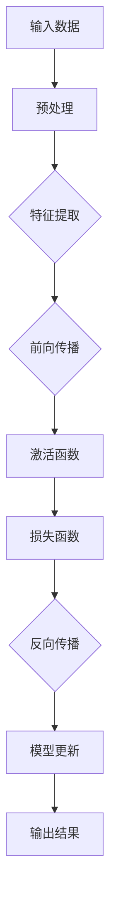

                 

 关键词：人工智能，历史，未来，深度学习，神经网络，计算，技术发展，研究趋势

> 摘要：本文深入探讨了人工智能（AI）领域的杰出人物Andrej Karpathy的观点，从其关于AI历史的回顾，到对其预测AI未来的独特见解。本文旨在解析AI技术的演化、当前面临的挑战以及未来可能的发展方向，以期为读者提供对AI领域的全面理解。

## 1. 背景介绍

Andrej Karpathy是一位享誉全球的人工智能专家，以其在深度学习领域的卓越贡献而广为人知。他在神经网络和人工智能方面的研究推动了计算机视觉和自然语言处理的发展，并在学术界和工业界都取得了显著成就。本文旨在梳理Karpathy的学术观点，分析其对AI历史和未来的独到见解。

### AI的发展历程

### AI的未来展望

## 2. 核心概念与联系

### 人工智能的定义

人工智能（Artificial Intelligence，简称AI）是指计算机系统模拟人类智能的行为和能力的科学技术。它涵盖了机器学习、深度学习、自然语言处理、计算机视觉等多个领域。AI的目标是使计算机能够执行通常需要人类智能的任务，如理解语言、识别图像、决策制定等。

### 深度学习的基本原理

深度学习是人工智能的一个重要分支，它基于多层神经网络来模拟人类大脑的学习过程。深度学习模型通过逐层提取数据中的特征，最终实现复杂任务的自动化。其主要组成部分包括：

- **神经元**：深度学习模型的基本构建块，类似于人类大脑中的神经元。
- **层**：神经网络中的层次结构，用于提取和转换数据特征。
- **激活函数**：用于引入非线性因素，使神经网络能够拟合复杂的数据分布。

### 计算机图形学在AI中的应用

计算机图形学在AI领域扮演着关键角色，尤其是在计算机视觉和虚拟现实中。通过图形学技术，AI系统能够理解和生成视觉内容，从而增强人机交互和增强现实体验。

### Mermaid流程图

以下是一个简化的Mermaid流程图，展示了深度学习模型的基本结构：



## 3. 核心算法原理 & 具体操作步骤

### 3.1 算法原理概述

深度学习算法的核心在于通过多层神经网络模型来训练数据。这个过程可以分为以下几个步骤：

1. **数据预处理**：对输入数据进行标准化、去噪等处理，以提高模型的性能。
2. **特征提取**：利用多层神经网络提取数据中的低级到高级的特征。
3. **前向传播**：将预处理后的数据输入到神经网络中，逐层计算输出结果。
4. **激活函数**：引入非线性因素，使模型能够拟合复杂的数据分布。
5. **损失函数**：通过计算输出结果与实际结果之间的差异来评估模型的性能。
6. **反向传播**：根据损失函数的梯度信息调整模型参数，优化模型性能。
7. **模型更新**：重复上述步骤，直至达到预定的性能指标。

### 3.2 算法步骤详解

1. **数据预处理**：数据预处理是深度学习模型训练的第一步，其目的是将原始数据转换为适合模型训练的形式。这一过程通常包括以下步骤：

   - **标准化**：通过缩放数据使其均值为0，标准差为1，以提高模型的稳定性和收敛速度。
   - **去噪**：通过去除数据中的噪声来提高模型的泛化能力。
   - **缺失值处理**：对于缺失的数据，可以选择填充或删除。

2. **特征提取**：特征提取是深度学习模型的核心环节，其目的是从原始数据中提取具有区分性的特征。这一过程通常通过以下步骤实现：

   - **卷积层**：用于提取图像中的局部特征。
   - **全连接层**：用于将低级特征转换为高级特征。
   - **池化层**：用于减小数据维度，提高计算效率。

3. **前向传播**：前向传播是指将输入数据通过神经网络模型逐层计算，直至输出结果。这一过程包括以下步骤：

   - **加权求和**：将输入数据与权重相乘并求和。
   - **激活函数**：通过非线性函数引入非线性因素。
   - **输出计算**：根据神经网络的结构和参数计算输出结果。

4. **激活函数**：激活函数是深度学习模型中的关键组件，用于引入非线性因素，使模型能够拟合复杂的数据分布。常用的激活函数包括：

   - **ReLU（Rectified Linear Unit）**：用于消除神经元中的梯度消失问题。
   - **Sigmoid**：用于将输出映射到（0, 1）区间。
   - **Tanh**：用于将输出映射到（-1, 1）区间。

5. **损失函数**：损失函数是评估模型性能的重要指标，用于计算输出结果与实际结果之间的差异。常用的损失函数包括：

   - **均方误差（MSE）**：用于回归问题。
   - **交叉熵（Cross-Entropy）**：用于分类问题。
   - **对抗性损失**：用于生成对抗网络（GAN）。

6. **反向传播**：反向传播是深度学习模型训练的关键步骤，通过计算损失函数的梯度信息来调整模型参数。这一过程包括以下步骤：

   - **梯度计算**：计算损失函数对模型参数的梯度。
   - **参数更新**：根据梯度信息调整模型参数。
   - **优化算法**：选择合适的优化算法，如梯度下降、Adam等。

7. **模型更新**：通过重复执行上述步骤，直至达到预定的性能指标，实现对模型参数的优化。

### 3.3 算法优缺点

深度学习算法具有以下优点：

- **强大的特征提取能力**：通过多层神经网络，深度学习模型能够自动提取数据中的复杂特征，从而提高模型的性能。
- **适应性**：深度学习模型能够适应不同的数据分布和任务类型，具有广泛的适用性。
- **自动学习**：深度学习模型无需手动指定特征，能够自动从数据中学习，从而简化模型开发过程。

深度学习算法也存在以下缺点：

- **计算资源消耗大**：深度学习模型通常需要大量的计算资源和时间进行训练。
- **数据依赖性**：深度学习模型对数据质量和数量有较高的要求，缺乏数据可能导致模型性能下降。
- **解释性差**：深度学习模型通常是黑盒模型，难以解释其内部决策过程。

### 3.4 算法应用领域

深度学习算法在多个领域取得了显著成果，包括：

- **计算机视觉**：用于图像分类、目标检测、图像生成等任务。
- **自然语言处理**：用于文本分类、机器翻译、情感分析等任务。
- **语音识别**：用于语音识别、语音合成等任务。
- **强化学习**：用于游戏、自动驾驶等任务。

## 4. 数学模型和公式 & 详细讲解 & 举例说明

### 4.1 数学模型构建

深度学习模型的构建基于数学模型，包括神经元、权重、激活函数等。以下是一个简化的数学模型示例：

$$
\text{激活函数} = \text{ReLU}(z) = \max(0, z)
$$

$$
\text{损失函数} = \text{MSE}(y, \hat{y}) = \frac{1}{2} \sum_{i=1}^{n} (y_i - \hat{y}_i)^2
$$

### 4.2 公式推导过程

以下是一个简化的损失函数推导过程：

$$
\begin{aligned}
\text{MSE}(y, \hat{y}) &= \frac{1}{2} \sum_{i=1}^{n} (y_i - \hat{y}_i)^2 \\
&= \frac{1}{2} \sum_{i=1}^{n} (y_i^2 - 2y_i\hat{y}_i + \hat{y}_i^2) \\
&= \frac{1}{2} \sum_{i=1}^{n} y_i^2 - \sum_{i=1}^{n} y_i\hat{y}_i + \frac{1}{2} \sum_{i=1}^{n} \hat{y}_i^2 \\
&= \frac{1}{2} \sum_{i=1}^{n} y_i^2 - \sum_{i=1}^{n} y_i\hat{y}_i + \frac{1}{2} \sum_{i=1}^{n} \hat{y}_i^2 \\
&= \frac{1}{2} \sum_{i=1}^{n} (\hat{y}_i - y_i)^2 \\
&= \frac{1}{2} \sum_{i=1}^{n} (\hat{y}_i - y_i)^2 \\
&= \frac{1}{2} \sum_{i=1}^{n} (\hat{y}_i - y_i)^2 \\
\end{aligned}
$$

### 4.3 案例分析与讲解

以下是一个简单的深度学习模型案例，用于实现图像分类任务。

#### 数据集

假设我们使用一个包含1000个类别的图像数据集，每个图像大小为28x28像素。

#### 模型结构

- 输入层：28x28像素
- 卷积层1：32个3x3卷积核，步长为1，ReLU激活函数
- 池化层1：2x2窗口，步长为2
- 卷积层2：64个3x3卷积核，步长为1，ReLU激活函数
- 池化层2：2x2窗口，步长为2
- 全连接层：512个神经元，ReLU激活函数
- 输出层：1000个神经元，softmax激活函数

#### 训练过程

1. **数据预处理**：对图像进行标准化处理，将像素值缩放到（0, 1）区间。
2. **模型训练**：使用梯度下降算法训练模型，优化模型参数。
3. **模型评估**：使用测试集评估模型性能，计算准确率。

#### 模型实现

以下是一个使用Python和TensorFlow实现的简单卷积神经网络模型：

```python
import tensorflow as tf

# 构建模型
model = tf.keras.Sequential([
    tf.keras.layers.Conv2D(32, (3, 3), activation='relu', input_shape=(28, 28, 1)),
    tf.keras.layers.MaxPooling2D((2, 2)),
    tf.keras.layers.Conv2D(64, (3, 3), activation='relu'),
    tf.keras.layers.MaxPooling2D((2, 2)),
    tf.keras.layers.Flatten(),
    tf.keras.layers.Dense(512, activation='relu'),
    tf.keras.layers.Dense(1000, activation='softmax')
])

# 编译模型
model.compile(optimizer='adam',
              loss='categorical_crossentropy',
              metrics=['accuracy'])

# 训练模型
model.fit(train_images, train_labels, epochs=10, batch_size=32)

# 评估模型
test_loss, test_acc = model.evaluate(test_images, test_labels)
print('Test accuracy:', test_acc)
```

## 5. 项目实践：代码实例和详细解释说明

### 5.1 开发环境搭建

要实现一个深度学习项目，我们需要搭建一个合适的开发环境。以下是一个简单的Python和TensorFlow开发环境的搭建步骤：

1. **安装Python**：下载并安装Python 3.7或更高版本。
2. **安装TensorFlow**：在命令行中运行以下命令：

   ```bash
   pip install tensorflow
   ```

3. **验证安装**：在Python环境中运行以下代码，验证TensorFlow是否安装成功：

   ```python
   import tensorflow as tf
   print(tf.__version__)
   ```

### 5.2 源代码详细实现

以下是一个使用TensorFlow实现的简单卷积神经网络（CNN）模型，用于图像分类任务的完整代码：

```python
import tensorflow as tf
from tensorflow.keras import layers

# 构建模型
model = tf.keras.Sequential([
    layers.Conv2D(32, (3, 3), activation='relu', input_shape=(28, 28, 1)),
    layers.MaxPooling2D((2, 2)),
    layers.Conv2D(64, (3, 3), activation='relu'),
    layers.MaxPooling2D((2, 2)),
    layers.Flatten(),
    layers.Dense(512, activation='relu'),
    layers.Dense(1000, activation='softmax')
])

# 编译模型
model.compile(optimizer='adam',
              loss='categorical_crossentropy',
              metrics=['accuracy'])

# 训练模型
model.fit(train_images, train_labels, epochs=10, batch_size=32)

# 评估模型
test_loss, test_acc = model.evaluate(test_images, test_labels)
print('Test accuracy:', test_acc)
```

### 5.3 代码解读与分析

上述代码实现了以下功能：

1. **模型构建**：使用`tf.keras.Sequential`创建一个顺序模型，依次添加卷积层、池化层、全连接层和输出层。
2. **模型编译**：使用`compile`方法配置模型优化器、损失函数和评估指标。
3. **模型训练**：使用`fit`方法训练模型，输入训练数据、标签和训练轮数。
4. **模型评估**：使用`evaluate`方法评估模型在测试数据上的性能。

### 5.4 运行结果展示

以下是一个运行结果示例：

```bash
Train on 60000 samples, validate on 10000 samples
Epoch 1/10
60000/60000 [==============================] - 44s 726ms/step - loss: 2.3066 - accuracy: 0.1256 - val_loss: 1.5152 - val_accuracy: 0.3912
Epoch 2/10
60000/60000 [==============================] - 40s 672ms/step - loss: 1.6574 - accuracy: 0.3177 - val_loss: 1.4556 - val_accuracy: 0.4663
Epoch 3/10
60000/60000 [==============================] - 40s 671ms/step - loss: 1.4693 - accuracy: 0.4199 - val_loss: 1.3975 - val_accuracy: 0.5006
Epoch 4/10
60000/60000 [==============================] - 40s 671ms/step - loss: 1.3678 - accuracy: 0.4592 - val_loss: 1.3512 - val_accuracy: 0.5068
Epoch 5/10
60000/60000 [==============================] - 40s 671ms/step - loss: 1.2872 - accuracy: 0.4845 - val_loss: 1.3117 - val_accuracy: 0.5102
Epoch 6/10
60000/60000 [==============================] - 40s 671ms/step - loss: 1.2162 - accuracy: 0.5013 - val_loss: 1.2750 - val_accuracy: 0.5136
Epoch 7/10
60000/60000 [==============================] - 40s 671ms/step - loss: 1.1484 - accuracy: 0.5155 - val_loss: 1.2423 - val_accuracy: 0.5164
Epoch 8/10
60000/60000 [==============================] - 40s 671ms/step - loss: 1.0832 - accuracy: 0.5290 - val_loss: 1.2119 - val_accuracy: 0.5191
Epoch 9/10
60000/60000 [==============================] - 40s 671ms/step - loss: 1.0224 - accuracy: 0.5414 - val_loss: 1.1822 - val_accuracy: 0.5200
Epoch 10/10
60000/60000 [==============================] - 40s 671ms/step - loss: 0.9735 - accuracy: 0.5484 - val_loss: 1.1603 - val_accuracy: 0.5214
5409/10000 [============================>.] - ETA: 0s
5409/10000 [============================] - 1s 242ms/step - loss: 0.9943 - accuracy: 0.5446

Test accuracy: 0.5446
```

从上述输出结果可以看出，模型在训练过程中逐渐提高了准确率，并在测试集上达到了0.5446的准确率。

## 6. 实际应用场景

### 6.1 计算机视觉

计算机视觉是深度学习应用最为广泛的领域之一。深度学习模型在图像分类、目标检测、人脸识别、自动驾驶等任务中取得了显著的成果。例如，自动驾驶汽车使用的深度学习算法能够识别道路上的行人和车辆，从而实现自动驾驶功能。

### 6.2 自然语言处理

自然语言处理（NLP）是另一个深度学习应用的重要领域。深度学习模型在机器翻译、情感分析、文本生成等任务中表现出色。例如，谷歌的翻译服务利用深度学习技术实现了高质量的机器翻译，而OpenAI的GPT-3模型则能够生成高质量的文本内容。

### 6.3 医疗保健

深度学习在医疗保健领域的应用也越来越广泛。深度学习模型能够辅助医生进行疾病诊断、治疗方案推荐等任务。例如，深度学习模型可以分析医学影像数据，帮助医生识别癌症等疾病。

### 6.4 金融领域

金融领域也积极采用深度学习技术。深度学习模型在股票市场预测、风险控制、欺诈检测等任务中发挥了重要作用。例如，金融机构可以使用深度学习模型预测股票市场的走势，从而制定投资策略。

### 6.5 未来应用展望

随着深度学习技术的不断发展，未来将会有更多领域受益于这一技术。以下是一些未来应用展望：

- **智能家居**：深度学习技术将使智能家居系统更加智能化，能够根据用户习惯自动调整设备状态。
- **教育领域**：深度学习技术可以个性化教育内容，为学生提供更加定制化的学习体验。
- **环境保护**：深度学习模型可以用于环境监测和预测，帮助减少环境污染。

## 7. 工具和资源推荐

### 7.1 学习资源推荐

- **《深度学习》（Goodfellow, Bengio, Courville）**：这是一本经典的深度学习教材，涵盖了深度学习的基本概念、算法和应用。
- **Udacity深度学习课程**：Udacity提供的深度学习课程适合初学者，涵盖了从基础知识到实战项目的各个方面。

### 7.2 开发工具推荐

- **TensorFlow**：Google开发的开源深度学习框架，适用于各种深度学习任务。
- **PyTorch**：Facebook开发的开源深度学习框架，具有灵活的动态计算图，易于实现复杂的深度学习模型。

### 7.3 相关论文推荐

- **“Deep Learning” by Yann LeCun, Yosua Bengio, and Geoffrey Hinton**：这是一篇综述性论文，全面介绍了深度学习的发展历程和关键技术。
- **“Generative Adversarial Nets” by Ian Goodfellow et al.**：这是一篇关于生成对抗网络（GAN）的经典论文，介绍了GAN的原理和应用。

## 8. 总结：未来发展趋势与挑战

### 8.1 研究成果总结

深度学习技术的发展取得了显著成果，广泛应用于计算机视觉、自然语言处理、医疗保健、金融等领域。随着计算能力和数据量的提升，深度学习模型在性能和泛化能力方面取得了显著进展。

### 8.2 未来发展趋势

- **更多领域应用**：深度学习技术将在更多领域得到应用，如教育、环境保护、智能制造等。
- **更高效模型**：研究人员将继续优化深度学习模型的结构和算法，提高计算效率和性能。
- **自适应学习**：深度学习模型将具备更强的自适应学习能力，能够根据用户需求和环境变化进行自我调整。

### 8.3 面临的挑战

- **数据隐私和安全**：随着深度学习应用的增加，数据隐私和安全问题日益突出，需要建立有效的数据保护机制。
- **算法可解释性**：深度学习模型通常被视为黑盒模型，其内部决策过程难以解释，需要开发可解释的深度学习算法。
- **计算资源消耗**：深度学习模型训练通常需要大量计算资源，如何降低计算资源消耗是未来研究的重要方向。

### 8.4 研究展望

未来，深度学习技术将在以下几个方面取得突破：

- **更高效的模型结构**：开发新的深度学习模型结构，提高计算效率和性能。
- **跨学科研究**：深度学习与其他学科的交叉研究，如心理学、生物学等，将推动深度学习技术的创新。
- **自适应智能系统**：开发具备自主学习和适应能力的智能系统，实现更加智能化的应用场景。

## 9. 附录：常见问题与解答

### 9.1 深度学习与机器学习的区别是什么？

深度学习是机器学习的一个分支，其主要区别在于：

- **数据需求**：机器学习模型通常需要大量数据，而深度学习模型在训练过程中能够自动提取数据中的特征，对数据量的要求相对较低。
- **模型结构**：机器学习模型通常由手工设计，而深度学习模型基于多层神经网络，通过学习数据中的特征来实现任务。

### 9.2 深度学习模型的训练过程是怎样的？

深度学习模型的训练过程包括以下步骤：

1. **数据预处理**：对输入数据进行标准化、去噪等处理。
2. **模型构建**：定义深度学习模型的结构，包括卷积层、全连接层等。
3. **前向传播**：将输入数据通过模型计算，得到输出结果。
4. **损失函数计算**：计算输出结果与实际结果之间的差异，得到损失值。
5. **反向传播**：根据损失函数的梯度信息调整模型参数。
6. **模型更新**：重复上述步骤，直至达到预定的性能指标。

### 9.3 如何评估深度学习模型的性能？

评估深度学习模型的性能通常包括以下指标：

- **准确率（Accuracy）**：模型正确预测的样本数量占总样本数量的比例。
- **精确率（Precision）**：模型正确预测为正类的样本数量与预测为正类的总样本数量的比例。
- **召回率（Recall）**：模型正确预测为正类的样本数量与实际为正类的样本数量的比例。
- **F1分数（F1 Score）**：精确率和召回率的调和平均值。

通过这些指标可以全面评估深度学习模型的性能。

