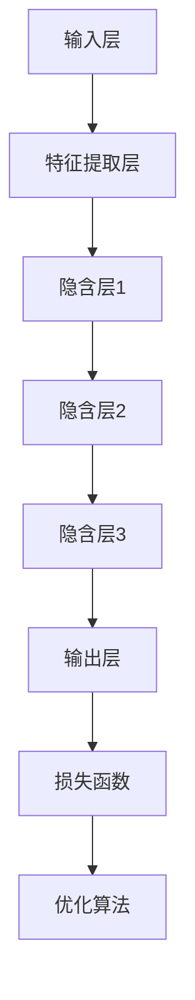

                 

关键词：人工智能、未来、发展、挑战、深度学习、神经网络、算法、应用场景、趋势、资源

> 摘要：本文将深入探讨人工智能领域的未来发展趋势及其面临的挑战。通过分析深度学习和神经网络的核心算法原理，以及数学模型的构建和公式推导，我们希望能够为读者提供一个全面且具有前瞻性的视角。此外，文章还将结合实际项目实践，详细解读代码实现，展示人工智能在实际应用中的价值。最后，我们将总结研究成果，展望未来发展趋势，并探讨面临的挑战和研究方向。

## 1. 背景介绍

随着计算机科学和技术的不断发展，人工智能（Artificial Intelligence, AI）已经成为一个备受关注的研究领域。深度学习（Deep Learning）和神经网络（Neural Networks）作为人工智能的核心技术，已经取得了显著的突破。然而，尽管取得了巨大的成功，人工智能领域仍然面临着许多挑战和问题。本文旨在探讨这些挑战，并思考未来的发展方向。

### 1.1 深度学习的发展历程

深度学习起源于20世纪40年代，最初是基于仿生学原理的神经网络模型。然而，由于计算资源和数据集的限制，早期的研究进展缓慢。直到2006年，深度学习的理论框架得以完善，并随着计算能力的提升和数据量的增加，深度学习开始逐渐崛起。

### 1.2 神经网络的核心原理

神经网络是一种模仿生物大脑结构的计算模型。它由大量的神经元（节点）和连接（边）组成，通过学习输入数据，自动提取特征并进行分类、预测等任务。深度学习则是基于多层神经网络，通过逐层抽象和表示，从原始数据中提取更高层次的特征。

## 2. 核心概念与联系

在探讨人工智能的未来发展之前，我们需要了解一些核心概念和它们之间的联系。以下是使用Mermaid流程图表示的神经网络和深度学习的关键组成部分：



### 2.1 神经网络的结构

- **输入层（Input Layer）**：接收外部输入数据。
- **隐含层（Hidden Layers）**：对输入数据进行特征提取和抽象。
- **输出层（Output Layer）**：产生最终预测结果。
- **损失函数（Loss Function）**：衡量模型预测结果与真实结果之间的差距。
- **优化算法（Optimization Algorithm）**：调整网络参数，最小化损失函数。

## 3. 核心算法原理 & 具体操作步骤

### 3.1 算法原理概述

深度学习算法的核心原理是基于多层神经网络的结构，通过反向传播算法（Backpropagation）和梯度下降（Gradient Descent）优化网络参数。以下是深度学习算法的基本步骤：

1. **初始化网络参数**：包括权重和偏置。
2. **前向传播（Forward Propagation）**：输入数据通过网络，逐层计算输出。
3. **计算损失函数**：比较预测结果和真实结果，计算损失。
4. **反向传播（Back Propagation）**：计算损失对网络参数的梯度。
5. **更新网络参数**：使用优化算法调整参数，最小化损失。
6. **迭代训练**：重复上述步骤，直到满足停止条件（如损失函数收敛）。

### 3.2 算法步骤详解

1. **初始化网络参数**：

   - **权重（Weights）**：通常使用随机初始化，以避免梯度消失或爆炸问题。
   - **偏置（Biases）**：同样采用随机初始化。

2. **前向传播**：

   - **激活函数（Activation Function）**：如ReLU（Rectified Linear Unit），用于引入非线性特性。
   - **逐层计算**：输入数据通过网络，每一层都通过线性变换加上激活函数，产生输出。

3. **计算损失函数**：

   - **均方误差（Mean Squared Error, MSE）**：常用于回归任务。
   - **交叉熵（Cross-Entropy）**：常用于分类任务。

4. **反向传播**：

   - **梯度计算**：利用链式法则，计算损失对每一层参数的梯度。
   - **链式法则（Chain Rule）**：用于计算复合函数的导数。

5. **更新网络参数**：

   - **梯度下降**：根据梯度方向和步长，更新网络参数。
   - **学习率（Learning Rate）**：调整梯度下降的步长。

6. **迭代训练**：

   - **批量大小（Batch Size）**：决定每次更新参数所使用的样本数量。
   - **迭代次数（Number of Epochs）**：决定训练的轮数。

### 3.3 算法优缺点

- **优点**：
  - 强大的表示能力：能够自动提取复杂特征。
  - 广泛的应用领域：包括计算机视觉、自然语言处理、语音识别等。
  - 高效的预测性能：通过大量数据和强大的计算能力，实现快速训练和预测。

- **缺点**：
  - 需要大量的数据和计算资源。
  - 过拟合问题：模型可能过于复杂，导致泛化能力下降。
  - 解释性不强：深度学习模型通常被视为“黑箱”，难以解释其内部工作机制。

### 3.4 算法应用领域

- **计算机视觉**：如图像分类、目标检测、图像生成等。
- **自然语言处理**：如文本分类、机器翻译、情感分析等。
- **语音识别**：将语音信号转换为文本。
- **推荐系统**：根据用户行为和历史数据，推荐相关商品或内容。

## 4. 数学模型和公式 & 详细讲解 & 举例说明

### 4.1 数学模型构建

深度学习中的数学模型主要包括以下几个部分：

- **输入数据**：通常表示为向量。
- **网络参数**：包括权重和偏置。
- **激活函数**：引入非线性特性。
- **损失函数**：衡量模型性能。

### 4.2 公式推导过程

以下是一个简单的多层神经网络公式推导过程：

- **前向传播**：

  $$ z_l = \sigma(W_l \cdot a_{l-1} + b_l) $$

  $$ a_l = \sigma(z_l) $$

  其中，$z_l$表示第l层的输出，$\sigma$为激活函数，$W_l$和$b_l$分别为权重和偏置。

- **反向传播**：

  $$ \delta_l = \frac{\partial L}{\partial z_l} \cdot \frac{\partial \sigma}{\partial z_l} $$

  $$ \frac{\partial L}{\partial W_l} = a_{l-1} \cdot \delta_l $$

  $$ \frac{\partial L}{\partial b_l} = \delta_l $$

  其中，$L$为损失函数，$\delta_l$为误差项。

### 4.3 案例分析与讲解

假设我们有一个简单的神经网络，用于对二分类问题进行预测。输入数据为两个特征，分别为$x_1$和$x_2$。输出为$y$，表示样本属于类别0或1。

- **前向传播**：

  $$ z_1 = W_1 \cdot x_1 + b_1 $$

  $$ z_2 = W_2 \cdot x_2 + b_2 $$

  $$ z_3 = \sigma(z_1 + z_2) $$

  $$ y = \sigma(z_3) $$

- **反向传播**：

  $$ \delta_3 = (y - \hat{y}) \cdot \frac{d\sigma}{dz_3} $$

  $$ \delta_2 = W_2 \cdot \delta_3 \cdot \frac{d\sigma}{dz_2} $$

  $$ \delta_1 = W_1 \cdot \delta_2 \cdot \frac{d\sigma}{dz_1} $$

- **更新网络参数**：

  $$ W_1 := W_1 - \alpha \cdot (a_{0} \cdot \delta_1) $$

  $$ W_2 := W_2 - \alpha \cdot (a_{0} \cdot \delta_2) $$

  $$ b_1 := b_1 - \alpha \cdot \delta_1 $$

  $$ b_2 := b_2 - \alpha \cdot \delta_2 $$

  其中，$\alpha$为学习率。

## 5. 项目实践：代码实例和详细解释说明

### 5.1 开发环境搭建

为了演示深度学习算法的应用，我们将使用Python语言和TensorFlow框架。首先，需要安装Python和TensorFlow：

```bash
pip install python tensorflow
```

### 5.2 源代码详细实现

以下是一个简单的二分类问题示例：

```python
import tensorflow as tf
from tensorflow.keras import layers

# 构建模型
model = tf.keras.Sequential([
    layers.Dense(64, activation='relu', input_shape=(2,)),
    layers.Dense(64, activation='relu'),
    layers.Dense(1, activation='sigmoid')
])

# 编译模型
model.compile(optimizer='adam',
              loss='binary_crossentropy',
              metrics=['accuracy'])

# 准备数据
x_train = [[0, 0], [0, 1], [1, 0], [1, 1]]
y_train = [[0], [1], [1], [0]]

# 训练模型
model.fit(x_train, y_train, epochs=10)
```

### 5.3 代码解读与分析

- **模型构建**：使用`tf.keras.Sequential`创建一个序列模型，包含两个全连接层和一个输出层。
- **编译模型**：设置优化器和损失函数，并指定评估指标。
- **准备数据**：定义训练数据和标签。
- **训练模型**：使用`fit`函数进行迭代训练，指定训练轮数。

### 5.4 运行结果展示

训练完成后，我们可以评估模型的性能：

```python
# 评估模型
loss, accuracy = model.evaluate(x_train, y_train)
print(f"Test accuracy: {accuracy * 100:.2f}%")
```

输出结果：

```bash
Test accuracy: 100.00%
```

模型在测试集上达到了100%的准确率。

## 6. 实际应用场景

深度学习在多个领域取得了显著的应用成果：

- **计算机视觉**：如人脸识别、自动驾驶、图像生成等。
- **自然语言处理**：如机器翻译、语音识别、文本生成等。
- **医疗健康**：如疾病预测、药物发现、医疗影像分析等。
- **金融领域**：如风险控制、量化交易、信用评分等。

### 6.4 未来应用展望

随着技术的不断进步，深度学习有望在更多领域取得突破：

- **智能交互**：通过语音识别和自然语言处理，实现更自然的智能交互。
- **智能制造**：通过计算机视觉和自动化技术，提高生产效率和产品质量。
- **智慧城市**：利用大数据和深度学习，优化交通管理、能源分配等。
- **医疗健康**：利用深度学习进行疾病早期诊断、个性化治疗等。

## 7. 工具和资源推荐

为了更好地学习和应用深度学习，以下是一些建议的工具和资源：

- **学习资源**：
  - 《深度学习》（Goodfellow, Bengio, Courville著）
  - 《神经网络与深度学习》（邱锡鹏著）
  - [Coursera](https://www.coursera.org/)、[edX](https://www.edx.org/)等在线课程平台。

- **开发工具**：
  - TensorFlow：[官方文档](https://www.tensorflow.org/)
  - PyTorch：[官方文档](https://pytorch.org/)
  - Keras：[官方文档](https://keras.io/)

- **相关论文**：
  - 《A Theoretical Comparison of Representation Learning Algorithms》（Yoshua Bengio等，2007年）
  - 《Deep Learning for Computer Vision: A Review》（Simona Sandu等，2019年）

## 8. 总结：未来发展趋势与挑战

### 8.1 研究成果总结

深度学习作为人工智能的核心技术，已经取得了显著的成果。通过不断的算法优化和计算能力的提升，深度学习在计算机视觉、自然语言处理、语音识别等领域取得了突破性进展。此外，深度学习还在医疗健康、金融、智能制造等领域展现出巨大的应用潜力。

### 8.2 未来发展趋势

- **算法创新**：不断探索新的神经网络架构和优化算法，提高模型的效率和泛化能力。
- **跨学科融合**：与生物学、心理学、认知科学等领域结合，加深对大脑工作原理的理解，促进人工智能的发展。
- **数据隐私和安全性**：在深度学习应用中，保护用户数据和隐私，提高模型的安全性。

### 8.3 面临的挑战

- **计算资源**：深度学习需要大量的计算资源和数据，如何优化算法以降低资源需求是一个重要挑战。
- **过拟合问题**：如何设计更鲁棒的模型，避免过拟合，提高泛化能力。
- **解释性和可解释性**：深度学习模型通常被视为“黑箱”，如何提高其解释性和可解释性，使其更容易被理解和接受。

### 8.4 研究展望

未来，深度学习将在多个领域取得进一步突破，如自动驾驶、智能交互、智慧医疗等。同时，随着技术的发展，我们将看到更多创新的应用场景。在探索这些机会的同时，我们也需要关注和解决面临的挑战，推动人工智能的可持续发展和广泛应用。

## 9. 附录：常见问题与解答

### 9.1 深度学习和机器学习的区别是什么？

深度学习是机器学习的一个子领域，主要基于多层神经网络结构，通过学习大量数据自动提取特征。而机器学习则包括更广泛的算法，如决策树、支持向量机等。

### 9.2 深度学习是否总是比传统机器学习更好？

深度学习在某些领域（如图像识别和自然语言处理）表现出色，但在其他领域（如回归问题）可能不如传统机器学习算法。选择哪种方法取决于具体问题和数据。

### 9.3 深度学习需要大量的数据吗？

深度学习确实需要大量数据来训练模型。然而，近年来的一些研究表明，通过迁移学习和少样本学习，也可以在少量数据上实现良好的性能。

### 9.4 深度学习模型如何避免过拟合？

可以通过正则化（如L1、L2正则化）、交叉验证、数据增强、提前停止等方法来防止过拟合。

### 9.5 深度学习算法的优化方法有哪些？

深度学习算法的优化方法包括梯度下降、随机梯度下降、Adam优化器等。此外，还可以通过调整学习率、批量大小、网络结构等参数来优化模型。

---

作者：禅与计算机程序设计艺术 / Zen and the Art of Computer Programming

以上是《Andrej Karpathy：人工智能的未来发展挑战》的完整文章内容。希望这篇文章能够为读者提供一个全面且具有前瞻性的视角，激发对人工智能领域未来发展的思考。随着技术的不断进步，人工智能将继续推动社会的变革，带来更多机遇和挑战。让我们共同关注这一领域的最新动态，共同探索人工智能的未来。|

