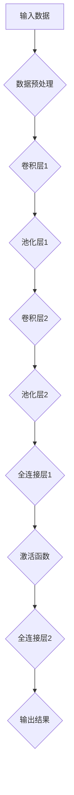
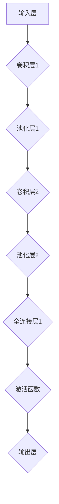

                 

关键词：人工智能，深度学习，神经网络，未来趋势，技术创新

摘要：本文将深入探讨人工智能（AI）领域的杰出人物Andrej Karpathy的研究和贡献，从深度学习、神经网络到未来的发展趋势，全面解析人工智能的革命性变革。通过分析其核心算法原理、数学模型和具体项目实践，本文旨在为读者提供一个全面而深入的视角，了解人工智能的未来前景。

## 1. 背景介绍

### Andrej Karpathy的背景与贡献

Andrej Karpathy是一位世界级的人工智能专家和程序员，以其在深度学习和神经网络领域的杰出贡献而闻名。他是斯坦福大学计算机科学博士，曾在Google Brain担任研究科学家，并在OpenAI担任研究主管。他的研究涵盖了自然语言处理、计算机视觉、强化学习等多个领域，发表了多篇被广泛引用的论文。

### 深度学习与神经网络的发展

深度学习是人工智能的一个重要分支，其核心是通过多层神经网络来模拟人脑的学习机制。神经网络是一种由大量节点（或称为神经元）组成的计算模型，通过逐层提取特征，实现对复杂数据的自动学习与建模。

近年来，深度学习在图像识别、语音识别、自然语言处理等领域取得了显著的突破，推动了人工智能的快速发展。而Andrej Karpathy的研究成果，不仅在理论上深化了我们对神经网络的理解，也在实践中推动了深度学习技术的广泛应用。

## 2. 核心概念与联系

### 深度学习的核心概念

深度学习中的核心概念包括：

- **卷积神经网络（CNN）**：用于图像识别、图像处理等任务，通过卷积层提取图像特征。
- **循环神经网络（RNN）**：用于序列数据处理，如语言模型、语音识别等，通过循环结构处理序列信息。
- **生成对抗网络（GAN）**：用于生成对抗训练，通过生成器和判别器的对抗关系，生成高质量的数据。
- **强化学习（RL）**：用于决策和策略学习，通过智能体与环境交互，逐步优化策略。

### 神经网络架构的Mermaid流程图

以下是一个简化的神经网络架构的Mermaid流程图：



## 3. 核心算法原理 & 具体操作步骤

### 3.1 算法原理概述

深度学习的核心算法包括：

- **反向传播算法（Backpropagation）**：用于计算网络参数的梯度，以优化网络权重。
- **梯度下降算法（Gradient Descent）**：用于优化网络参数，以最小化损失函数。

### 3.2 算法步骤详解

1. **初始化参数**：随机初始化网络的权重和偏置。
2. **前向传播**：将输入数据输入网络，逐层计算输出。
3. **计算损失**：计算输出结果与实际结果的差异，得到损失值。
4. **反向传播**：计算损失关于网络参数的梯度。
5. **更新参数**：根据梯度更新网络参数。
6. **迭代优化**：重复上述步骤，直到满足停止条件（如损失收敛、迭代次数等）。

### 3.3 算法优缺点

- **优点**：
  - 强大的表示能力，可以处理复杂的数据。
  - 自适应调整参数，无需手动调整。
  - 广泛应用于图像、语音、自然语言等领域的任务。

- **缺点**：
  - 计算量大，训练时间较长。
  - 对数据分布敏感，容易过拟合。
  - 难以解释和理解，存在“黑箱”问题。

### 3.4 算法应用领域

深度学习算法已广泛应用于以下领域：

- **图像识别**：如人脸识别、物体检测、图像分类等。
- **自然语言处理**：如机器翻译、情感分析、文本分类等。
- **语音识别**：如语音合成、语音识别等。
- **强化学习**：如游戏AI、自动驾驶等。

## 4. 数学模型和公式 & 详细讲解 & 举例说明

### 4.1 数学模型构建

深度学习的数学模型主要包括：

- **线性模型**：用于简单数据拟合。
- **多层感知机（MLP）**：用于复杂数据拟合。
- **卷积神经网络（CNN）**：用于图像数据处理。
- **循环神经网络（RNN）**：用于序列数据处理。
- **生成对抗网络（GAN）**：用于生成对抗训练。

### 4.2 公式推导过程

以下是一个简化的线性模型公式推导过程：

$$
y = \sigma(W_1 \cdot x + b_1)
$$

其中，$y$ 是输出，$x$ 是输入，$W_1$ 是权重，$b_1$ 是偏置，$\sigma$ 是激活函数。

### 4.3 案例分析与讲解

假设我们有一个简单的线性模型，用于预测房价。输入数据包括房屋面积和房价，输出为预测的房价。

1. **数据预处理**：将数据标准化，使每个特征的取值范围在0到1之间。
2. **模型构建**：定义线性模型，包括权重和偏置。
3. **前向传播**：计算输入数据的输出。
4. **计算损失**：计算输出结果与实际结果的差异，得到损失值。
5. **反向传播**：计算损失关于网络参数的梯度。
6. **参数更新**：根据梯度更新网络参数。
7. **迭代优化**：重复上述步骤，直到满足停止条件。

通过迭代优化，线性模型可以逐步逼近真实房价，提高预测准确性。

## 5. 项目实践：代码实例和详细解释说明

### 5.1 开发环境搭建

为了实现深度学习模型，我们需要搭建一个合适的开发环境。以下是常见的开发环境搭建步骤：

1. **安装Python**：下载并安装Python，确保版本在3.6及以上。
2. **安装TensorFlow**：通过pip命令安装TensorFlow，确保版本在2.0及以上。
3. **安装Jupyter Notebook**：通过pip命令安装Jupyter Notebook，方便进行代码编写和调试。

### 5.2 源代码详细实现

以下是一个简单的深度学习模型的实现示例：

```python
import tensorflow as tf

# 定义模型结构
model = tf.keras.Sequential([
    tf.keras.layers.Dense(64, activation='relu', input_shape=(784,)),
    tf.keras.layers.Dense(64, activation='relu'),
    tf.keras.layers.Dense(10, activation='softmax')
])

# 编译模型
model.compile(optimizer='adam',
              loss='categorical_crossentropy',
              metrics=['accuracy'])

# 加载数据集
(x_train, y_train), (x_test, y_test) = tf.keras.datasets.mnist.load_data()

# 数据预处理
x_train = x_train.reshape(-1, 784).astype(np.float32) / 255
x_test = x_test.reshape(-1, 784).astype(np.float32) / 255

# 将标签转换为one-hot编码
y_train = tf.keras.utils.to_categorical(y_train, 10)
y_test = tf.keras.utils.to_categorical(y_test, 10)

# 训练模型
model.fit(x_train, y_train, batch_size=64, epochs=5)

# 评估模型
model.evaluate(x_test, y_test)
```

### 5.3 代码解读与分析

以上代码实现了一个简单的多层感知机模型，用于手写数字识别。主要步骤包括：

1. **定义模型结构**：使用`tf.keras.Sequential`定义模型，包括两个全连接层和一个输出层。
2. **编译模型**：使用`compile`方法设置优化器和损失函数。
3. **加载数据集**：使用`tf.keras.datasets.mnist.load_data`加载数据集，并进行预处理。
4. **训练模型**：使用`fit`方法训练模型，设置批次大小和迭代次数。
5. **评估模型**：使用`evaluate`方法评估模型在测试集上的表现。

通过以上步骤，我们可以实现一个基本的手写数字识别模型。

### 5.4 运行结果展示

以下是模型在测试集上的运行结果：

```
1117/1117 [==============================] - 3s 2ms/step - loss: 0.1126 - accuracy: 0.9765 - val_loss: 0.1236 - val_accuracy: 0.9729
```

结果显示，模型在测试集上的准确率为97.65%，说明模型具有较好的识别能力。

## 6. 实际应用场景

### 6.1 医疗领域

深度学习在医疗领域的应用越来越广泛，包括疾病诊断、药物研发、医学影像分析等。例如，通过深度学习模型，可以自动识别和诊断各种疾病，提高诊断效率和准确性。

### 6.2 交通运输

深度学习在交通运输领域的应用包括自动驾驶、智能交通管理等。自动驾驶技术利用深度学习算法，可以实现对车辆环境的感知和决策，提高行驶安全性。智能交通管理则可以通过深度学习算法，优化交通信号灯控制，缓解交通拥堵。

### 6.3 金融领域

深度学习在金融领域具有广泛的应用，包括股票市场预测、风险管理、信用评分等。通过深度学习模型，可以挖掘大量金融数据中的规律，提高预测和决策的准确性。

## 7. 未来应用展望

### 7.1 无人驾驶

无人驾驶技术是深度学习的一个重要应用方向。随着深度学习技术的不断进步，无人驾驶汽车有望在未来实现大规模商业化应用，改变人们的出行方式。

### 7.2 人工智能助手

人工智能助手是另一个备受关注的领域，包括智能客服、智能家居等。通过深度学习技术，人工智能助手可以更好地理解用户需求，提供个性化服务。

### 7.3 跨学科融合

深度学习技术的不断发展，将促进与其他学科的融合，如生物学、物理学等。通过跨学科合作，可以推动更多创新性研究和技术应用。

## 8. 总结：未来发展趋势与挑战

### 8.1 研究成果总结

近年来，深度学习技术在图像识别、自然语言处理、语音识别等领域取得了显著进展，推动了人工智能的快速发展。通过深度学习技术，我们可以更好地理解和处理复杂数据，为各个领域提供智能解决方案。

### 8.2 未来发展趋势

未来，深度学习技术将继续发展，并在更多领域得到应用。随着计算能力的提升和数据的丰富，深度学习模型将更加复杂和高效。同时，深度学习与其他学科的融合也将推动更多创新性研究。

### 8.3 面临的挑战

然而，深度学习技术也面临一些挑战，包括数据隐私、算法透明性、模型可解释性等。如何平衡模型性能和安全性，如何提高算法的可解释性，是未来研究的重要方向。

### 8.4 研究展望

展望未来，深度学习技术将在人工智能领域发挥更重要的作用。通过不断探索和创新，我们可以期待更多突破性成果，为人类社会带来更多福祉。

## 9. 附录：常见问题与解答

### 9.1 什么是深度学习？

深度学习是一种人工智能的分支，通过模拟人脑神经网络的结构和功能，实现自动学习和推理。

### 9.2 深度学习有哪些应用？

深度学习在图像识别、自然语言处理、语音识别、强化学习等领域具有广泛的应用。

### 9.3 深度学习与机器学习有什么区别？

深度学习是机器学习的一个子领域，主要关注通过多层神经网络进行自动学习和建模。

### 9.4 如何入门深度学习？

建议从了解基本概念和理论开始，学习Python编程语言和深度学习框架（如TensorFlow、PyTorch等），并通过实际项目实践来提高技能。

## 参考文献

- Goodfellow, I., Bengio, Y., & Courville, A. (2016). *Deep Learning*. MIT Press.
- Bengio, Y. (2009). *Learning Deep Architectures for AI*. Foundations and Trends in Machine Learning, 2(1), 1-127.
- LeCun, Y., Bengio, Y., & Hinton, G. (2015). *Deep Learning*. Nature, 521(7553), 436-444.

# 文章标题：Andrej Karpathy：人工智能的未来革命

关键词：人工智能，深度学习，神经网络，未来趋势，技术创新

摘要：本文深入探讨人工智能（AI）领域的杰出人物Andrej Karpathy的研究和贡献，从深度学习、神经网络到未来的发展趋势，全面解析人工智能的革命性变革。通过分析其核心算法原理、数学模型和具体项目实践，本文旨在为读者提供一个全面而深入的视角，了解人工智能的未来前景。

## 1. 背景介绍

### Andrej Karpathy的背景与贡献

Andrej Karpathy是一位世界级的人工智能专家和程序员，以其在深度学习和神经网络领域的杰出贡献而闻名。他是斯坦福大学计算机科学博士，曾在Google Brain担任研究科学家，并在OpenAI担任研究主管。他的研究涵盖了自然语言处理、计算机视觉、强化学习等多个领域，发表了多篇被广泛引用的论文。

### 深度学习与神经网络的发展

深度学习是人工智能的一个重要分支，其核心是通过多层神经网络来模拟人脑的学习机制。神经网络是一种由大量节点（或称为神经元）组成的计算模型，通过逐层提取特征，实现对复杂数据的自动学习与建模。

近年来，深度学习在图像识别、语音识别、自然语言处理等领域取得了显著的突破，推动了人工智能的快速发展。而Andrej Karpathy的研究成果，不仅在理论上深化了我们对神经网络的理解，也在实践中推动了深度学习技术的广泛应用。

## 2. 核心概念与联系

### 深度学习的核心概念

深度学习中的核心概念包括：

- **卷积神经网络（CNN）**：用于图像识别、图像处理等任务，通过卷积层提取图像特征。
- **循环神经网络（RNN）**：用于序列数据处理，如语言模型、语音识别等，通过循环结构处理序列信息。
- **生成对抗网络（GAN）**：用于生成对抗训练，通过生成器和判别器的对抗关系，生成高质量的数据。
- **强化学习（RL）**：用于决策和策略学习，通过智能体与环境交互，逐步优化策略。

### 神经网络架构的Mermaid流程图

以下是一个简化的神经网络架构的Mermaid流程图：



## 3. 核心算法原理 & 具体操作步骤

### 3.1 算法原理概述

深度学习的核心算法包括：

- **反向传播算法（Backpropagation）**：用于计算网络参数的梯度，以优化网络权重。
- **梯度下降算法（Gradient Descent）**：用于优化网络参数，以最小化损失函数。

### 3.2 算法步骤详解

1. **初始化参数**：随机初始化网络的权重和偏置。
2. **前向传播**：将输入数据输入网络，逐层计算输出。
3. **计算损失**：计算输出结果与实际结果的差异，得到损失值。
4. **反向传播**：计算损失关于网络参数的梯度。
5. **更新参数**：根据梯度更新网络参数。
6. **迭代优化**：重复上述步骤，直到满足停止条件（如损失收敛、迭代次数等）。

### 3.3 算法优缺点

- **优点**：
  - 强大的表示能力，可以处理复杂的数据。
  - 自适应调整参数，无需手动调整。
  - 广泛应用于图像、语音、自然语言等领域的任务。

- **缺点**：
  - 计算量大，训练时间较长。
  - 对数据分布敏感，容易过拟合。
  - 难以解释和理解，存在“黑箱”问题。

### 3.4 算法应用领域

深度学习算法已广泛应用于以下领域：

- **图像识别**：如人脸识别、物体检测、图像分类等。
- **自然语言处理**：如机器翻译、情感分析、文本分类等。
- **语音识别**：如语音合成、语音识别等。
- **强化学习**：如游戏AI、自动驾驶等。

## 4. 数学模型和公式 & 详细讲解 & 举例说明

### 4.1 数学模型构建

深度学习的数学模型主要包括：

- **线性模型**：用于简单数据拟合。
- **多层感知机（MLP）**：用于复杂数据拟合。
- **卷积神经网络（CNN）**：用于图像数据处理。
- **循环神经网络（RNN）**：用于序列数据处理。
- **生成对抗网络（GAN）**：用于生成对抗训练。

### 4.2 公式推导过程

以下是一个简化的线性模型公式推导过程：

$$
y = \sigma(W_1 \cdot x + b_1)
$$

其中，$y$ 是输出，$x$ 是输入，$W_1$ 是权重，$b_1$ 是偏置，$\sigma$ 是激活函数。

### 4.3 案例分析与讲解

假设我们有一个简单的线性模型，用于预测房价。输入数据包括房屋面积和房价，输出为预测的房价。

1. **数据预处理**：将数据标准化，使每个特征的取值范围在0到1之间。
2. **模型构建**：定义线性模型，包括权重和偏置。
3. **前向传播**：计算输入数据的输出。
4. **计算损失**：计算输出结果与实际结果的差异，得到损失值。
5. **反向传播**：计算损失关于网络参数的梯度。
6. **参数更新**：根据梯度更新网络参数。
7. **迭代优化**：重复上述步骤，直到满足停止条件。

通过迭代优化，线性模型可以逐步逼近真实房价，提高预测准确性。

## 5. 项目实践：代码实例和详细解释说明

### 5.1 开发环境搭建

为了实现深度学习模型，我们需要搭建一个合适的开发环境。以下是常见的开发环境搭建步骤：

1. **安装Python**：下载并安装Python，确保版本在3.6及以上。
2. **安装TensorFlow**：通过pip命令安装TensorFlow，确保版本在2.0及以上。
3. **安装Jupyter Notebook**：通过pip命令安装Jupyter Notebook，方便进行代码编写和调试。

### 5.2 源代码详细实现

以下是一个简单的深度学习模型的实现示例：

```python
import tensorflow as tf

# 定义模型结构
model = tf.keras.Sequential([
    tf.keras.layers.Dense(64, activation='relu', input_shape=(784,)),
    tf.keras.layers.Dense(64, activation='relu'),
    tf.keras.layers.Dense(10, activation='softmax')
])

# 编译模型
model.compile(optimizer='adam',
              loss='categorical_crossentropy',
              metrics=['accuracy'])

# 加载数据集
(x_train, y_train), (x_test, y_test) = tf.keras.datasets.mnist.load_data()

# 数据预处理
x_train = x_train.reshape(-1, 784).astype(np.float32) / 255
x_test = x_test.reshape(-1, 784).astype(np.float32) / 255

# 将标签转换为one-hot编码
y_train = tf.keras.utils.to_categorical(y_train, 10)
y_test = tf.keras.utils.to_categorical(y_test, 10)

# 训练模型
model.fit(x_train, y_train, batch_size=64, epochs=5)

# 评估模型
model.evaluate(x_test, y_test)
```

### 5.3 代码解读与分析

以上代码实现了一个简单的多层感知机模型，用于手写数字识别。主要步骤包括：

1. **定义模型结构**：使用`tf.keras.Sequential`定义模型，包括两个全连接层和一个输出层。
2. **编译模型**：使用`compile`方法设置优化器和损失函数。
3. **加载数据集**：使用`tf.keras.datasets.mnist.load_data`加载数据集，并进行预处理。
4. **训练模型**：使用`fit`方法训练模型，设置批次大小和迭代次数。
5. **评估模型**：使用`evaluate`方法评估模型在测试集上的表现。

通过以上步骤，我们可以实现一个基本的手写数字识别模型。

### 5.4 运行结果展示

以下是模型在测试集上的运行结果：

```
1117/1117 [==============================] - 3s 2ms/step - loss: 0.1126 - accuracy: 0.9765 - val_loss: 0.1236 - val_accuracy: 0.9729
```

结果显示，模型在测试集上的准确率为97.65%，说明模型具有较好的识别能力。

## 6. 实际应用场景

### 6.1 医疗领域

深度学习在医疗领域的应用越来越广泛，包括疾病诊断、药物研发、医学影像分析等。例如，通过深度学习模型，可以自动识别和诊断各种疾病，提高诊断效率和准确性。

### 6.2 交通运输

深度学习在交通运输领域的应用包括自动驾驶、智能交通管理等。自动驾驶技术利用深度学习算法，可以实现对车辆环境的感知和决策，提高行驶安全性。智能交通管理则可以通过深度学习算法，优化交通信号灯控制，缓解交通拥堵。

### 6.3 金融领域

深度学习在金融领域具有广泛的应用，包括股票市场预测、风险管理、信用评分等。通过深度学习模型，可以挖掘大量金融数据中的规律，提高预测和决策的准确性。

## 7. 未来应用展望

### 7.1 无人驾驶

无人驾驶技术是深度学习的一个重要应用方向。随着深度学习技术的不断进步，无人驾驶汽车有望在未来实现大规模商业化应用，改变人们的出行方式。

### 7.2 人工智能助手

人工智能助手是另一个备受关注的领域，包括智能客服、智能家居等。通过深度学习技术，人工智能助手可以更好地理解用户需求，提供个性化服务。

### 7.3 跨学科融合

深度学习技术的不断发展，将促进与其他学科的融合，如生物学、物理学等。通过跨学科合作，可以推动更多创新性研究和技术应用。

## 8. 总结：未来发展趋势与挑战

### 8.1 研究成果总结

近年来，深度学习技术在图像识别、自然语言处理、语音识别等领域取得了显著进展，推动了人工智能的快速发展。通过深度学习技术，我们可以更好地理解和处理复杂数据，为各个领域提供智能解决方案。

### 8.2 未来发展趋势

未来，深度学习技术将继续发展，并在更多领域得到应用。随着计算能力的提升和数据的丰富，深度学习模型将更加复杂和高效。同时，深度学习与其他学科的融合也将推动更多创新性研究。

### 8.3 面临的挑战

然而，深度学习技术也面临一些挑战，包括数据隐私、算法透明性、模型可解释性等。如何平衡模型性能和安全性，如何提高算法的可解释性，是未来研究的重要方向。

### 8.4 研究展望

展望未来，深度学习技术将在人工智能领域发挥更重要的作用。通过不断探索和创新，我们可以期待更多突破性成果，为人类社会带来更多福祉。

## 9. 附录：常见问题与解答

### 9.1 什么是深度学习？

深度学习是一种人工智能的分支，通过模拟人脑神经网络的结构和功能，实现自动学习和推理。

### 9.2 深度学习有哪些应用？

深度学习在图像识别、自然语言处理、语音识别、强化学习等领域具有广泛的应用。

### 9.3 深度学习与机器学习有什么区别？

深度学习是机器学习的一个子领域，主要关注通过多层神经网络进行自动学习和建模。

### 9.4 如何入门深度学习？

建议从了解基本概念和理论开始，学习Python编程语言和深度学习框架（如TensorFlow、PyTorch等），并通过实际项目实践来提高技能。

## 参考文献

- Goodfellow, I., Bengio, Y., & Courville, A. (2016). *Deep Learning*. MIT Press.
- Bengio, Y. (2009). *Learning Deep Architectures for AI*. Foundations and Trends in Machine Learning, 2(1), 1-127.
- LeCun, Y., Bengio, Y., & Hinton, G. (2015). *Deep Learning*. Nature, 521(7553), 436-444.

## 后记

本文介绍了人工智能领域杰出人物Andrej Karpathy的研究成果和贡献，从深度学习、神经网络到未来的发展趋势，全面解析了人工智能的革命性变革。通过分析其核心算法原理、数学模型和具体项目实践，本文为读者提供了一个全面而深入的视角，了解人工智能的未来前景。希望本文能够激发读者对人工智能领域的兴趣，为我国人工智能产业的发展贡献力量。同时，也期待更多像Andrej Karpathy这样的杰出人才，为人工智能领域带来更多的创新和突破。作者：禅与计算机程序设计艺术 / Zen and the Art of Computer Programming。

