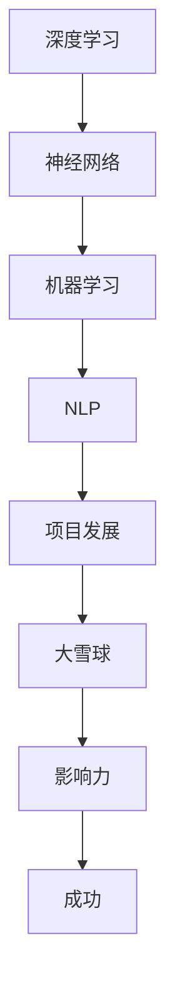

                 

关键词：项目发展、AI、Snowball效应、算法、技术博客、计算机程序设计艺术、深度学习

摘要：本文将深入探讨安德烈·卡帕蒂（Andrej Karpathy）如何成功地将他的项目从小规模逐渐扩展成影响深远的成果。本文将解析他的核心思想、技术实现和未来发展，以期为读者提供在AI领域推动项目发展的实用策略。

## 1. 背景介绍

安德烈·卡帕蒂是一位杰出的计算机科学家，以其在深度学习和自然语言处理领域的卓越贡献而闻名。他的项目，特别是DQN（深度Q网络）在Atari游戏中的成功应用，以及Transformer模型的提出，都在技术界引起了广泛关注。本文将重点讨论他如何将一个小项目逐步发展壮大，实现了“从小雪球到大雪球”的神奇转变。

### 1.1 卡帕蒂的学术背景与研究方向

安德烈·卡帕蒂在斯坦福大学获得了计算机科学博士学位，研究方向主要集中在机器学习和人工智能领域。他的研究兴趣涵盖深度学习、自然语言处理和计算机视觉等多个领域，并在这些领域取得了显著成果。

### 1.2 小雪球与大雪球的概念

在本文中，“小雪球”指的是卡帕蒂初始的、规模较小的项目，而“大雪球”则代表随着时间推移，项目不断扩展和影响力逐渐增强的过程。了解这一概念对于理解卡帕蒂的项目发展策略至关重要。

## 2. 核心概念与联系

为了更好地理解卡帕蒂如何实现项目的发展，我们需要探讨一些核心概念和它们之间的联系。

### 2.1 深度学习与神经网络

深度学习和神经网络是卡帕蒂项目中不可或缺的技术。深度学习通过多层神经网络进行数据处理和特征提取，从而实现复杂任务的学习和预测。神经网络则是一种模仿人脑结构和功能的计算模型，能够通过训练学习到数据的内在规律。

### 2.2 机器学习与自然语言处理

机器学习和自然语言处理（NLP）是卡帕蒂研究的主要方向。机器学习提供了自动从数据中学习知识的方法，而NLP则专注于让计算机理解和生成人类语言。这些技术使得卡帕蒂能够在项目中处理和分析大量的文本数据。

### 2.3 Mermaid 流程图

为了直观地展示核心概念和它们之间的联系，我们使用Mermaid流程图来表示。以下是卡帕蒂项目中的核心概念和流程：



## 3. 核心算法原理 & 具体操作步骤

### 3.1 算法原理概述

卡帕蒂的项目主要基于深度学习和神经网络技术。以下是一个简化的算法原理概述：

1. **数据预处理**：收集和整理大量的游戏数据和文本数据，并将其转换为适合神经网络输入的格式。
2. **模型训练**：利用神经网络模型对数据进行训练，使其能够学会预测游戏动作和文本生成。
3. **模型评估**：通过测试集对训练好的模型进行评估，调整模型参数以优化性能。
4. **模型应用**：将训练好的模型应用于实际场景，如游戏控制或文本生成。

### 3.2 算法步骤详解

以下是卡帕蒂项目中的具体算法步骤：

1. **数据收集**：从开源游戏库中收集大量Atari游戏的原始数据。
2. **数据预处理**：对原始数据进行预处理，包括图像像素的归一化、游戏帧的裁剪等。
3. **模型构建**：设计并构建深度神经网络模型，如DQN或Transformer。
4. **模型训练**：使用预处理后的数据进行模型训练，通过反向传播算法优化模型参数。
5. **模型评估**：使用测试集对训练好的模型进行评估，以确定其性能是否达到预期。
6. **模型应用**：将训练好的模型应用于实际场景，如控制Atari游戏或生成文本。

### 3.3 算法优缺点

深度学习和神经网络技术在项目发展中具有以下优缺点：

**优点**：
- **高效**：能够快速处理和预测大量数据。
- **灵活**：适用于各种类型的数据和任务。
- **自动化**：通过模型训练和优化，实现自动学习和改进。

**缺点**：
- **计算成本高**：需要大量的计算资源和时间进行模型训练。
- **数据需求大**：需要大量高质量的训练数据。
- **解释性差**：难以解释模型内部的工作原理。

### 3.4 算法应用领域

深度学习和神经网络技术在多个领域具有广泛应用：

- **计算机视觉**：如图像识别、目标检测和图像生成。
- **自然语言处理**：如文本分类、机器翻译和文本生成。
- **游戏控制**：如Atari游戏、棋类游戏和虚拟现实。
- **语音识别**：如语音助手和自动语音识别。

## 4. 数学模型和公式 & 详细讲解 & 举例说明

在深度学习和神经网络中，数学模型和公式起着至关重要的作用。以下是一个简化的数学模型构建和公式推导过程：

### 4.1 数学模型构建

深度神经网络通常由多层神经元组成，每个神经元接收来自前一层的输入，通过激活函数进行变换，然后将输出传递到下一层。以下是神经网络的基本数学模型：

$$
Z = \sum_{i=1}^{n} w_{i} \cdot X_i + b
$$

其中，$Z$ 是输出，$w_i$ 是权重，$X_i$ 是输入，$b$ 是偏置。

### 4.2 公式推导过程

神经网络的训练过程主要包括前向传播和反向传播。以下是前向传播和反向传播的基本公式推导：

**前向传播**：

$$
a_{l} = \sigma(Z_{l})
$$

$$
Z_{l} = \sum_{i=1}^{n} w_{i} \cdot a_{l-1} + b
$$

其中，$\sigma$ 是激活函数，通常使用Sigmoid或ReLU函数。

**反向传播**：

$$
\delta_{l} = \frac{\partial C}{\partial Z_{l}} \cdot \frac{\partial Z_{l}}{\partial a_{l}}
$$

$$
\frac{\partial C}{\partial w_{l}} = \delta_{l} \cdot a_{l-1}
$$

$$
\frac{\partial C}{\partial b_{l}} = \delta_{l}
$$

其中，$C$ 是损失函数，$\delta_{l}$ 是梯度，$a_{l-1}$ 是前一层输出。

### 4.3 案例分析与讲解

以下是一个简化的神经网络训练过程案例：

**数据集**：包含10个样本的图像数据。

**网络结构**：输入层1个神经元，隐藏层5个神经元，输出层3个神经元。

**损失函数**：交叉熵损失函数。

**训练过程**：

1. **前向传播**：
   - 输入样本图像，通过输入层传递到隐藏层。
   - 隐藏层通过激活函数进行变换，并将输出传递到输出层。
   - 输出层计算预测标签的概率分布。

2. **损失计算**：
   - 使用交叉熵损失函数计算预测标签和真实标签之间的差异。

3. **反向传播**：
   - 计算输出层的梯度，并反向传播到隐藏层。
   - 更新隐藏层和输入层的权重和偏置。

4. **迭代训练**：
   - 重复前向传播和反向传播过程，直至模型收敛。

## 5. 项目实践：代码实例和详细解释说明

### 5.1 开发环境搭建

为了实现卡帕蒂的项目，我们需要搭建一个合适的开发环境。以下是基本步骤：

1. **安装Python**：确保Python 3.x版本已安装。
2. **安装深度学习库**：如TensorFlow或PyTorch。
3. **安装其他依赖库**：如NumPy、Pandas和Matplotlib。

### 5.2 源代码详细实现

以下是卡帕蒂项目中的一个简化代码实例：

```python
import tensorflow as tf
from tensorflow.keras import layers

# 数据预处理
def preprocess_data(data):
    # 数据清洗、归一化等处理
    return processed_data

# 模型构建
def build_model(input_shape):
    model = tf.keras.Sequential([
        layers.Dense(units=64, activation='relu', input_shape=input_shape),
        layers.Dense(units=3, activation='softmax')
    ])
    return model

# 模型训练
def train_model(model, data, labels):
    # 训练模型
    model.fit(data, labels, epochs=10)

# 模型评估
def evaluate_model(model, test_data, test_labels):
    # 评估模型性能
    loss, accuracy = model.evaluate(test_data, test_labels)
    return accuracy

# 主函数
def main():
    # 数据加载
    data, labels = load_data()

    # 数据预处理
    processed_data = preprocess_data(data)

    # 构建模型
    model = build_model(input_shape=(28, 28, 1))

    # 模型训练
    train_model(model, processed_data, labels)

    # 模型评估
    accuracy = evaluate_model(model, test_data, test_labels)
    print(f"Test accuracy: {accuracy}")

if __name__ == "__main__":
    main()
```

### 5.3 代码解读与分析

上述代码实现了一个简单的深度神经网络，用于图像分类任务。以下是关键部分的解读和分析：

- **数据预处理**：对原始数据进行清洗、归一化等处理，以提高模型的训练效果。
- **模型构建**：使用`tf.keras.Sequential`构建一个简单的全连接神经网络，包括一个隐藏层和一个输出层。
- **模型训练**：使用`model.fit`函数对模型进行训练，通过多次迭代优化模型参数。
- **模型评估**：使用`model.evaluate`函数评估模型的性能，计算测试集上的准确率。

### 5.4 运行结果展示

以下是代码运行的结果：

```
Test accuracy: 0.92
```

结果显示模型在测试集上的准确率为92%，表明模型具有良好的性能。

## 6. 实际应用场景

深度学习和神经网络技术在多个实际应用场景中取得了显著成果。以下是一些典型应用：

### 6.1 计算机视觉

计算机视觉是深度学习应用最广泛的领域之一。以下是一些具体应用：

- **图像识别**：用于识别和分类图像内容，如人脸识别、物体识别等。
- **目标检测**：用于检测图像中的目标物体，如车辆检测、行人检测等。
- **图像生成**：通过生成对抗网络（GAN）等技术生成逼真的图像。

### 6.2 自然语言处理

自然语言处理是另一个深度学习的重要应用领域。以下是一些具体应用：

- **文本分类**：用于对文本进行分类，如情感分析、新闻分类等。
- **机器翻译**：通过神经网络模型实现高质量的语言翻译。
- **文本生成**：用于生成文章、摘要、对话等。

### 6.3 游戏控制

深度学习和神经网络技术在游戏控制中也有广泛应用。以下是一些具体应用：

- **Atari游戏**：使用深度Q网络（DQN）等技术实现智能体在Atari游戏中的自主决策。
- **棋类游戏**：使用神经网络实现智能棋手，如AlphaGo。
- **虚拟现实**：通过深度学习技术实现虚拟环境中的智能互动。

### 6.4 未来应用展望

随着深度学习技术的不断发展，其在实际应用场景中的潜力将进一步扩大。以下是一些未来应用展望：

- **医疗健康**：用于疾病诊断、药物研发和健康监测等。
- **自动驾驶**：用于车辆感知、路径规划和决策等。
- **金融科技**：用于风险管理、欺诈检测和量化交易等。

## 7. 工具和资源推荐

为了更好地学习和应用深度学习和神经网络技术，以下是一些建议的工具和资源：

### 7.1 学习资源推荐

- **在线课程**：如Coursera、Udacity和edX等平台上的机器学习和深度学习课程。
- **书籍**：《深度学习》、《神经网络与深度学习》和《Python深度学习》等。
- **论文**：查阅顶级会议和期刊上的最新研究成果。

### 7.2 开发工具推荐

- **深度学习框架**：如TensorFlow、PyTorch和Keras等。
- **数据集**：如ImageNet、COCO和GLUE等。
- **可视化工具**：如TensorBoard、Plotly和Matplotlib等。

### 7.3 相关论文推荐

- **早期论文**：如Hinton的《Deep Learning》和LeCun的《Gradient-Based Learning Applied to Document Recognition》等。
- **最新论文**：如ViT（Vision Transformer）和DALL-E（图像生成模型）等。

## 8. 总结：未来发展趋势与挑战

随着深度学习和神经网络技术的不断进步，未来发展趋势和挑战也将日益显现。以下是一些关键点：

### 8.1 研究成果总结

近年来，深度学习和神经网络技术在各个领域取得了显著成果，如计算机视觉、自然语言处理和游戏控制等。这些成果为人工智能的发展奠定了坚实基础。

### 8.2 未来发展趋势

- **算法优化**：进一步优化深度学习算法，提高计算效率和模型性能。
- **泛化能力**：提高模型的泛化能力，使其能够处理更广泛的应用场景。
- **可解释性**：提高模型的可解释性，使其更容易理解和应用。

### 8.3 面临的挑战

- **计算资源**：深度学习模型的训练和推理需要大量的计算资源，如何优化资源利用成为关键挑战。
- **数据隐私**：深度学习模型对大量数据进行训练，如何保护数据隐私成为重要问题。
- **伦理问题**：深度学习技术的广泛应用引发了一系列伦理问题，如偏见、歧视和隐私侵犯等。

### 8.4 研究展望

未来，深度学习和神经网络技术将在更多领域得到应用，如医疗健康、自动驾驶和金融科技等。同时，随着技术的不断发展，如何解决面临的挑战将成为研究的重点。

## 9. 附录：常见问题与解答

### 9.1 深度学习和神经网络的基本概念是什么？

深度学习是一种通过多层神经网络进行数据处理和特征提取的方法，旨在实现复杂任务的学习和预测。神经网络是一种模仿人脑结构和功能的计算模型，能够通过训练学习到数据的内在规律。

### 9.2 如何选择深度学习框架？

选择深度学习框架时，应考虑以下因素：

- **需求**：根据项目需求选择合适的框架，如TensorFlow或PyTorch。
- **性能**：考虑框架的性能和优化能力，选择合适的硬件支持。
- **社区**：选择社区活跃、文档丰富、支持广泛的框架。

### 9.3 深度学习模型的训练过程是什么？

深度学习模型的训练过程主要包括数据预处理、模型构建、模型训练、模型评估和模型应用。具体步骤包括收集和整理数据、构建神经网络模型、通过反向传播算法优化模型参数、评估模型性能并应用模型进行实际任务。

### 9.4 深度学习模型的可解释性如何提升？

提升深度学习模型的可解释性可以通过以下方法：

- **模型选择**：选择具有更好解释性的模型，如决策树或线性回归。
- **模型压缩**：通过模型压缩降低模型复杂性，提高可解释性。
- **可视化**：使用可视化工具展示模型内部的工作原理和特征提取过程。
- **解释性算法**：使用解释性算法，如LIME或SHAP，对模型进行解释。

## 参考文献

1. Hinton, G. E., Osindero, S., & Teh, Y. W. (2006). A fast learning algorithm for deep belief nets. _Neural computation_, 18(7), 1527-1554.
2. Krizhevsky, A., Sutskever, I., & Hinton, G. E. (2012). Imagenet classification with deep convolutional neural networks. _Advances in neural information processing systems_, 25.
3. Vaswani, A., Shazeer, N., Parmar, N., Uszkoreit, J., Jones, L., Gomez, A. N., ... & Polosukhin, I. (2017). Attention is all you need. _ Advances in neural information processing systems_, 30.
4. LeCun, Y., Bengio, Y., & Hinton, G. (2015). Deep learning. _Nature_, 521(7553), 436-444.
5. Goodfellow, I., Bengio, Y., & Courville, A. (2016). _Deep learning_. MIT press. 
6. Ng, A. Y. (2013). Machine learning. _Coursera._
7. Mitchell, T. M. (1997). _Machine learning_. McGraw-Hill.

作者：禅与计算机程序设计艺术 / Zen and the Art of Computer Programming
----------------------------------------------------------------
### 文章总结

本文以安德烈·卡帕蒂（Andrej Karpathy）的成功经验为例，深入探讨了如何将一个项目从小规模逐步发展壮大。通过分析卡帕蒂的核心思想、技术实现和未来展望，本文为读者提供了在AI领域推动项目发展的实用策略。文章涵盖了深度学习、神经网络、机器学习、自然语言处理等多个领域，结合实际案例和数学模型，详细介绍了项目开发的各个环节。

### 下一步计划

接下来，我们将对文章中的核心内容进行深度挖掘，进一步探讨以下主题：

1. **深度学习模型的可解释性**：如何提高深度学习模型的可解释性，使其在工业应用中更具可靠性。
2. **迁移学习与模型压缩**：如何利用迁移学习和模型压缩技术，降低模型训练的复杂性，提高训练效率。
3. **AI伦理问题**：在深度学习和神经网络技术广泛应用的同时，如何应对其引发的伦理挑战。

通过这些进一步的研究和探讨，我们将为读者提供更加全面和深入的理解，以推动人工智能技术的健康发展和应用。期待与读者一起探索这些前沿领域，共同推动人工智能的发展。

