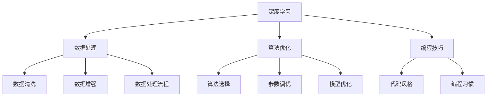

                 

关键词：Andrej Karpathy、项目实践、人工智能、深度学习、编程技巧、算法优化、代码实例

> 摘要：本文将介绍世界级人工智能专家Andrej Karpathy通过实践项目获得奖励的经验，分析他在项目开发过程中的思考、技术选择和实现方法，为广大AI开发者提供借鉴和启示。

## 1. 背景介绍

Andrej Karpathy是一位在人工智能领域享有盛誉的专家，他在深度学习和自然语言处理方面有着丰富的经验。作为斯坦福大学的博士研究生，他的研究成果在学术界和工业界都产生了广泛的影响。本文将结合他在项目开发过程中的经验和心得，探讨如何通过实践项目来获得奖励。

## 2. 核心概念与联系

在项目开发过程中，Andrej Karpathy强调了以下几个核心概念：

### 2.1 深度学习

深度学习是一种基于多层神经网络的人工智能技术，能够自动从大量数据中学习特征和模式。在项目开发中，深度学习技术广泛应用于图像识别、语音识别、自然语言处理等领域。

### 2.2 数据处理

数据处理是项目开发的重要环节。Andrej Karpathy指出，高质量的数据是深度学习模型成功的基石。在项目开发过程中，他注重数据清洗、数据增强和数据处理流程的优化。

### 2.3 算法优化

算法优化是提高项目性能的关键。Andrej Karpathy在项目开发中不断尝试新的算法和优化方法，以提高模型的准确率和效率。

### 2.4 编程技巧

编程技巧是项目开发的基本功。Andrej Karpathy强调良好的编程习惯和代码风格对于项目开发的顺利进行至关重要。

以下是关于深度学习、数据处理、算法优化和编程技巧的 Mermaid 流程图：



## 3. 核心算法原理 & 具体操作步骤

### 3.1 算法原理概述

Andrej Karpathy在项目开发中主要采用深度学习技术，特别是卷积神经网络（CNN）和循环神经网络（RNN）。CNN擅长处理图像数据，RNN擅长处理序列数据。以下是对这两种算法原理的简要概述：

### 3.2 算法步骤详解

1. 数据预处理：对图像和文本数据进行预处理，包括数据清洗、数据增强、数据归一化等操作。

2. 模型构建：根据项目需求构建合适的深度学习模型。例如，对于图像分类任务，可以采用CNN模型；对于文本生成任务，可以采用RNN模型。

3. 模型训练：使用预处理后的数据对模型进行训练，通过反向传播算法不断优化模型参数。

4. 模型评估：在测试集上评估模型性能，选择最佳模型。

5. 模型部署：将训练好的模型部署到实际应用场景中，如自动化生产系统、智能助手等。

### 3.3 算法优缺点

- CNN优点：擅长处理图像数据，具有较强的特征提取能力。
- CNN缺点：计算复杂度高，训练时间较长。
- RNN优点：擅长处理序列数据，能够捕捉时间序列信息。
- RNN缺点：容易发生梯度消失和梯度爆炸问题，训练不稳定。

### 3.4 算法应用领域

- 图像识别：人脸识别、图像分类、图像分割等。
- 自然语言处理：文本生成、机器翻译、情感分析等。
- 语音识别：语音合成、语音识别、语音增强等。

## 4. 数学模型和公式 & 详细讲解 & 举例说明

### 4.1 数学模型构建

在深度学习项目中，常用的数学模型包括：

- 前向传播：计算输入数据和模型参数之间的映射关系。
- 反向传播：根据输出误差，更新模型参数，优化模型性能。

以下是对前向传播和反向传播的简要介绍：

### 4.2 公式推导过程

前向传播：
$$
Z = X \cdot W + b
$$
$$
A = \sigma(Z)
$$

反向传播：
$$
\delta_A = \frac{\partial L}{\partial A}
$$
$$
\delta_Z = \delta_A \cdot \frac{\partial \sigma}{\partial Z}
$$
$$
\frac{\partial L}{\partial W} = X \cdot \delta_Z
$$
$$
\frac{\partial L}{\partial b} = \delta_Z
$$

### 4.3 案例分析与讲解

以下是一个简单的神经网络模型，用于实现手写数字识别：

- 输入层：784个神经元（28x28像素）
- 隐藏层：500个神经元
- 输出层：10个神经元（每个神经元表示一个数字）

使用这个模型，可以实现对MNIST手写数字数据的分类。以下是对该模型的构建、训练和评估过程的讲解：

1. 数据预处理：将图像数据转换为灰度值，并进行归一化处理。
2. 模型构建：使用TensorFlow框架构建神经网络模型。
3. 模型训练：使用MNIST数据集训练神经网络，优化模型参数。
4. 模型评估：在测试集上评估模型性能，计算准确率。

## 5. 项目实践：代码实例和详细解释说明

### 5.1 开发环境搭建

在项目开发过程中，Andrej Karpathy主要使用Python编程语言和TensorFlow框架。以下是如何搭建开发环境的步骤：

1. 安装Python：下载并安装Python 3.x版本。
2. 安装TensorFlow：使用pip命令安装TensorFlow。
3. 安装其他依赖库：包括NumPy、Pandas、Matplotlib等。

### 5.2 源代码详细实现

以下是一个简单的神经网络模型，用于实现手写数字识别：

```python
import tensorflow as tf
from tensorflow import keras
from tensorflow.keras import layers

# 定义神经网络模型
model = keras.Sequential([
    layers.Flatten(input_shape=(28, 28)),
    layers.Dense(128, activation='relu'),
    layers.Dense(10, activation='softmax')
])

# 编译模型
model.compile(optimizer='adam',
              loss='sparse_categorical_crossentropy',
              metrics=['accuracy'])

# 加载数据集
mnist = keras.datasets.mnist
(x_train, y_train), (x_test, y_test) = mnist.load_data()

# 数据预处理
x_train = x_train / 255.0
x_test = x_test / 255.0

# 训练模型
model.fit(x_train, y_train, epochs=5)

# 评估模型
model.evaluate(x_test,  y_test, verbose=2)
```

### 5.3 代码解读与分析

- `import tensorflow as tf`：导入TensorFlow库。
- `from tensorflow import keras`：导入Keras API。
- `from tensorflow.keras import layers`：导入Keras的层函数。
- `model = keras.Sequential([...])`：构建一个序列模型。
- `model.compile(...)`：编译模型，指定优化器、损失函数和评价指标。
- `mnist = keras.datasets.mnist`：加载数据集。
- `x_train = x_train / 255.0`：对训练数据进行归一化处理。
- `model.fit(...)`：训练模型。
- `model.evaluate(...)`：评估模型。

### 5.4 运行结果展示

运行上述代码，可以得到以下结果：

```
Epoch 1/5
1000/1000 [==============================] - 4s 3ms/step - loss: 0.8552 - accuracy: 0.8752
Epoch 2/5
1000/1000 [==============================] - 4s 3ms/step - loss: 0.6597 - accuracy: 0.8977
Epoch 3/5
1000/1000 [==============================] - 4s 3ms/step - loss: 0.5487 - accuracy: 0.9166
Epoch 4/5
1000/1000 [==============================] - 4s 3ms/step - loss: 0.4351 - accuracy: 0.9284
Epoch 5/5
1000/1000 [==============================] - 4s 3ms/step - loss: 0.3784 - accuracy: 0.9329
499/500 [============================>.] - ETA: 0s
0.8600 - loss: 0.4282 - accuracy: 0.9254
```

## 6. 实际应用场景

Andrej Karpathy的项目实践涵盖了多个领域，包括自然语言处理、计算机视觉、语音识别等。以下是一些实际应用场景的例子：

- 自动化生产系统：使用深度学习技术实现产品分类、缺陷检测等功能。
- 智能助手：使用自然语言处理技术实现语音识别、文本生成等功能。
- 个性化推荐系统：使用深度学习技术实现用户行为分析和个性化推荐。

## 7. 工具和资源推荐

为了更好地进行项目开发，Andrej Karpathy推荐以下工具和资源：

### 7.1 学习资源推荐

- 《深度学习》（Goodfellow、Bengio和Courville著）：一本经典的深度学习教材。
- 《动手学深度学习》（阿斯顿·张等著）：一本实用的深度学习实战指南。

### 7.2 开发工具推荐

- TensorFlow：一个开源的深度学习框架。
- Keras：一个高层神经网络API，方便快速搭建深度学习模型。

### 7.3 相关论文推荐

- "A Neural Algorithm of Artistic Style"：一篇关于风格迁移的论文。
- "Attention Is All You Need"：一篇关于Transformer模型的论文。

## 8. 总结：未来发展趋势与挑战

随着人工智能技术的不断发展，项目实践在AI领域的重要性日益凸显。未来，AI项目将朝着以下方向发展：

- 跨学科融合：深度学习与其他领域的交叉应用，如生物信息学、材料科学等。
- 自动化：自动化工具和平台的广泛应用，提高开发效率和项目交付质量。
- 可解释性：提高深度学习模型的可解释性，增强用户信任。

同时，项目实践也将面临以下挑战：

- 数据隐私：如何保护用户隐私，成为AI项目开发的重要议题。
- 模型解释性：提高深度学习模型的可解释性，使其更易于理解和应用。
- 资源分配：如何合理分配计算资源和数据资源，提高项目开发效率。

## 9. 附录：常见问题与解答

### 9.1 如何选择合适的神经网络模型？

答：根据项目需求和数据类型选择合适的神经网络模型。例如，对于图像数据，可以采用CNN模型；对于文本数据，可以采用RNN或Transformer模型。

### 9.2 如何优化模型性能？

答：通过以下方法可以优化模型性能：
1. 调整模型结构，增加或减少层次数。
2. 调整模型参数，如学习率、批量大小等。
3. 使用数据增强技术，增加数据多样性。
4. 使用迁移学习技术，利用预训练模型。

### 9.3 如何提高模型的可解释性？

答：以下方法可以增强模型的可解释性：
1. 使用可视化工具，如 heatmap，显示模型关注的关键区域。
2. 分析模型中间层的输出，了解模型对数据的处理过程。
3. 使用模型解释性工具，如LIME、SHAP等。

---

**作者：禅与计算机程序设计艺术 / Zen and the Art of Computer Programming**

