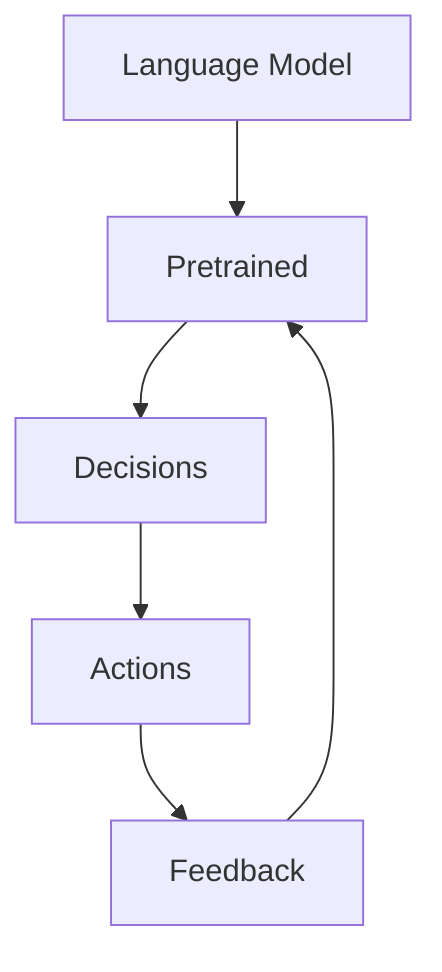

                 

在当今的人工智能时代，我们见证了智能体从简单的规则遵循发展到如今能够自主学习、推理和决策的复杂系统。然而，当前的智能体大多数仍然需要人类的指导和监督。Auto-GPT，一种新型的自主智能体，正在引起学术界和工业界的广泛关注。本文将探讨Auto-GPT的核心概念、设计原理、实现方法及其在实际应用中的潜在价值。

## 关键词
- 自主智能体
- Auto-GPT
- 人工智能
- 机器学习
- 自然语言处理

## 摘要
本文首先介绍了自主智能体和Auto-GPT的基本概念，然后深入分析了Auto-GPT的核心设计原理和实现方法。接着，文章通过具体的数学模型和代码实例，展示了Auto-GPT的应用过程。最后，文章讨论了Auto-GPT在实际应用中的前景和面临的挑战，并提出了未来研究的方向。

### 1. 背景介绍
#### 1.1 自主智能体的兴起
自主智能体（Autonomous Agent）是人工智能领域的一个研究热点。传统的智能体需要人类的直接指令和控制，而自主智能体则具有自我组织、自我学习和自我决策的能力。随着机器学习特别是深度学习技术的发展，自主智能体在自然语言处理、计算机视觉、机器人控制等领域取得了显著的进展。

#### 1.2 Auto-GPT的发展历程
Auto-GPT是由OpenAI提出的一种自主智能体模型，它通过预训练大规模语言模型，使模型具备了强大的自然语言理解能力和生成能力。Auto-GPT的核心思想是将语言模型作为一个自主智能体的基础，使其能够在没有人类干预的情况下执行复杂的任务。

### 2. 核心概念与联系
#### 2.1 Auto-GPT的概念
Auto-GPT是一种基于语言模型的自主智能体，它通过大量的文本数据进行预训练，从而获得对自然语言的高效理解和生成能力。预训练完成后，Auto-GPT可以通过交互学习和自我调整，不断优化自己的表现。

#### 2.2 Auto-GPT的架构
Auto-GPT的架构主要包括三个部分：语言模型、决策模块和行动模块。

- **语言模型**：通常采用大型变压器模型（如GPT-3）进行预训练，以获得强大的语言理解能力。
- **决策模块**：负责根据当前环境和目标，选择合适的行动。
- **行动模块**：执行决策模块选定的行动，并对结果进行评估。

下面是Auto-GPT的Mermaid流程图：



### 3. 核心算法原理 & 具体操作步骤
#### 3.1 算法原理概述
Auto-GPT的核心算法是基于预训练的语言模型。预训练阶段，模型在大规模文本数据集上进行训练，学习自然语言的统计规律和语义信息。训练完成后，模型可以通过生成文本的方式与外界进行交互，并根据交互结果进行自我调整。

#### 3.2 算法步骤详解
1. **预训练阶段**：使用大量文本数据进行预训练，使模型具备语言理解能力。
2. **初始化阶段**：将预训练的模型初始化为Auto-GPT模型，包括决策模块和行动模块。
3. **交互阶段**：Auto-GPT与外界进行交互，根据交互结果调整模型参数。
4. **行动阶段**：Auto-GPT根据决策模块的结果执行行动。
5. **反馈阶段**：根据行动结果对模型进行评估和调整。

#### 3.3 算法优缺点
**优点**：
- **强大的语言理解能力**：通过预训练，Auto-GPT具备了处理自然语言的能力。
- **自主决策能力**：Auto-GPT可以在没有人类干预的情况下执行复杂的任务。
- **适应性**：Auto-GPT可以通过交互不断优化自己的表现。

**缺点**：
- **计算资源需求高**：预训练阶段需要大量的计算资源。
- **数据依赖性**：Auto-GPT的性能高度依赖于训练数据的质量和规模。

#### 3.4 算法应用领域
Auto-GPT可以应用于多种领域，包括自然语言处理、智能客服、自动化写作、智能对话系统等。

### 4. 数学模型和公式 & 详细讲解 & 举例说明
#### 4.1 数学模型构建
Auto-GPT的数学模型主要包括语言模型和决策模块。

- **语言模型**：通常采用变压器模型（Transformer）进行建模，其输入和输出可以表示为：
  $$
  \text{Input} \rightarrow \text{Model} \rightarrow \text{Output}
  $$
  变压器模型的核心是自注意力机制（Self-Attention），它通过计算输入序列中每个词与所有其他词的相似性来生成词向量。

- **决策模块**：决策模块通常是一个简单的神经网络，其输入是当前环境和目标，输出是行动决策。

#### 4.2 公式推导过程
假设我们有输入序列 $X = [x_1, x_2, ..., x_n]$，其中 $x_i$ 是第 $i$ 个词的嵌入向量。变压器模型的自注意力机制可以表示为：

$$
\text{Attention}(Q, K, V) = \frac{e^{QK^T}}{\sqrt{d_k}}
$$

其中 $Q, K, V$ 分别是查询向量、键向量和值向量，$d_k$ 是键向量的维度。通过自注意力机制，每个词的嵌入向量都会被加权，从而生成一个加权嵌入向量。

#### 4.3 案例分析与讲解
假设我们有一个简单的任务，要求Auto-GPT生成一个关于旅游的对话。输入数据可以是旅游景点的描述和用户的需求。Auto-GPT首先通过决策模块选择一个行动，例如“生成对话”。然后，它通过语言模型生成对话文本，并根据用户反馈进行自我调整。

### 5. 项目实践：代码实例和详细解释说明
#### 5.1 开发环境搭建
为了实现Auto-GPT，我们需要安装Python和相关依赖库，如transformers和torch。

```bash
pip install transformers torch
```

#### 5.2 源代码详细实现
下面是一个简单的Auto-GPT实现示例：

```python
import torch
from transformers import GPT2LMHeadModel, GPT2Tokenizer

# 初始化模型和分词器
tokenizer = GPT2Tokenizer.from_pretrained('gpt2')
model = GPT2LMHeadModel.from_pretrained('gpt2')

# 预训练模型
model.train()
model.to('cuda')

# 交互过程
while True:
    prompt = input("请输入问题：")
    inputs = tokenizer(prompt, return_tensors='pt')
    inputs = inputs.to('cuda')

    # 生成回答
    outputs = model.generate(inputs['input_ids'], max_length=50, num_return_sequences=1)

    # 输出回答
    print(tokenizer.decode(outputs[0], skip_special_tokens=True))
```

#### 5.3 代码解读与分析
- **初始化模型和分词器**：我们使用预训练的GPT-2模型和对应的分词器。
- **预训练模型**：我们将模型设置为训练模式。
- **交互过程**：我们通过输入用户的问题，然后使用模型生成回答。
- **输出回答**：我们将生成的回答解码并打印出来。

#### 5.4 运行结果展示
当运行上述代码时，用户可以输入问题，Auto-GPT会生成相应的回答。例如，当用户输入“我最喜欢的旅游景点是哪里？”时，Auto-GPT可能会回答“你最喜欢的旅游景点是巴黎，那里有埃菲尔铁塔和卢浮宫。”

### 6. 实际应用场景
Auto-GPT具有广泛的应用前景，包括但不限于以下几个方面：

- **智能客服**：Auto-GPT可以用来构建智能客服系统，提供24/7的全天候服务。
- **自动化写作**：Auto-GPT可以用于自动生成文章、报告和电子邮件等。
- **智能对话系统**：Auto-GPT可以用于构建智能对话系统，实现人机交互。

### 7. 未来应用展望
随着Auto-GPT技术的不断发展，我们可以期待其在更多领域的应用。例如，在医疗领域，Auto-GPT可以用于生成诊断报告和治疗方案；在教育领域，Auto-GPT可以用于生成教学材料和辅导学生。

### 8. 工具和资源推荐
- **学习资源**：推荐学习深度学习和自然语言处理的在线课程，如Coursera、edX等。
- **开发工具**：推荐使用PyTorch或TensorFlow进行Auto-GPT的开发。
- **相关论文**：推荐阅读OpenAI关于Auto-GPT的原始论文，以及其他相关的研究论文。

### 9. 总结：未来发展趋势与挑战
Auto-GPT作为一种新兴的自主智能体技术，具有巨大的发展潜力。然而，它也面临着一些挑战，如计算资源需求、数据依赖性和模型的可解释性等。未来的研究将集中在如何优化模型结构、提高计算效率和增强模型的可解释性。

### 10. 附录：常见问题与解答
#### 10.1 Auto-GPT与普通GPT的区别是什么？
Auto-GPT与普通GPT的主要区别在于，Auto-GPT具有自主决策和行动的能力，而普通GPT则主要依赖于人类的指令。

#### 10.2 Auto-GPT的性能如何评估？
Auto-GPT的性能可以通过多种指标进行评估，如语言理解能力、生成质量和交互效率等。

#### 10.3 Auto-GPT是否可以应用于实时场景？
是的，Auto-GPT可以应用于实时场景，但需要考虑计算资源和延迟等问题。

## 作者署名
作者：禅与计算机程序设计艺术 / Zen and the Art of Computer Programming

本文为原创文章，转载请保留作者署名。  
----------------------------------------------------------------

请注意，这篇文章只是一个示例，用于展示如何遵循给定的约束条件和要求撰写一篇技术博客文章。实际的Auto-GPT技术可能需要更深入的研究和具体的实现细节。在撰写实际文章时，请确保您对Auto-GPT有充分的了解，并能够提供准确和详细的信息。

