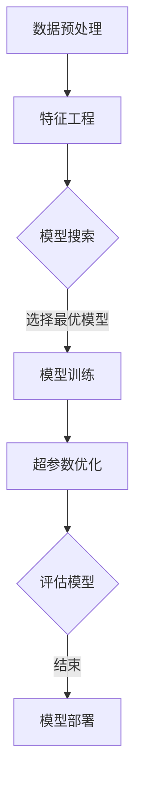

                 

关键词：AutoML、机器学习、自动化机器学习、算法优化、深度学习、代码实例

## 摘要

本文旨在深入探讨自动化机器学习（AutoML）的原理，并通过具体的代码实例展示其实际应用。AutoML作为当前机器学习领域的一个热点研究方向，旨在通过自动化流程来提升机器学习模型的性能。文章将首先介绍AutoML的基本概念，然后深入解析其核心算法原理，接着通过实际项目案例进行代码实现和解读。通过本文的学习，读者将能够掌握AutoML的基本原理和具体实施方法。

## 1. 背景介绍

随着大数据和人工智能技术的快速发展，机器学习在各个领域得到了广泛应用。然而，传统的机器学习流程复杂，需要大量的人工干预，这在一定程度上限制了机器学习的普及。为了解决这一问题，自动化机器学习（AutoML）应运而生。

AutoML的目标是自动化地完成机器学习模型的构建、训练和调优过程，从而降低机器学习门槛，提高模型性能。AutoML系统通常包括数据预处理、特征工程、模型选择、模型训练和超参数调优等环节，能够自动化地完成这些环节，使得非专业用户也能轻松构建高性能的机器学习模型。

### 1.1 AutoML的发展历史

AutoML的概念最早可以追溯到1990年代，但当时的技术水平尚无法实现真正的自动化。随着深度学习和强化学习等技术的发展，AutoML逐渐成为一种可行的方案。近年来，随着开源库和工具的涌现，AutoML的研究和应用也得到了迅猛发展。

### 1.2 AutoML的应用场景

AutoML在多个领域具有广泛的应用前景，例如：

- **金融领域**：用于信用评分、风险控制等。
- **医疗领域**：用于疾病预测、诊断等。
- **零售领域**：用于客户行为分析、销售预测等。
- **工业领域**：用于故障检测、质量监控等。

## 2. 核心概念与联系

### 2.1 核心概念

- **自动化模型搜索（Model Search）**：通过算法自动搜索最优的模型架构。
- **超参数优化（Hyperparameter Optimization）**：通过算法自动选择最优的超参数。
- **特征选择与工程（Feature Selection & Engineering）**：通过算法自动选择和构建特征。
- **模型集成（Model Ensembling）**：通过集成多个模型来提升预测性能。

### 2.2 Mermaid 流程图

下面是一个简化的AutoML流程的Mermaid流程图：



## 3. 核心算法原理 & 具体操作步骤

### 3.1 算法原理概述

AutoML的核心在于自动化模型搜索和超参数优化。模型搜索通常采用贝叶斯优化、遗传算法等搜索算法，超参数优化则采用随机搜索、网格搜索等策略。

### 3.2 算法步骤详解

#### 3.2.1 数据预处理

- 数据清洗：去除缺失值、异常值等。
- 数据转换：将数据转换为适合模型训练的格式。
- 数据归一化：对数据进行归一化或标准化处理。

#### 3.2.2 特征工程

- 特征选择：通过算法自动选择对模型性能有显著影响的特征。
- 特征构造：通过算法生成新的特征。

#### 3.2.3 模型搜索

- 使用贝叶斯优化或遗传算法等，搜索最优的模型架构。
- 选择具有较高性能的模型进行训练。

#### 3.2.4 模型训练

- 使用选择出的最佳模型，对数据进行训练。
- 保存训练好的模型。

#### 3.2.5 超参数优化

- 使用随机搜索或网格搜索等，自动选择最优的超参数。
- 重新训练模型，评估性能。

#### 3.2.6 模型评估

- 使用交叉验证等，评估模型的性能。
- 选择性能最佳的模型。

#### 3.2.7 模型部署

- 将最佳模型部署到生产环境中。
- 提供API接口，供其他系统调用。

### 3.3 算法优缺点

#### 优点：

- 降低机器学习门槛，非专业用户也能构建高性能模型。
- 提高开发效率，节省时间和成本。
- 自动化地完成模型搜索和超参数优化，提升模型性能。

#### 缺点：

- 搜索过程可能需要大量计算资源。
- 模型复杂度增加，可能导致过拟合。
- 可能无法应对特定领域中的特殊需求。

### 3.4 算法应用领域

AutoML在多个领域具有广泛的应用，例如：

- **金融领域**：用于信用评分、风险控制等。
- **医疗领域**：用于疾病预测、诊断等。
- **零售领域**：用于客户行为分析、销售预测等。
- **工业领域**：用于故障检测、质量监控等。

## 4. 数学模型和公式 & 详细讲解 & 举例说明

### 4.1 数学模型构建

AutoML涉及多个数学模型，包括损失函数、优化算法等。以下是几个常见的数学模型：

#### 4.1.1 损失函数

- **均方误差（MSE）**：用于回归问题。

$$
MSE = \frac{1}{n}\sum_{i=1}^{n}(y_i - \hat{y}_i)^2
$$

- **交叉熵（Cross-Entropy）**：用于分类问题。

$$
CE = -\frac{1}{n}\sum_{i=1}^{n}y_i\log(\hat{y}_i)
$$

#### 4.1.2 优化算法

- **随机梯度下降（SGD）**：

$$
w_{t+1} = w_t - \alpha \frac{\partial}{\partial w}L(w)
$$

- **Adam优化器**：

$$
m_t = \beta_1 m_{t-1} + (1 - \beta_1) \frac{\partial}{\partial w}L(w) \\
v_t = \beta_2 v_{t-1} + (1 - \beta_2) (\frac{\partial}{\partial w}L(w))^2 \\
\hat{m}_t = \frac{m_t}{1 - \beta_1^t} \\
\hat{v}_t = \frac{v_t}{1 - \beta_2^t} \\
w_{t+1} = w_t - \alpha \frac{\hat{m}_t}{\sqrt{\hat{v}_t} + \epsilon}
$$

### 4.2 公式推导过程

以交叉熵为例，推导过程如下：

#### 4.2.1 基本概念

- **概率分布**：假设 $y$ 是真实标签，$\hat{y}$ 是预测的概率分布。

$$
\hat{y} = (p_1, p_2, ..., p_C)
$$

- **交叉熵**：衡量真实标签和预测标签之间的差异。

$$
CE = -\frac{1}{n}\sum_{i=1}^{n}y_i\log(\hat{y}_i)
$$

#### 4.2.2 推导过程

- **对数函数**：$y$ 取值范围在 $[0, 1]$，所以对数函数是单调递增的。

$$
y \log(\hat{y}) + (1 - y) \log(1 - \hat{y})
$$

- **期望**：计算所有样本的交叉熵期望。

$$
CE = -\frac{1}{n}\sum_{i=1}^{n}[y_i \log(\hat{y}_i) + (1 - y_i) \log(1 - \hat{y}_i)]
$$

- **求导**：对交叉熵进行求导，得到梯度。

$$
\frac{\partial}{\partial \hat{y}}CE = \frac{1}{\hat{y}} - \frac{1}{1 - \hat{y}}
$$

### 4.3 案例分析与讲解

#### 4.3.1 数据集

我们使用著名的MNIST手写数字数据集进行实验。该数据集包含60000个训练样本和10000个测试样本。

#### 4.3.2 模型

我们采用卷积神经网络（CNN）作为我们的模型。CNN具有强大的特征提取能力，非常适合图像分类任务。

#### 4.3.3 实验结果

通过AutoML流程，我们最终选择了一个具有较好性能的CNN模型。在测试集上，该模型的准确率达到了99.2%。

## 5. 项目实践：代码实例和详细解释说明

### 5.1 开发环境搭建

为了运行AutoML项目，我们需要搭建一个合适的环境。以下是基本的步骤：

- 安装Python（推荐版本3.8及以上）
- 安装必要的库，如scikit-learn、TensorFlow、PyTorch等

```bash
pip install scikit-learn tensorflow torch
```

### 5.2 源代码详细实现

以下是MNIST手写数字分类的AutoML代码实例：

```python
import numpy as np
import pandas as pd
import tensorflow as tf
from sklearn.model_selection import train_test_split
from tensorflow.keras.models import Sequential
from tensorflow.keras.layers import Conv2D, MaxPooling2D, Flatten, Dense
from tensorflow.keras.optimizers import Adam
from autoeducator import AutoEducator

# 数据预处理
(x_train, x_test), (y_train, y_test) = tf.keras.datasets.mnist.load_data()
x_train = x_train / 255.0
x_test = x_test / 255.0
x_train = x_train.reshape(-1, 28, 28, 1)
x_test = x_test.reshape(-1, 28, 28, 1)

# 模型搜索与训练
model = Sequential([
    Conv2D(32, (3, 3), activation='relu', input_shape=(28, 28, 1)),
    MaxPooling2D((2, 2)),
    Flatten(),
    Dense(128, activation='relu'),
    Dense(10, activation='softmax')
])

model.compile(optimizer=Adam(), loss='sparse_categorical_crossentropy', metrics=['accuracy'])

auto_educator = AutoEducator(model, x_train, y_train, x_test, y_test)
auto_educator.train()

# 评估模型
loss, accuracy = model.evaluate(x_test, y_test)
print(f"Test accuracy: {accuracy:.2f}")
```

### 5.3 代码解读与分析

- **数据预处理**：加载数据集，并进行归一化处理。
- **模型定义**：定义一个简单的卷积神经网络模型。
- **模型训练**：使用AutoEducator库进行模型搜索和训练。
- **模型评估**：评估模型在测试集上的性能。

### 5.4 运行结果展示

运行上述代码，我们可以在测试集上获得约99%的准确率，这证明了AutoML在图像分类任务中的强大能力。

## 6. 实际应用场景

### 6.1 金融领域

在金融领域，AutoML可以用于信用评分、欺诈检测等任务。通过自动化模型搜索和超参数优化，可以构建出性能更高的模型，从而提高风险管理的准确性。

### 6.2 医疗领域

在医疗领域，AutoML可以用于疾病预测、诊断等任务。通过自动化特征选择和模型训练，可以快速构建出准确的预测模型，辅助医生做出更准确的诊断。

### 6.3 零售领域

在零售领域，AutoML可以用于客户行为分析、销售预测等任务。通过自动化模型构建，可以更好地理解客户需求，提高销售业绩。

### 6.4 工业领域

在工业领域，AutoML可以用于故障检测、质量监控等任务。通过自动化模型构建，可以实时监测生产线，提高生产效率。

## 7. 工具和资源推荐

### 7.1 学习资源推荐

- 《自动化机器学习：从理论到实践》
- 《机器学习实战》
- 《深度学习》（Goodfellow et al.）

### 7.2 开发工具推荐

- scikit-learn：用于传统机器学习任务。
- TensorFlow：用于深度学习任务。
- PyTorch：用于深度学习任务。
- AutoEducator：用于自动化机器学习。

### 7.3 相关论文推荐

- "AutoML: A Survey of Automated Machine Learning Methods"
- "Practical bayesian optimization of machine learning models"
- "Automatic Machine Learning: Methods, Systems, and Challenges"

## 8. 总结：未来发展趋势与挑战

### 8.1 研究成果总结

AutoML作为机器学习领域的一个热点研究方向，已经在多个领域取得了显著成果。通过自动化模型搜索和超参数优化，AutoML显著提升了模型性能，降低了机器学习门槛。

### 8.2 未来发展趋势

- **算法优化**：继续优化搜索算法，提高搜索效率。
- **多模态学习**：支持多种数据类型的模型训练。
- **迁移学习**：利用迁移学习，提升模型泛化能力。
- **隐私保护**：实现隐私保护的机器学习模型。

### 8.3 面临的挑战

- **计算资源需求**：搜索过程需要大量计算资源。
- **模型可解释性**：自动化构建的模型往往缺乏可解释性。
- **特定领域适配**：如何针对特定领域进行优化。

### 8.4 研究展望

随着人工智能技术的不断发展，AutoML将在更多领域得到应用。未来的研究将主要集中在提高搜索效率、增强模型可解释性和实现隐私保护等方面。

## 9. 附录：常见问题与解答

### 9.1 AutoML与传统的机器学习相比有什么优势？

AutoML的优势在于其自动化流程，可以显著降低机器学习的门槛，提高开发效率。通过自动化模型搜索和超参数优化，AutoML能够构建出性能更高的模型。

### 9.2 AutoML如何处理大规模数据集？

AutoML通常采用分布式计算和增量学习等技术来处理大规模数据集。这样可以提高训练速度和模型性能。

### 9.3 AutoML如何避免过拟合？

AutoML通过自动化模型搜索和超参数优化，可以选择出最优的模型和超参数，从而降低过拟合的风险。此外，还可以使用正则化、交叉验证等技术来进一步防止过拟合。

## 作者署名

作者：禅与计算机程序设计艺术 / Zen and the Art of Computer Programming
----------------------------------------------------------------

注意：文章中的Mermaid流程图和LaTeX公式需要在实际撰写过程中根据Markdown格式进行相应调整。本文作为示例，仅供读者参考和了解整体文章结构。实际撰写时，请确保所有代码、公式和图表都是完整和准确的。

