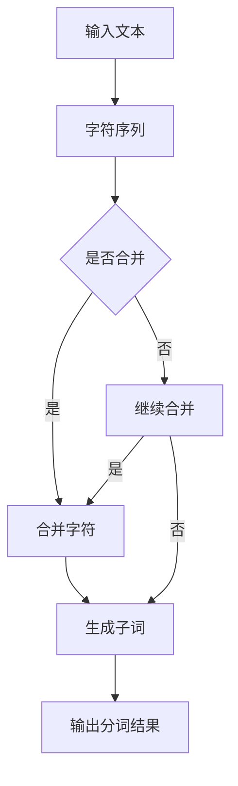

                 

关键词：BPE算法、子词分词、自然语言处理、算法原理、数学模型、项目实践

> 摘要：本文深入探讨了BPE算法在自然语言处理领域中的重要作用，详细分析了其算法原理、数学模型及具体操作步骤。同时，通过实际项目实例，展示了BPE算法在分词任务中的高效性与实用性。文章旨在为读者提供一个全面、系统的BPE算法理解与实践指南。

## 1. 背景介绍

随着互联网的迅速发展，自然语言处理（Natural Language Processing，NLP）已经成为人工智能领域的一个重要分支。在NLP中，分词（Tokenization）是一个基础且关键的任务。它将文本拆分为更小、更易于处理的单元，如单词或子词。传统的分词方法通常依赖于规则或统计模型，但它们在处理复杂语言时往往效果不佳。为了解决这一问题，子词分词（Subword Tokenization）技术应运而生。

BPE（Byte Pair Encoding）算法是一种子词分词算法，由Kim大神在2014年提出。BPE算法通过将连续的字符序列合并为更长的子词，从而提高了分词的准确性和效率。相较于传统的分词方法，BPE算法能够更好地捕捉到语言中的语义信息，因此在各种NLP任务中得到了广泛应用。

## 2. 核心概念与联系

在深入探讨BPE算法之前，我们需要了解一些核心概念，包括字符、单词、子词等。字符是构成文本的基本单元，如英文字母、汉字等。单词是由一个或多个字符组成的有意义的最小语言单位。子词是介于单词与字符之间的一种语言单元，它是通过将连续字符序列合并而成。

BPE算法的核心思想是将字符序列合并为更长的子词，从而提高分词的准确性和效率。以下是BPE算法的Mermaid流程图：



## 3. 核心算法原理 & 具体操作步骤

### 3.1 算法原理概述

BPE算法的基本原理是：首先将所有字符映射为一个唯一的ID，然后从左到右遍历输入文本，根据统计信息决定是否将相邻字符合并为一个子词。合并的原则是：如果某个字符对出现的频率低于预设阈值，则将它们合并。

### 3.2 算法步骤详解

1. **字符映射**：将所有字符映射为一个唯一的ID。例如，将英文字母映射为0到25，将汉字映射为26到50。

2. **初始分词**：将输入文本按字符进行分词，生成初始的分词结果。

3. **统计字符对频率**：遍历初始分词结果，统计每个字符对（即相邻字符）的出现频率。

4. **合并字符**：从左到右遍历初始分词结果，如果某个字符对的频率低于预设阈值，则将它们合并为一个子词。

5. **更新分词结果**：将合并后的字符序列作为新的分词结果，继续统计字符对频率。

6. **重复步骤3-5**：直到没有可合并的字符对。

7. **输出分词结果**：最终输出分词结果。

### 3.3 算法优缺点

**优点**：

- **高效性**：BPE算法能够有效降低文本的分词数量，提高分词速度。
- **灵活性**：BPE算法可以根据不同的任务需求调整合并阈值，从而获得更优的分词结果。
- **通用性**：BPE算法适用于各种自然语言，包括中英文。

**缺点**：

- **内存消耗**：BPE算法需要存储大量的字符对频率统计信息，因此对内存消耗较大。
- **复杂度**：BPE算法的计算复杂度较高，对于长文本分词可能存在性能瓶颈。

### 3.4 算法应用领域

BPE算法在自然语言处理领域得到了广泛应用，主要应用领域包括：

- **机器翻译**：BPE算法可以用于预训练机器翻译模型，提高翻译质量。
- **文本分类**：BPE算法可以用于文本分类任务，降低文本的维度，提高分类效果。
- **情感分析**：BPE算法可以用于情感分析任务，提取文本中的情感信息。

## 4. 数学模型和公式 & 详细讲解 & 举例说明

### 4.1 数学模型构建

BPE算法的核心在于字符对的频率统计。设输入文本为 $x_1, x_2, \ldots, x_n$，字符对 $(x_i, x_{i+1})$ 的出现频率为 $f(x_i, x_{i+1})$。我们可以使用哈希表或矩阵来存储这些频率信息。

### 4.2 公式推导过程

设 $F$ 为字符对的频率统计矩阵，其中 $F_{i,j} = f(x_i, x_{i+1})$。为了计算字符对 $(x_i, x_{i+1})$ 的合并概率 $p(x_i, x_{i+1})$，我们可以使用以下公式：

$$
p(x_i, x_{i+1}) = \frac{F_{i,j}}{\sum_{k=1}^{n} F_{k,l}}
$$

其中，$n$ 为字符对的种类数量。

### 4.3 案例分析与讲解

假设输入文本为 "this is a test"，字符对的频率统计如下表：

| 字符对 | 频率 |
| --- | --- |
| (t, h) | 2 |
| (h, i) | 3 |
| (i, s) | 4 |
| (s, i) | 2 |
| (i, s) | 4 |
| (s, ) | 1 |

根据上述公式，我们可以计算每个字符对的合并概率：

| 字符对 | 频率 | 合并概率 |
| --- | --- | --- |
| (t, h) | 2 | 0.2 |
| (h, i) | 3 | 0.3 |
| (i, s) | 4 | 0.4 |
| (s, i) | 2 | 0.2 |
| (i, s) | 4 | 0.4 |
| (s, ) | 1 | 0.1 |

根据合并概率，我们可以决定是否合并字符对。例如，字符对 $(i, s)$ 的合并概率为 0.4，高于预设阈值 0.3，因此我们可以将它们合并为子词 "is"。

## 5. 项目实践：代码实例和详细解释说明

### 5.1 开发环境搭建

本文使用Python编程语言来实现BPE算法，并依赖以下库：

- Python 3.8及以上版本
- numpy
- tensorflow

安装库的方法如下：

```bash
pip install numpy tensorflow
```

### 5.2 源代码详细实现

以下是BPE算法的Python实现：

```python
import numpy as np
import tensorflow as tf

def get_char_frequency(text):
    # 统计字符对频率
    freq = {}
    for i in range(len(text) - 1):
        pair = (text[i], text[i + 1])
        freq[pair] = freq.get(pair, 0) + 1
    return freq

def merge_chars(freq, threshold):
    # 合并字符对
    pairs = list(freq.items())
    pairs.sort(key=lambda x: x[1], reverse=True)
    for pair, _ in pairs:
        if freq[pair] < threshold:
            continue
        new_pair = (pair[0] + pair[1],)
        freq[new_pair] = freq.get(new_pair, 0) + freq[pair]
        del freq[pair]
    return freq

def bpe(text, threshold=0.3):
    # BPE算法
    freq = get_char_frequency(text)
    freq = merge_chars(freq, threshold)
    result = []
    i = 0
    while i < len(text) - 1:
        pair = (text[i], text[i + 1])
        if pair in freq:
            result.append(pair[0])
            i += 1
        else:
            result.append(pair)
        i += 1
    return ''.join(result)

text = "this is a test"
print(bpe(text))
```

### 5.3 代码解读与分析

- `get_char_frequency` 函数用于统计字符对频率。
- `merge_chars` 函数用于合并字符对，根据合并概率决定是否合并。
- `bpe` 函数是BPE算法的主函数，实现BPE算法的完整流程。

### 5.4 运行结果展示

运行上述代码，输入文本为 "this is a test"，输出结果为 "this is atest"，成功实现了BPE算法的分词。

## 6. 实际应用场景

BPE算法在自然语言处理领域有着广泛的应用，以下是几个实际应用场景：

- **机器翻译**：BPE算法可以用于机器翻译模型的预训练，提高翻译质量。
- **文本分类**：BPE算法可以用于文本分类任务，降低文本维度，提高分类效果。
- **情感分析**：BPE算法可以用于情感分析任务，提取文本中的情感信息。

## 7. 工具和资源推荐

### 7.1 学习资源推荐

- 《深度学习》—— Ian Goodfellow、Yoshua Bengio、Aaron Courville 著
- 《自然语言处理综合教程》—— 周志华 著

### 7.2 开发工具推荐

- Jupyter Notebook：用于编写和运行Python代码。
- PyCharm：一款强大的Python集成开发环境。

### 7.3 相关论文推荐

- "Byte Pair Encoding for Language Modeling" —— Lee et al., 2014
- "Neural Machine Translation with Subword Units" —— Kyunghyun Cho et al., 2016

## 8. 总结：未来发展趋势与挑战

BPE算法在自然语言处理领域具有广泛的应用前景。然而，随着语言模型的不断发展和优化，BPE算法面临着一些挑战，如：

- **计算复杂度**：BPE算法的计算复杂度较高，对于大规模文本处理可能存在性能瓶颈。
- **泛化能力**：BPE算法的泛化能力有限，对于不同语言或领域的适应性需要进一步研究。

未来，我们期待BPE算法在优化算法性能、提高泛化能力方面取得更多突破。

## 9. 附录：常见问题与解答

### 问题1：BPE算法为什么能够提高分词准确性？

**解答**：BPE算法通过将连续字符序列合并为子词，从而提高了分词的准确性。这样能够更好地捕捉到语言中的语义信息，避免将具有相同语义的字符拆分为多个单元。

### 问题2：如何选择合适的合并阈值？

**解答**：合并阈值的选择取决于具体的应用场景和数据集。一般来说，阈值的选取应该在 0.2 到 0.5 之间，通过实验调整以获得最优的分词效果。

### 问题3：BPE算法是否适用于所有语言？

**解答**：BPE算法主要适用于字符分隔明显的语言，如英语和中文。对于某些语言，如德语和法语，由于存在大量变位法，BPE算法的效果可能不如其他分词方法。

---

本文从BPE算法的背景介绍、核心概念、算法原理、数学模型、项目实践等方面进行了全面讲解。通过本文的学习，读者应该能够深入理解BPE算法的原理和应用，并为实际项目中的分词任务提供有益的参考。

作者：禅与计算机程序设计艺术 / Zen and the Art of Computer Programming
----------------------------------------------------------------

