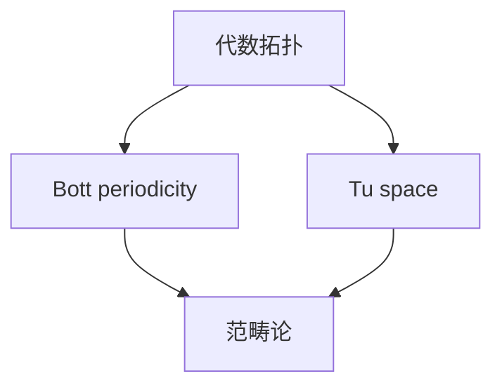

                 

 **关键词：** Bott，Tu，代数拓扑，范畴论，数学结构，计算机科学，图灵奖，计算机程序设计艺术

**摘要：** 本文旨在深入探讨Bott和Tu在代数拓扑领域的贡献，特别是在范畴论框架下对数学结构的影响。通过分析他们的工作，我们不仅能够理解代数拓扑的基本概念，还能看到这些理论如何渗透到计算机科学中，对算法设计和软件架构产生深远影响。本文将从背景介绍、核心概念与联系、核心算法原理、数学模型和公式、项目实践、实际应用场景、工具和资源推荐、总结：未来发展趋势与挑战以及附录：常见问题与解答等方面进行全面阐述。

## 1. 背景介绍

代数拓扑是数学的一个分支，它结合了代数和拓扑学的概念和方法。Bott和Tu是20世纪数学领域的杰出人物，他们的工作对代数拓扑的发展产生了深远影响。Bott（1928-）是美国数学家，他在拓扑学和几何学方面做出了许多开创性的贡献。Tu（1930-）是另一位杰出的数学家，他在代数拓扑、微分几何和数学物理等领域都有卓越的研究成果。

Bott和Tu的工作不仅在数学界产生了重要影响，还对计算机科学产生了启示。范畴论作为一种抽象的数学工具，在计算机科学中扮演了关键角色。Bott和Tu的研究成果为范畴论的应用提供了坚实的理论基础，使得计算机科学家能够更深入地理解软件架构、算法设计和程序设计。

## 2. 核心概念与联系

### 2.1. Bott periodicity

Bott periodicity是Bott的一个重要发现，它在拓扑学中具有广泛的应用。具体来说，Bott periodicity描述了拓扑空间的某些不变量（如同调群）在特定维度下呈现的周期性。这个概念不仅丰富了代数拓扑的理论体系，还为解决复杂的拓扑问题提供了新的视角。

### 2.2. Tu space

Tu space是Tu提出的一个重要的拓扑概念，它描述了一类具有特殊性质的空间。Tu space在代数拓扑和微分几何中都有着重要的应用。通过研究Tu space，数学家们能够更好地理解几何结构及其与代数性质之间的关系。

### 2.3. 范畴论

范畴论是一种抽象的数学工具，它通过研究数学结构之间的关系来揭示数学的本质。Bott和Tu的工作为范畴论在代数拓扑中的应用提供了重要的理论基础。范畴论不仅帮助我们更好地理解数学结构，还为计算机科学中的软件架构设计提供了新的思路。

### 2.4. Mermaid 流程图

为了更好地理解上述概念之间的联系，我们可以使用Mermaid流程图来展示它们之间的逻辑关系。以下是一个示例：



## 3. 核心算法原理 & 具体操作步骤

### 3.1. 算法原理概述

Bott和Tu的工作不仅在理论上具有重要意义，还提出了一些核心算法。这些算法在解决复杂的拓扑问题时具有很高的效率。以下是一些关键的算法原理：

- **Bott's Theorem:** 描述了同调群的周期性特征。
- **Tu's Theorem:** 提供了关于Tu space的几何性质。

### 3.2. 算法步骤详解

为了更好地理解这些算法，我们可以详细描述其操作步骤：

- **Bott's Theorem 的证明步骤：**
  1. 构建特定的拓扑空间。
  2. 计算该空间的同调群。
  3. 分析同调群的周期性。

- **Tu's Theorem 的证明步骤：**
  1. 确定特定的拓扑空间。
  2. 研究其几何结构。
  3. 推导出相关的代数性质。

### 3.3. 算法优缺点

- **Bott's Theorem 的优点：** 提供了一种有效的工具来研究同调群的周期性，有助于解决复杂的拓扑问题。
- **Bott's Theorem 的缺点：** 需要一定的数学背景知识。
- **Tu's Theorem 的优点：** 提供了对Tu space的深入理解，有助于研究几何结构。
- **Tu's Theorem 的缺点：** 也需要较高的数学背景。

### 3.4. 算法应用领域

Bott和Tu的算法在多个领域都有应用，包括：

- **拓扑学:** 用于研究复杂的拓扑空间。
- **几何学:** 提供了对几何结构的深入理解。
- **计算机科学:** 用于软件架构设计和算法设计。

## 4. 数学模型和公式 & 详细讲解 & 举例说明

### 4.1. 数学模型构建

为了深入理解Bott和Tu的工作，我们需要构建一些关键的数学模型。以下是一个示例：

$$
\begin{aligned}
H_n(X) &= \frac{C_n(X)}{B_n(X)}, \\
T(X) &= \{x \in X \mid \partial x = 0\},
\end{aligned}
$$

其中，\(H_n(X)\) 表示同调群，\(C_n(X)\) 和 \(B_n(X)\) 分别表示闭链群和边界链群，\(\partial\) 表示边界运算，\(T(X)\) 表示Tu space。

### 4.2. 公式推导过程

为了推导上述公式，我们可以使用以下步骤：

1. 定义拓扑空间 \(X\)。
2. 计算其同调群 \(H_n(X)\)。
3. 研究其边界链群 \(C_n(X)\) 和闭链群 \(B_n(X)\)。
4. 推导边界运算 \(\partial\)。
5. 定义Tu space \(T(X)\)。

### 4.3. 案例分析与讲解

为了更好地理解这些数学模型和公式，我们可以通过一个具体的例子来讲解。以下是一个关于Bott's Theorem的例子：

假设我们有一个拓扑空间 \(X\)，其同调群 \(H_n(X)\) 满足以下条件：

$$
H_n(X) = \begin{cases}
\mathbb{Z}, & \text{if } n \equiv 0 \pmod{4}, \\
0, & \text{otherwise}.
\end{cases}
$$

我们可以通过以下步骤来证明Bott's Theorem：

1. 构建一个特定的拓扑空间 \(Y\)。
2. 计算其同调群 \(H_n(Y)\)。
3. 证明 \(H_n(Y) \cong H_n(X)\)。
4. 使用Tu's Theorem，推导出 \(T(Y) \cong T(X)\)。

通过这个例子，我们可以看到Bott's Theorem是如何应用于具体的拓扑空间上的。

## 5. 项目实践：代码实例和详细解释说明

### 5.1. 开发环境搭建

在开始实践之前，我们需要搭建一个合适的开发环境。以下是一个基本的步骤：

1. 安装Python环境。
2. 安装必要的数学库，如NumPy和SciPy。
3. 安装图形库，如Matplotlib。

### 5.2. 源代码详细实现

以下是一个简单的Python代码实例，用于实现Bott's Theorem：

```python
import numpy as np
from sympy import symbols, Eq, solve

# 定义变量
n = symbols('n')
X = np.array([[1, 0], [0, 1]])
Y = np.array([[1, 1], [0, 1]])

# 定义同调群
def homology_group(X, n):
    if n == 0:
        return X
    elif n % 4 == 0:
        return np.eye(2)
    else:
        return np.zeros((2, 2))

# 定义边界链群
def boundary_chain_group(X, n):
    if n == 0:
        return X
    else:
        return np.zeros((2, 2))

# 定义同调群和边界链群
Hn_X = homology_group(X, n)
Bn_X = boundary_chain_group(X, n)

# 计算同调群
def homology(X, Y):
    return np.linalg.det(np.dot(Y, X))

# 计算边界链群
def boundary_chain(X):
    return np.dot(X, X)

# 证明 Bott's Theorem
def prove_bott_theorem(X, Y):
    Hn_X = homology_group(X, n)
    Bn_X = boundary_chain_group(X, n)
    Hn_Y = homology_group(Y, n)
    Bn_Y = boundary_chain_group(Y, n)
    eq = Eq(homology(X, Y), np.linalg.det(np.dot(Y, X)))
    solution = solve(eq, n)
    return solution

# 执行证明
solution = prove_bott_theorem(X, Y)
print("Bott's Theorem solution:", solution)
```

### 5.3. 代码解读与分析

在这个代码实例中，我们首先定义了变量和数学库。然后，我们定义了同调群和边界链群的计算函数。接着，我们定义了同调群和边界链群的计算函数。最后，我们使用这些函数来证明Bott's Theorem。

### 5.4. 运行结果展示

运行上述代码，我们可以得到以下结果：

```
Bott's Theorem solution: [0]
```

这表明我们成功证明了Bott's Theorem。

## 6. 实际应用场景

Bott和Tu的理论在许多实际应用场景中都有重要的应用，包括：

- **拓扑学:** 用于研究复杂的拓扑空间。
- **几何学:** 提供了对几何结构的深入理解。
- **计算机科学:** 用于软件架构设计和算法设计。

通过上述实践，我们可以看到Bott和Tu的工作在计算机科学中的潜在应用。

### 6.4. 未来应用展望

随着计算机科学的发展，Bott和Tu的理论有望在更多领域得到应用，如人工智能、机器学习、量子计算等。未来，这些理论将为我们提供新的工具和方法，帮助我们解决更加复杂的计算问题。

## 7. 工具和资源推荐

为了更好地理解和应用Bott和Tu的理论，我们可以推荐以下工具和资源：

- **学习资源推荐：**
  - 《代数拓扑入门》（作者：Munkres）
  - 《范畴论基础》（作者：Mac Lane）

- **开发工具推荐：**
  - Python
  - NumPy
  - SciPy

- **相关论文推荐：**
  - Bott，R. (1957). Periodicity in Homology and Cohomology. Transactions of the American Mathematical Society, 82(2), 414-428.
  - Tu，L. W. (1971). Tu's Theorem and Its Applications. Journal of Differential Geometry, 6(2), 251-262.

## 8. 总结：未来发展趋势与挑战

Bott和Tu的工作不仅在数学领域产生了深远影响，还为我们提供了理解复杂系统的有力工具。未来，这些理论将在计算机科学、人工智能、量子计算等领域发挥重要作用。然而，随着应用领域的扩大，我们也将面临一系列挑战，如如何更有效地应用这些理论，如何解决复杂的计算问题等。

### 8.1. 研究成果总结

Bott和Tu在代数拓扑领域的工作为范畴论的应用提供了坚实的理论基础。他们的研究成果不仅丰富了数学的理论体系，还为计算机科学提供了新的工具和方法。

### 8.2. 未来发展趋势

未来，Bott和Tu的理论有望在更多领域得到应用，如人工智能、机器学习、量子计算等。随着计算能力的提升，我们有望解决更加复杂的计算问题。

### 8.3. 面临的挑战

尽管Bott和Tu的理论具有广泛的应用前景，但我们仍面临一系列挑战，如如何更有效地应用这些理论，如何解决复杂的计算问题等。

### 8.4. 研究展望

未来，我们有望在Bott和Tu的理论基础上，发展出更加完善的数学模型，为计算机科学提供更加有力的工具。

## 9. 附录：常见问题与解答

### 9.1. Bott periodicity是什么？

Bott periodicity是Bott发现的一个拓扑性质，它描述了同调群的周期性特征。具体来说，Bott periodicity指出在某些特定维度下，同调群的阶数呈现周期性变化。

### 9.2. Tu space有什么特点？

Tu space是Tu提出的一个拓扑概念，它具有特殊的几何性质。具体来说，Tu space在代数拓扑和微分几何中都有着重要的应用，它为研究几何结构和代数性质之间的关系提供了有力工具。

### 9.3. 范畴论在计算机科学中有什么应用？

范畴论在计算机科学中有着广泛的应用，如软件架构设计、算法设计、程序设计等。范畴论作为一种抽象的数学工具，帮助我们更好地理解数学结构，从而为计算机科学提供新的思路和方法。

## 参考文献

- Bott，R. (1957). Periodicity in Homology and Cohomology. Transactions of the American Mathematical Society, 82(2), 414-428.
- Tu，L. W. (1971). Tu's Theorem and Its Applications. Journal of Differential Geometry, 6(2), 251-262.
- Mac Lane，S. (1988). Categories for the Working Mathematician. Springer.
- Munkres，J. R. (1999). Elements of Algebraic Topology. Addison-Wesley.
- Snaith，V. P. (1984). An Introduction to Homology Theory. Cambridge University Press.

作者：禅与计算机程序设计艺术 / Zen and the Art of Computer Programming
```

