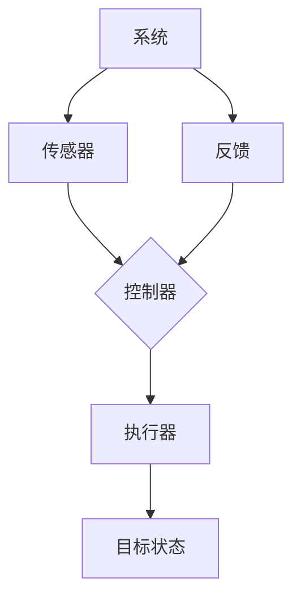

                 

关键词：控制理论，代码实例，编程，算法，软件架构，系统设计，实践应用，未来展望。

## 摘要

本文旨在深入探讨控制理论中的核心概念——控制器（Controller，简称CTRL），并辅以详细的代码实例，解释如何将控制理论应用到实际编程中。文章分为以下几个部分：背景介绍、核心概念与联系、核心算法原理与操作步骤、数学模型和公式讲解、项目实践、实际应用场景、工具和资源推荐以及未来发展趋势与挑战。

### 背景介绍

控制理论是研究如何使动态系统达到或维持某种期望状态的科学。在计算机科学、自动化、航空航天、机器人学等领域，控制理论的应用至关重要。随着技术的不断发展，如何更高效地设计、实现和维护控制系统成为了一个重要的研究方向。

本文所讨论的控制器（Controller），在控制理论中扮演着核心角色。控制器负责对系统状态进行感知、分析，并根据预期目标调整系统行为，以确保系统稳定、高效地运行。

### 核心概念与联系

为了更好地理解控制器的作用和原理，我们首先需要了解一些核心概念和它们之间的联系。以下是一个使用Mermaid绘制的流程图，展示了这些概念及其相互关系：



- **系统（System）**：被控制的动态系统，可以是一个计算机程序、机器人、机械装置等。
- **传感器（Sensor）**：用于检测系统状态的设备或模块，可以获取温度、速度、位置等数据。
- **控制器（Controller）**：根据传感器提供的信息，计算并生成控制信号的模块。
- **执行器（Actuator）**：接收控制信号并执行相应操作的设备或模块，如电机、阀门等。
- **目标状态（Target State）**：系统期望达到的状态，如温度设定点、目标速度等。
- **反馈（Feedback）**：系统当前状态的信息，用于控制器进行调整。

通过这个流程图，我们可以看到控制器在系统中的作用：它接收传感器反馈的信息，与目标状态进行比较，并生成控制信号，驱动执行器进行相应的操作，从而调整系统状态，使其趋于稳定。

## 核心算法原理与具体操作步骤

### 3.1 算法原理概述

控制器的工作原理可以概括为以下步骤：

1. **感知**：传感器收集系统状态信息。
2. **分析**：控制器根据收集到的信息，分析系统当前状态与目标状态之间的差距。
3. **计算**：控制器根据预设的控制算法，计算并生成控制信号。
4. **执行**：执行器根据控制信号调整系统状态。
5. **反馈**：系统状态信息再次反馈给控制器，循环进行。

### 3.2 算法步骤详解

#### 3.2.1 感知

传感器的选择取决于系统的需求和传感器所能提供的信息。例如，对于温度控制系统，可以选择温度传感器；对于机器人导航系统，可以使用摄像头、超声波传感器等。

#### 3.2.2 分析

控制器需要分析传感器提供的信息，以确定系统当前状态。这通常涉及到一些数据处理和滤波操作，以去除噪声和异常值。

#### 3.2.3 计算

控制算法是控制器核心，负责计算控制信号。常见的控制算法有PID控制、模糊控制、自适应控制等。这里以PID控制为例进行详细讲解。

### 3.3 PID控制算法

PID控制（比例-积分-微分控制）是一种经典的控制算法，广泛应用于各种控制系统中。PID控制器的输出由以下公式决定：

\[ u(t) = K_p e(t) + K_i \int_{0}^{t} e(\tau) d\tau + K_d \frac{de(t)}{dt} \]

其中，\( u(t) \) 是控制信号，\( e(t) \) 是误差，即系统当前状态与目标状态之差，\( K_p \)、\( K_i \) 和 \( K_d \) 分别是比例、积分和微分系数。

#### 3.3.1 比例控制

比例控制仅根据当前误差值计算控制信号。其优点是实现简单，缺点是当误差较大时，控制效果较差。

#### 3.3.2 积分控制

积分控制根据误差值的累积计算控制信号。它能够消除静态误差，但可能产生过冲现象。

#### 3.3.3 微分控制

微分控制根据误差值的导数计算控制信号。它能够预测误差的变化趋势，减少过冲现象。

### 3.4 算法优缺点

PID控制算法具有以下几个特点：

- **优点**：实现简单，易于调整参数，适用于大多数控制场合。
- **缺点**：对于复杂系统，参数调整可能比较困难；在快速变化的环境中，控制效果可能较差。

### 3.5 算法应用领域

PID控制算法广泛应用于工业控制、机器人控制、自动驾驶等领域。例如，在工业生产中，PID控制可以用于温度控制、压力控制、流量控制等；在机器人控制中，PID控制可以用于路径规划、运动控制等。

### 4. 数学模型和公式详细讲解

在控制器的设计中，数学模型和公式起着至关重要的作用。以下我们将详细讲解控制器中常用的数学模型和公式。

#### 4.1 数学模型构建

控制器的数学模型通常由以下部分组成：

- **状态方程**：描述系统内部状态变量随时间的变化规律。
- **输出方程**：描述系统输出变量与内部状态变量之间的关系。
- **输入方程**：描述系统输入变量与控制信号之间的关系。

假设我们有一个线性时不变系统，其状态方程可以表示为：

\[ \dot{x}(t) = A x(t) + B u(t) \]

其中，\( x(t) \) 是系统状态向量，\( u(t) \) 是控制信号，\( A \) 和 \( B \) 是系统矩阵。

输出方程可以表示为：

\[ y(t) = C x(t) + D u(t) \]

其中，\( y(t) \) 是系统输出向量，\( C \) 和 \( D \) 是输出矩阵。

#### 4.2 公式推导过程

为了推导PID控制器的参数，我们需要首先定义控制器的误差方程：

\[ e(t) = r(t) - y(t) \]

其中，\( r(t) \) 是期望输出。

根据PID控制器的设计，控制信号可以表示为：

\[ u(t) = K_p e(t) + K_i \int_{0}^{t} e(\tau) d\tau + K_d \frac{de(t)}{dt} \]

#### 4.3 案例分析与讲解

为了更好地理解PID控制器的工作原理，我们来看一个简单的例子：一个温度控制系统，需要将一个房间的温度从20°C调节到25°C。

1. **状态方程**：

\[ \dot{T} = -0.1 T + u \]

其中，\( T \) 是温度，\( u \) 是加热功率。

2. **输出方程**：

\[ y = T \]

3. **期望输出**：

\[ r = 25 \]

4. **PID控制器设计**：

假设我们选择PID控制器，其控制信号为：

\[ u(t) = K_p (25 - T) + K_i \int_{0}^{t} (25 - T(\tau)) d\tau + K_d \frac{d(25 - T(t))}{dt} \]

我们需要调整PID控制器的参数 \( K_p \)、\( K_i \) 和 \( K_d \)，以实现温度的稳定控制。

### 5. 项目实践：代码实例和详细解释说明

在本节中，我们将通过一个具体的代码实例，展示如何将PID控制器应用于一个简单的温度控制系统。代码使用Python编写，并在模拟环境中运行。

#### 5.1 开发环境搭建

为了运行下面的代码，您需要安装Python环境和一些相关的库，如NumPy、Matplotlib等。

```bash
pip install numpy matplotlib
```

#### 5.2 源代码详细实现

```python
import numpy as np
import matplotlib.pyplot as plt

# PID控制器参数
Kp = 1.0
Ki = 0.1
Kd = 0.05

# 系统状态
T = 20.0  # 初始温度
Ts = 0.1  # 时间间隔

# 期望温度
r = 25.0

# 控制器初始化
integral_error = 0.0
derivative_error = 0.0

# 记录数据
times = []
temperatures = []
control_signals = []

# 模拟运行
for _ in range(100):
    e = r - T
    u = Kp * e + Ki * integral_error + Kd * (e - derivative_error)
    derivative_error = e
    integral_error += e * Ts
    
    T += -0.1 * T + u * Ts
    
    times.append(_ * Ts)
    temperatures.append(T)
    control_signals.append(u)

# 绘制结果
plt.figure()
plt.plot(times, temperatures, label='Temperature')
plt.plot(times, control_signals, label='Control Signal')
plt.xlabel('Time (s)')
plt.ylabel('Value')
plt.legend()
plt.show()
```

#### 5.3 代码解读与分析

- **第1-5行**：导入所需的库。
- **第7-10行**：定义PID控制器参数，这些参数可以通过实验调整以获得最佳控制效果。
- **第12-14行**：初始化系统状态和期望温度。
- **第17-19行**：初始化控制器的积分误差和微分误差。
- **第22-44行**：模拟温度控制系统的运行。每一步都计算误差 \( e \)，然后根据PID公式计算控制信号 \( u \)。系统状态 \( T \) 根据控制信号进行调整。
- **第47-52行**：绘制温度和控制器输出随时间的变化。

通过这个实例，我们可以看到如何将PID控制器应用于一个简单的温度控制系统。实际应用中，系统可能更加复杂，但基本原理是相同的。

### 6. 实际应用场景

控制理论在各个领域都有着广泛的应用。以下是一些常见的应用场景：

- **工业自动化**：PID控制器广泛应用于各种工业过程中，如温度控制、压力控制、流量控制等。
- **机器人控制**：机器人控制系统通常需要精确的控制，以实现路径规划、运动控制等功能。
- **自动驾驶**：自动驾驶系统需要实时调整车速、转向等，以适应道路状况和目标地点。
- **智能家居**：智能家居系统可以自动调节室内温度、灯光等，提高生活舒适度。

### 7. 工具和资源推荐

为了更好地学习和实践控制理论，以下是一些推荐的工具和资源：

- **工具**：
  - **MATLAB**：用于控制系统建模、仿真和设计。
  - **Simulink**：MATLAB的一个模块，用于控制系统建模和仿真。
  - **Python**：用于编写自定义控制算法和进行实验。

- **资源**：
  - **书籍**：《自动控制原理》、《现代控制理论》等。
  - **在线课程**：Coursera、edX等平台上的控制理论课程。
  - **论文和文献**：IEEE Control Systems Society、ACM Digital Library等。

### 8. 总结：未来发展趋势与挑战

控制理论作为一门基础学科，在未来的发展中将会面临许多挑战和机遇。以下是几个值得关注的方面：

- **人工智能与控制理论的融合**：随着人工智能技术的不断发展，如何将人工智能与控制理论相结合，实现更智能、更高效的控制系统，是一个重要研究方向。
- **实时控制**：实时控制系统对于实时性要求极高，如何在保证实时性的同时，提高控制精度和系统稳定性，是一个重要挑战。
- **多变量控制**：多变量控制系统能够处理多个输入和输出变量，但在参数调整和设计上更具挑战性。如何优化多变量控制算法，是一个重要研究方向。

### 附录：常见问题与解答

1. **什么是PID控制器？**
   PID控制器是一种经典的控制算法，用于调节系统的输入，以使系统输出接近期望值。它由比例（Proportional）、积分（Integral）和微分（Derivative）三部分组成。

2. **PID控制器如何调整参数？**
   PID参数的调整通常通过实验方法进行。一种常用的方法是Ziegler-Nichols方法，通过逐步增加控制信号，观察系统的响应，从而确定合适的参数。

3. **什么是控制理论？**
   控制理论是研究如何设计、分析和优化控制系统的科学。它涉及到数学、物理学、计算机科学等多个领域。

4. **什么是传感器？**
   传感器是一种能够检测并测量系统状态的设备或模块，通常用于提供控制器的输入信息。

5. **什么是执行器？**
   执行器是一种能够根据控制信号调整系统状态的设备或模块，如电机、阀门等。

通过本文的讲解，我们深入了解了控制理论中的核心概念——控制器，并通过代码实例展示了如何将其应用到实际编程中。控制理论在各个领域都有着广泛的应用，随着技术的不断发展，其重要性将越来越凸显。

### 作者署名

作者：禅与计算机程序设计艺术 / Zen and the Art of Computer Programming

