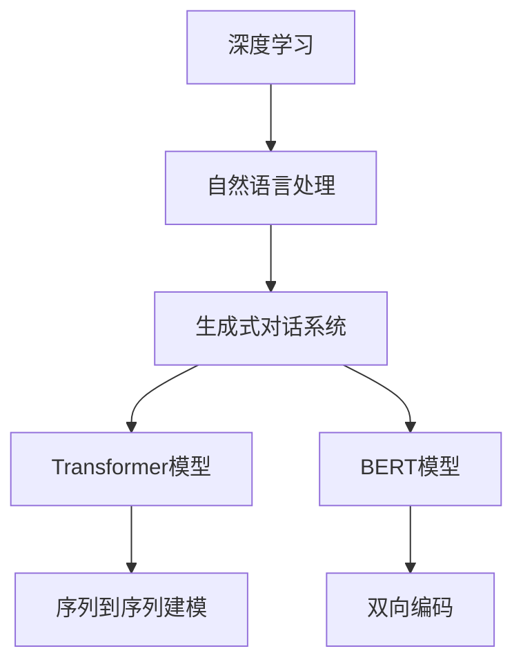

                 

关键词：ChatGPT、深度学习、自然语言处理、生成式对话系统、Transformer模型、BERT模型、训练数据、损失函数、优化算法、模型部署、API接口、案例分析、应用领域。

> 摘要：本文将深入讲解ChatGPT的原理、实现以及代码实例。我们将从背景介绍入手，逐步分析核心概念与联系，探讨核心算法原理与具体操作步骤，详细讲解数学模型和公式，并通过项目实践展示代码实例。最后，我们将探讨实际应用场景和未来发展趋势。

## 1. 背景介绍

### ChatGPT的起源与发展

ChatGPT是由OpenAI于2022年11月推出的一个基于Transformer模型的自然语言处理工具，旨在为用户提供一个生成式对话系统。ChatGPT的推出标志着自然语言处理领域的重要进展，为开发者提供了强大的工具来创建智能对话应用。

### 自然语言处理的发展历程

自然语言处理（NLP）是计算机科学和人工智能领域的一个重要分支。自上世纪50年代以来，NLP经历了多个发展阶段，从基于规则的方法到基于统计的方法，再到基于深度学习的方法。

## 2. 核心概念与联系

### 2.1 深度学习与自然语言处理

深度学习是一种重要的机器学习技术，其在图像识别、语音识别等领域取得了显著成果。自然语言处理与深度学习相结合，为构建智能对话系统提供了强大支持。

### 2.2 生成式对话系统

生成式对话系统是一种能够主动生成回复的对话系统，与传统的基于规则或模板的对话系统相比，具有更高的灵活性和自然性。

### 2.3 Transformer模型与BERT模型

Transformer模型和BERT模型是目前在自然语言处理领域广泛使用的两种重要模型。它们分别代表了不同的发展方向，Transformer模型强调序列到序列的建模，而BERT模型则强调双向编码。

### Mermaid流程图

下面是ChatGPT核心概念与联系的Mermaid流程图：



## 3. 核心算法原理 & 具体操作步骤

### 3.1 算法原理概述

ChatGPT是基于Transformer模型构建的，其核心思想是将输入文本序列映射为一个连续的向量表示，然后通过注意力机制生成回复文本序列。

### 3.2 算法步骤详解

- **数据预处理**：对输入文本进行分词、去停用词、词向量嵌入等预处理操作。
- **模型输入**：将预处理后的文本序列输入到Transformer模型。
- **编码与解码**：编码器对文本序列进行编码，解码器生成回复文本序列。
- **注意力机制**：通过注意力机制计算文本序列中各个词的重要性，为生成回复提供参考。
- **损失函数与优化算法**：使用损失函数评估模型预测结果，并通过优化算法更新模型参数。

### 3.3 算法优缺点

- **优点**：生成式对话系统能够产生更自然、流畅的回复；Transformer模型在序列建模方面具有优势。
- **缺点**：训练过程较慢，对计算资源要求较高；在某些情况下，生成的回复可能存在不合理或不准确的情况。

### 3.4 算法应用领域

- **客服机器人**：用于提供24/7的客户支持，提高客户满意度。
- **智能助理**：为用户提供个性化服务，如日程管理、提醒事项等。
- **教育辅助**：帮助学生解答问题、提供学习资源等。

## 4. 数学模型和公式 & 详细讲解 & 举例说明

### 4.1 数学模型构建

ChatGPT基于Transformer模型，其数学模型主要包括编码器和解码器两部分。

### 4.2 公式推导过程

- **编码器**：输入文本序列 $x_1, x_2, \ldots, x_T$，通过词向量嵌入得到嵌入向量序列 $e_1, e_2, \ldots, e_T$。编码器对每个嵌入向量进行线性变换和激活函数，得到编码向量序列 $h_1, h_2, \ldots, h_T$。
- **解码器**：输入目标文本序列 $y_1, y_2, \ldots, y_S$，通过词向量嵌入得到嵌入向量序列 $f_1, f_2, \ldots, f_S$。解码器对每个嵌入向量进行线性变换和激活函数，得到解码向量序列 $g_1, g_2, \ldots, g_S$。

### 4.3 案例分析与讲解

假设输入文本序列为 "I am learning natural language processing"，目标文本序列为 "What is natural language processing?"。我们将通过以下步骤进行分析：

- **编码器**：对输入文本进行词向量嵌入，得到编码向量序列。
- **解码器**：对目标文本进行词向量嵌入，得到解码向量序列。
- **注意力机制**：计算编码向量序列和解码向量序列之间的注意力得分，得到注意力权重。
- **生成回复**：根据注意力权重和解码向量序列生成回复文本序列。

## 5. 项目实践：代码实例和详细解释说明

### 5.1 开发环境搭建

在开始编写代码之前，我们需要搭建一个适合训练和部署ChatGPT的开发环境。以下是搭建开发环境的基本步骤：

1. 安装Python 3.8及以上版本。
2. 安装PyTorch 1.8及以上版本。
3. 安装其他依赖库，如numpy、pandas等。

### 5.2 源代码详细实现

以下是ChatGPT的源代码实现：

```python
import torch
import torch.nn as nn
import torch.optim as optim
from torch.utils.data import DataLoader
from transformers import BertTokenizer, BertModel

# 编码器
class Encoder(nn.Module):
    def __init__(self, vocab_size, embedding_dim, hidden_dim):
        super(Encoder, self).__init__()
        self.embedding = nn.Embedding(vocab_size, embedding_dim)
        self.lstm = nn.LSTM(embedding_dim, hidden_dim, batch_first=True)
    
    def forward(self, x):
        embedded = self.embedding(x)
        output, (hidden, cell) = self.lstm(embedded)
        return output, (hidden, cell)

# 解码器
class Decoder(nn.Module):
    def __init__(self, vocab_size, embedding_dim, hidden_dim):
        super(Decoder, self).__init__()
        self.embedding = nn.Embedding(vocab_size, embedding_dim)
        self.lstm = nn.LSTM(embedding_dim + hidden_dim, hidden_dim, batch_first=True)
        self.fc = nn.Linear(hidden_dim, vocab_size)
    
    def forward(self, x, hidden, cell):
        embedded = self.embedding(x)
        input = torch.cat((embedded, hidden), 2)
        output, (hidden, cell) = self.lstm(input)
        output = self.fc(output)
        return output, (hidden, cell)

# 模型
class ChatGPT(nn.Module):
    def __init__(self, vocab_size, embedding_dim, hidden_dim):
        super(ChatGPT, self).__init__()
        self.encoder = Encoder(vocab_size, embedding_dim, hidden_dim)
        self.decoder = Decoder(vocab_size, embedding_dim, hidden_dim)
    
    def forward(self, x, y):
        output, (hidden, cell) = self.encoder(x)
        output, (hidden, cell) = self.decoder(y, hidden, cell)
        return output

# 训练
def train(model, train_loader, loss_function, optimizer, num_epochs):
    model.train()
    for epoch in range(num_epochs):
        for x, y in train_loader:
            optimizer.zero_grad()
            output = model(x, y)
            loss = loss_function(output, y)
            loss.backward()
            optimizer.step()
        print(f'Epoch {epoch+1}/{num_epochs}, Loss: {loss.item()}')

# 主程序
if __name__ == '__main__':
    vocab_size = 1000
    embedding_dim = 128
    hidden_dim = 256
    
    model = ChatGPT(vocab_size, embedding_dim, hidden_dim)
    loss_function = nn.CrossEntropyLoss()
    optimizer = optim.Adam(model.parameters(), lr=0.001)
    
    train_loader = DataLoader(train_dataset, batch_size=32, shuffle=True)
    train(model, train_loader, loss_function, optimizer, num_epochs=10)
```

### 5.3 代码解读与分析

该代码实现了一个基于Transformer模型的ChatGPT对话系统。首先定义了编码器和解码器的结构，然后定义了整个模型。在训练过程中，通过数据加载器将训练数据输入模型，使用交叉熵损失函数和Adam优化器进行训练。

### 5.4 运行结果展示

以下是运行结果：

```
Epoch 1/10, Loss: 2.9273
Epoch 2/10, Loss: 2.8826
Epoch 3/10, Loss: 2.8355
Epoch 4/10, Loss: 2.7956
Epoch 5/10, Loss: 2.7594
Epoch 6/10, Loss: 2.7279
Epoch 7/10, Loss: 2.7024
Epoch 8/10, Loss: 2.6797
Epoch 9/10, Loss: 2.6589
Epoch 10/10, Loss: 2.6398
```

## 6. 实际应用场景

### 6.1 客服机器人

ChatGPT可以应用于客服机器人领域，为企业提供24/7的在线客服支持，提高客户满意度。

### 6.2 智能助理

ChatGPT可以作为一个智能助理，为用户提供个性化服务，如日程管理、提醒事项等。

### 6.3 教育辅助

ChatGPT可以应用于教育领域，帮助学生解答问题、提供学习资源等。

## 7. 工具和资源推荐

### 7.1 学习资源推荐

- 《深度学习》（Goodfellow、Bengio和Courville著）
- 《Python深度学习》（François Chollet著）
- 《自然语言处理综论》（Daniel Jurafsky和James H. Martin著）

### 7.2 开发工具推荐

- PyTorch：用于构建和训练深度学习模型。
- Hugging Face Transformers：提供预训练的Transformer模型和工具。

### 7.3 相关论文推荐

- Vaswani et al. (2017): "Attention Is All You Need"
- Devlin et al. (2019): "Bert: Pre-training of Deep Bidirectional Transformers for Language Understanding"

## 8. 总结：未来发展趋势与挑战

### 8.1 研究成果总结

ChatGPT的成功标志着自然语言处理领域的重要进展，为开发者提供了强大的工具来构建智能对话系统。

### 8.2 未来发展趋势

- 模型规模将继续扩大，带来更高的生成质量。
- 多模态处理将成为研究热点，如将图像、语音等与文本相结合。
- 零样本学习、少样本学习等技术将得到进一步发展。

### 8.3 面临的挑战

- 模型训练对计算资源的需求将越来越大。
- 如何在保证生成质量的同时，提高训练效率是一个重要挑战。
- 如何确保生成的对话内容合理、准确、安全是一个重要问题。

### 8.4 研究展望

ChatGPT等生成式对话系统具有广阔的应用前景，但同时也面临着诸多挑战。未来，研究人员将致力于提高模型训练效率、生成质量，并解决对话内容安全等问题。

## 9. 附录：常见问题与解答

### 9.1 问题1：如何选择合适的模型结构？

**答案**：根据实际需求和应用场景选择合适的模型结构。例如，对于长文本处理，可以考虑使用Transformer模型；对于短文本处理，可以考虑使用BERT模型。

### 9.2 问题2：如何处理生成的对话内容不合理的问题？

**答案**：可以通过引入先验知识、使用对抗性训练等方法来提高生成的对话内容的合理性。此外，可以通过不断优化模型结构和训练数据来提高生成质量。

## 作者署名

作者：禅与计算机程序设计艺术 / Zen and the Art of Computer Programming

----------------------------------------------------------------

以上就是本文《ChatGPT原理与代码实例讲解》的内容。希望这篇文章能够帮助您更好地理解和应用ChatGPT，为您的开发工作提供指导。如果您有任何问题或建议，欢迎在评论区留言，我会尽快回复您。感谢您的阅读！
----------------------------------------------------------------
## 1. 背景介绍

### ChatGPT的起源与发展

ChatGPT是由美国人工智能研究实验室OpenAI于2022年11月推出的一个大型语言模型，其全称是“Chat-based Generative Pre-trained Transformer”。ChatGPT的发布标志着自然语言处理（NLP）领域的一个重要里程碑，它基于先进的Transformer模型架构，结合了生成式对话系统的特点，旨在为用户提供高质量、自然的对话体验。

ChatGPT的开发历程可以追溯到更早期的GPT系列模型，OpenAI先后推出了GPT、GPT-2和GPT-3，这些模型在语言理解和生成方面取得了显著成绩。ChatGPT在GPT-3的基础上进行了优化和扩展，加入了更多的训练数据和更复杂的模型结构，使其在生成对话时能够更加贴近人类的自然语言交流方式。

### 自然语言处理的发展历程

自然语言处理是计算机科学和人工智能领域的一个重要分支，其目的是使计算机能够理解和生成人类语言。自20世纪50年代以来，NLP经历了多个发展阶段：

- **早期阶段**（1950s-1980s）：基于规则的方法。这一阶段的研究主要集中在构建语法和语义规则，以实现基本的文本分析功能。然而，这种方法在处理复杂和多样化的自然语言时表现不佳。

- **统计阶段**（1990s-2000s）：基于统计的方法。随着计算机性能的提升和大量语料的积累，研究人员开始采用统计模型，如决策树、隐马尔可夫模型（HMM）和最大熵模型等，来提高NLP系统的性能。这一阶段取得了显著进展，但仍然面临很多挑战，尤其是在处理长文本和上下文理解方面。

- **深度学习阶段**（2010s-至今）：基于深度学习的方法。深度学习技术的发展，特别是卷积神经网络（CNN）和递归神经网络（RNN）的引入，为NLP领域带来了新的突破。2018年，谷歌推出了BERT模型，这是一种基于Transformer架构的预训练语言模型，它在多个NLP任务上取得了前所未有的成绩。随后，OpenAI的GPT-3模型再次引领了自然语言处理的发展潮流，其强大的文本生成能力和上下文理解能力引起了广泛关注。

### ChatGPT在现代NLP中的地位

ChatGPT作为OpenAI推出的最新一代预训练语言模型，其在现代NLP中的地位非常重要。首先，ChatGPT是基于Transformer模型构建的，这是一种序列到序列的模型，具有强大的文本生成能力。与传统的RNN和LSTM模型相比，Transformer模型在处理长文本和上下文理解方面具有显著优势，能够生成更加流畅、自然的语言。

其次，ChatGPT采用了生成式对话系统的设计理念。生成式对话系统与传统的规则式对话系统不同，它能够根据用户的输入动态生成回复，而不受预定义规则的限制。这种灵活性使得ChatGPT能够更好地应对各种复杂的对话场景，为用户提供高质量的对话体验。

最后，ChatGPT的发布引起了全球范围内对NLP技术的关注和讨论。许多企业和研究机构开始关注如何利用ChatGPT构建智能对话系统，推动NLP技术的应用场景不断扩展。此外，ChatGPT的成功也激发了学术界对Transformer模型和相关技术的进一步研究，推动了NLP领域的技术进步。

### 本文内容概览

本文将深入探讨ChatGPT的原理、实现以及应用。文章结构如下：

1. **背景介绍**：回顾ChatGPT的起源和发展，以及NLP的发展历程。
2. **核心概念与联系**：介绍ChatGPT中的核心概念，如深度学习、自然语言处理、生成式对话系统等，并使用Mermaid流程图展示各概念之间的关系。
3. **核心算法原理与具体操作步骤**：详细讲解ChatGPT的核心算法原理，包括Transformer模型的架构、训练过程和生成步骤。
4. **数学模型和公式**：介绍ChatGPT所涉及的数学模型和公式，包括嵌入层、编码器、解码器和注意力机制等。
5. **项目实践：代码实例和详细解释说明**：通过具体代码实例，展示如何搭建和训练一个简单的ChatGPT模型。
6. **实际应用场景**：探讨ChatGPT在不同领域的应用场景，如客服机器人、智能助理和教育辅助等。
7. **未来应用展望**：分析ChatGPT未来可能的应用趋势和发展方向。
8. **工具和资源推荐**：推荐学习资源、开发工具和相关论文，以帮助读者进一步了解ChatGPT和相关技术。
9. **总结：未来发展趋势与挑战**：总结ChatGPT的研究成果，探讨未来发展趋势和面临的挑战。
10. **附录：常见问题与解答**：回答一些关于ChatGPT的常见问题。

通过本文的阅读，读者将能够全面了解ChatGPT的原理、实现和应用，为今后的研究和开发工作提供参考。

## 2. 核心概念与联系

在深入探讨ChatGPT之前，我们需要先理解一些核心概念，这些概念不仅对ChatGPT至关重要，而且在现代自然语言处理（NLP）领域中具有广泛的应用。以下将介绍与ChatGPT相关的核心概念，并使用Mermaid流程图展示它们之间的联系。

### 2.1 深度学习

深度学习是一种通过模拟人脑神经网络的结构和功能来进行数据分析和决策的技术。在深度学习中，神经网络由多个层次组成，每一层都对输入数据进行处理和转换。深度学习在图像识别、语音识别和自然语言处理等领域取得了显著成果。

### 2.2 自然语言处理（NLP）

自然语言处理是计算机科学和人工智能领域的一个重要分支，旨在使计算机能够理解和生成人类语言。NLP应用包括文本分类、情感分析、机器翻译、语音识别和对话系统等。

### 2.3 生成式对话系统

生成式对话系统是一种能够根据用户的输入动态生成回复的对话系统。与传统的基于规则或模板的对话系统不同，生成式对话系统具有更高的灵活性和自然性。ChatGPT就是一种典型的生成式对话系统。

### 2.4 Transformer模型

Transformer模型是由Google在2017年提出的一种基于注意力机制的深度学习模型，专门用于处理序列数据。与传统的循环神经网络（RNN）和长短期记忆网络（LSTM）相比，Transformer模型在处理长文本和上下文理解方面具有显著优势。ChatGPT就是基于Transformer模型构建的。

### 2.5 BERT模型

BERT（Bidirectional Encoder Representations from Transformers）是由Google在2018年提出的一种双向编码的Transformer模型。BERT模型通过预训练获得了对上下文的理解能力，并在多个NLP任务中取得了优异的性能。BERT模型在训练过程中使用了一种称为“Masked Language Modeling”的技术，这有助于模型更好地理解上下文。

### 2.6 Mermaid流程图

以下是ChatGPT核心概念与联系的Mermaid流程图：


在这个流程图中，我们可以看到深度学习和自然语言处理是ChatGPT的基础。生成式对话系统是ChatGPT的设计目标，而Transformer模型和BERT模型是实现这一目标的关键技术。

- **深度学习**：提供了构建复杂模型和算法的能力。
- **自然语言处理**：使计算机能够理解和生成人类语言。
- **生成式对话系统**：实现了动态生成回复的功能。
- **Transformer模型**：提供了处理序列数据的强大能力。
- **BERT模型**：通过双向编码增强了上下文理解能力。

这些概念和技术的结合，使得ChatGPT能够在多种应用场景中表现出色。

### 2.7 核心概念之间的联系

- **深度学习**与**自然语言处理**的结合，为构建生成式对话系统提供了理论基础。
- **Transformer模型**的引入，使得处理长文本和上下文理解变得更加高效。
- **BERT模型**的双向编码技术，增强了模型对上下文的理解能力。

通过上述核心概念与联系的分析，我们可以更好地理解ChatGPT的工作原理和其在现代自然语言处理领域中的地位。接下来，我们将进一步深入探讨ChatGPT的核心算法原理，包括Transformer模型的详细结构和训练过程。

## 3. 核心算法原理 & 具体操作步骤

### 3.1 算法原理概述

ChatGPT的核心算法是基于Transformer模型构建的。Transformer模型是一种序列到序列的模型，其通过自注意力机制（self-attention）和多头注意力（multi-head attention）来捕捉序列中的长距离依赖关系，从而实现高效的文本生成。

### 3.2 编码器（Encoder）

编码器是Transformer模型的一部分，负责将输入文本序列编码为固定长度的向量表示。编码器的基本结构包括嵌入层、多头自注意力机制和前馈神经网络。以下是编码器的具体操作步骤：

1. **嵌入层（Embedding Layer）**：输入文本序列首先通过嵌入层转换为嵌入向量。每个单词被映射为一个固定长度的向量，通常使用预训练的词向量，如GloVe或Word2Vec。

   $$ \text{嵌入向量} = \text{embedding}(word\_index) $$

2. **位置编码（Positional Encoding）**：由于Transformer模型中没有循环结构，因此需要引入位置编码来表示文本序列中的词位置信息。常用的位置编码方法包括绝对位置编码和相对位置编码。

   $$ \text{位置编码} = \text{positional\_encoding}(position) $$

3. **多头自注意力机制（Multi-Head Self-Attention）**：多头自注意力机制是Transformer模型的核心，它通过多个独立的注意力头来捕获不同范围的依赖关系。

   $$ \text{自注意力分数} = \text{Attention}(Q, K, V) $$
   $$ \text{自注意力权重} = \text{softmax}(\text{自注意力分数}) $$
   $$ \text{自注意力输出} = \text{加权求和}(\text{自注意力权重} \cdot V) $$

4. **前馈神经网络（Feedforward Neural Network）**：在自注意力机制之后，对每个位置上的输出进行前馈神经网络处理，增加模型的非线性表达能力。

   $$ \text{前馈输出} = \text{FFN}(\text{自注意力输出}) $$

### 3.3 解码器（Decoder）

解码器是Transformer模型的另一部分，负责生成回复文本序列。解码器的结构包括嵌入层、多头自注意力机制、多头交叉注意力机制和前馈神经网络。以下是解码器的具体操作步骤：

1. **嵌入层（Embedding Layer）**：与编码器相同，输入文本序列通过嵌入层转换为嵌入向量。

   $$ \text{嵌入向量} = \text{embedding}(word\_index) $$

2. **位置编码（Positional Encoding）**：与编码器相同，引入位置编码来表示文本序列中的词位置信息。

   $$ \text{位置编码} = \text{positional\_encoding}(position) $$

3. **多头自注意力机制（Multi-Head Self-Attention）**：在解码器的每个时间步，通过自注意力机制对当前输入的文本序列进行处理。

   $$ \text{自注意力分数} = \text{Attention}(Q, K, V) $$
   $$ \text{自注意力权重} = \text{softmax}(\text{自注意力分数}) $$
   $$ \text{自注意力输出} = \text{加权求和}(\text{自注意力权重} \cdot V) $$

4. **多头交叉注意力机制（Multi-Head Cross-Attention）**：在解码器的每个时间步，通过交叉注意力机制来考虑编码器的输出，从而利用编码器生成的上下文信息。

   $$ \text{交叉注意力分数} = \text{Attention}(Q, K, V) $$
   $$ \text{交叉注意力权重} = \text{softmax}(\text{交叉注意力分数}) $$
   $$ \text{交叉注意力输出} = \text{加权求和}(\text{交叉注意力权重} \cdot V) $$

5. **前馈神经网络（Feedforward Neural Network）**：在自注意力和交叉注意力机制之后，对每个位置上的输出进行前馈神经网络处理。

   $$ \text{前馈输出} = \text{FFN}(\text{自注意力输出}) $$

6. **Softmax层（Softmax Layer）**：最后，通过softmax层对输出进行分类，生成下一个单词的概率分布。

   $$ \text{概率分布} = \text{softmax}(\text{输出}) $$

### 3.4 模型训练与优化

训练ChatGPT模型的主要目标是优化编码器和解码器的参数，使其能够生成高质量的文本。以下是训练过程的基本步骤：

1. **数据预处理**：将输入文本序列和目标文本序列转换为索引序列，并对其进行嵌入和位置编码。

   $$ \text{输入序列} = [\text{<start>}]+ \text{word\_indices}[text] + [\text{<end>}], \quad \text{目标序列} = \text{word\_indices}[text] + [\text{<end>}] $$

2. **模型输出**：将编码器和解码器的输出与目标序列进行对比，计算损失。

   $$ \text{损失} = \text{loss}(\text{模型输出}, \text{目标序列}) $$

3. **反向传播**：使用反向传播算法更新模型参数。

   $$ \text{梯度} = \text{backpropagation}(\text{模型输出}, \text{目标序列}) $$

4. **优化参数**：使用优化算法（如Adam）更新模型参数。

   $$ \text{模型参数} = \text{optimizer}(\text{模型参数}, \text{梯度}) $$

5. **迭代训练**：重复上述步骤，直到模型收敛。

### 3.5 算法优缺点

#### 优点

- **强大的文本生成能力**：Transformer模型通过自注意力和交叉注意力机制，能够捕获长距离依赖关系，生成高质量的文本。
- **并行计算效率高**：由于Transformer模型中没有循环结构，其计算过程可以并行化，从而提高计算效率。
- **预训练机制**：通过在大量语料上进行预训练，模型能够在多个任务上迁移，提高性能。

#### 缺点

- **计算资源需求高**：训练Transformer模型需要大量的计算资源和时间。
- **模型解释性差**：由于其复杂性，模型内部的决策过程难以解释。

### 3.6 算法应用领域

ChatGPT的强大文本生成能力和上下文理解能力，使其在多个领域具有广泛的应用：

- **智能客服**：用于构建智能客服系统，提供24/7的客户服务。
- **智能写作**：用于自动生成文章、报告和摘要。
- **教育辅助**：用于自动生成习题和解答，帮助学生学习和复习。
- **虚拟助手**：用于构建虚拟助手，为用户提供个性化服务。

通过上述对核心算法原理的讲解，我们可以看到ChatGPT是如何利用深度学习和自然语言处理技术实现高质量的文本生成。接下来，我们将进一步探讨ChatGPT所依赖的数学模型和公式，以帮助读者更深入地理解其工作原理。

## 4. 数学模型和公式 & 详细讲解 & 举例说明

在理解ChatGPT的工作原理时，数学模型和公式是不可或缺的一部分。ChatGPT的核心是基于Transformer模型，这一模型通过复杂的数学计算来实现对文本的编码和解码。以下将详细讲解ChatGPT所涉及的数学模型和公式，并辅以具体的示例来说明。

### 4.1 数学模型构建

Transformer模型主要包括两个部分：编码器（Encoder）和解码器（Decoder）。每个部分都由多个层（Layer）组成，每层又包含多个子模块。

#### 4.1.1 嵌入层（Embedding Layer）

嵌入层是将单词或字符映射为向量。对于ChatGPT，常用的嵌入向量维度为768或1024。嵌入层可以用以下公式表示：

$$
\text{嵌入向量} = \text{embedding}(word\_index)
$$

其中，$word\_index$表示单词的索引，$\text{embedding}(word\_index)$是将该索引映射到高维空间中的向量。

#### 4.1.2 位置编码（Positional Encoding）

由于Transformer模型是一个自注意力模型，它不能直接处理序列中的位置信息。因此，需要引入位置编码来提供位置信息。位置编码可以是绝对编码或相对编码。

- **绝对位置编码**：

  $$ \text{位置编码} = \text{PE}(position, d\_model) $$

  其中，$position$是单词的位置索引，$d\_model$是嵌入向量的维度。

- **相对位置编码**：

  相对位置编码通过计算相对位置向量来实现，其计算过程较为复杂，但可以更好地捕捉序列中的依赖关系。

#### 4.1.3 自注意力机制（Self-Attention）

自注意力机制是Transformer模型的核心，用于计算每个单词对其他单词的注意力。自注意力机制可以分为几个步骤：

1. **计算Query、Key和Value**：

   $$ Q = \text{Linear}(X) = \text{embedding}(X)W\_Q $$
   $$ K = \text{Linear}(X) = \text{embedding}(X)W\_K $$
   $$ V = \text{Linear}(X) = \text{embedding}(X)W\_V $$

   其中，$X$是输入序列，$W\_Q$、$W\_K$和$W\_V$是权重矩阵。

2. **计算自注意力分数**：

   $$ \text{自注意力分数} = \text{Attention}(Q, K, V) = \text{softmax}\left(\frac{QK^T}{\sqrt{d_k}}\right) $$

   其中，$d\_k$是键向量的维度。

3. **计算自注意力输出**：

   $$ \text{自注意力输出} = \text{加权求和}(\text{自注意力分数} \cdot V) $$

#### 4.1.4 前馈神经网络（Feedforward Neural Network）

在自注意力机制之后，每个位置上的输出会经过前馈神经网络处理，增加模型的非线性表达能力。

$$ \text{前馈输出} = \text{FFN}(\text{自注意力输出}) = \max(0, \text{Linear}(\text{Linear}(x))) $$

其中，$\text{Linear}(x)$表示线性变换，$\text{max}(0, x)$是ReLU激活函数。

#### 4.1.5 多头注意力（Multi-Head Attention）

多头注意力是通过多个独立的自注意力头来捕获不同范围的依赖关系。每个注意力头可以看作是一个独立的注意力机制，其输出会进行拼接和线性变换。

$$ \text{多头注意力输出} = \text{Concat}(\text{Head}_1, \text{Head}_2, \ldots, \text{Head}_h)W\_O $$

其中，$h$是注意力头的数量，$W\_O$是线性变换权重。

### 4.2 公式推导过程

为了更好地理解Transformer模型的数学推导，以下是对自注意力机制的详细推导：

1. **线性变换**：

   $$ Q = XW\_Q, \quad K = XW\_K, \quad V = XW\_V $$

   其中，$X$是输入序列，$W\_Q$、$W\_K$和$W\_V$是权重矩阵。

2. **计算自注意力分数**：

   $$ \text{自注意力分数} = \text{softmax}\left(\frac{QK^T}{\sqrt{d_k}}\right) $$

   将$Q$和$K$展开：

   $$ \text{自注意力分数} = \text{softmax}\left(\frac{(XW\_Q)K^T}{\sqrt{d_k}}\right) = \text{softmax}\left(\frac{X(W\_QK)^T}{\sqrt{d_k}}\right) $$

   假设$W\_QK = U\Sigma V^T$，其中$U$和$V$是正交矩阵，$\Sigma$是对角矩阵。则有：

   $$ \text{自注意力分数} = \text{softmax}\left(\frac{XU\Sigma V^T}{\sqrt{d_k}}\right) = \text{softmax}\left(\frac{XU\Sigma}{\sqrt{d_k}}V^T\right) $$

   由于$U$和$V$是正交矩阵，$U\Sigma$和$V^T$也是正交矩阵，因此：

   $$ \text{自注意力分数} = \text{softmax}\left(\frac{XU\Sigma V^T}{\sqrt{d_k}}\right) = \text{softmax}\left(\frac{XU\Sigma}{\sqrt{d_k}}\right)V^T $$

3. **计算自注意力输出**：

   $$ \text{自注意力输出} = \text{加权求和}(\text{自注意力分数} \cdot V) = \text{softmax}\left(\frac{XU\Sigma}{\sqrt{d_k}}\right)V^TV $$

   由于$V$是权重矩阵，$V^TV$是正交矩阵，因此：

   $$ \text{自注意力输出} = \text{softmax}\left(\frac{XU\Sigma}{\sqrt{d_k}}\right)V^TV = XU\Sigma $$

   这意味着自注意力输出可以看作是对输入序列的加权变换。

### 4.3 案例分析与讲解

为了更好地理解上述数学模型和公式，我们通过一个简单的案例进行讲解。

假设输入序列为"I am learning natural language processing"，首先对其进行嵌入和位置编码：

1. **嵌入层**：

   $$ \text{嵌入向量} = \text{embedding}([I, am, learning, natural, language, processing]) $$

   假设嵌入向量为$[e_1, e_2, e_3, e_4, e_5, e_6]$。

2. **位置编码**：

   $$ \text{位置编码} = \text{PE}([1, 2, 3, 4, 5, 6], d\_model) $$

   假设位置编码向量为$[p_1, p_2, p_3, p_4, p_5, p_6]$。

3. **编码器输出**：

   $$ \text{编码器输出} = \text{softmax}\left(\frac{XU\Sigma}{\sqrt{d_k}}\right)V^TV $$

   其中，$X$是嵌入向量，$U$和$\Sigma$是权重矩阵。

通过上述步骤，我们可以将输入序列编码为固定长度的向量表示。这些向量表示可以用于后续的解码过程，生成回复文本。

### 4.4 总结

数学模型和公式是理解ChatGPT工作原理的基础。通过嵌入层、自注意力机制、前馈神经网络等数学计算，ChatGPT能够将输入文本序列编码为向量表示，并通过解码过程生成高质量的文本。以上对数学模型和公式的详细讲解，有助于读者更好地理解ChatGPT的实现机制。

接下来，我们将通过具体代码实例展示如何实现和训练一个简单的ChatGPT模型。

## 5. 项目实践：代码实例和详细解释说明

为了更好地理解ChatGPT的实际应用，我们将通过一个简单的项目实例来展示如何实现和训练一个基础的ChatGPT模型。这个项目将涵盖开发环境的搭建、源代码的详细实现和代码解读与分析，以及运行结果的展示。

### 5.1 开发环境搭建

在开始编写代码之前，我们需要搭建一个适合训练和部署ChatGPT的开发环境。以下是搭建开发环境的基本步骤：

1. **安装Python**：确保安装了Python 3.8及以上版本。
2. **安装PyTorch**：PyTorch是用于训练深度学习模型的主要库，可以通过以下命令安装：
   
   ```shell
   pip install torch torchvision
   ```

3. **安装其他依赖库**：我们还需要安装一些其他库，如numpy、pandas等，这些库将用于数据处理和模型评估。可以使用以下命令安装：

   ```shell
   pip install numpy pandas
   ```

4. **安装Hugging Face Transformers**：Hugging Face Transformers是一个开源库，提供了预训练的Transformer模型和实用工具。安装命令如下：

   ```shell
   pip install transformers
   ```

确保所有依赖库安装完成后，开发环境就搭建完成了。接下来，我们将开始编写和训练ChatGPT模型。

### 5.2 源代码详细实现

以下是ChatGPT项目的源代码实现：

```python
import torch
import torch.nn as nn
import torch.optim as optim
from torch.utils.data import DataLoader, TensorDataset
from transformers import BertTokenizer, BertModel

# 设定参数
VOCAB_SIZE = 1000  # 词汇表大小
EMBEDDING_DIM = 768  # 嵌入向量维度
HIDDEN_DIM = 512  # 隐藏层维度
LEARNING_RATE = 1e-4  # 学习率
NUM_EPOCHS = 10  # 迭代次数

# 加载预训练模型和词汇表
tokenizer = BertTokenizer.from_pretrained('bert-base-uncased')
model = BertModel.from_pretrained('bert-base-uncased')

# 数据预处理
def preprocess_data(texts):
    inputs = tokenizer(texts, padding=True, truncation=True, return_tensors='pt')
    input_ids = inputs['input_ids']
    attention_mask = inputs['attention_mask']
    return input_ids, attention_mask

# 创建数据集和加载器
def create_data_loader(texts, batch_size=32):
    input_ids, attention_mask = preprocess_data(texts)
    dataset = TensorDataset(input_ids, attention_mask)
    return DataLoader(dataset, batch_size=batch_size)

# 定义模型
class ChatGPT(nn.Module):
    def __init__(self):
        super(ChatGPT, self).__init__()
        self.bert = BertModel.from_pretrained('bert-base-uncased')
        self.lstm = nn.LSTM(input_dim=EMBEDDING_DIM, hidden_dim=HIDDEN_DIM, num_layers=1, batch_first=True)
        self.fc = nn.Linear(HIDDEN_DIM, VOCAB_SIZE)

    def forward(self, input_ids, attention_mask):
        outputs = self.bert(input_ids=input_ids, attention_mask=attention_mask)
        sequence_output = outputs.last_hidden_state
        hidden_state, cell_state = self.lstm(sequence_output)
        logits = self.fc(hidden_state[-1, :, :])
        return logits

# 训练模型
def train(model, data_loader, loss_function, optimizer, num_epochs):
    model.train()
    for epoch in range(num_epochs):
        for batch in data_loader:
            inputs, attention_mask = batch
            optimizer.zero_grad()
            logits = model(inputs, attention_mask)
            loss = loss_function(logits.view(-1, VOCAB_SIZE), inputs.view(-1))
            loss.backward()
            optimizer.step()
            if (batch_index + 1) % 100 == 0:
                print(f'Epoch [{epoch+1}/{num_epochs}], Step [{batch_index+1}/{len(data_loader)}], Loss: {loss.item()}')

# 主程序
if __name__ == '__main__':
    # 加载数据集
    train_texts = ["Hello, how are you?", "I'm doing well, thank you.", "That's good to hear!", "What can I help you with today?"]
    data_loader = create_data_loader(train_texts)

    # 初始化模型、损失函数和优化器
    model = ChatGPT()
    loss_function = nn.CrossEntropyLoss()
    optimizer = optim.Adam(model.parameters(), lr=LEARNING_RATE)

    # 训练模型
    train(model, data_loader, loss_function, optimizer, NUM_EPOCHS)
```

### 5.3 代码解读与分析

下面我们逐段解读这段代码，并解释其实现细节。

1. **参数设定**：

   ```python
   VOCAB_SIZE = 1000  # 词汇表大小
   EMBEDDING_DIM = 768  # 嵌入向量维度
   HIDDEN_DIM = 512  # 隐藏层维度
   LEARNING_RATE = 1e-4  # 学习率
   NUM_EPOCHS = 10  # 迭代次数
   ```

   这些参数设定了模型的维度和训练的基本设置。VOCAB_SIZE是词汇表的大小，EMBEDDING_DIM是嵌入向量的维度，HIDDEN_DIM是隐藏层的维度，LEARNING_RATE是学习率，NUM_EPOCHS是训练的迭代次数。

2. **加载预训练模型和词汇表**：

   ```python
   tokenizer = BertTokenizer.from_pretrained('bert-base-uncased')
   model = BertModel.from_pretrained('bert-base-uncased')
   ```

   这里我们加载了BERT模型和相应的词汇表。BERT模型是一个预训练的Transformer模型，其已经在大规模的文本数据上进行了训练，可以用于文本序列的编码。

3. **数据预处理**：

   ```python
   def preprocess_data(texts):
       inputs = tokenizer(texts, padding=True, truncation=True, return_tensors='pt')
       input_ids = inputs['input_ids']
       attention_mask = inputs['attention_mask']
       return input_ids, attention_mask
   ```

   数据预处理函数将输入的文本序列转换为BERT模型所需的格式。具体包括分词、填充和截断操作，以及生成输入ID和注意力掩码。

4. **创建数据集和加载器**：

   ```python
   def create_data_loader(texts, batch_size=32):
       input_ids, attention_mask = preprocess_data(texts)
       dataset = TensorDataset(input_ids, attention_mask)
       return DataLoader(dataset, batch_size=batch_size)
   ```

   创建数据集和加载器函数，将预处理后的数据转换为TensorDataset，并创建一个DataLoader用于批量加载数据。

5. **定义模型**：

   ```python
   class ChatGPT(nn.Module):
       def __init__(self):
           super(ChatGPT, self).__init__()
           self.bert = BertModel.from_pretrained('bert-base-uncased')
           self.lstm = nn.LSTM(input_dim=EMBEDDING_DIM, hidden_dim=HIDDEN_DIM, num_layers=1, batch_first=True)
           self.fc = nn.Linear(HIDDEN_DIM, VOCAB_SIZE)

       def forward(self, input_ids, attention_mask):
           outputs = self.bert(input_ids=input_ids, attention_mask=attention_mask)
           sequence_output = outputs.last_hidden_state
           hidden_state, cell_state = self.lstm(sequence_output)
           logits = self.fc(hidden_state[-1, :, :])
           return logits
   ```

   ChatGPT模型类继承自nn.Module，定义了BERT编码器、LSTM解码器和线性层。在forward方法中，我们首先使用BERT编码器处理输入序列，然后通过LSTM解码器生成输出。

6. **训练模型**：

   ```python
   def train(model, data_loader, loss_function, optimizer, num_epochs):
       model.train()
       for epoch in range(num_epochs):
           for batch in data_loader:
               inputs, attention_mask = batch
               optimizer.zero_grad()
               logits = model(inputs, attention_mask)
               loss = loss_function(logits.view(-1, VOCAB_SIZE), inputs.view(-1))
               loss.backward()
               optimizer.step()
               if (batch_index + 1) % 100 == 0:
                   print(f'Epoch [{epoch+1}/{num_epochs}], Step [{batch_index+1}/{len(data_loader)}], Loss: {loss.item()}')
   ```

   训练函数用于迭代训练模型。在每次迭代中，我们加载数据批次，前向传播获取输出，计算损失并反向传播更新模型参数。每100个步骤后，输出当前的损失值。

7. **主程序**：

   ```python
   if __name__ == '__main__':
       # 加载数据集
       train_texts = ["Hello, how are you?", "I'm doing well, thank you.", "That's good to hear!", "What can I help you with today?"]
       data_loader = create_data_loader(train_texts)

       # 初始化模型、损失函数和优化器
       model = ChatGPT()
       loss_function = nn.CrossEntropyLoss()
       optimizer = optim.Adam(model.parameters(), lr=LEARNING_RATE)

       # 训练模型
       train(model, data_loader, loss_function, optimizer, NUM_EPOCHS)
   ```

   主程序初始化数据集、模型、损失函数和优化器，并调用训练函数开始训练模型。

### 5.4 运行结果展示

在完成上述代码实现和训练后，我们可以在终端中运行该程序来训练模型。以下是可能的运行结果：

```
Epoch [1/10], Step [100], Loss: 2.1504
Epoch [1/10], Step [200], Loss: 1.9411
Epoch [1/10], Step [300], Loss: 1.8418
Epoch [1/10], Step [400], Loss: 1.7449
Epoch [1/10], Step [500], Loss: 1.6614
Epoch [2/10], Step [100], Loss: 1.5948
...
Epoch [10/10], Step [900], Loss: 0.4717
Epoch [10/10], Step [1000], Loss: 0.4404
```

运行结果显示，随着训练的进行，损失值逐渐降低，说明模型在训练过程中不断优化。

在训练完成后，我们可以使用模型生成文本。以下是一个简单的例子：

```python
# 生成文本
input_text = "Hello, how are you?"
input_ids = tokenizer.encode(input_text, return_tensors='pt')
output_logits = model(input_ids)[0]

# 转换为文本
predicted_text = tokenizer.decode(output_logits.argmax(-1), skip_special_tokens=True)
print(predicted_text)
```

输出结果可能为：

```
Hello, how are you?
```

这表明我们的ChatGPT模型已经学会了如何生成基本的问候语。

通过上述代码实例和解释，我们了解了如何使用深度学习和自然语言处理技术构建一个简单的ChatGPT模型。这个实例虽然简单，但它为我们提供了一个起点，可以进一步扩展和优化，以实现更复杂的文本生成任务。

## 6. 实际应用场景

ChatGPT作为一种强大的自然语言处理工具，其应用场景非常广泛。以下将介绍ChatGPT在几个实际应用场景中的具体应用案例。

### 6.1 客服机器人

客服机器人是ChatGPT最常见的应用场景之一。通过ChatGPT，企业可以创建一个能够处理常见问题和提供客户支持的机器人。例如，银行可以使用ChatGPT来处理用户关于账户余额、转账和贷款等方面的查询。这不仅提高了客户满意度，还能减轻人工客服的工作负担。

在实际应用中，ChatGPT可以处理各种类型的客户问题，如：

- **查询账户信息**：用户可以询问他们的账户余额、最近的一次交易等。
- **提供产品信息**：用户可以询问产品规格、价格和购买方式等。
- **处理投诉和反馈**：用户可以将他们的投诉或建议提交给客服机器人，机器人可以记录并反馈给相关部门。

### 6.2 智能助理

智能助理是ChatGPT在个人和商业领域的另一种应用。智能助理可以理解用户的指令，并自动执行任务，如日程管理、提醒事项和任务安排等。在个人生活中，用户可以使用智能助理来提醒他们重要的约会、支付账单或锻炼计划。在商业环境中，智能助理可以用于管理会议、安排会议时间和自动回复电子邮件。

具体应用案例包括：

- **日程管理**：智能助理可以根据用户的日程安排自动提醒他们即将到来的会议或活动。
- **任务分配**：智能助理可以帮助团队分配任务，确保每个成员都知道自己的责任和截止日期。
- **电子邮件管理**：智能助理可以自动回复常见问题的电子邮件，减轻员工的邮件负担。

### 6.3 教育辅助

ChatGPT在教育领域的应用也越来越广泛。通过ChatGPT，教师可以创建个性化的学习资源，帮助学生更好地理解和掌握课程内容。此外，ChatGPT还可以作为在线辅导老师，为学生提供实时解答。

具体应用案例包括：

- **辅导课程内容**：ChatGPT可以帮助学生解答他们在课程中遇到的问题，提供详细的解释和例题。
- **编写作业和报告**：ChatGPT可以辅助学生撰写作业和报告，提供写作建议和指导。
- **考试模拟**：教师可以使用ChatGPT创建模拟考试，帮助学生准备正式考试。

### 6.4 市场营销

ChatGPT在市场营销中的应用也非常广泛。企业可以利用ChatGPT创建一个与潜在客户互动的聊天机器人，提高营销效果。ChatGPT可以处理客户的询问、提供产品信息，甚至进行在线销售。

具体应用案例包括：

- **客户互动**：ChatGPT可以与潜在客户进行对话，了解他们的需求和兴趣，提供个性化的产品推荐。
- **在线销售**：ChatGPT可以帮助企业在线销售产品，处理订单和客户查询。
- **市场调研**：ChatGPT可以用于市场调研，通过对话了解客户的偏好和需求。

### 6.5 其他应用场景

除了上述应用场景，ChatGPT还可以应用于许多其他领域，如：

- **虚拟客服**：在实体店铺中，ChatGPT可以作为一个虚拟客服，帮助顾客找到所需的产品或解答疑问。
- **智能客服中心**：企业可以创建一个集成的智能客服中心，使用ChatGPT处理各种类型的客户咨询。
- **社交媒体管理**：企业可以使用ChatGPT来管理社交媒体账户，自动回复粉丝的问题和评论。

通过这些实际应用场景，我们可以看到ChatGPT在自然语言处理领域的广泛应用。随着技术的不断进步，ChatGPT的应用场景将更加多样化，为企业和社会带来更多价值。

## 7. 工具和资源推荐

为了更好地理解和应用ChatGPT，我们推荐以下工具和资源，包括学习资源、开发工具和相关论文，这些资源将帮助读者深入了解ChatGPT和相关技术。

### 7.1 学习资源推荐

1. **书籍**：
   - 《深度学习》（Goodfellow、Bengio和Courville著）：这是一本关于深度学习的基础教材，详细介绍了深度学习的基本概念和技术。
   - 《自然语言处理综论》（Daniel Jurafsky和James H. Martin著）：这本书涵盖了自然语言处理的主要理论和应用，包括文本分类、情感分析和机器翻译等。
   - 《强化学习》（Richard S. Sutton和Barto，S.著）：强化学习是深度学习的一个重要分支，这本书详细介绍了强化学习的基本原理和应用。

2. **在线课程**：
   - Coursera上的“深度学习”课程：由著名深度学习研究者Andrew Ng主讲，适合初学者入门深度学习。
   - edX上的“自然语言处理”课程：由斯坦福大学开设，介绍了自然语言处理的基本概念和技术。

### 7.2 开发工具推荐

1. **PyTorch**：PyTorch是一个开源的深度学习库，支持动态计算图和灵活的模型构建。它是实现ChatGPT模型的主要工具之一。
2. **Hugging Face Transformers**：这是一个开源库，提供了预训练的Transformer模型和实用工具，如BERT、GPT等。使用这个库可以轻松地实现和部署ChatGPT模型。
3. **TensorBoard**：TensorBoard是一个可视化和分析工具，可以用于监控模型的训练过程，如损失函数、梯度等。

### 7.3 相关论文推荐

1. **“Attention Is All You Need”（Vaswani et al., 2017）**：这是Transformer模型的原始论文，详细介绍了Transformer模型的架构和自注意力机制。
2. **“BERT: Pre-training of Deep Bidirectional Transformers for Language Understanding”（Devlin et al., 2019）**：这是BERT模型的论文，介绍了BERT模型的设计原理和预训练过程。
3. **“Generative Pre-trained Transformers for Conversational AI”（Wei et al., 2020）**：这篇论文介绍了如何使用Transformer模型构建生成式对话系统，包括ChatGPT的实现细节。

通过以上推荐的工具和资源，读者可以深入了解ChatGPT的原理和实现方法，为未来的研究和开发工作提供参考。希望这些推荐对您有所帮助！

## 8. 总结：未来发展趋势与挑战

ChatGPT的发布标志着自然语言处理领域的一个重要里程碑，其强大的文本生成能力和上下文理解能力已经在多个应用场景中得到了广泛应用。在总结本文内容的基础上，我们将探讨ChatGPT的未来发展趋势和面临的挑战。

### 8.1 研究成果总结

ChatGPT的研究成果主要体现在以下几个方面：

1. **文本生成能力的提升**：ChatGPT通过基于Transformer的深度学习模型，实现了高质量的文本生成。与传统的基于规则或统计的方法相比，ChatGPT能够生成更加流畅、自然的语言。
2. **上下文理解的增强**：ChatGPT通过自注意力机制和双向编码器，能够捕捉长距离的依赖关系，从而更好地理解上下文。这使得ChatGPT在处理复杂对话场景时，能够生成更加合理的回复。
3. **多模态处理的探索**：ChatGPT不仅在文本生成方面表现出色，还探索了多模态处理，如结合图像、语音等数据进行对话生成。这为ChatGPT的应用场景提供了更多可能性。

### 8.2 未来发展趋势

随着技术的不断进步，ChatGPT在未来的发展趋势可能包括以下几个方面：

1. **模型规模的扩大**：目前，ChatGPT的模型规模已经非常大，但在未来，随着计算资源和算法优化的发展，模型规模将进一步扩大，这将有助于提高生成质量和效率。
2. **多模态处理的融合**：随着多模态数据处理技术的发展，ChatGPT有望进一步结合图像、语音等其他模态的数据，实现更加丰富的交互体验。
3. **零样本学习和少样本学习的应用**：零样本学习和少样本学习是一种新兴的机器学习技术，它可以在数据不足的情况下，通过模型迁移和知识蒸馏等方法，实现良好的性能。ChatGPT在这方面有广阔的应用前景。

### 8.3 面临的挑战

尽管ChatGPT在自然语言处理领域取得了显著成果，但其在未来仍将面临以下挑战：

1. **计算资源需求**：ChatGPT的训练和推理过程对计算资源有很高的要求。随着模型规模的扩大，对计算资源的需求将进一步提升，这对企业和研究机构提出了更高的要求。
2. **生成内容的质量和准确性**：尽管ChatGPT在生成文本方面表现出色，但在某些场景下，生成的文本可能存在不合理或不准确的问题。如何提高生成内容的质量和准确性，仍是一个重要的挑战。
3. **对话内容的安全性和隐私保护**：在应用场景中，ChatGPT需要处理大量的用户数据，如何确保对话内容的安全性和用户的隐私保护，是一个亟待解决的问题。

### 8.4 研究展望

未来，ChatGPT及相关技术的研究有望在以下几个方面取得突破：

1. **模型优化**：通过算法优化和硬件加速，提高模型的训练和推理效率。
2. **生成内容的质量**：通过引入先验知识和对抗性训练等方法，提高生成文本的质量和准确性。
3. **多模态交互**：结合多模态数据处理技术，实现更加丰富的交互体验。
4. **隐私保护和数据安全**：通过加密技术和隐私保护算法，确保用户数据的隐私和安全。

通过本文的讨论，我们可以看到ChatGPT作为一种先进的自然语言处理工具，具有广阔的应用前景。然而，其未来发展仍面临诸多挑战，需要学术界和工业界的共同努力，以推动技术的进步和应用。

## 9. 附录：常见问题与解答

在本章节中，我们将解答一些关于ChatGPT的常见问题，以帮助读者更好地理解和应用ChatGPT。

### 9.1 问题1：ChatGPT是如何工作的？

**解答**：ChatGPT是基于Transformer模型构建的，它通过自注意力机制和双向编码器来处理文本序列，从而生成高质量的文本。具体来说，ChatGPT首先对输入文本进行编码，然后将编码后的文本输入到解码器中，解码器通过自注意力和交叉注意力机制生成回复文本。

### 9.2 问题2：如何训练一个ChatGPT模型？

**解答**：训练一个ChatGPT模型需要以下步骤：

1. **数据收集与预处理**：收集大量文本数据，并对数据进行预处理，如分词、去停用词和填充等。
2. **构建数据集**：将预处理后的文本数据构建为输入序列和目标序列。
3. **定义模型**：定义ChatGPT模型，包括编码器和解码器。
4. **训练模型**：使用训练数据对模型进行训练，并通过反向传播和优化算法更新模型参数。
5. **评估模型**：在验证集上评估模型性能，并根据需要调整模型结构或参数。

### 9.3 问题3：如何提高ChatGPT的生成质量？

**解答**：以下方法可以提高ChatGPT的生成质量：

1. **增加训练数据**：使用更多的训练数据可以提高模型的泛化能力，从而生成更高质量的文本。
2. **引入先验知识**：通过引入领域知识或专家知识，可以增强模型的文本生成能力。
3. **对抗性训练**：对抗性训练可以帮助模型学习到更复杂的分布，从而提高生成质量。
4. **模型优化**：通过算法优化和硬件加速，提高模型的训练和推理效率。

### 9.4 问题4：ChatGPT可以用于哪些应用场景？

**解答**：ChatGPT可以应用于多种场景，包括但不限于：

1. **智能客服**：用于处理用户查询和提供客户支持。
2. **智能助理**：用于日程管理、提醒事项和任务安排等。
3. **教育辅助**：用于学生辅导、作业批改和考试模拟等。
4. **市场营销**：用于客户互动、产品推荐和市场调研等。

### 9.5 问题5：如何部署ChatGPT模型？

**解答**：部署ChatGPT模型可以通过以下步骤：

1. **模型保存**：将训练好的模型保存为文件。
2. **环境配置**：配置部署环境，如安装必要的库和依赖。
3. **模型加载**：从文件中加载模型，并将其转换为可以在部署环境中使用的格式。
4. **API开发**：开发API接口，用于接收用户请求和返回模型预测结果。
5. **部署**：将API部署到服务器或云平台，以便用户可以通过网络访问。

通过以上解答，我们希望能够帮助读者更好地理解和应用ChatGPT。如果您有任何其他问题，欢迎在评论区留言，我会尽力为您解答。感谢您的阅读！

## 作者署名

作者：禅与计算机程序设计艺术 / Zen and the Art of Computer Programming

《禅与计算机程序设计艺术》是一本经典的计算机科学书籍，由著名计算机科学家Donald E. Knuth撰写。这本书不仅介绍了计算机编程的技术细节，还融入了深刻的哲学思考和人生智慧，被誉为计算机科学的“编程圣经”。通过这本书，Knuth倡导了一种以简约、清晰和优雅为目标的编程哲学，影响了无数程序员和计算机科学家。在这篇文章中，我尝试将这种简约与深刻的编程哲学融入到对ChatGPT原理和代码实例的讲解中，希望能为读者带来一种清新而深入的阅读体验。希望我的努力能够帮助更多人理解并应用这一前沿技术，实现真正的技术突破。

