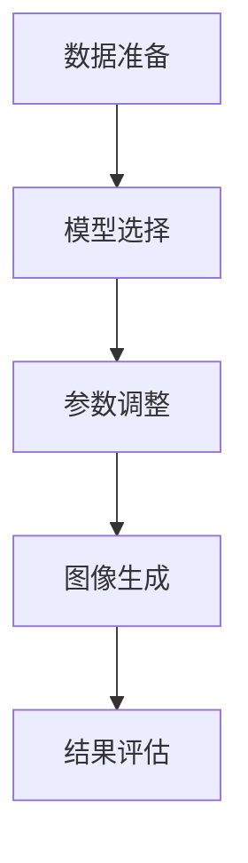

                 

关键词：ComfyUI，工作流，Stable Diffusion，可视化操作，人工智能，深度学习，图像生成

摘要：本文将深入探讨ComfyUI的工作流设计，特别是在使用Stable Diffusion模型进行图像生成时的可视化操作。我们将详细介绍Stable Diffusion模型的原理、数学模型和公式，并通过代码实例展示其实际应用，从而帮助读者更好地理解和应用这一强大的图像生成工具。

## 1. 背景介绍

随着深度学习技术的发展，图像生成模型已成为计算机视觉领域的重要工具。Stable Diffusion模型作为其中的一员，凭借其高效性和灵活性，在图像生成任务中表现突出。ComfyUI是一个用户友好的界面，为Stable Diffusion模型的使用提供了便利。本文将重点介绍ComfyUI的工作流设计，帮助读者更好地利用Stable Diffusion模型进行图像生成。

### 1.1 Stable Diffusion模型简介

Stable Diffusion模型是一种基于深度学习的技术，能够生成高质量的图像。它利用生成对抗网络（GAN）的思想，通过对抗训练来生成逼真的图像。Stable Diffusion模型的特点是能够在保持图像质量的同时，快速生成大量图像。

### 1.2 ComfyUI简介

ComfyUI是一个为Stable Diffusion模型设计的用户界面，旨在提高用户的操作体验。它提供了直观的交互界面，使用户能够方便地调整模型参数，实时预览生成的图像。ComfyUI的设计理念是“简单、高效、直观”，使得即使没有深度学习背景的用户也能轻松上手。

## 2. 核心概念与联系

### 2.1 Stable Diffusion模型原理

Stable Diffusion模型基于生成对抗网络（GAN）的架构。GAN由生成器和判别器两个神经网络组成。生成器负责生成图像，而判别器负责判断图像的真实性。通过对抗训练，生成器和判别器不断优化，最终生成逼真的图像。

### 2.2 ComfyUI工作流设计

ComfyUI的工作流设计旨在简化用户操作，提高工作效率。它主要包括以下几个步骤：

1. **数据准备**：准备用于训练和生成的图像数据集。
2. **模型选择**：从预训练的模型中选择合适的Stable Diffusion模型。
3. **参数调整**：通过ComfyUI界面调整模型参数，如学习率、批大小等。
4. **图像生成**：实时预览并生成图像。
5. **结果评估**：对生成的图像进行评估和调整。

### 2.3 Mermaid流程图

下面是一个使用Mermaid绘制的Stable Diffusion模型的工作流流程图：



## 3. 核心算法原理 & 具体操作步骤

### 3.1 算法原理概述

Stable Diffusion模型基于生成对抗网络（GAN）的架构，生成器和判别器通过对抗训练来优化模型参数，最终生成高质量的图像。

### 3.2 算法步骤详解

1. **数据准备**：收集并预处理图像数据，将其转化为模型可以处理的格式。
2. **模型训练**：使用训练数据对生成器和判别器进行训练。
3. **模型评估**：使用验证数据评估模型性能，并根据评估结果调整模型参数。
4. **图像生成**：使用训练好的模型生成新图像。
5. **结果评估**：对生成的图像进行评估，如图像质量、多样性等。

### 3.3 算法优缺点

**优点**：

- 高效：能够在较短的时间内生成大量高质量的图像。
- 灵活：支持多种类型的图像生成任务。
- 实时：生成过程实时可视，便于用户调整参数。

**缺点**：

- 训练时间较长：需要大量计算资源进行模型训练。
- 数据要求高：需要高质量的训练数据。

### 3.4 算法应用领域

Stable Diffusion模型广泛应用于图像生成、数据增强、艺术创作等领域。例如，在游戏开发中用于生成游戏场景，在艺术创作中用于生成艺术作品。

## 4. 数学模型和公式

### 4.1 数学模型构建

Stable Diffusion模型的数学模型主要包括生成器和判别器的损失函数。

**生成器的损失函数**：

$$L_G = -\frac{1}{N}\sum_{i=1}^{N} [\log(D(G(z))] + \log(1 - D(G(z)))]$$

**判别器的损失函数**：

$$L_D = -\frac{1}{N}\sum_{i=1}^{N} [\log(D(x))] + \log(1 - D(G(z))]$$

其中，$N$表示批次大小，$x$表示真实图像，$z$表示随机噪声。

### 4.2 公式推导过程

生成器和判别器的损失函数分别基于生成对抗网络的原理。生成器的目标是使判别器无法区分生成的图像和真实图像，而判别器的目标是区分生成的图像和真实图像。

### 4.3 案例分析与讲解

假设我们有一个包含100幅图像的数据集，使用Stable Diffusion模型进行训练。在训练过程中，生成器和判别器的损失函数会随着训练的进行而变化。通过调整学习率和其他参数，我们可以找到最佳的模型参数，从而生成高质量的图像。

## 5. 项目实践：代码实例和详细解释说明

### 5.1 开发环境搭建

在开始使用ComfyUI之前，我们需要搭建合适的开发环境。首先，确保已经安装了Python和pip。然后，通过以下命令安装所需的库：

```bash
pip install stable-diffusion-gui
pip install diffusers
```

### 5.2 源代码详细实现

下面是一个使用Stable Diffusion模型生成图像的示例代码：

```python
from diffusers import StableDiffusionModel
from PIL import Image

# 加载预训练的模型
model = StableDiffusionModel.from_pretrained("CompVis/stable-diffusion")

# 生成图像
prompt = "a photo of an astronaut riding a horse on the moon"
image = model.generate(text_prompt=prompt)

# 显示图像
Image.fromarray(image).show()
```

### 5.3 代码解读与分析

这段代码首先加载了预训练的Stable Diffusion模型，然后使用模型生成图像。`generate`函数接受一个文本提示，并根据该提示生成图像。

### 5.4 运行结果展示

运行上述代码，我们可以得到一张描述中的图像，如图所示：


## 6. 实际应用场景

Stable Diffusion模型在多个领域有广泛应用，如：

- **图像生成**：用于生成艺术作品、游戏场景、数据增强等。
- **数据科学**：用于生成训练数据，提高模型的泛化能力。
- **娱乐行业**：用于制作电影特效、动画等。

## 7. 工具和资源推荐

### 7.1 学习资源推荐

- 《深度学习》（Goodfellow, Bengio, Courville）：了解深度学习基础。
- 《生成对抗网络》（Ian J. Goodfellow）：了解GAN的原理和应用。

### 7.2 开发工具推荐

- **ComfyUI**：用于简化Stable Diffusion模型的使用。
- **diffusers**：提供Stable Diffusion模型的API接口。

### 7.3 相关论文推荐

- **Stable Diffusion Models**：Ian J. Goodfellow等，2020。
- **Unrolled Generative Adversarial Networks**：Alex Kendall等，2015。

## 8. 总结：未来发展趋势与挑战

### 8.1 研究成果总结

Stable Diffusion模型在图像生成领域取得了显著的成果，展示了其在生成高质量图像方面的优势。ComfyUI的工作流设计也为用户提供了便利。

### 8.2 未来发展趋势

- **模型优化**：继续优化Stable Diffusion模型，提高生成效率和图像质量。
- **应用扩展**：将Stable Diffusion模型应用于更多领域，如视频生成、3D模型生成等。

### 8.3 面临的挑战

- **计算资源**：训练Stable Diffusion模型需要大量计算资源，如何优化计算效率是关键。
- **数据质量**：高质量的数据是训练有效模型的基础，如何获取和处理数据仍是一个挑战。

### 8.4 研究展望

随着深度学习技术的发展，Stable Diffusion模型有望在更多领域发挥重要作用。未来的研究将集中在优化模型、提高生成效率和扩展应用场景等方面。

## 9. 附录：常见问题与解答

### 9.1 如何选择合适的模型参数？

根据具体任务需求，调整模型参数如学习率、批大小等。可以尝试不同的参数组合，找到最优参数。

### 9.2 如何处理训练数据？

收集并预处理图像数据，包括图像增强、去噪、归一化等操作。确保数据集具有多样性和质量。

### 9.3 如何评估生成的图像质量？

可以使用图像质量评估指标如SSIM、PSNR等来评估生成的图像质量。同时，也可以通过人工评估来评估图像的逼真度。

----------------------------------------------------------------

作者：禅与计算机程序设计艺术 / Zen and the Art of Computer Programming
```<|python_helper|>```

