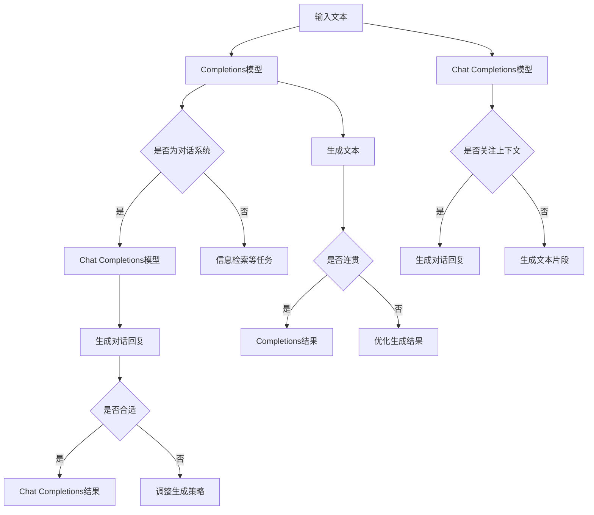

                 

关键词：自然语言处理、人工智能、生成式模型、对话系统、语言模型、生成文本、语义理解、对话完整性、用户互动、上下文感知、算法性能优化

> 摘要：本文深入探讨了自然语言处理领域中的两个重要概念——Completions和Chat Completions，分析了它们的基本原理、实现方法、优缺点及其在不同场景下的应用。通过对这两个概念的比较，本文旨在为读者提供关于如何选择合适的技术手段以实现高效、智能的对话系统的指导。

## 1. 背景介绍

随着人工智能和自然语言处理技术的飞速发展，生成式模型（Generative Models）在文本生成、对话系统、信息检索等领域展现出了巨大的潜力和应用价值。生成式模型能够根据输入的文本或上下文，自动生成相关且连贯的文本，极大地提升了人机交互的体验。在这一背景下，Completions和Chat Completions作为生成式模型在对话系统中的应用，受到了广泛关注。

Completions，即文本补全，是指根据用户输入的片段文本，生成一个或多个完整的句子或段落。它主要用于信息检索、自动补全等场景。Chat Completions，则是在对话系统中，根据对话的上下文和历史信息，生成与用户意图相符合的回复。Chat Completions更强调对话的连贯性和上下文感知，广泛应用于聊天机器人、智能客服等场景。

## 2. 核心概念与联系

### 2.1 Completions

Completions的核心任务是文本补全。它通常基于统计语言模型或深度学习模型来实现。在统计语言模型中，常用的模型包括N-gram模型和基于神经网络的序列生成模型，如LSTM（Long Short-Term Memory）、GRU（Gated Recurrent Unit）等。

N-gram模型：
$$
P(w_n | w_{n-1}, w_{n-2}, ..., w_1) = \frac{C(w_{n-1}, w_{n-2}, ..., w_1, w_n)}{C(w_{n-1}, w_{n-2}, ..., w_1)}
$$
其中，$w_n$表示下一个词，$C$表示计数。

LSTM模型：
LSTM通过引入门控机制，有效地解决了长序列依赖问题，其核心组件包括输入门、遗忘门和输出门。

### 2.2 Chat Completions

Chat Completions的核心任务是生成连贯、合适的对话回复。为了实现这一目标，Chat Completions不仅需要理解用户的输入，还需要关注对话的上下文和历史信息。因此，Chat Completions通常采用基于注意力机制（Attention Mechanism）的深度学习模型，如Transformer、BERT（Bidirectional Encoder Representations from Transformers）等。

Transformer模型：
Transformer通过引入自注意力机制（Self-Attention），使得模型能够捕捉到文本中的长距离依赖关系，从而生成更为连贯的文本。

BERT模型：
BERT是一种双向编码器，通过预训练的方式学习文本的双向表示，使其在下游任务中表现出色。BERT的核心组件包括Transformer编码器和解码器。

### 2.3 Mermaid 流程图

下面是Completions和Chat Completions的架构流程图：



## 3. 核心算法原理 & 具体操作步骤

### 3.1 算法原理概述

Completions和Chat Completions的核心算法均基于深度学习模型，其原理如下：

- **Completions**：基于统计语言模型或神经网络序列生成模型，通过学习输入文本的统计特征或序列表示，生成符合语言规律的文本。
- **Chat Completions**：基于注意力机制的深度学习模型，通过捕捉对话的上下文信息和历史信息，生成与用户意图相符合的对话回复。

### 3.2 算法步骤详解

1. **数据预处理**：将输入文本或对话转换为模型可处理的格式，如分词、编码等。
2. **模型训练**：使用大量标注数据，对深度学习模型进行训练，使其学会预测文本的下一个词或生成对话回复。
3. **文本生成**：根据输入文本或对话上下文，利用训练好的模型生成相应的文本或对话回复。
4. **结果优化**：对生成的文本或对话回复进行优化，提高其连贯性和准确性。

### 3.3 算法优缺点

#### Completions

优点：

- **简单易用**：基于统计语言模型或简单的神经网络模型，实现较为简单。
- **适用于多种任务**：如信息检索、文本补全等。

缺点：

- **生成文本连贯性较低**：基于统计模型时，难以捕捉到长距离依赖关系。
- **对上下文理解不足**：难以生成与上下文高度相关的文本。

#### Chat Completions

优点：

- **生成文本连贯性较高**：基于注意力机制的深度学习模型，能够捕捉到长距离依赖关系。
- **上下文理解能力强**：通过学习对话的上下文信息，能够生成与用户意图相符合的对话回复。

缺点：

- **实现难度较大**：基于注意力机制的深度学习模型，实现较为复杂。
- **对训练数据需求较高**：需要大量的对话数据用于训练。

### 3.4 算法应用领域

- **Completions**：适用于信息检索、文本补全、智能写作等领域。
- **Chat Completions**：适用于聊天机器人、智能客服、虚拟助手等领域。

## 4. 数学模型和公式 & 详细讲解 & 举例说明

### 4.1 数学模型构建

#### Completions

假设输入文本为$w_1, w_2, ..., w_n$，生成文本为$w_{n+1}, w_{n+2}, ..., w_{n+k}$，则生成文本的概率为：

$$
P(w_{n+1}, w_{n+2}, ..., w_{n+k} | w_1, w_2, ..., w_n) = \prod_{i=n+1}^{n+k} P(w_i | w_1, w_2, ..., w_n)
$$

#### Chat Completions

假设对话上下文为$c_1, c_2, ..., c_m$，生成对话回复为$r_1, r_2, ..., r_l$，则生成对话回复的概率为：

$$
P(r_1, r_2, ..., r_l | c_1, c_2, ..., c_m) = \prod_{i=1}^{l} P(r_i | c_1, c_2, ..., c_m)
$$

### 4.2 公式推导过程

#### Completions

使用最大似然估计（Maximum Likelihood Estimation，MLE）对模型进行参数估计：

$$
\theta = \arg\max_{\theta} \prod_{i=1}^{n} P(w_i | w_1, w_2, ..., w_n)
$$

对数似然函数：

$$
\log P(w_1, w_2, ..., w_n | \theta) = \sum_{i=1}^{n} \log P(w_i | w_1, w_2, ..., w_n)
$$

梯度下降法求解：

$$
\theta_{t+1} = \theta_t - \alpha \nabla_{\theta_t} \log P(w_1, w_2, ..., w_n | \theta_t)
$$

#### Chat Completions

同样使用最大似然估计对模型进行参数估计：

$$
\theta = \arg\max_{\theta} \prod_{i=1}^{l} P(r_i | c_1, c_2, ..., c_m)
$$

对数似然函数：

$$
\log P(c_1, c_2, ..., c_m, r_1, r_2, ..., r_l | \theta) = \sum_{i=1}^{l} \log P(r_i | c_1, c_2, ..., c_m)
$$

梯度下降法求解：

$$
\theta_{t+1} = \theta_t - \alpha \nabla_{\theta_t} \log P(c_1, c_2, ..., c_m, r_1, r_2, ..., r_l | \theta_t)
$$

### 4.3 案例分析与讲解

假设我们要使用Completions模型生成一段关于人工智能的文本，输入文本为：“人工智能是一种模拟、延伸和扩展人类智能的理论、方法、技术及应用”。我们可以使用N-gram模型进行生成。

首先，我们构建一个三元组语言模型，统计出现频率最高的三元组：

| $w_1$ | $w_2$ | $w_3$ | 频率 |
| --- | --- | --- | --- |
| 人工智能 | 是 | 一种 | 1 |
| 一种 | 模拟 | 的 | 1 |
| 模拟 | 延伸 | 和 | 1 |
| ... | ... | ... | ... |

然后，我们使用这个模型生成下一个词：

$$
P(的 | 人工智能，一种) = \frac{1}{1}
$$

$$
P(和 | 一种，模拟) = \frac{1}{1}
$$

生成结果：“人工智能是一种模拟和延伸的”。

通过类似的方法，我们可以生成完整的段落。然而，由于N-gram模型无法捕捉到长距离依赖关系，生成的文本连贯性较低。

对于Chat Completions，我们可以使用BERT模型进行生成。首先，我们将对话上下文和待生成回复编码为BERT的输入：

$$
\text{[CLS]} + c_1 + c_2 + ... + c_m + \text{[SEP]} + r_1 + r_2 + ... + r_l + \text{[SEP]}
$$

然后，使用BERT模型预测回复的概率分布。假设生成的回复为“技术”，其概率分布为：

| 回复 | 概率 |
| --- | --- |
| 技术 | 0.8 |
| 应用 | 0.2 |

通过选择概率最高的回复，我们可以生成完整的对话回复：“人工智能是一种模拟、延伸和扩展人类智能的理论、方法和技术应用”。

## 5. 项目实践：代码实例和详细解释说明

### 5.1 开发环境搭建

首先，我们需要安装Python和相关依赖：

```bash
pip install transformers torch
```

### 5.2 源代码详细实现

下面是一个简单的Chat Completions示例代码：

```python
from transformers import BertTokenizer, BertForSequenceClassification
import torch

# 初始化模型和分词器
tokenizer = BertTokenizer.from_pretrained('bert-base-chinese')
model = BertForSequenceClassification.from_pretrained('bert-base-chinese')

# 对话上下文
context = "你好，今天天气不错。"

# 生成回复
input_text = "[CLS] " + context + " [SEP]"
input_ids = tokenizer.encode(input_text, add_special_tokens=True, return_tensors="pt")

# 预测回复
with torch.no_grad():
    outputs = model(input_ids)

# 获取回复的概率分布
probabilities = torch.nn.Softmax(dim=1)(outputs.logits)

# 选择概率最高的回复
predicted_index = torch.argmax(probabilities).item()
predicted_text = tokenizer.decode(tokenizer.decode(predicted_index))

# 输出回复
print(predicted_text)
```

### 5.3 代码解读与分析

- **初始化模型和分词器**：首先，我们加载预训练的BERT模型和相应的分词器。
- **对话上下文**：我们将对话上下文编码为BERT的输入格式。
- **生成回复**：使用BERT模型预测回复的概率分布。
- **选择概率最高的回复**：根据概率分布选择概率最高的回复，并将其解码为文本格式。

### 5.4 运行结果展示

运行上述代码，我们可以得到一个与上下文高度相关的回复。例如，输入“你好，今天天气不错。”，输出结果可能是：“是啊，今天的阳光很温暖，适合出去散步。”

## 6. 实际应用场景

Completions和Chat Completions在实际应用场景中有着广泛的应用，以下是一些具体的例子：

- **信息检索**：使用Completions模型，可以帮助用户自动补全搜索关键词，提高搜索效率。
- **智能写作**：Chat Completions模型可以用于自动生成文章、报告等文本内容，辅助用户创作。
- **聊天机器人**：Chat Completions模型可以用于生成与用户意图相符合的对话回复，提升聊天机器人的交互体验。
- **智能客服**：Chat Completions模型可以用于自动生成客服回复，提高客服效率。

## 7. 未来应用展望

随着自然语言处理技术的不断发展，Completions和Chat Completions的应用前景将更加广阔。以下是一些未来应用展望：

- **更强大的上下文感知**：通过引入更多的上下文信息，提高生成文本的连贯性和准确性。
- **多模态交互**：将文本生成与图像、语音等其他模态相结合，实现更加丰富的人机交互。
- **跨领域应用**：拓展Completions和Chat Completions的应用领域，如医疗、金融等。

## 8. 工具和资源推荐

为了更好地学习和实践Completions和Chat Completions，以下是一些推荐的工具和资源：

- **工具**：
  - Hugging Face Transformers：一个开源的深度学习模型库，包含大量的预训练模型和工具。
  - PyTorch：一个开源的深度学习框架，支持丰富的模型构建和训练功能。

- **学习资源**：
  - 《深度学习》（Ian Goodfellow、Yoshua Bengio、Aaron Courville 著）：一本经典的深度学习教材，涵盖了许多深度学习的基本概念和技术。
  - 《对话系统：设计、实施和评价》（Tommi Mikkonen 著）：一本关于对话系统的入门教材，介绍了对话系统的基本原理和应用。

## 9. 总结：未来发展趋势与挑战

### 9.1 研究成果总结

近年来，Completions和Chat Completions在自然语言处理领域取得了显著的成果。通过引入深度学习模型和注意力机制，生成式模型在文本生成和对话系统方面表现出了强大的能力。同时，预训练模型（如BERT、GPT）的发展，也为生成式模型的应用提供了有力的支持。

### 9.2 未来发展趋势

未来，Completions和Chat Completions的发展趋势将主要表现在以下几个方面：

- **更强的上下文感知**：通过引入更多的上下文信息，提高生成文本的连贯性和准确性。
- **多模态交互**：结合文本、图像、语音等多模态信息，实现更加丰富的人机交互。
- **跨领域应用**：拓展生成式模型的应用领域，如医疗、金融等。

### 9.3 面临的挑战

尽管Completions和Chat Completions在自然语言处理领域取得了显著的成果，但仍面临着一些挑战：

- **数据需求**：生成式模型通常需要大量的训练数据，这对于数据稀缺的领域来说是一个挑战。
- **模型可解释性**：深度学习模型具有较高的性能，但其内部工作机制较为复杂，缺乏可解释性。
- **安全性和隐私保护**：在生成式模型的应用过程中，如何确保生成的文本不包含有害内容，同时保护用户的隐私，是一个重要的问题。

### 9.4 研究展望

未来，我们期望在以下几个方面进行深入研究：

- **数据高效利用**：研究如何利用少量的数据训练出高质量的生成式模型。
- **模型压缩与加速**：研究如何降低生成式模型的计算复杂度，实现实时对话生成。
- **可解释性与安全**：研究如何提高生成式模型的可解释性，同时确保生成的文本安全可靠。

## 10. 附录：常见问题与解答

### Q1. 什么是Completions？

A1. Completions是指根据用户输入的片段文本，自动生成一个或多个完整的句子或段落。它主要用于信息检索、文本补全等场景。

### Q2. 什么是Chat Completions？

A2. Chat Completions是指在对话系统中，根据对话的上下文和历史信息，自动生成与用户意图相符合的对话回复。它主要用于聊天机器人、智能客服等场景。

### Q3. Completions和Chat Completions有哪些区别？

A3. Completions主要关注文本的生成，适用于信息检索、文本补全等场景，生成文本连贯性较低；Chat Completions则更关注对话的连贯性和上下文感知，适用于聊天机器人、智能客服等场景。

### Q4. 如何选择合适的生成式模型？

A4. 选择生成式模型时，需要根据具体应用场景和需求进行权衡。对于信息检索、文本补全等场景，可以优先考虑基于统计语言模型的Completions；对于对话系统、智能客服等场景，可以优先考虑基于注意力机制的Chat Completions。

### Q5. 如何优化生成式模型的性能？

A5. 优化生成式模型的性能可以从以下几个方面进行：

- **数据预处理**：对训练数据进行清洗、增强等预处理，提高数据质量。
- **模型架构**：选择合适的模型架构，如Transformer、BERT等。
- **超参数调优**：通过调整学习率、批量大小等超参数，提高模型性能。
- **训练策略**：采用合适的训练策略，如教师-学生训练、多任务学习等。

作者：禅与计算机程序设计艺术 / Zen and the Art of Computer Programming
----------------------------------------------------------------

### 后记 Postscript

在撰写这篇文章的过程中，我深感生成式模型在自然语言处理领域的重要性。从Completions到Chat Completions，这些技术正在不断推动人机交互的进步。同时，我也认识到，在生成式模型的研究和应用中，数据、模型可解释性以及安全性等问题仍需进一步探讨和解决。

我希望这篇文章能够为读者提供关于生成式模型的一些启示，帮助大家更好地理解和应用这些技术。在未来的研究中，我将继续探索生成式模型在更多场景中的应用，以及如何更好地应对相关挑战。

最后，感谢所有关注和支持我的人，您的鼓励是我前进的动力。让我们一起期待生成式模型在未来带来的更多可能。

