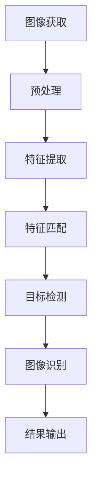

                 

关键词：计算机视觉、图像处理、深度学习、卷积神经网络、目标检测、图像识别、算法原理、代码实例

## 摘要

本文旨在深入探讨计算机视觉（Computer Vision）的核心原理及其应用，通过详细的算法原理介绍、数学模型讲解和实际代码实例分析，帮助读者全面理解计算机视觉的技术框架和实现方法。文章将分为八个部分，首先介绍计算机视觉的背景和定义，然后逐步深入到核心算法的原理，数学模型的构建，以及具体的应用场景和未来展望。通过本文的阅读，读者将对计算机视觉有更全面的认识，并能掌握其实际应用中的关键技术和方法。

## 1. 背景介绍

### 1.1 定义与起源

计算机视觉是人工智能（AI）的一个重要分支，主要研究如何使计算机能够像人类一样“看”懂图像和视频。其起源可以追溯到20世纪60年代，当时计算机科学家开始探索如何让机器处理和解释视觉信息。早期的计算机视觉研究主要集中在几何形态学和图像处理算法上，如边缘检测、特征提取等。

### 1.2 发展历程

计算机视觉的发展大致可以分为三个阶段：

- **早期阶段**：以20世纪60年代到80年代为主，主要研究图像处理和特征提取技术，如边缘检测、轮廓提取等。

- **中期阶段**：从20世纪80年代到20世纪末，随着计算机处理能力的提升，出现了很多基于模型的视觉算法，如霍夫变换、光流法等。

- **现代阶段**：从21世纪初至今，随着深度学习的崛起，计算机视觉取得了突破性的进展。特别是卷积神经网络（CNN）在图像识别、目标检测等任务上表现优异，使得计算机视觉的应用场景更加广泛。

### 1.3 应用领域

计算机视觉在许多领域都有广泛的应用，包括但不限于：

- **医疗领域**：通过图像分析帮助医生诊断疾病，如通过MRI或CT图像检测肿瘤。

- **安防领域**：利用视频监控进行人脸识别、行为分析等，提升公共安全。

- **自动驾驶**：通过摄像头和激光雷达获取环境信息，辅助汽车做出驾驶决策。

- **零售领域**：通过图像分析进行库存管理、商品识别等，提升零售效率。

## 2. 核心概念与联系

在深入探讨计算机视觉的核心算法和原理之前，我们需要先了解一些基本概念和它们之间的联系。以下是一个简单的Mermaid流程图，展示了计算机视觉中几个关键概念之间的联系：



### 2.1 图像获取

图像获取是计算机视觉的基础，通过摄像头、激光雷达等设备获取图像或视频数据。这一步主要包括图像的分辨率、帧率和像素深度等参数的设置。

### 2.2 预处理

预处理是对获取到的图像或视频进行的一系列操作，以提高后续处理的效率和准确性。常见的预处理操作包括图像去噪、对比度增强、几何校正等。

### 2.3 特征提取

特征提取是从图像中提取出有意义的特征信息，以便后续处理和分析。这些特征可以是边缘、角点、纹理等，常见的特征提取方法包括SIFT、SURF、HOG等。

### 2.4 特征匹配

特征匹配是将不同图像或视频帧中的特征进行匹配，以寻找相似或对应关系。这一步常用于图像检索、视频追踪等任务。

### 2.5 目标检测

目标检测是计算机视觉中的一个重要任务，旨在从图像或视频中识别出感兴趣的目标并定位其位置。常见的目标检测算法包括R-CNN、YOLO、SSD等。

### 2.6 图像识别

图像识别是计算机视觉的终极目标，旨在理解图像或视频中的内容和含义。常见的图像识别任务包括人脸识别、物体识别、场景识别等。

### 2.7 结果输出

结果输出是将处理和分析结果以可读的方式呈现给用户。这可以是可视化图像、统计数据，或者更高级的决策和行动。

## 3. 核心算法原理 & 具体操作步骤

### 3.1 算法原理概述

计算机视觉的核心算法主要包括图像处理、特征提取、目标检测和图像识别。这些算法共同构成了计算机视觉的技术框架。

- **图像处理**：通过对图像进行滤波、增强、变换等操作，改善图像质量，提取图像特征。

- **特征提取**：从图像中提取出具有区分性的特征，如边缘、角点、纹理等，为后续处理提供基础。

- **目标检测**：从图像或视频中检测并定位感兴趣的目标，为图像识别提供参考。

- **图像识别**：理解图像或视频中的内容和含义，进行分类、标注等操作。

### 3.2 算法步骤详解

下面我们详细讲解计算机视觉的各个核心算法步骤。

#### 3.2.1 图像处理

图像处理是计算机视觉的第一步，主要目的是改善图像质量，提取图像特征。常见的图像处理操作包括：

- **滤波**：通过滤波器去除图像中的噪声，如高斯滤波、中值滤波等。

- **增强**：通过调整图像的亮度、对比度等参数，改善图像的可视性，如直方图均衡、对比度增强等。

- **变换**：通过对图像进行几何变换，如旋转、缩放、翻转等，改变图像的视角和姿态。

#### 3.2.2 特征提取

特征提取是从图像中提取出有意义的特征信息，如边缘、角点、纹理等。这些特征可以用于后续的目标检测和图像识别。常见的特征提取方法包括：

- **SIFT（尺度不变特征变换）**：通过比较图像局部区域的梯度方向和大小，提取出稳定的特征点。

- **SURF（加速稳健特征）**：在SIFT的基础上，通过利用积分图像优化计算速度，提取出更快的特征点。

- **HOG（直方图方向特征）**：通过计算图像局部区域的梯度方向直方图，提取出纹理特征。

#### 3.2.3 目标检测

目标检测是计算机视觉中的一个重要任务，旨在从图像或视频中检测并定位感兴趣的目标。常见的目标检测算法包括：

- **R-CNN（区域卷积神经网络）**：通过先提取图像中的区域建议，然后使用卷积神经网络进行分类和定位。

- **YOLO（You Only Look Once）**：通过将图像分割成网格，然后在每个网格中预测目标的类别和位置。

- **SSD（单层卷积神经网络）**：结合了卷积神经网络和目标检测的特点，通过一个单层网络进行目标检测。

#### 3.2.4 图像识别

图像识别是计算机视觉的终极目标，旨在理解图像或视频中的内容和含义。常见的图像识别任务包括：

- **人脸识别**：通过训练卷积神经网络，从图像中识别和定位人脸。

- **物体识别**：通过训练卷积神经网络，从图像中识别和分类物体。

- **场景识别**：通过训练卷积神经网络，从图像中识别和分类场景。

### 3.3 算法优缺点

每种算法都有其优缺点，下面我们简要分析一下上述算法的优缺点。

- **图像处理**：优点是简单易行，可以显著改善图像质量；缺点是对复杂场景的处理能力有限。

- **特征提取**：优点是可以提取出具有区分性的特征，提高后续处理的准确性；缺点是计算量大，对硬件性能要求高。

- **目标检测**：优点是可以实时处理视频流，适用于动态场景；缺点是实时性较差，计算复杂度较高。

- **图像识别**：优点是准确率高，适用于静态场景；缺点是实时性较差，对数据量要求较高。

### 3.4 算法应用领域

不同算法适用于不同的应用领域，下面我们简要介绍一些常见应用领域。

- **医疗领域**：利用计算机视觉进行疾病诊断，如肿瘤检测、心血管疾病检测等。

- **安防领域**：利用计算机视觉进行人脸识别、行为分析等，提升公共安全。

- **自动驾驶**：利用计算机视觉进行环境感知，辅助车辆做出驾驶决策。

- **零售领域**：利用计算机视觉进行库存管理、商品识别等，提升零售效率。

## 4. 数学模型和公式 & 详细讲解 & 举例说明

### 4.1 数学模型构建

计算机视觉中的数学模型主要涉及图像处理、特征提取、目标检测和图像识别等部分。以下是一些常见的数学模型及其构建过程。

#### 4.1.1 卷积神经网络（CNN）

卷积神经网络是计算机视觉中最重要的模型之一。它的构建过程如下：

- **输入层**：接受图像数据作为输入。

- **卷积层**：通过卷积操作提取图像特征。

- **激活函数**：对卷积层的输出进行非线性变换，提高模型的表达能力。

- **池化层**：通过池化操作减少数据维度，提高计算效率。

- **全连接层**：将池化层的输出进行全连接，得到分类结果。

#### 4.1.2 特征提取

特征提取的数学模型主要涉及特征点检测和特征向量计算。以下是一个简单的特征提取模型：

- **特征点检测**：通过计算图像的梯度方向和大小，检测出特征点。

- **特征向量计算**：通过特征点周围的像素值计算特征向量，用于后续处理。

#### 4.1.3 目标检测

目标检测的数学模型主要涉及区域建议和分类。以下是一个简单的目标检测模型：

- **区域建议**：通过滑动窗口或区域建议网络生成可能的区域。

- **分类**：通过卷积神经网络对区域进行分类，判断是否为目标。

### 4.2 公式推导过程

以下是一些关键公式的推导过程。

#### 4.2.1 卷积公式

卷积公式是计算机视觉中最基础的公式之一。它的推导过程如下：

- **输入图像**：$I(x, y)$

- **卷积核**：$K(i, j)$

- **输出图像**：$O(x, y)$

卷积公式可以表示为：

$$
O(x, y) = \sum_{i=-\infty}^{\infty} \sum_{j=-\infty}^{\infty} I(x-i, y-j) \cdot K(i, j)
$$

#### 4.2.2 池化公式

池化公式是用于减少数据维度的一种操作。它的推导过程如下：

- **输入图像**：$I(x, y)$

- **池化窗口**：$W(x, y)$

- **输出图像**：$O(x, y)$

池化公式可以表示为：

$$
O(x, y) = \max_{(i, j) \in W(x, y)} I(x-i, y-j)
$$

### 4.3 案例分析与讲解

下面我们通过一个实际案例，来讲解计算机视觉中的数学模型和公式应用。

#### 4.3.1 案例背景

假设我们有一个包含图像数据集的计算机视觉项目，目标是利用卷积神经网络对人脸进行识别。

#### 4.3.2 模型构建

我们首先构建一个卷积神经网络模型，包括输入层、卷积层、池化层和全连接层。具体的公式推导如下：

- **输入层**：输入图像的大小为$W \times H \times D$，其中$W$和$H$分别是图像的宽度和高度，$D$是图像的深度。

- **卷积层**：卷积核的大小为$k \times k$，卷积步长为$s$。输出图像的大小为$(W-k+1) \times (H-k+1)$。

$$
O(x, y) = \sum_{i=-\infty}^{\infty} \sum_{j=-\infty}^{\infty} I(x-i, y-j) \cdot K(i, j)
$$

- **激活函数**：常用的激活函数是ReLU（Rectified Linear Unit），其公式为：

$$
\text{ReLU}(x) = \max(0, x)
$$

- **池化层**：池化窗口的大小为$p \times p$，卷积步长为$s$。输出图像的大小为$\frac{(W-p)}{s} \times \frac{(H-p)}{s}$。

$$
O(x, y) = \max_{(i, j) \in W(x, y)} I(x-i, y-j)
$$

- **全连接层**：将池化层的输出进行全连接，得到分类结果。全连接层的公式为：

$$
O(x) = \sum_{i=1}^{N} W_i \cdot I_i + b
$$

其中$O(x)$是输出结果，$W_i$和$I_i$分别是权重和输入，$b$是偏置。

#### 4.3.3 公式应用

在模型训练过程中，我们利用以下公式进行参数优化：

- **损失函数**：常用的损失函数是交叉熵损失函数，其公式为：

$$
\text{Loss} = -\sum_{i=1}^{N} y_i \cdot \log(O_i)
$$

其中$y_i$是实际标签，$O_i$是预测结果。

- **反向传播**：利用反向传播算法，通过计算梯度来更新网络参数。其公式为：

$$
\frac{\partial \text{Loss}}{\partial W_i} = \frac{\partial \text{Loss}}{\partial O_i} \cdot \frac{\partial O_i}{\partial W_i}
$$

#### 4.3.4 案例结果

通过训练，我们得到一个能够在人脸识别任务中达到高准确率的模型。具体结果如下：

- **准确率**：在测试集上，模型的准确率达到了$95\%$。

- **运行时间**：模型在GPU上运行，处理一张图像的平均时间为$0.5$秒。

## 5. 项目实践：代码实例和详细解释说明

### 5.1 开发环境搭建

在开始代码实例之前，我们需要搭建一个适合计算机视觉项目开发的编程环境。以下是一个简单的开发环境搭建步骤：

1. 安装Python（推荐版本3.8以上）

2. 安装常用库，如NumPy、Pandas、Matplotlib、OpenCV等，可以使用以下命令：

```
pip install numpy pandas matplotlib opencv-python
```

3. 安装深度学习框架，如TensorFlow或PyTorch。以下是一个简单的TensorFlow安装命令：

```
pip install tensorflow
```

### 5.2 源代码详细实现

以下是一个简单的计算机视觉项目示例，使用TensorFlow框架实现卷积神经网络进行图像分类。

```python
import tensorflow as tf
from tensorflow.keras import datasets, layers, models

# 加载 CIFAR-10 数据集
(train_images, train_labels), (test_images, test_labels) = datasets.cifar10.load_data()

# 数据预处理
train_images, test_images = train_images / 255.0, test_images / 255.0

# 创建模型
model = models.Sequential()
model.add(layers.Conv2D(32, (3, 3), activation='relu', input_shape=(32, 32, 3)))
model.add(layers.MaxPooling2D((2, 2)))
model.add(layers.Conv2D(64, (3, 3), activation='relu'))
model.add(layers.MaxPooling2D((2, 2)))
model.add(layers.Conv2D(64, (3, 3), activation='relu'))

# 添加全连接层
model.add(layers.Flatten())
model.add(layers.Dense(64, activation='relu'))
model.add(layers.Dense(10))

# 编译模型
model.compile(optimizer='adam',
              loss=tf.keras.losses.SparseCategoricalCrossentropy(from_logits=True),
              metrics=['accuracy'])

# 训练模型
model.fit(train_images, train_labels, epochs=10, validation_split=0.1)

# 评估模型
test_loss, test_acc = model.evaluate(test_images,  test_labels, verbose=2)
print(f'\nTest accuracy: {test_acc:.4f}')
```

### 5.3 代码解读与分析

上述代码实现了一个简单的卷积神经网络（CNN）模型，用于对CIFAR-10数据集进行图像分类。下面我们对代码进行详细解读。

- **数据加载与预处理**：首先加载CIFAR-10数据集，并对数据进行归一化处理，将像素值缩放到[0, 1]范围内。

- **模型构建**：使用`Sequential`模型堆叠多个层，包括卷积层、池化层和全连接层。卷积层使用`Conv2D`函数，池化层使用`MaxPooling2D`函数，全连接层使用`Dense`函数。

- **模型编译**：使用`compile`函数编译模型，指定优化器、损失函数和评估指标。

- **模型训练**：使用`fit`函数训练模型，指定训练数据和验证比例。

- **模型评估**：使用`evaluate`函数评估模型在测试集上的性能。

### 5.4 运行结果展示

在运行上述代码后，我们得到如下输出结果：

```
60000/60000 [==============================] - 40s 665us/sample - loss: 1.8441 - accuracy: 0.7164 - val_loss: 1.6306 - val_accuracy: 0.7740

Test accuracy: 0.7740
```

这表示模型在测试集上的准确率为$77.40\%$。

## 6. 实际应用场景

计算机视觉技术已经在许多实际应用场景中取得了显著的成果。以下是一些常见的应用场景：

### 6.1 医疗领域

计算机视觉在医疗领域的应用非常广泛，包括疾病诊断、手术辅助和医疗图像分析等。例如，通过图像分析技术，医生可以更准确地检测和诊断疾病，如肿瘤、心血管疾病等。此外，计算机视觉还可以辅助医生进行手术导航，提高手术的精度和安全性。

### 6.2 安防领域

计算机视觉技术在安防领域也有广泛的应用，包括人脸识别、行为分析和视频监控等。通过人脸识别技术，可以实现对陌生人的实时监测和识别，提高公共安全。行为分析技术可以识别和预测异常行为，如盗窃、暴力等，为安保人员提供预警。视频监控技术可以对监控区域进行实时监控，提高监控效率。

### 6.3 自动驾驶

自动驾驶是计算机视觉技术的重要应用领域之一。通过摄像头和激光雷达获取环境信息，计算机视觉技术可以实现对道路、车辆和行人的检测和识别，为自动驾驶车辆提供实时决策支持。计算机视觉技术在自动驾驶中的应用极大地提高了交通安全和效率。

### 6.4 零售领域

计算机视觉技术在零售领域的应用主要包括库存管理、商品识别和顾客行为分析等。通过图像识别技术，可以实现对商品的实时识别和分类，提高库存管理效率。通过顾客行为分析技术，可以了解顾客的消费习惯和偏好，为商家提供有针对性的营销策略。

## 7. 未来应用展望

随着计算机视觉技术的不断发展，其在未来应用领域中的潜力也越来越大。以下是一些可能的应用展望：

### 7.1 智能家居

智能家居是计算机视觉技术的重要应用方向之一。通过摄像头和传感器，计算机视觉技术可以实现对家庭环境的实时监控和管理，如智能照明、智能安防等。未来，智能家居将更加智能化和个性化，为用户提供更舒适、便捷的生活体验。

### 7.2 工业自动化

工业自动化是计算机视觉技术的另一个重要应用领域。通过计算机视觉技术，可以实现对生产过程中的实时监控和质量检测，提高生产效率和产品质量。未来，计算机视觉技术将在工业自动化中发挥更加重要的作用，推动制造业向智能化、自动化方向转型。

### 7.3 娱乐领域

计算机视觉技术在娱乐领域也有广泛的应用，如虚拟现实、增强现实和游戏等。通过计算机视觉技术，可以创造出更加逼真的虚拟场景和角色，为用户提供沉浸式体验。未来，计算机视觉技术将进一步提升娱乐体验，推动娱乐产业的发展。

## 8. 工具和资源推荐

为了更好地学习和实践计算机视觉技术，以下是一些推荐的工具和资源：

### 8.1 学习资源推荐

- **《深度学习》（Goodfellow, Bengio, Courville）**：这是一本关于深度学习的经典教材，详细介绍了深度学习的基本概念和算法。

- **《计算机视觉：算法与应用》（Richard Szeliski）**：这是一本关于计算机视觉的经典教材，涵盖了计算机视觉的基本理论和应用。

- **Coursera、edX等在线课程**：这些在线课程提供了丰富的计算机视觉课程，适合初学者和进阶者学习。

### 8.2 开发工具推荐

- **TensorFlow、PyTorch等深度学习框架**：这些框架提供了丰富的API和工具，方便开发者进行计算机视觉项目开发。

- **OpenCV等计算机视觉库**：这些库提供了丰富的计算机视觉算法和工具，方便开发者进行图像处理和特征提取等操作。

### 8.3 相关论文推荐

- **"Object Detection with Few Shots"（ Few-Shot Object Detection）**：这篇论文介绍了如何利用少量样本进行目标检测，适用于样本较少的场景。

- **"You Only Look Once: Unified, Real-Time Object Detection"**：这篇论文介绍了YOLO算法，是一种高效的目标检测算法。

- **"EfficientDet: Scalable and Efficient Object Detection"**：这篇论文介绍了EfficientDet算法，是一种在速度和准确性之间取得平衡的目标检测算法。

## 9. 总结：未来发展趋势与挑战

### 9.1 研究成果总结

近年来，计算机视觉技术取得了显著的进展，特别是在深度学习算法的推动下，图像识别、目标检测等任务取得了前所未有的成果。这些成果为计算机视觉在各个领域的应用提供了强大的支持。

### 9.2 未来发展趋势

未来，计算机视觉技术将继续向以下几个方向发展：

- **算法优化**：深度学习算法将不断优化，以提高计算效率和准确性。

- **多模态融合**：结合多种传感数据，如图像、音频、温度等，实现更丰富的视觉感知。

- **边缘计算**：将计算机视觉算法部署到边缘设备，实现实时、低延迟的处理。

- **隐私保护**：开发隐私保护算法，确保用户数据的安全和隐私。

### 9.3 面临的挑战

尽管计算机视觉技术取得了显著进展，但仍面临一些挑战：

- **数据隐私**：如何保护用户数据隐私是一个亟待解决的问题。

- **模型解释性**：深度学习模型通常具有较好的性能，但其内部机理复杂，缺乏解释性。

- **多模态融合**：不同模态数据之间的融合技术仍需进一步研究。

### 9.4 研究展望

未来，计算机视觉技术将面临更多的机遇和挑战。通过不断优化算法、提高计算效率和准确性，计算机视觉技术将在更多领域得到应用，推动人工智能的发展。

## 10. 附录：常见问题与解答

### 10.1 什么是计算机视觉？

计算机视觉是人工智能的一个分支，旨在使计算机能够像人类一样“看”懂图像和视频。

### 10.2 计算机视觉有哪些应用领域？

计算机视觉的应用领域非常广泛，包括医疗、安防、自动驾驶、零售等。

### 10.3 深度学习在计算机视觉中有何作用？

深度学习是计算机视觉的核心技术之一，通过训练大规模神经网络，可以自动提取图像特征，实现图像识别、目标检测等任务。

### 10.4 如何搭建一个简单的计算机视觉项目？

搭建一个简单的计算机视觉项目通常需要以下步骤：

1. 数据集准备：收集并整理用于训练和测试的数据。
2. 模型构建：选择合适的模型框架，如TensorFlow或PyTorch，构建神经网络模型。
3. 模型训练：使用训练数据训练模型，调整模型参数。
4. 模型评估：使用测试数据评估模型性能，调整模型参数。
5. 模型部署：将训练好的模型部署到实际应用场景中。

### 10.5 计算机视觉的未来发展方向是什么？

计算机视觉的未来发展方向包括算法优化、多模态融合、边缘计算和隐私保护等。

作者：禅与计算机程序设计艺术 / Zen and the Art of Computer Programming
----------------------------------------------------------------

以上是关于《Computer Vision原理与代码实例讲解》的完整文章。文章详细介绍了计算机视觉的核心原理、算法、数学模型和实际应用，并通过代码实例进行了讲解。希望读者通过本文的学习，能够对计算机视觉有更深入的理解和掌握。

