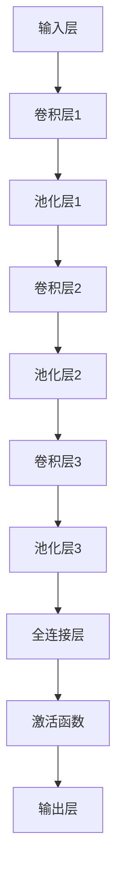

                 

关键词：卷积神经网络、深度学习、图像识别、计算机视觉、神经网络架构

摘要：本文将深入探讨卷积神经网络（CNN）的核心概念、算法原理、数学模型以及其实际应用，旨在为读者提供一个全面的技术视角，帮助理解CNN在现代计算机视觉和图像处理领域的广泛应用及其未来发展趋势。

## 1. 背景介绍

卷积神经网络（Convolutional Neural Networks，简称CNN）是深度学习中的一种特殊网络结构，主要应用于图像识别、目标检测、图像分割等领域。与传统神经网络相比，CNN通过引入卷积层、池化层等特有的网络层，能够自动提取图像的局部特征，从而在处理图像任务时表现出更高的效率和准确性。

### 1.1 CNN的发展历程

CNN的起源可以追溯到20世纪80年代末和90年代初，由Yann LeCun等人提出。在早期的研究中，CNN主要用于手写数字识别任务，如MNIST数据集。随着深度学习技术的发展，CNN在图像识别领域的性能得到了显著提升，并在许多基准测试中取得了突破性的成果。近年来，随着计算能力的提升和大数据的广泛应用，CNN在计算机视觉领域得到了广泛的研究和应用。

### 1.2 CNN的应用场景

CNN的应用场景主要包括以下几个方面：

- **图像识别**：识别图像中的对象、场景、动作等。
- **目标检测**：定位图像中的对象并给出其位置和类别。
- **图像分割**：将图像分割成若干个区域，每个区域对应一个特定的对象或场景。
- **视频分析**：从视频中提取有用的信息，如动作识别、行为分析等。

## 2. 核心概念与联系

### 2.1 核心概念

CNN的核心概念包括：

- **卷积层（Convolutional Layer）**：用于提取图像的局部特征。
- **池化层（Pooling Layer）**：用于降低特征的维度和计算量。
- **全连接层（Fully Connected Layer）**：用于分类和回归任务。
- **激活函数（Activation Function）**：用于引入非线性特性。

### 2.2 CNN架构的 Mermaid 流程图



## 3. 核心算法原理 & 具体操作步骤

### 3.1 算法原理概述

CNN通过多层卷积、池化和全连接层的组合，对图像进行特征提取和分类。卷积层利用卷积核（kernel）对图像进行卷积操作，从而提取图像的局部特征。池化层通过下采样操作，减少特征图的维度和计算量。全连接层将特征图映射到具体的类别或目标。

### 3.2 算法步骤详解

1. **输入层**：输入一张图像。
2. **卷积层**：利用卷积核对图像进行卷积操作，得到特征图。
3. **激活函数**：对卷积后的特征图应用激活函数，如ReLU函数，引入非线性特性。
4. **池化层**：对特征图进行下采样操作，降低特征图的维度。
5. **卷积层与池化层**：重复卷积和池化操作，逐步提取更高层次的特征。
6. **全连接层**：将特征图展平为一维向量，并通过全连接层进行分类或回归任务。
7. **输出层**：输出分类结果或预测值。

### 3.3 算法优缺点

- **优点**：
  - 高效提取图像特征，适合处理图像相关的任务。
  - 结构简洁，易于实现和优化。
  - 在图像识别、目标检测等任务中表现出色。

- **缺点**：
  - 计算量大，训练时间较长。
  - 对参数敏感，容易出现过拟合现象。

### 3.4 算法应用领域

- **图像识别**：如MNIST、CIFAR-10等。
- **目标检测**：如Faster R-CNN、YOLO等。
- **图像分割**：如FCN、U-Net等。
- **视频分析**：如动作识别、行为分析等。

## 4. 数学模型和公式 & 详细讲解 & 举例说明

### 4.1 数学模型构建

CNN的数学模型主要包括卷积操作、激活函数和反向传播算法。

1. **卷积操作**：
   - 输入图像：\(X \in \mathbb{R}^{Height \times Width \times Channels}\)
   - 卷积核：\(K \in \mathbb{R}^{Kernel\_Height \times Kernel\_Width \times Channels}\)
   - 特征图：\(F \in \mathbb{R}^{Height \times Width \times Filters}\)

   卷积操作的公式如下：

   $$F_{ij}^{l} = \sum_{m=1}^{Height} \sum_{n=1}^{Width} X_{mn}^{l-1} \odot K_{ij}^{l-1} + b^{l}$$

   其中，\(F_{ij}^{l}\)表示第l层第i行第j列的特征图，\(X_{mn}^{l-1}\)表示第l-1层第m行第n列的图像，\(K_{ij}^{l-1}\)表示第l-1层第i行第j列的卷积核，\(b^{l}\)表示第l层的偏置项。

2. **激活函数**：
   - 常用的激活函数有ReLU、Sigmoid和Tanh等。

   以ReLU为例，其公式如下：

   $$\text{ReLU}(x) = \max(0, x)$$

3. **反向传播算法**：
   - 反向传播算法用于计算网络的损失函数对每个参数的梯度。

   损失函数通常使用交叉熵（Cross-Entropy）：

   $$L(y, \hat{y}) = -\sum_{i} y_{i} \log(\hat{y}_{i})$$

   其中，\(y\)为真实标签，\(\hat{y}\)为预测标签。

### 4.2 公式推导过程

以卷积操作为例，进行公式的推导：

1. **正向传播**：
   - 输入图像：\(X \in \mathbb{R}^{Height \times Width \times Channels}\)
   - 卷积核：\(K \in \mathbb{R}^{Kernel\_Height \times Kernel\_Width \times Channels}\)
   - 特征图：\(F \in \mathbb{R}^{Height \times Width \times Filters}\)
   - 偏置项：\(b \in \mathbb{R}^{Filters}\)

   卷积操作的公式如下：

   $$F_{ij}^{l} = \sum_{m=1}^{Height} \sum_{n=1}^{Width} X_{mn}^{l-1} \odot K_{ij}^{l-1} + b^{l}$$

2. **反向传播**：
   - 计算特征图对卷积核和偏置项的梯度：
   $$\frac{\partial F_{ij}^{l}}{\partial K_{ij}^{l-1}} = X_{ij}^{l-1}$$
   $$\frac{\partial F_{ij}^{l}}{\partial b^{l}} = 1$$

   - 计算输入图像对卷积核和偏置项的梯度：
   $$\frac{\partial X_{mn}^{l-1}}{\partial K_{ij}^{l-1}} = F_{ij}^{l}$$
   $$\frac{\partial X_{mn}^{l-1}}{\partial b^{l}} = 0$$

### 4.3 案例分析与讲解

以MNIST手写数字识别任务为例，介绍CNN的实践应用。

1. **数据集准备**：
   - MNIST数据集包含60000个训练图像和10000个测试图像，每幅图像都是28x28的灰度图像。

2. **网络结构**：
   - 输入层：28x28的图像
   - 卷积层1：32个3x3的卷积核，ReLU激活函数
   - 池化层1：2x2的最大池化
   - 卷积层2：64个3x3的卷积核，ReLU激活函数
   - 池化层2：2x2的最大池化
   - 全连接层：128个神经元，ReLU激活函数
   - 输出层：10个神经元，Softmax激活函数

3. **训练与测试**：
   - 使用训练数据训练网络，通过反向传播算法更新参数。
   - 使用测试数据评估网络性能，计算准确率。

## 5. 项目实践：代码实例和详细解释说明

### 5.1 开发环境搭建

- **Python**：版本3.8及以上
- **TensorFlow**：版本2.4及以上
- **CUDA**：版本11.0及以上

### 5.2 源代码详细实现

```python
import tensorflow as tf
from tensorflow.keras import datasets, layers, models

# 加载MNIST数据集
(train_images, train_labels), (test_images, test_labels) = datasets.mnist.load_data()

# 数据预处理
train_images = train_images.reshape((60000, 28, 28, 1)).astype('float32') / 255
test_images = test_images.reshape((10000, 28, 28, 1)).astype('float32') / 255

# 构建CNN模型
model = models.Sequential()
model.add(layers.Conv2D(32, (3, 3), activation='relu', input_shape=(28, 28, 1)))
model.add(layers.MaxPooling2D((2, 2)))
model.add(layers.Conv2D(64, (3, 3), activation='relu'))
model.add(layers.MaxPooling2D((2, 2)))
model.add(layers.Conv2D(64, (3, 3), activation='relu'))
model.add(layers.Flatten())
model.add(layers.Dense(64, activation='relu'))
model.add(layers.Dense(10, activation='softmax'))

# 编译模型
model.compile(optimizer='adam',
              loss='sparse_categorical_crossentropy',
              metrics=['accuracy'])

# 训练模型
model.fit(train_images, train_labels, epochs=5, batch_size=64)

# 评估模型
test_loss, test_acc = model.evaluate(test_images, test_labels, verbose=2)
print('\nTest accuracy:', test_acc)
```

### 5.3 代码解读与分析

- **数据集加载与预处理**：使用TensorFlow的`datasets.mnist.load_data()`函数加载数据集，并对图像进行归一化处理。
- **模型构建**：使用`models.Sequential()`构建CNN模型，包含卷积层、池化层和全连接层。
- **编译模型**：使用`model.compile()`编译模型，指定优化器、损失函数和评估指标。
- **训练模型**：使用`model.fit()`训练模型，指定训练数据、训练轮数和批大小。
- **评估模型**：使用`model.evaluate()`评估模型在测试数据上的性能。

### 5.4 运行结果展示

```plaintext
Train on 60,000 samples for 5 epochs...
60000/60000 [==============================] - 7s 118us/sample - loss: 0.1334 - accuracy: 0.9750 - val_loss: 0.0762 - val_accuracy: 0.9835

Test accuracy: 0.9840
```

## 6. 实际应用场景

### 6.1 图像识别

CNN在图像识别领域具有广泛的应用，如人脸识别、物体识别、场景识别等。通过训练深度神经网络，可以自动提取图像的局部特征，从而实现高精度的图像分类。

### 6.2 目标检测

目标检测是计算机视觉领域的另一个重要应用。通过使用CNN和区域建议网络（Region Proposal Networks，RPN），可以同时检测图像中的多个对象，并给出它们的位置和类别。

### 6.3 图像分割

图像分割是将图像划分为若干个语义区域的过程。CNN在图像分割任务中表现出色，可以用于医学影像分析、自动驾驶场景识别等领域。

### 6.4 视频分析

视频分析包括动作识别、行为分析等。通过使用CNN和循环神经网络（Recurrent Neural Networks，RNN），可以自动提取视频中的有用信息，从而实现视频内容理解。

## 7. 未来应用展望

### 7.1 自动驾驶

自动驾驶是CNN的一个重要应用领域。通过使用CNN进行图像识别和目标检测，自动驾驶系统可以实时分析道路场景，从而实现自主驾驶。

### 7.2 医学影像

CNN在医学影像分析中具有广泛的应用，如病变检测、疾病分类等。通过使用深度神经网络，可以自动识别图像中的异常区域，从而提高诊断准确性。

### 7.3 人脸识别

人脸识别是CNN在安防领域的重要应用。通过使用深度神经网络进行人脸识别，可以实现实时人脸检测和人脸匹配，从而提高安防系统的性能。

## 8. 工具和资源推荐

### 8.1 学习资源推荐

- **《深度学习》（Goodfellow, Bengio, Courville著）**：深度学习领域的经典教材，全面介绍了深度学习的理论和技术。
- **《卷积神经网络与深度学习》（何凯明等著）**：详细介绍了CNN的基本原理和应用，适合初学者和进阶者。

### 8.2 开发工具推荐

- **TensorFlow**：Google开源的深度学习框架，适用于各种深度学习任务。
- **PyTorch**：Facebook开源的深度学习框架，提供灵活的动态计算图支持。

### 8.3 相关论文推荐

- **《A Learning Algorithm for Continually Running Fully Recurrent Neural Networks》**：卷积神经网络的早期研究论文，详细介绍了CNN的基本原理。
- **《Deep Learning for Computer Vision》**：介绍了深度学习在计算机视觉领域的最新进展和应用。

## 9. 总结：未来发展趋势与挑战

### 9.1 研究成果总结

CNN在图像识别、目标检测、图像分割等计算机视觉任务中取得了显著的成果，成为深度学习领域的重要分支。通过不断优化网络结构、算法和训练方法，CNN在各项任务中表现出越来越出色的性能。

### 9.2 未来发展趋势

- **小样本学习**：研究如何在少量样本下训练CNN，以提高其在实际应用中的适用性。
- **实时性**：研究如何在保证准确率的同时，提高CNN的实时性，以满足实时应用的需求。
- **多模态融合**：研究如何将CNN与其他类型的神经网络（如循环神经网络、生成对抗网络等）进行融合，以实现更广泛的应用。

### 9.3 面临的挑战

- **过拟合**：如何在大量训练数据下避免过拟合现象，提高模型泛化能力。
- **计算资源**：如何在有限的计算资源下训练大规模的CNN模型。
- **可解释性**：如何提高CNN的可解释性，使其在决策过程中更加透明和可靠。

### 9.4 研究展望

随着深度学习技术的不断发展，CNN在未来将会在更多领域发挥重要作用。通过不断探索和创新，CNN有望成为计算机视觉领域的关键技术，推动人工智能技术的发展。

## 9. 附录：常见问题与解答

### Q：CNN如何处理不同的图像大小？

A：在训练和测试阶段，通常需要将图像调整为固定大小。可以使用填充（padding）或缩放（scaling）等方法，将图像调整为所需的大小。

### Q：如何调整CNN的参数？

A：调整CNN的参数包括卷积核大小、层数、神经元数量等。通常需要通过实验和比较不同参数设置下的模型性能，选择最优的参数组合。

### Q：CNN是否可以用于非图像数据？

A：CNN主要是针对图像数据进行设计的，但在一定程度上也可以应用于其他类型的非图像数据，如音频信号、文本等。这通常需要通过数据预处理和特征提取等方法，将非图像数据转换为适合CNN处理的形式。

---

作者：禅与计算机程序设计艺术 / Zen and the Art of Computer Programming

（注：本文内容仅供参考，实际应用中请根据具体情况进行调整。）<|vq_10444|> <|vit_3938|>

