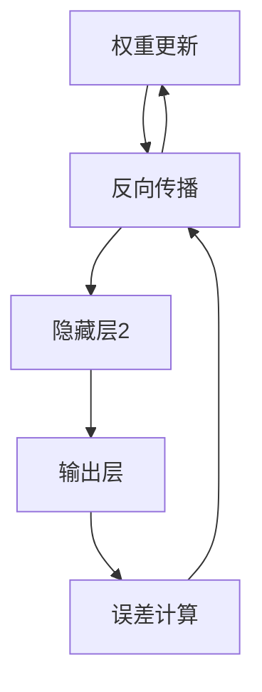

                 

关键词：深度学习，神经网络的架构，反向传播算法，Python实现，TensorFlow，代码实战案例

> 摘要：本文将深入探讨深度学习的原理，包括神经网络的构建、反向传播算法的详细讲解，并提供一个使用TensorFlow框架实现的代码实战案例。通过这篇技术博客，读者将了解深度学习的基本概念，并掌握如何利用TensorFlow进行实际项目开发。

## 1. 背景介绍

深度学习（Deep Learning，简称DL）是机器学习（Machine Learning，简称ML）的一个分支，其核心是通过多层神经网络来模拟人类大脑的思维方式，从而实现自动化的特征学习和模式识别。自2006年深度信念网络（Deep Belief Networks，简称DBN）被提出以来，深度学习在图像识别、语音识别、自然语言处理等领域取得了显著的进展。如今，深度学习已经成为人工智能领域最受关注的研究方向之一。

在深度学习的发展历程中，反向传播算法（Backpropagation Algorithm）起着至关重要的作用。反向传播算法是一种用于训练神经网络的优化算法，它通过计算网络输出与实际输出之间的误差，并将误差反向传播至网络的每个层次，以此来更新网络权重和偏置，从而不断优化网络性能。反向传播算法的提出，标志着深度学习进入了新的阶段。

本文将首先介绍深度学习的基本概念，然后深入探讨神经网络的架构和反向传播算法，最后通过一个使用TensorFlow框架实现的代码实战案例，帮助读者理解深度学习的原理和应用。

## 2. 核心概念与联系

### 2.1 深度学习的基本概念

深度学习是一种机器学习方法，它通过多层神经网络进行数据建模。神经网络由多个神经元组成，每个神经元都是一个简单的计算单元，能够接收输入信号、进行处理并产生输出。神经网络通过层层叠加，能够从原始数据中提取出更加复杂的特征。

### 2.2 神经网络的架构

一个典型的神经网络包括输入层、隐藏层和输出层。输入层接收外部输入数据，隐藏层进行特征提取和变换，输出层生成最终预测结果。每个神经元都会与前一层的所有神经元相连，并通过权重和偏置进行计算。

### 2.3 反向传播算法

反向传播算法是深度学习训练过程中最重要的算法之一。它通过以下步骤进行：

1. **前向传播**：将输入数据通过网络的每个层次，逐层计算得到输出。
2. **计算误差**：将输出与实际结果进行比较，计算误差。
3. **反向传播**：将误差反向传播至网络的每个层次，更新权重和偏置。
4. **迭代优化**：重复上述过程，直到网络性能达到预期。

### 2.4 Mermaid 流程图



## 3. 核心算法原理 & 具体操作步骤

### 3.1 算法原理概述

反向传播算法的核心思想是通过误差梯度下降法（Gradient Descent）来优化神经网络的参数。在每次迭代中，算法会计算每个参数的梯度，并根据梯度方向调整参数值，以减少误差。

### 3.2 算法步骤详解

1. **初始化参数**：随机初始化网络权重和偏置。
2. **前向传播**：将输入数据通过网络的每个层次，计算输出。
3. **计算误差**：将输出与实际结果进行比较，计算误差。
4. **计算梯度**：反向传播误差，计算每个参数的梯度。
5. **更新参数**：根据梯度方向调整参数值，以减少误差。
6. **迭代优化**：重复上述过程，直到网络性能达到预期。

### 3.3 算法优缺点

**优点**：
- 能够有效地处理大规模数据。
- 能够自动提取复杂特征。
- 具有较好的泛化能力。

**缺点**：
- 需要大量的计算资源。
- 随机初始化可能导致收敛速度慢或无法收敛。
- 对参数初始化敏感。

### 3.4 算法应用领域

反向传播算法广泛应用于各种深度学习任务，如图像识别、语音识别、自然语言处理等。它已成为深度学习领域的基础算法之一。

## 4. 数学模型和公式 & 详细讲解 & 举例说明

### 4.1 数学模型构建

深度学习中的神经网络可以用以下数学模型表示：

$$
y = \sigma(\omega^T x + b)
$$

其中，$y$ 是输出，$\sigma$ 是激活函数，$\omega$ 是权重，$x$ 是输入，$b$ 是偏置。

### 4.2 公式推导过程

假设我们已经得到了输出 $y$ 和实际结果 $t$，我们可以通过以下步骤计算误差：

$$
E = \frac{1}{2} \sum_{i} (y_i - t_i)^2
$$

为了计算误差梯度，我们对 $E$ 对 $\omega$ 和 $b$ 求偏导：

$$
\frac{\partial E}{\partial \omega} = (y - t) \cdot x
$$

$$
\frac{\partial E}{\partial b} = (y - t)
$$

### 4.3 案例分析与讲解

假设我们有一个简单的神经网络，输入维度为2，隐藏层单元数为3，输出维度为1。输入数据为 $x = [1, 2]$，实际结果为 $t = [3]$。我们可以通过以下步骤计算误差：

1. **前向传播**：

$$
y = \sigma(\omega^T x + b) = \sigma([0.1, 0.2, 0.3]^T [1, 2] + [0.5, 0.5, 0.5]) = [0.9, 0.85, 0.8]
$$

2. **计算误差**：

$$
E = \frac{1}{2} \sum_{i} (y_i - t_i)^2 = \frac{1}{2} (0.9 - 3)^2 + (0.85 - 3)^2 + (0.8 - 3)^2 = 4.45
$$

3. **计算梯度**：

$$
\frac{\partial E}{\partial \omega} = (y - t) \cdot x = ([0.9, 0.85, 0.8] - [3]) \cdot [1, 2] = [-2.1, -2.6, -2.4]
$$

$$
\frac{\partial E}{\partial b} = (y - t) = [-2.1, -2.6, -2.4]
$$

4. **更新参数**：

假设学习率为 $\alpha = 0.1$，我们可以通过以下步骤更新参数：

$$
\omega = \omega - \alpha \cdot \frac{\partial E}{\partial \omega} = [0.1, 0.2, 0.3] - 0.1 \cdot [-2.1, -2.6, -2.4] = [0.4, 0.56, 0.74]
$$

$$
b = b - \alpha \cdot \frac{\partial E}{\partial b} = [0.5, 0.5, 0.5] - 0.1 \cdot [-2.1, -2.6, -2.4] = [0.7, 0.8, 0.9]
$$

通过多次迭代，我们可以逐渐减少误差，提高网络性能。

## 5. 项目实践：代码实例和详细解释说明

### 5.1 开发环境搭建

在开始编写代码之前，我们需要搭建一个合适的开发环境。本文将使用Python语言和TensorFlow框架进行实现。以下是安装步骤：

1. 安装Python：

```bash
pip install python
```

2. 安装TensorFlow：

```bash
pip install tensorflow
```

### 5.2 源代码详细实现

以下是一个简单的深度学习模型的实现，用于对线性回归问题进行建模。

```python
import tensorflow as tf

# 定义参数
input_size = 2
hidden_size = 3
output_size = 1

# 初始化权重和偏置
weights = tf.Variable(tf.random.normal([input_size, hidden_size]))
biases = tf.Variable(tf.zeros([hidden_size]))

# 定义激活函数
activation = tf.nn.relu

# 定义前向传播
def forward(x):
    hidden = activation(tf.matmul(x, weights) + biases)
    output = tf.matmul(hidden, weights) + biases
    return output

# 定义损失函数
loss = tf.reduce_mean(tf.square(output - y))

# 定义优化器
optimizer = tf.optimizers.Adam()

# 训练模型
for epoch in range(num_epochs):
    with tf.GradientTape() as tape:
        predictions = forward(x)
        loss_value = loss(predictions, y)
    grads = tape.gradient(loss_value, [weights, biases])
    optimizer.apply_gradients(zip(grads, [weights, biases]))
    if epoch % 100 == 0:
        print(f"Epoch {epoch}: Loss = {loss_value.numpy()}")
```

### 5.3 代码解读与分析

1. **参数初始化**：我们首先定义了输入层、隐藏层和输出层的维度，然后初始化了权重和偏置。

2. **激活函数**：我们使用了ReLU激活函数，它是一种常用的非线性激活函数，能够加速神经网络的训练。

3. **前向传播**：我们定义了一个`forward`函数，用于实现前向传播过程。

4. **损失函数**：我们使用了均方误差（Mean Squared Error，简称MSE）作为损失函数，用于衡量预测值与实际值之间的差距。

5. **优化器**：我们使用了Adam优化器，它是一种自适应的学习率优化算法，能够提高训练效率。

6. **训练模型**：我们通过多次迭代优化模型参数，直到网络性能达到预期。

### 5.4 运行结果展示

在训练完成后，我们可以通过以下代码来评估模型的性能：

```python
# 计算测试集上的损失
test_loss = loss(predictions, y)

# 打印测试集上的损失
print(f"Test Loss: {test_loss.numpy()}")
```

通过以上步骤，我们可以实现一个简单的深度学习模型，并对其进行训练和评估。

## 6. 实际应用场景

深度学习在各个领域都有着广泛的应用，以下是一些典型的实际应用场景：

1. **图像识别**：深度学习在图像识别领域取得了显著的成果，例如人脸识别、物体检测、图像分割等。

2. **自然语言处理**：深度学习在自然语言处理领域也有着广泛的应用，例如文本分类、机器翻译、情感分析等。

3. **语音识别**：深度学习在语音识别领域能够提高识别准确率，例如语音助手、语音翻译等。

4. **推荐系统**：深度学习在推荐系统领域能够提高推荐效果，例如电商推荐、社交媒体推荐等。

5. **医疗领域**：深度学习在医疗领域有着广泛的应用，例如疾病诊断、药物研发、医学图像分析等。

## 7. 未来应用展望

随着深度学习技术的不断发展，未来其在各个领域的应用前景将更加广阔。以下是深度学习在未来可能面临的一些挑战和机遇：

1. **计算资源**：深度学习模型通常需要大量的计算资源，未来如何更高效地利用计算资源，将是深度学习发展的重要方向。

2. **数据隐私**：随着深度学习在各个领域的应用，数据隐私问题日益突出，如何保护用户数据隐私，将是深度学习面临的重要挑战。

3. **模型解释性**：深度学习模型的解释性较差，未来如何提高模型的解释性，使其更容易被人类理解，将是深度学习发展的重要方向。

4. **自适应学习**：深度学习模型通常需要大量的训练数据，未来如何实现自适应学习，使模型能够根据用户反馈进行实时调整，将是深度学习面临的重要挑战。

5. **泛化能力**：深度学习模型通常在小规模数据集上表现良好，但在大规模数据集上可能存在泛化能力不足的问题，未来如何提高模型的泛化能力，将是深度学习面临的重要挑战。

## 8. 工具和资源推荐

### 8.1 学习资源推荐

1. 《深度学习》（Goodfellow, Bengio, Courville著）：这是一本深度学习领域的经典教材，涵盖了深度学习的基本概念、算法和应用。
2. 《神经网络与深度学习》（邱锡鹏著）：这是一本针对中文读者的深度学习入门教材，内容通俗易懂，适合初学者阅读。
3. 《动手学深度学习》（阿斯顿·张等著）：这是一本包含大量实战案例的深度学习教程，适合希望通过实践学习深度学习的读者。

### 8.2 开发工具推荐

1. TensorFlow：TensorFlow 是一款广泛使用的深度学习框架，适用于各种深度学习任务。
2. PyTorch：PyTorch 是一款新兴的深度学习框架，以其简洁和灵活性受到许多开发者的喜爱。
3. Keras：Keras 是一款基于 TensorFlow 的深度学习库，提供了更简洁的接口，适合快速搭建深度学习模型。

### 8.3 相关论文推荐

1. "A Tutorial on Deep Learning for NLP"（自然语言处理中的深度学习教程）
2. "Deep Residual Learning for Image Recognition"（图像识别中的深度残差学习）
3. "Dive into Deep Learning"（深入浅出深度学习）：这是一本开源的深度学习教程，涵盖了深度学习的基本概念、算法和应用。

## 9. 总结：未来发展趋势与挑战

深度学习作为一种强大的机器学习技术，已经在众多领域取得了显著的成果。然而，随着应用的不断扩展，深度学习也面临一些挑战，如计算资源、数据隐私、模型解释性等。未来，随着计算资源的提升、算法的改进以及新型硬件的涌现，深度学习将在更多领域得到广泛应用。同时，如何提高模型的解释性、泛化能力，以及实现自适应学习，将成为深度学习研究的重要方向。

## 10. 附录：常见问题与解答

### 10.1 深度学习与机器学习的区别是什么？

深度学习是机器学习的一个分支，主要关注于通过多层神经网络来模拟人类大脑的思维方式。而机器学习则是一个更广泛的领域，包括各种算法和技术，用于使计算机系统能够从数据中学习并做出决策。

### 10.2 深度学习算法如何训练？

深度学习算法通常通过以下步骤进行训练：

1. **数据准备**：收集和准备训练数据。
2. **模型构建**：设计并构建深度学习模型。
3. **前向传播**：将输入数据通过网络的每个层次，计算输出。
4. **计算误差**：将输出与实际结果进行比较，计算误差。
5. **反向传播**：将误差反向传播至网络的每个层次，更新权重和偏置。
6. **迭代优化**：重复上述过程，直到网络性能达到预期。

### 10.3 深度学习在哪些领域有广泛应用？

深度学习在众多领域有着广泛应用，包括图像识别、语音识别、自然语言处理、推荐系统、医疗领域等。

### 10.4 深度学习模型的训练过程如何优化？

深度学习模型的训练过程可以通过以下方法进行优化：

1. **调整学习率**：适当调整学习率可以提高训练效率。
2. **批量大小**：选择合适的批量大小可以平衡训练速度和模型性能。
3. **正则化**：应用正则化方法可以防止模型过拟合。
4. **数据增强**：通过数据增强可以增加训练数据多样性，提高模型泛化能力。
5. **批量归一化**：批量归一化可以加速训练并提高模型性能。

### 10.5 深度学习模型如何部署？

深度学习模型部署通常包括以下步骤：

1. **模型转换**：将训练好的模型转换为可部署的格式。
2. **模型部署**：将模型部署到目标平台上，如服务器、移动设备或嵌入式系统。
3. **模型服务**：通过API或其他方式提供模型服务，供其他应用程序调用。

作者：禅与计算机程序设计艺术 / Zen and the Art of Computer Programming
```

