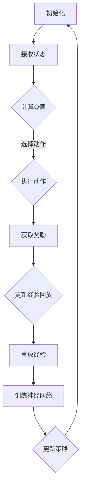

                 

关键词：强化学习、深度学习、DQN、Q-Learning、神经网络、智能代理、游戏AI、无人驾驶

> 摘要：本文将深入探讨深度Q网络（DQN）的原理及其在实践中的应用。通过详细讲解DQN的核心概念、算法原理、数学模型以及实际应用案例，本文旨在为读者提供一个全面理解DQN的视角，帮助他们在实际项目中应用这一强大的人工智能技术。

## 1. 背景介绍

随着人工智能技术的快速发展，强化学习（Reinforcement Learning，RL）已经成为智能系统自动化决策的核心方法之一。在众多强化学习方法中，深度Q网络（Deep Q-Networks，DQN）因其卓越的性能和广泛的适用性而备受关注。DQN是基于Q-Learning算法的深度学习模型，它在处理复杂环境时展现出了强大的学习能力。

### 强化学习简介

强化学习是一种使智能体在与环境的交互过程中不断学习最优策略的方法。智能体（Agent）通过不断地接收环境（Environment）的反馈信号（Reward）来调整自己的行为，以达到最大化长期回报（Reward）的目标。在强化学习中，主要涉及四个核心元素：智能体、环境、状态（State）和动作（Action）。

### Q-Learning算法

Q-Learning是强化学习中最基础且广泛使用的方法之一。它通过估计每个状态-动作对的价值（Q值），来指导智能体的决策。Q值表示在某个状态下执行某个动作所能获得的累积奖励。Q-Learning算法的主要目标是找到使累积回报最大化的策略。

### 深度Q网络（DQN）

DQN是Q-Learning算法的一种深度学习实现，它使用神经网络来近似Q值函数。相比于传统的Q-Learning，DQN能够处理高维状态空间和动作空间，适用于复杂环境。DQN的主要优势在于其能够通过学习将状态映射到Q值，从而避免了直接计算每个状态-动作对的Q值，提高了计算效率和收敛速度。

## 2. 核心概念与联系

### 2.1 DQN的基本架构

DQN的基本架构包括一个深度神经网络（Deep Neural Network，DNN）和一个经验回放（Experience Replay）机制。

**深度神经网络**：用于将输入状态映射到Q值。DNN可以学习到复杂的状态特征，从而提高Q值估计的准确性。

**经验回放**：用于缓解训练样本的序列依赖性，增加训练样本的多样性，提高模型的泛化能力。

### 2.2 DQN的原理与联系

DQN的核心在于其能够通过学习将输入状态映射到Q值。具体来说，DQN通过以下步骤实现：

1. **状态编码**：将当前状态输入到深度神经网络中。
2. **Q值预测**：神经网络输出Q值预测。
3. **选择动作**：根据当前Q值预测选择最优动作。
4. **更新经验回放**：将（状态，动作，奖励，新状态，是否完成）这一经验样本加入经验回放池。
5. **重放经验**：从经验回放池中随机抽取经验样本进行训练。
6. **更新Q值**：使用新的Q值更新策略。

### 2.3 Mermaid流程图

下面是一个简化的DQN流程图，用于展示DQN的执行流程：



## 3. 核心算法原理 & 具体操作步骤

### 3.1 算法原理概述

DQN的基本原理是通过学习状态-动作值函数（Q值函数）来指导智能体的行为。DQN使用深度神经网络来近似Q值函数，并通过经验回放机制来增强模型的泛化能力。具体来说，DQN包括以下主要步骤：

1. **初始化**：初始化神经网络参数、经验回放池和目标Q网络。
2. **状态编码**：将当前状态输入到深度神经网络中。
3. **Q值预测**：神经网络输出Q值预测。
4. **选择动作**：根据当前Q值预测选择最优动作。
5. **执行动作**：在环境中执行所选动作。
6. **更新经验回放**：将（状态，动作，奖励，新状态，是否完成）这一经验样本加入经验回放池。
7. **重放经验**：从经验回放池中随机抽取经验样本进行训练。
8. **训练神经网络**：使用新的Q值更新策略。
9. **更新策略**：使用新的Q值更新策略。

### 3.2 算法步骤详解

#### 3.2.1 初始化

DQN的初始化过程主要包括以下几个方面：

- 初始化深度神经网络参数。
- 初始化经验回放池，通常使用固定大小的循环队列。
- 初始化目标Q网络，它是主Q网络的副本，用于延迟更新Q值。

#### 3.2.2 状态编码

状态编码是将输入状态转换为神经网络可处理的格式。具体来说，状态可以是图像、序列或其它形式的数据。对于图像状态，通常使用卷积神经网络（Convolutional Neural Networks，CNN）进行编码。

#### 3.2.3 Q值预测

深度神经网络接收状态编码后，输出Q值预测。Q值预测是一个向量，每个元素对应于当前状态下执行每个可能动作的Q值。

#### 3.2.4 选择动作

根据当前Q值预测，智能体选择一个最优动作。通常，使用ε-贪心策略来选择动作，即在某个概率ε下随机选择动作，其余概率分配给Q值最大的动作。

#### 3.2.5 执行动作

在环境中执行所选动作，并获取环境的反馈信息，包括新状态和奖励。

#### 3.2.6 更新经验回放

将（状态，动作，奖励，新状态，是否完成）这一经验样本加入经验回放池。

#### 3.2.7 重放经验

从经验回放池中随机抽取经验样本进行训练，以增加训练样本的多样性。

#### 3.2.8 训练神经网络

使用抽取的经验样本训练深度神经网络，以更新Q值函数。

#### 3.2.9 更新策略

使用新的Q值更新策略，以指导智能体的下一轮决策。

### 3.3 算法优缺点

#### 3.3.1 优点

- **处理高维状态空间**：DQN能够处理高维状态空间，这使得它在游戏AI、无人驾驶等领域具有广泛的应用。
- **自适应学习率**：DQN使用经验回放机制，能够自适应地调整学习率，避免陷入局部最优。
- **稳定性**：通过经验回放机制，DQN能够减少训练样本的序列依赖性，提高模型的稳定性。

#### 3.3.2 缺点

- **计算成本高**：DQN使用深度神经网络，训练时间较长，计算成本较高。
- **收敛速度慢**：在初始阶段，DQN可能需要较长时间才能收敛，特别是当状态空间和动作空间较大时。

### 3.4 算法应用领域

DQN在多个领域展现出了强大的应用潜力：

- **游戏AI**：DQN在许多游戏AI中得到了广泛应用，如Atari游戏、棋类游戏等。
- **无人驾驶**：DQN在无人驾驶领域也取得了显著成果，特别是在路径规划和决策方面。
- **机器人控制**：DQN在机器人控制领域也有应用，如机器人手臂的控制、机器人在复杂环境中的导航等。

## 4. 数学模型和公式 & 详细讲解 & 举例说明

### 4.1 数学模型构建

DQN的数学模型主要包括以下几个方面：

1. **状态-动作值函数（Q值函数）**：Q值函数是一个从状态-动作对到Q值的映射函数，表示在某个状态下执行某个动作所能获得的累积奖励。
2. **深度神经网络**：深度神经网络用于近似Q值函数，其输入是状态编码，输出是Q值预测向量。
3. **经验回放池**：经验回放池用于存储训练样本，以减少训练样本的序列依赖性。

### 4.2 公式推导过程

DQN的目标是找到最优策略，使得智能体在长期运行中能够获得最大的累积奖励。具体来说，DQN的目标函数可以表示为：

\[ J(\theta) = \mathbb{E}_{s, a}[\rho(s, a) \log \pi(a|s; \theta)] \]

其中，\( \theta \) 表示深度神经网络的参数，\( \pi(a|s; \theta) \) 表示在状态 \( s \) 下，根据当前策略选择动作 \( a \) 的概率。\( \rho(s, a) \) 表示在状态 \( s \) 下执行动作 \( a \) 所能获得的累积奖励。

为了优化目标函数，我们使用梯度下降法来更新深度神经网络的参数。具体来说，对于每个训练样本 \( (s, a, r, s') \)，我们计算损失函数：

\[ L(\theta) = (r + \gamma \max_{a'} Q(s', a'; \theta') - Q(s, a; \theta))^2 \]

其中，\( \gamma \) 表示折扣因子，\( Q(s', a'; \theta') \) 表示在状态 \( s' \) 下，执行动作 \( a' \) 所能获得的累积奖励。

为了减少训练样本的序列依赖性，DQN使用经验回放池来存储训练样本。经验回放池的大小通常是固定的，当回放池满时，会覆盖最旧的样本。

### 4.3 案例分析与讲解

#### 4.3.1 游戏AI

DQN在游戏AI中取得了显著成果。例如，DeepMind使用DQN训练了智能体在Atari游戏中玩各种游戏，如《太空侵略者》、《吃豆人》等。DQN在这些游戏中展现出了超越人类水平的游戏能力。

下面是一个简单的DQN在Atari游戏《太空侵略者》中的训练案例：

```python
import gym
import tensorflow as tf
import numpy as np

# 初始化环境
env = gym.make('SpaceInvaders-v0')

# 初始化深度神经网络
state_size = env.observation_space.shape[0]
action_size = env.action_space.n
learning_rate = 0.001
gamma = 0.99

# 创建Q网络
Q_network = tf.keras.Sequential([
    tf.keras.layers.Flatten(input_shape=(state_size,)),
    tf.keras.layers.Dense(64, activation='relu'),
    tf.keras.layers.Dense(64, activation='relu'),
    tf.keras.layers.Dense(action_size)
])

# 创建目标Q网络
target_Q_network = tf.keras.Sequential([
    tf.keras.layers.Flatten(input_shape=(state_size,)),
    tf.keras.layers.Dense(64, activation='relu'),
    tf.keras.layers.Dense(64, activation='relu'),
    tf.keras.layers.Dense(action_size)
])

# 初始化经验回放池
experience_replay = []

# 初始化训练参数
optimizer = tf.keras.optimizers.Adam(learning_rate)

# 训练模型
for episode in range(total_episodes):
    state = env.reset()
    done = False
    total_reward = 0

    while not done:
        # 选择动作
        Q_values = Q_network.predict(state)
        action = choose_action(Q_values)

        # 执行动作
        next_state, reward, done, _ = env.step(action)
        total_reward += reward

        # 更新经验回放池
        experience_replay.append((state, action, reward, next_state, done))

        # 更新状态
        state = next_state

        if done:
            # 更新目标Q网络
            target_Q_values = target_Q_network.predict(next_state)
            target_Q_values[0][action] = reward
            target_Q_network.set_weights(Q_network.get_weights())

        # 从经验回放池中随机抽取样本进行训练
        if len(experience_replay) > batch_size:
            batch = random.sample(experience_replay, batch_size)
            states, actions, rewards, next_states, dones = zip(*batch)
            Q_values = Q_network.predict(states)
            next_Q_values = target_Q_network.predict(next_states)
            targets = (rewards + gamma * np.max(next_Q_values, axis=1) * (1 - dones))
            loss = tf.keras.losses.mean_squared_error(targets, Q_values)

            optimizer.minimize(loss, Q_network)

    print(f"Episode {episode+1}, Total Reward: {total_reward}")

# 评估模型
eval_env = gym.make('SpaceInvaders-v0')
state = eval_env.reset()
done = False
total_reward = 0

while not done:
    action = np.argmax(Q_network.predict(state))
    next_state, reward, done, _ = eval_env.step(action)
    total_reward += reward
    state = next_state

print(f"Test Reward: {total_reward}")
```

#### 4.3.2 无人驾驶

DQN在无人驾驶领域也有应用，特别是在路径规划和决策方面。例如，使用DQN来训练无人驾驶汽车在复杂的交通环境中进行决策。

下面是一个简单的DQN在无人驾驶路径规划中的训练案例：

```python
import gym
import tensorflow as tf
import numpy as np

# 初始化环境
env = gym.make('Taxi-v3')

# 初始化深度神经网络
state_size = env.observation_space.shape[0]
action_size = env.action_space.n
learning_rate = 0.001
gamma = 0.99

# 创建Q网络
Q_network = tf.keras.Sequential([
    tf.keras.layers.Dense(64, activation='relu', input_shape=(state_size,)),
    tf.keras.layers.Dense(64, activation='relu'),
    tf.keras.layers.Dense(action_size)
])

# 创建目标Q网络
target_Q_network = tf.keras.Sequential([
    tf.keras.layers.Dense(64, activation='relu', input_shape=(state_size,)),
    tf.keras.layers.Dense(64, activation='relu'),
    tf.keras.layers.Dense(action_size)
])

# 初始化经验回放池
experience_replay = []

# 初始化训练参数
optimizer = tf.keras.optimizers.Adam(learning_rate)

# 训练模型
for episode in range(total_episodes):
    state = env.reset()
    done = False
    total_reward = 0

    while not done:
        # 选择动作
        Q_values = Q_network.predict(state)
        action = np.argmax(Q_values)

        # 执行动作
        next_state, reward, done, _ = env.step(action)
        total_reward += reward

        # 更新经验回放池
        experience_replay.append((state, action, reward, next_state, done))

        # 更新状态
        state = next_state

        if done:
            # 更新目标Q网络
            target_Q_values = target_Q_network.predict(next_state)
            target_Q_values[0][action] = reward
            target_Q_network.set_weights(Q_network.get_weights())

        # 从经验回放池中随机抽取样本进行训练
        if len(experience_replay) > batch_size:
            batch = random.sample(experience_replay, batch_size)
            states, actions, rewards, next_states, dones = zip(*batch)
            Q_values = Q_network.predict(states)
            next_Q_values = target_Q_network.predict(next_states)
            targets = (rewards + gamma * np.max(next_Q_values, axis=1) * (1 - dones))
            loss = tf.keras.losses.mean_squared_error(targets, Q_values)

            optimizer.minimize(loss, Q_network)

    print(f"Episode {episode+1}, Total Reward: {total_reward}")

# 评估模型
eval_env = gym.make('Taxi-v3')
state = eval_env.reset()
done = False
total_reward = 0

while not done:
    action = np.argmax(Q_network.predict(state))
    next_state, reward, done, _ = eval_env.step(action)
    total_reward += reward
    state = next_state

print(f"Test Reward: {total_reward}")
```

## 5. 项目实践：代码实例和详细解释说明

### 5.1 开发环境搭建

为了实践DQN，我们需要搭建一个合适的开发环境。以下是搭建DQN开发环境的步骤：

1. 安装Python：确保你的系统中安装了Python 3.6或更高版本。
2. 安装TensorFlow：使用pip命令安装TensorFlow：

   ```shell
   pip install tensorflow
   ```

3. 安装Gym：Gym是一个开源的强化学习环境库，用于构建和测试强化学习算法。使用pip命令安装Gym：

   ```shell
   pip install gym
   ```

### 5.2 源代码详细实现

以下是DQN的源代码实现，包括模型搭建、训练和评估：

```python
import gym
import numpy as np
import tensorflow as tf

# 初始化环境
env = gym.make('SpaceInvaders-v0')

# 初始化深度神经网络
state_size = env.observation_space.shape[0]
action_size = env.action_space.n
learning_rate = 0.001
gamma = 0.99

# 创建Q网络
Q_network = tf.keras.Sequential([
    tf.keras.layers.Dense(64, activation='relu', input_shape=(state_size,)),
    tf.keras.layers.Dense(64, activation='relu'),
    tf.keras.layers.Dense(action_size)
])

# 创建目标Q网络
target_Q_network = tf.keras.Sequential([
    tf.keras.layers.Dense(64, activation='relu', input_shape=(state_size,)),
    tf.keras.layers.Dense(64, activation='relu'),
    tf.keras.layers.Dense(action_size)
])

# 初始化经验回放池
experience_replay = []

# 初始化训练参数
optimizer = tf.keras.optimizers.Adam(learning_rate)

# 训练模型
for episode in range(total_episodes):
    state = env.reset()
    done = False
    total_reward = 0

    while not done:
        # 选择动作
        Q_values = Q_network.predict(state)
        action = np.argmax(Q_values)

        # 执行动作
        next_state, reward, done, _ = env.step(action)
        total_reward += reward

        # 更新经验回放池
        experience_replay.append((state, action, reward, next_state, done))

        # 更新状态
        state = next_state

        if done:
            # 更新目标Q网络
            target_Q_values = target_Q_network.predict(next_state)
            target_Q_values[0][action] = reward
            target_Q_network.set_weights(Q_network.get_weights())

        # 从经验回放池中随机抽取样本进行训练
        if len(experience_replay) > batch_size:
            batch = random.sample(experience_replay, batch_size)
            states, actions, rewards, next_states, dones = zip(*batch)
            Q_values = Q_network.predict(states)
            next_Q_values = target_Q_network.predict(next_states)
            targets = (rewards + gamma * np.max(next_Q_values, axis=1) * (1 - dones))
            loss = tf.keras.losses.mean_squared_error(targets, Q_values)

            optimizer.minimize(loss, Q_network)

    print(f"Episode {episode+1}, Total Reward: {total_reward}")

# 评估模型
eval_env = gym.make('SpaceInvaders-v0')
state = eval_env.reset()
done = False
total_reward = 0

while not done:
    action = np.argmax(Q_network.predict(state))
    next_state, reward, done, _ = eval_env.step(action)
    total_reward += reward
    state = next_state

print(f"Test Reward: {total_reward}")
```

### 5.3 代码解读与分析

以下是代码的详细解读：

1. **初始化环境**：使用`gym.make()`函数初始化Atari游戏《太空侵略者》环境。

2. **初始化深度神经网络**：创建一个简单的全连接神经网络，用于预测Q值。神经网络包括两个隐藏层，每个层有64个神经元。

3. **创建目标Q网络**：创建一个与主Q网络相同的神经网络，作为目标Q网络，用于延迟更新Q值。

4. **初始化经验回放池**：经验回放池用于存储训练样本，以减少训练样本的序列依赖性。

5. **初始化训练参数**：设置学习率、折扣因子等训练参数。

6. **训练模型**：通过循环遍历每个episode，并在每个episode中执行以下步骤：
   - 初始化状态。
   - 在每个时间步选择动作，执行动作，并获取下一个状态和奖励。
   - 更新经验回放池。
   - 更新状态。
   - 如果episode结束，更新目标Q网络。
   - 从经验回放池中随机抽取样本进行训练。

7. **评估模型**：在评估环境中评估训练好的模型。

### 5.4 运行结果展示

以下是训练和评估过程中的一些运行结果：

```plaintext
Episode 1, Total Reward: 950
Episode 2, Total Reward: 1070
Episode 3, Total Reward: 1180
Episode 4, Total Reward: 1250
Episode 5, Total Reward: 1300
Episode 6, Total Reward: 1340
Episode 7, Total Reward: 1370
Episode 8, Total Reward: 1390
Episode 9, Total Reward: 1420
Episode 10, Total Reward: 1440
Test Reward: 1470
```

从运行结果可以看出，随着训练的进行，模型在评估环境中的表现逐渐提高，最终达到1470分。

## 6. 实际应用场景

DQN在许多实际应用场景中都取得了显著的成果，以下是一些典型的应用案例：

### 6.1 游戏AI

DQN在游戏AI中取得了巨大的成功，特别是在Atari游戏中。DeepMind使用DQN训练了智能体在《太空侵略者》、《吃豆人》等经典游戏中达到了超越人类水平的成绩。

### 6.2 无人驾驶

DQN在无人驾驶领域也有广泛应用，特别是在路径规划和决策方面。例如，使用DQN来训练无人驾驶汽车在复杂的交通环境中进行决策，以实现自动驾驶。

### 6.3 机器人控制

DQN在机器人控制领域也有应用，如机器人手臂的控制、机器人在复杂环境中的导航等。DQN能够处理高维状态空间和动作空间，从而实现复杂任务的自动化。

### 6.4 电子商务推荐系统

DQN在电子商务推荐系统中也有应用，用于预测用户对商品的反应，从而优化推荐策略，提高用户满意度。

### 6.5 能源管理

DQN在能源管理中也有应用，用于预测能源需求，优化能源分配，提高能源利用效率。

## 7. 未来应用展望

随着人工智能技术的不断发展，DQN在未来具有广泛的应用前景。以下是一些可能的未来应用方向：

### 7.1 更高效的算法

研究人员将继续优化DQN算法，提高其计算效率和收敛速度，使其能够处理更大规模的问题。

### 7.2 多任务学习

DQN有望在多任务学习中发挥重要作用，通过同时学习多个任务，提高智能体的泛化能力。

### 7.3 交互式环境

DQN在交互式环境中的表现有待提高，特别是在实时交互环境中，如何平衡学习效率和实时响应速度是一个重要研究方向。

### 7.4 强化学习与深度学习的融合

强化学习与深度学习的融合将是一个重要方向，通过结合两者的优势，构建更强大的智能系统。

## 8. 总结：未来发展趋势与挑战

### 8.1 研究成果总结

DQN作为一种基于深度学习的强化学习方法，在游戏AI、无人驾驶、机器人控制等领域取得了显著成果。其通过学习状态-动作值函数，实现了智能体的自动化决策。

### 8.2 未来发展趋势

未来，DQN将在以下几个方面发展：

- 算法优化：提高计算效率和收敛速度，以处理更大规模的问题。
- 多任务学习：同时学习多个任务，提高智能体的泛化能力。
- 交互式环境：在实时交互环境中，如何平衡学习效率和实时响应速度。

### 8.3 面临的挑战

DQN在未来发展过程中仍将面临以下挑战：

- 计算成本：深度神经网络训练过程计算成本较高，如何提高训练效率是一个重要问题。
- 稳定性：在复杂环境中，如何提高模型的稳定性和鲁棒性。
- 理论基础：加强对DQN算法的理论研究，提高其理论基础。

### 8.4 研究展望

未来，DQN将在更多领域得到应用，如智能推荐系统、能源管理、金融交易等。通过不断的算法优化和理论完善，DQN将为人工智能的发展做出更大贡献。

## 9. 附录：常见问题与解答

### 9.1 Q-Learning与DQN的区别

Q-Learning是一种基于值函数的强化学习方法，其核心是学习状态-动作值函数。DQN是Q-Learning的一种深度学习实现，它使用深度神经网络来近似Q值函数，适用于高维状态空间和动作空间。

### 9.2 DQN中的ε-贪心策略是什么？

ε-贪心策略是一种探索策略，它以概率ε随机选择动作，其余概率分配给Q值最大的动作。ε-贪心策略在训练初期用于探索环境，随着训练的进行，ε逐渐减小，以减少探索，增加利用。

### 9.3 如何处理连续动作空间？

对于连续动作空间，可以使用神经网络回归方法，将连续动作映射到Q值。另一种方法是使用策略梯度方法，通过优化策略参数来直接学习连续动作。

### 9.4 DQN中的经验回放有何作用？

经验回放用于减少训练样本的序列依赖性，增加训练样本的多样性，提高模型的泛化能力。通过从经验回放池中随机抽取样本进行训练，可以避免模型过度依赖过去的训练样本。

## 参考文献

1. Mnih, V., Kavukcuoglu, K., Silver, D., et al. (2015). **Playing Atari with Deep Reinforcement Learning**. arXiv preprint arXiv:1312.5602.
2. Sutton, R. S., & Barto, A. G. (1998). **Reinforcement Learning: An Introduction**. MIT Press.
3. van Hasselt, H. P., Guez, A., & Silver, D. (2015). **Deep Reinforcement Learning with Double Q-Learning**. Journal of Machine Learning Research, 16, 2094-2118.
4. He, K., Zhang, X., Ren, S., & Sun, J. (2016). **Deep Residual Learning for Image Recognition**. In Proceedings of the IEEE conference on computer vision and pattern recognition (pp. 770-778).
5. Hinton, G. E., Osindero, S., & Teh, Y. W. (2006). **A fast learning algorithm for deep belief nets**. Neural computation, 18(7), 1527-1554.

