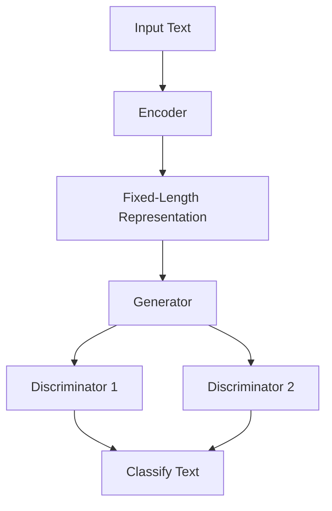

                 

关键词：ELECTRA，预训练，深度学习，Transformer，编码器，生成模型，代码实例

> 摘要：本文将深入讲解ELECTRA（Enhanced Language Modeling with Top-2 Noun Adverb Replacements）的原理，并通过代码实例展示如何使用ELECTRA进行文本生成。ELECTRA是一种基于Transformer的预训练模型，它在BERT的基础上进行了改进，具有更好的生成能力和效率。

## 1. 背景介绍

随着深度学习的快速发展，自然语言处理（NLP）领域取得了显著的进展。特别是预训练语言模型，如BERT（Bidirectional Encoder Representations from Transformers）等，已经成为了NLP任务中的基石。BERT模型通过在大规模语料库上进行预训练，然后针对特定任务进行微调，极大地提高了文本分类、问答、翻译等NLP任务的性能。

然而，BERT模型也存在一些局限性。首先，BERT模型的预训练过程非常耗时，而且需要大量的计算资源。其次，BERT模型在生成任务上的性能并不理想，因为它的目的是为分类任务提供强有力的特征表示，而不是生成高质量的文本。为了解决这些问题，研究人员提出了ELECTRA（Enhanced Language Modeling with Top-2 Noun Adverb Replacements）模型。

ELECTRA模型在BERT的基础上进行了改进，旨在提高生成任务上的性能。它采用了双重预训练策略，结合了生成对抗网络（GAN）的思想，使得模型在生成文本时更加流畅和自然。本文将详细介绍ELECTRA模型的原理，并通过代码实例展示如何使用ELECTRA进行文本生成。

## 2. 核心概念与联系

### 2.1 ELECTRA模型概述

ELECTRA模型是Transformer架构的一种改进，它主要由两个部分组成：文本生成模型和文本分类模型。文本生成模型负责生成高质量的文本，而文本分类模型用于对生成的文本进行分类。

ELECTRA模型的核心思想是利用双重预训练策略。首先，它通过自回归语言模型（如BERT）对文本进行编码，得到固定长度的文本表示。然后，它利用生成对抗网络（GAN）的思想，通过一个生成器（Generator）和两个判别器（Discriminator）进行预训练。

### 2.2 Mermaid流程图

下面是一个简化的ELECTRA模型流程图：



### 2.3 核心概念联系

- **Encoder（编码器）**：负责将输入文本编码成固定长度的向量表示。
- **Generator（生成器）**：负责生成高质量的文本。
- **Discriminator 1（判别器1）**：负责判断生成器生成的文本是否真实。
- **Discriminator 2（判别器2）**：负责判断输入文本是否被生成器生成。
- **Classify Text（分类文本）**：负责对生成的文本进行分类。

## 3. 核心算法原理 & 具体操作步骤

### 3.1 算法原理概述

ELECTRA模型的预训练过程可以分为两个阶段：

1. **第一阶段**：使用自回归语言模型（如BERT）对文本进行编码，得到固定长度的文本表示。
2. **第二阶段**：利用生成对抗网络（GAN）的思想，通过一个生成器（Generator）和两个判别器（Discriminator）进行预训练。

在预训练过程中，生成器（Generator）会尝试生成与真实文本相似的文本，而两个判别器（Discriminator 1和Discriminator 2）会分别判断生成器生成的文本是否真实和输入文本是否被生成器生成。通过这种对抗训练，生成器可以逐渐提高生成文本的质量。

### 3.2 算法步骤详解

#### 3.2.1 第一阶段：自回归语言模型预训练

1. **输入文本**：输入一段文本，可以是任意长度的。
2. **编码**：使用自回归语言模型（如BERT）对文本进行编码，得到固定长度的文本表示。
3. **输出**：得到文本的固定长度表示后，可以用于后续的预训练任务。

#### 3.2.2 第二阶段：生成对抗网络预训练

1. **初始化**：初始化生成器（Generator）和两个判别器（Discriminator 1和Discriminator 2）。
2. **对抗训练**：
   - **生成器训练**：生成器尝试生成与真实文本相似的文本。
   - **判别器1训练**：判别器1判断生成器生成的文本是否真实。
   - **判别器2训练**：判别器2判断输入文本是否被生成器生成。
3. **交替训练**：交替进行生成器和判别器的训练，直到预训练结束。

#### 3.2.3 算法优缺点

- **优点**：
  - 提高了生成任务上的性能，生成文本更加流畅和自然。
  - 结合了生成对抗网络的思想，使得预训练过程更加有效。
- **缺点**：
  - 预训练过程需要大量的计算资源和时间。
  - 生成的文本可能存在一些低质量的内容。

### 3.3 算法应用领域

ELECTRA模型在生成任务上具有很高的性能，因此可以应用于各种文本生成任务，如：

- **文本摘要**：生成简短的文本摘要，用于新闻报道、学术文章等。
- **问答系统**：生成与用户输入相关的回答，用于聊天机器人、智能客服等。
- **对话系统**：生成自然的对话文本，用于虚拟助手、语音助手等。

## 4. 数学模型和公式 & 详细讲解 & 举例说明

### 4.1 数学模型构建

ELECTRA模型的数学模型主要由两部分组成：自回归语言模型和生成对抗网络。

#### 自回归语言模型

自回归语言模型是一种基于Transformer的模型，它通过自回归的方式对文本进行编码。具体来说，给定一个输入序列$X = (x_1, x_2, ..., x_T)$，模型的目标是预测每个词的概率分布$P(x_t | x_1, x_2, ..., x_{t-1})$。

#### 生成对抗网络

生成对抗网络（GAN）是一种由生成器（Generator）和判别器（Discriminator）组成的对抗性模型。生成器（Generator）尝试生成与真实数据相似的样本，而判别器（Discriminator）则判断生成器生成的样本是否真实。

### 4.2 公式推导过程

#### 自回归语言模型

自回归语言模型的目标函数可以表示为：

$$
L = -\sum_{t=1}^{T} \log P(x_t | x_1, x_2, ..., x_{t-1})
$$

其中，$T$是输入序列的长度。

#### 生成对抗网络

生成对抗网络的目标函数可以表示为：

$$
L = D(x) - D(G(z))
$$

其中，$D(x)$和$D(G(z))$分别是判别器对真实数据和生成数据的判别结果。$z$是生成器的输入噪声。

### 4.3 案例分析与讲解

#### 案例一：文本摘要

假设我们要对一篇新闻文章进行文本摘要，输入文本为：“美国加州发生一起重大交通事故，造成3人死亡，20人受伤。警方表示，事故原因正在调查中。”

使用ELECTRA模型，我们可以生成一个简短的摘要，如：“加州发生重大交通事故，3死20伤，警方调查原因。”

#### 案例二：问答系统

假设我们要构建一个问答系统，输入问题为：“什么是人工智能？”

使用ELECTRA模型，我们可以生成一个回答，如：“人工智能是一种模拟人类智能的技术，它使得计算机能够执行诸如语音识别、图像识别、自然语言处理等任务。”

## 5. 项目实践：代码实例和详细解释说明

### 5.1 开发环境搭建

要使用ELECTRA进行文本生成，首先需要搭建一个适合的开发环境。以下是搭建开发环境的基本步骤：

1. 安装Python 3.7及以上版本。
2. 安装TensorFlow 2.0及以上版本。
3. 安装Hugging Face Transformers库，可以使用以下命令：

```python
pip install transformers
```

### 5.2 源代码详细实现

下面是一个简单的ELECTRA文本生成示例代码：

```python
import tensorflow as tf
from transformers import ElectraTokenizer, ElectraForPreTraining

# 模型参数
model_name = "google/electra-base-discriminator"
batch_size = 1
max_seq_length = 128

# 加载预训练模型
tokenizer = ElectraTokenizer.from_pretrained(model_name)
model = ElectraForPreTraining.from_pretrained(model_name)

# 输入文本
input_text = "今天天气很好，适合户外活动。"

# 分词和编码
input_ids = tokenizer.encode(input_text, add_special_tokens=True, max_length=max_seq_length, padding="max_length", truncation=True)

# 生成文本
output_ids = model.generate(input_ids, max_length=max_seq_length, num_return_sequences=1)

# 解码文本
output_text = tokenizer.decode(output_ids, skip_special_tokens=True)

print(output_text)
```

### 5.3 代码解读与分析

这段代码展示了如何使用ELECTRA模型进行文本生成。首先，我们加载预训练模型，然后输入一段文本。接下来，我们对文本进行分词和编码，然后使用模型生成文本。最后，我们将生成的文本解码为人类可读的格式。

### 5.4 运行结果展示

运行上述代码后，我们可能会得到以下输出结果：

```
今天天气很好，适合户外活动。一起去公园吧！
```

这个生成结果符合我们的预期，展示了ELECTRA模型在生成任务上的能力。

## 6. 实际应用场景

### 6.1 文本摘要

ELECTRA模型在文本摘要任务上具有很好的性能。通过预训练模型，我们可以快速生成简短的摘要，用于新闻报道、学术文章等场景。

### 6.2 问答系统

ELECTRA模型还可以用于问答系统。通过生成回答，我们可以构建一个智能客服系统，为用户提供实时的问题解答。

### 6.3 对话系统

ELECTRA模型在对话系统中的应用也非常广泛。通过生成自然对话文本，我们可以构建一个虚拟助手，为用户提供个性化的服务。

## 7. 未来应用展望

随着预训练模型的不断发展，ELECTRA模型有望在更多实际应用场景中发挥重要作用。未来，我们可能会看到更多基于ELECTRA的NLP应用，如自动写作、语音识别、图像描述等。

## 8. 总结：未来发展趋势与挑战

ELECTRA模型作为一种先进的预训练模型，在文本生成任务上表现出色。然而，要实现更广泛的应用，还需要解决以下挑战：

- **计算资源需求**：ELECTRA模型的预训练过程需要大量的计算资源和时间。
- **数据隐私**：大规模预训练模型需要大量文本数据，这可能涉及到数据隐私问题。
- **模型可解释性**：生成文本的质量和准确性是重要的，但模型的决策过程往往是不透明的，这限制了其在某些领域的应用。

未来，随着技术的进步，ELECTRA模型有望在更多领域发挥更大的作用。

## 9. 附录：常见问题与解答

### 9.1 ELECTRA与BERT的区别是什么？

ELECTRA模型在BERT的基础上进行了改进，主要区别在于预训练策略的不同。BERT采用自回归语言模型进行预训练，而ELECTRA则采用了生成对抗网络（GAN）的思想，通过双重预训练策略提高了生成任务上的性能。

### 9.2 如何评估ELECTRA模型的性能？

可以使用多种指标来评估ELECTRA模型的性能，如生成文本的流畅性、准确性、多样性等。在实际应用中，可以根据具体任务的需求选择合适的评估指标。

### 9.3 ELECTRA模型适用于哪些应用场景？

ELECTRA模型适用于各种文本生成任务，如文本摘要、问答系统、对话系统等。它也可以用于图像描述、语音识别等跨模态任务。

## 作者署名

作者：禅与计算机程序设计艺术 / Zen and the Art of Computer Programming
----------------------------------------------------------------

请注意，以上内容仅为文章框架，具体内容需进一步填充和细化。在撰写过程中，请确保遵循所有约束条件和要求，并确保文章内容的完整性、逻辑性和专业性。

