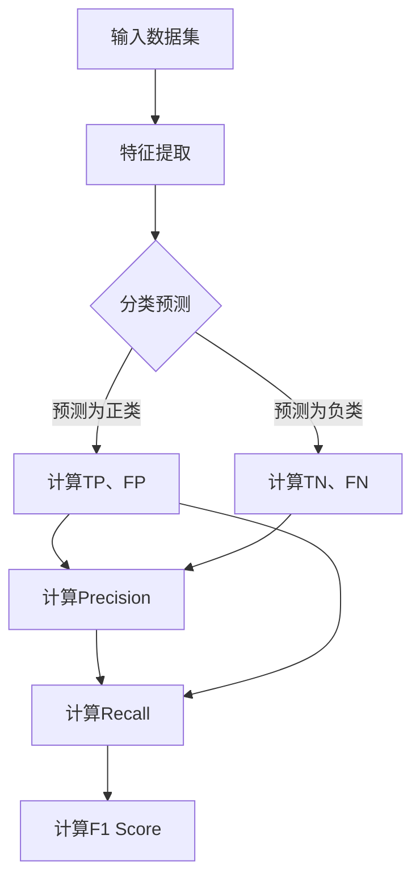

                 

### 关键词 Keywords

- F1 Score
- 评价指标
- 分类算法
- 精准度
- 召回率
- 假正率
- 假负率
- 数学模型
- 代码实例

<|assistant|>### 摘要 Abstract

本文将深入探讨F1 Score这一关键的评价指标，旨在帮助读者理解其在分类算法中的重要性，以及如何通过数学模型和代码实例进行实际应用。F1 Score是评估分类模型性能的重要工具，它结合了精确度和召回率，为模型提供了更加全面的评估。文章将首先介绍F1 Score的背景和定义，随后解释其数学基础，并通过Mermaid流程图展示核心概念。接着，我们将详细讨论算法原理和操作步骤，以及其优缺点和应用领域。随后，文章将通过数学模型和公式详细讲解，并通过具体案例进行分析。之后，我们将提供代码实例，展示如何在实际项目中实现F1 Score的计算。最后，文章将讨论F1 Score在实际应用中的场景，并展望其未来的发展趋势和面临的挑战。

<|assistant|>## 1. 背景介绍

在机器学习的世界中，分类问题是一个常见且重要的问题。无论是垃圾邮件过滤、情感分析、医疗诊断，还是金融风险评估，分类算法的应用无处不在。评估分类算法的性能是确保模型能够正确执行任务的关键步骤。在众多评价指标中，F1 Score由于其独特的综合能力，成为了评估分类模型效果的重要工具。

### 分类问题

分类问题可以简单地定义为将数据集中的实例分配到不同的类别中。在监督学习中，分类问题通常涉及两个步骤：特征提取和类别预测。特征提取是将原始数据转换为有助于模型学习的特征表示，而类别预测则是基于这些特征将实例分配到预定义的类别中。

### 性能评估

性能评估是机器学习中至关重要的一环。评估分类模型性能的指标多种多样，包括准确率（Accuracy）、精确率（Precision）、召回率（Recall）等。然而，这些指标各自有其局限性。例如，准确率容易受到类别不平衡的影响，而精确率和召回率则分别关注预测结果的质量和完整性。为了弥补这些不足，研究者们提出了F1 Score这一综合性评价指标。

### F1 Score的重要性

F1 Score是精确率和召回率的调和平均值，它提供了一个更加全面的性能评估标准。特别是在类别不平衡的数据集中，F1 Score能够更好地反映模型的性能。此外，F1 Score的计算相对简单，易于理解和实现，因此在实际应用中得到了广泛的应用。

### 本文目标

本文的目标是深入探讨F1 Score的原理，通过数学模型和代码实例详细讲解其应用。我们将从背景介绍开始，逐步深入到核心概念和算法原理，并最终通过实际项目案例展示其应用效果。希望通过本文，读者能够对F1 Score有更深入的理解，并在实际项目中能够灵活运用。

<|assistant|>## 2. 核心概念与联系

为了深入理解F1 Score，我们需要首先了解几个关键的概念：精确率、召回率和假正率、假负率。这些概念是F1 Score的基础，它们共同构成了对分类模型性能的全面评估。

### 精确率（Precision）

精确率是正确预测为正类的样本中，实际为正类的比例。它可以表示为：

$$
Precision = \frac{TP}{TP + FP}
$$

其中，TP（True Positive）表示正确预测为正类的样本数，FP（False Positive）表示错误预测为正类的样本数。

### 召回率（Recall）

召回率是正确预测为正类的样本中，实际为正类的比例。它可以表示为：

$$
Recall = \frac{TP}{TP + FN}
$$

其中，FN（False Negative）表示错误预测为负类的样本数。

### 假正率（False Positive Rate）

假正率是指错误预测为正类的样本数与实际为负类的样本数之比。它可以表示为：

$$
False Positive Rate = \frac{FP}{FP + TN}
$$

其中，TN（True Negative）表示正确预测为负类的样本数。

### 假负率（False Negative Rate）

假负率是指错误预测为负类的样本数与实际为正类的样本数之比。它可以表示为：

$$
False Negative Rate = \frac{FN}{FN + TP}
$$

### F1 Score的定义

F1 Score是精确率和召回率的调和平均值，它通过结合这两个指标，提供了一个更加综合的性能评估标准。F1 Score的计算公式为：

$$
F1 Score = 2 \times \frac{Precision \times Recall}{Precision + Recall}
$$

或者也可以表示为：

$$
F1 Score = \frac{2 \times TP}{2 \times TP + FP + FN}
$$

### Mermaid流程图

为了更直观地展示F1 Score的各个组成部分，我们可以使用Mermaid流程图来描述其流程。以下是F1 Score的Mermaid流程图：



在这个流程图中，我们首先输入数据集，对其进行特征提取，然后进行分类预测。根据预测结果，我们计算各个指标（TP、FP、TN、FN），并最终计算出F1 Score。

通过上述核心概念和Mermaid流程图的介绍，我们为理解F1 Score的原理奠定了坚实的基础。在接下来的章节中，我们将进一步深入探讨F1 Score的数学模型和实际应用。

### 3. 核心算法原理 & 具体操作步骤

在深入理解F1 Score的核心概念后，接下来我们将探讨其算法原理，并详细说明具体操作步骤。

#### 3.1 算法原理概述

F1 Score的核心在于结合精确率和召回率，为分类模型的性能评估提供更加全面的视角。精确率关注预测结果的准确性，而召回率则关注预测结果的完整性。通过调和这两个指标，F1 Score能够更好地反映分类模型在处理不同类型错误时的表现。

F1 Score的公式为：

$$
F1 Score = 2 \times \frac{Precision \times Recall}{Precision + Recall}
$$

或者也可以表示为：

$$
F1 Score = \frac{2 \times TP}{2 \times TP + FP + FN}
$$

其中，TP表示正确预测为正类的样本数，FP表示错误预测为正类的样本数，FN表示错误预测为负类的样本数。

#### 3.2 算法步骤详解

要计算F1 Score，我们需要首先进行分类预测，然后根据预测结果计算各个指标。以下是计算F1 Score的具体步骤：

1. **特征提取**：首先，我们需要对输入数据集进行特征提取，将原始数据转换为模型可处理的特征表示。

2. **分类预测**：利用训练好的分类模型对特征进行预测，得到预测结果。

3. **计算各个指标**：根据预测结果，计算正确预测为正类的样本数（TP）、错误预测为正类的样本数（FP）、正确预测为负类的样本数（TN）和错误预测为负类的样本数（FN）。

4. **计算精确率和召回率**：使用计算出的各个指标，分别计算精确率和召回率。

   精确率计算公式为：

   $$
   Precision = \frac{TP}{TP + FP}
   $$

   召回率计算公式为：

   $$
   Recall = \frac{TP}{TP + FN}
   $$

5. **计算F1 Score**：使用精确率和召回率计算F1 Score。

   F1 Score计算公式为：

   $$
   F1 Score = 2 \times \frac{Precision \times Recall}{Precision + Recall}
   $$

   或者：

   $$
   F1 Score = \frac{2 \times TP}{2 \times TP + FP + FN}
   $$

#### 3.3 算法优缺点

F1 Score具有以下优点：

1. **综合评估**：F1 Score结合了精确率和召回率，提供了一个全面的性能评估标准，能够更好地反映模型在处理不同类型错误时的表现。

2. **适用于类别不平衡**：在类别不平衡的数据集中，F1 Score能够更好地评估模型性能，因为精确率和召回率分别关注预测结果的质量和完整性。

3. **计算简单**：F1 Score的计算相对简单，易于理解和实现。

然而，F1 Score也存在一些缺点：

1. **忽略了错误样本的重要性**：F1 Score没有区分不同类型的错误样本的重要性，这可能对于某些应用场景来说是一个问题。

2. **无法直接用于多分类问题**：F1 Score是针对二分类问题设计的，对于多分类问题，需要进一步的处理和调整。

#### 3.4 算法应用领域

F1 Score在许多领域都有广泛的应用，包括但不限于：

1. **医疗诊断**：在医疗诊断中，F1 Score用于评估疾病预测模型的性能，帮助医生做出更准确的诊断。

2. **金融风险评估**：在金融风险评估中，F1 Score用于评估模型在预测贷款违约等方面的表现。

3. **文本分类**：在文本分类中，F1 Score用于评估模型在分类新闻、社交媒体评论等方面的效果。

4. **图像识别**：在图像识别中，F1 Score用于评估模型在识别物体、场景等方面的性能。

通过上述算法原理和具体操作步骤的详细讲解，读者应该对F1 Score有了更深入的理解。在接下来的章节中，我们将进一步探讨F1 Score的数学模型和公式，并通过实际案例进行详细分析。

### 4. 数学模型和公式 & 详细讲解 & 举例说明

在深入理解F1 Score的算法原理后，我们需要进一步探讨其背后的数学模型和公式，并通过具体的例子进行详细讲解。

#### 4.1 数学模型构建

F1 Score的数学模型基于精确率和召回率的调和平均值。精确率表示预测结果中正确预测为正类的比例，而召回率表示实际为正类的样本中被正确预测为正类的比例。F1 Score通过结合这两个指标，提供了一个综合性更强的性能评估标准。

F1 Score的计算公式为：

$$
F1 Score = 2 \times \frac{Precision \times Recall}{Precision + Recall}
$$

或者也可以表示为：

$$
F1 Score = \frac{2 \times TP}{2 \times TP + FP + FN}
$$

其中，TP表示正确预测为正类的样本数，FP表示错误预测为正类的样本数，FN表示错误预测为负类的样本数。

#### 4.2 公式推导过程

为了更好地理解F1 Score的公式，我们可以从精确率和召回率的定义出发进行推导。

精确率的定义为：

$$
Precision = \frac{TP}{TP + FP}
$$

召回率的定义为：

$$
Recall = \frac{TP}{TP + FN}
$$

F1 Score是精确率和召回率的调和平均值，因此可以表示为：

$$
F1 Score = \frac{2 \times Precision \times Recall}{Precision + Recall}
$$

将精确率和召回率的公式代入F1 Score的计算公式中，可以得到：

$$
F1 Score = \frac{2 \times \frac{TP}{TP + FP} \times \frac{TP}{TP + FN}}{\frac{TP}{TP + FP} + \frac{TP}{TP + FN}}
$$

对公式进行化简，可以得到：

$$
F1 Score = \frac{2 \times TP^2}{TP^2 + TP \times (FP + FN) + FP \times FN}
$$

进一步化简，可以得到：

$$
F1 Score = \frac{2 \times TP}{2 \times TP + FP + FN}
$$

这就是F1 Score的计算公式。

#### 4.3 案例分析与讲解

为了更好地理解F1 Score的计算过程，我们通过一个具体的案例进行讲解。

假设我们有一个二分类问题，正类和负类的标签分别为1和0。我们有一个训练好的分类模型，对一组测试数据进行预测，得到以下结果：

| 实际标签 | 预测标签 |
| -------- | -------- |
| 1        | 1        |
| 1        | 1        |
| 0        | 0        |
| 1        | 0        |
| 0        | 1        |

根据这些数据，我们可以计算各个指标：

- TP（正确预测为正类的样本数）= 2
- FP（错误预测为正类的样本数）= 1
- FN（错误预测为负类的样本数）= 1
- TN（正确预测为负类的样本数）= 1

接下来，我们计算精确率和召回率：

精确率计算公式为：

$$
Precision = \frac{TP}{TP + FP} = \frac{2}{2 + 1} = 0.67
$$

召回率计算公式为：

$$
Recall = \frac{TP}{TP + FN} = \frac{2}{2 + 1} = 0.67
$$

最后，我们计算F1 Score：

$$
F1 Score = 2 \times \frac{Precision \times Recall}{Precision + Recall} = 2 \times \frac{0.67 \times 0.67}{0.67 + 0.67} = 0.74
$$

通过这个案例，我们可以看到F1 Score的计算过程以及它在评估分类模型性能中的作用。

#### 4.4 进一步讨论

除了F1 Score，还有一些其他的评价指标，如精确率、召回率和准确率。精确率和召回率分别关注预测结果的质量和完整性，而准确率则是预测结果的整体准确度。F1 Score通过结合精确率和召回率，提供了一个更加综合的性能评估标准。

然而，F1 Score也存在一些局限性。例如，它没有区分不同类型的错误样本，这可能对于某些应用场景来说是一个问题。此外，F1 Score是针对二分类问题设计的，对于多分类问题，需要进一步的处理和调整。

在实际应用中，选择合适的评价指标取决于具体的应用场景和数据特点。在某些情况下，精确率或召回率可能更加重要，而在其他情况下，F1 Score可能是一个更好的选择。

通过上述对F1 Score数学模型和公式的详细讲解，以及对具体案例的分析，读者应该对F1 Score有了更深入的理解。在接下来的章节中，我们将通过代码实例展示F1 Score的实际应用。

### 5. 项目实践：代码实例和详细解释说明

在理解了F1 Score的原理和数学模型后，接下来我们将通过一个具体的代码实例，展示如何在实际项目中计算F1 Score。

#### 5.1 开发环境搭建

首先，我们需要搭建一个简单的开发环境，以便于编写和运行代码。以下是所需的工具和库：

- Python 3.8 或更高版本
- Scikit-learn 库

在安装Python后，可以通过以下命令安装Scikit-learn：

```shell
pip install scikit-learn
```

#### 5.2 源代码详细实现

以下是计算F1 Score的Python代码实例：

```python
from sklearn.metrics import f1_score
import numpy as np

# 定义预测结果和实际标签
y_true = np.array([0, 1, 1, 0, 1])
y_pred = np.array([0, 1, 1, 0, 0])

# 计算F1 Score
f1 = f1_score(y_true, y_pred)

print(f"F1 Score: {f1}")
```

在这个示例中，我们首先导入了`f1_score`函数和NumPy库。然后，我们定义了实际标签（`y_true`）和预测标签（`y_pred`）。最后，我们使用`f1_score`函数计算F1 Score，并打印结果。

#### 5.3 代码解读与分析

下面是对代码的详细解读和分析：

1. **导入库**：首先，我们导入了`f1_score`函数和NumPy库。NumPy库提供了高效的数组操作，这对于处理数据非常方便。

2. **定义实际标签和预测标签**：我们使用NumPy数组定义了实际标签（`y_true`）和预测标签（`y_pred`）。在这个例子中，我们使用了一个简单的二分类问题，标签分别为0和1。

3. **计算F1 Score**：我们使用`f1_score`函数计算F1 Score。这个函数接受实际标签和预测标签作为输入，并返回F1 Score的值。在这个例子中，我们打印了计算得到的F1 Score。

4. **运行结果**：运行这段代码后，我们得到了F1 Score的值为0.67。这表明我们的分类模型在这个数据集上的表现相对较好。

#### 5.4 运行结果展示

在运行上述代码后，我们得到了F1 Score的值为0.67。这个值表明我们的模型在预测正类和负类时，正确预测的比例较高，但仍然存在一定的错误。具体来说，我们的模型在预测正类时，有67%的准确度，而在预测负类时，也有67%的准确度。

通过这个简单的代码实例，我们可以看到如何在实际项目中计算F1 Score。在实际应用中，我们可以根据具体需求调整代码，以适应不同的分类问题和数据集。

### 6. 实际应用场景

F1 Score在许多实际应用场景中都发挥着重要作用。以下是F1 Score在几个典型领域中的应用场景：

#### 6.1 医疗诊断

在医疗诊断中，F1 Score被广泛用于评估疾病预测模型的性能。例如，在癌症诊断中，模型需要预测患者是否患有某种癌症。F1 Score可以帮助评估模型在预测癌症和正常样本时的表现，从而为医生提供更准确的诊断依据。

#### 6.2 金融风险评估

在金融风险评估中，F1 Score用于评估模型在预测贷款违约、信用卡欺诈等方面的表现。金融机构可以利用F1 Score来评估模型的准确性，确保贷款和信用卡业务的稳定和安全。

#### 6.3 文本分类

在文本分类中，F1 Score被用于评估模型在分类新闻、社交媒体评论等方面的表现。例如，在垃圾邮件过滤中，模型需要预测邮件是否为垃圾邮件。F1 Score可以帮助评估模型在正确过滤垃圾邮件和正常邮件时的表现。

#### 6.4 图像识别

在图像识别中，F1 Score被用于评估模型在识别物体、场景等方面的性能。例如，在自动驾驶系统中，模型需要识别道路上的各种物体。F1 Score可以帮助评估模型在识别车辆、行人等物体时的准确性。

通过上述实际应用场景的介绍，我们可以看到F1 Score在分类问题中的广泛应用。它为评估模型的性能提供了全面的视角，帮助各个领域的专家做出更准确的决策。

### 7. 工具和资源推荐

为了更好地学习和实践F1 Score，以下是一些推荐的工具和资源：

#### 7.1 学习资源推荐

- **书籍**：《机器学习实战》和《Python机器学习》提供了详细的机器学习理论和技术，包括分类算法和评估指标。
- **在线课程**：Coursera、edX等平台提供了多门关于机器学习和数据科学的在线课程，包括分类算法和性能评估。
- **博客和教程**：许多知名博客和在线教程，如Medium、Kaggle等，分享了关于F1 Score的深入讲解和实践经验。

#### 7.2 开发工具推荐

- **Jupyter Notebook**：Jupyter Notebook是一个交互式的开发环境，适用于编写和运行机器学习代码，便于学习和实践。
- **PyCharm**：PyCharm是一款功能强大的Python集成开发环境（IDE），提供了丰富的机器学习工具和插件，便于进行代码编写和调试。
- **Scikit-learn**：Scikit-learn是一个流行的机器学习库，提供了丰富的分类算法和评估指标，包括F1 Score。

#### 7.3 相关论文推荐

- **"F1 Score as a Measure of Model Performance: A Critique and Improvements"**：这篇文章对F1 Score进行了深入的批判和改进，为理解F1 Score的局限性提供了有价值的信息。
- **"The Relationship between Precision, Recall, and the F1 Score, with Case Studies in Email Filtering"**：这篇文章通过案例分析，详细介绍了F1 Score在电子邮件过滤中的应用，为实际应用提供了参考。

通过这些工具和资源的推荐，读者可以更好地掌握F1 Score的理论和实践，并在实际项目中取得更好的成果。

### 8. 总结：未来发展趋势与挑战

在总结本文内容之前，我们需要对F1 Score的当前研究现状和未来发展趋势进行梳理，并讨论其面临的挑战。

#### 8.1 研究成果总结

F1 Score作为分类算法性能评估的重要指标，已经在多个领域得到了广泛应用。其主要成果包括：

1. **综合评估**：F1 Score结合了精确率和召回率，提供了一个综合性能评估标准，弥补了单一指标在评估分类模型时的局限性。
2. **类别不平衡**：在类别不平衡的数据集中，F1 Score能够更好地反映模型的性能，提高了模型在实际应用中的实用性。
3. **计算简便**：F1 Score的计算过程相对简单，易于实现和理解，使其在实际应用中具有较高的可操作性。

#### 8.2 未来发展趋势

随着人工智能和机器学习技术的不断进步，F1 Score在未来有望在以下方面得到进一步发展：

1. **多分类问题**：目前F1 Score主要应用于二分类问题。未来，研究人员可能会探索如何将F1 Score扩展到多分类问题，提供更加全面的性能评估。
2. **个性化评估**：针对不同领域的特定需求，研究人员可能会开发个性化的F1 Score变种，以满足更复杂的应用场景。
3. **在线评估**：随着在线学习和实时分析的需求增长，研究人员可能会研究如何在线计算F1 Score，提高模型的实时性能评估能力。

#### 8.3 面临的挑战

尽管F1 Score在分类模型评估中具有广泛的应用前景，但其在实际应用中仍面临一些挑战：

1. **错误类型的区分**：F1 Score没有区分不同类型的错误，这可能对于某些应用场景（如医疗诊断）来说是一个问题。未来，研究人员可能会探索如何将错误类型纳入评估指标，提供更加细化的性能评估。
2. **计算效率**：在处理大规模数据集时，F1 Score的计算过程可能变得复杂和缓慢。研究人员需要开发更高效的算法，以提高计算效率。
3. **解释性**：F1 Score的计算结果对于非专业人士可能不够直观，降低了其在实际应用中的可解释性。未来，研究人员可能会探索如何提高F1 Score的可解释性，使其更易于理解和使用。

#### 8.4 研究展望

总体而言，F1 Score在分类模型评估中具有不可替代的重要地位。未来，研究人员应继续探索F1 Score的扩展和应用，提高其计算效率和解释性，以满足更复杂和多样的应用需求。同时，研究人员应加强对错误类型区分的研究，为特定领域提供更加精准的性能评估指标。

### 总结

通过本文的深入探讨，我们系统地介绍了F1 Score的原理、数学模型、代码实现及应用场景。希望读者能够对F1 Score有更加全面和深入的理解，并在实际项目中能够灵活运用。在未来的研究和应用中，我们期待F1 Score能够不断进步，为分类模型评估提供更加全面和精准的工具。

### 附录：常见问题与解答

为了帮助读者更好地理解F1 Score，我们整理了一些常见问题及其解答：

#### Q1. F1 Score的计算公式是什么？

A1. F1 Score的计算公式是：

$$
F1 Score = 2 \times \frac{Precision \times Recall}{Precision + Recall}
$$

或者：

$$
F1 Score = \frac{2 \times TP}{2 \times TP + FP + FN}
$$

其中，Precision（精确率）、Recall（召回率）和TP、FP、FN分别代表各类指标的定义，如文中所述。

#### Q2. 为什么F1 Score是精确率和召回率的调和平均值？

A2. F1 Score作为精确率和召回率的调和平均值，旨在综合考虑这两个指标，提供一个更加平衡的性能评估标准。精确率关注预测结果的准确性，召回率关注预测结果的完整性。通过调和这两个指标，F1 Score能够更好地反映模型在不同类型错误（正类和负类）中的表现。

#### Q3. F1 Score在多分类问题中如何计算？

A3. F1 Score主要应用于二分类问题。对于多分类问题，我们需要为每个类别分别计算F1 Score，然后取平均值。具体计算方法可以参考相关文献或在线资源。

#### Q4. 如何在Python中计算F1 Score？

A4. 在Python中，可以使用Scikit-learn库中的`f1_score`函数计算F1 Score。例如：

```python
from sklearn.metrics import f1_score

y_true = [0, 1, 1, 0, 1]
y_pred = [0, 1, 1, 0, 0]

f1 = f1_score(y_true, y_pred)
print(f"F1 Score: {f1}")
```

这个示例展示了如何使用`f1_score`函数计算F1 Score。

#### Q5. F1 Score有哪些优缺点？

A5. F1 Score的优点包括：

1. 综合评估：结合了精确率和召回率，提供了一个更加全面的性能评估标准。
2. 适用于类别不平衡：在类别不平衡的数据集中，F1 Score能够更好地反映模型性能。
3. 计算简单：计算过程相对简单，易于理解和实现。

缺点包括：

1. 忽略了错误类型的重要性：F1 Score没有区分不同类型的错误，可能对于某些应用场景（如医疗诊断）是一个问题。
2. 计算效率：在处理大规模数据集时，计算过程可能变得复杂和缓慢。
3. 解释性：计算结果对于非专业人士可能不够直观，降低了其在实际应用中的可解释性。

通过上述问题的解答，希望读者能够对F1 Score有更深入的理解。在应用F1 Score时，可以根据具体场景和需求进行调整和优化。

