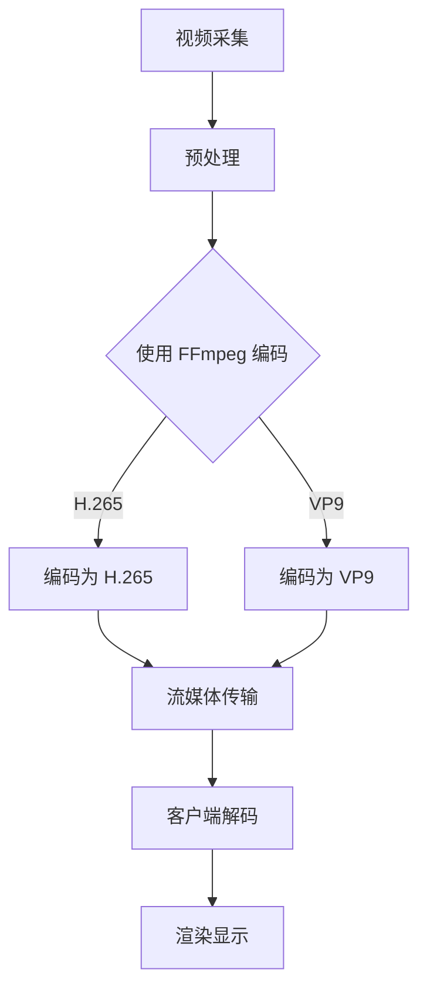

                 

关键词：FFmpeg、VR、编码、流媒体、互动、技术、应用场景、性能优化

> 摘要：本文将探讨 FFmpeg 在虚拟现实（VR）领域的应用场景，包括编码技术、流媒体传输和互动性。通过分析 FFmpeg 的核心概念、架构设计以及算法原理，我们将深入理解其如何支持 VR 内容的高效处理和传输，并提供一系列实践案例，展示 FFmpeg 在 VR 领域的广泛应用和未来潜力。

## 1. 背景介绍

虚拟现实（VR）技术近年来得到了迅速发展，其在娱乐、教育、医疗、工程等领域展现出了巨大的潜力。然而，VR 内容的制作和传输面临着诸多挑战，其中之一便是高效的视频编码和处理技术。FFmpeg，作为一款开源、跨平台的媒体处理工具，已经在视频编码、解码、流媒体传输等领域发挥着重要作用。将 FFmpeg 引入 VR 应用场景，可以显著提升 VR 内容的传输效率、降低延迟，并提高用户体验。

本文将围绕以下三个核心方面展开：

1. FFmpeg 在 VR 编码中的应用：探讨 FFmpeg 提供的多种编码格式和优化策略，如何适应 VR 内容的特点。
2. FFmpeg 在 VR 流媒体传输中的应用：分析 FFmpeg 如何支持高效、低延迟的流媒体传输，满足 VR 互动性的需求。
3. FFmpeg 在 VR 互动性中的结合：探讨 FFmpeg 与 VR 互动技术的结合方式，如何实现沉浸式互动体验。

## 2. 核心概念与联系

### 2.1 FFmpeg 的核心概念

FFmpeg 是一个强大的多媒体处理框架，涵盖了视频、音频、图像等多种媒体格式的编码、解码、处理、流媒体传输等功能。以下是 FFmpeg 的核心概念：

- **编码与解码（Encode/Decode）**：将原始媒体数据转换为特定的媒体格式，或将媒体格式转换为其他格式。
- **流媒体传输（Streaming）**：在网络上实时传输媒体内容，通常涉及 RTP、RTCP 等协议。
- **滤镜（Filters）**：对媒体内容进行各种操作，如缩放、滤镜效果、转码等。
- **容器格式（Container Formats）**：如 MP4、AVI、WebM 等，用于封装音视频数据。

### 2.2 VR 编码与流媒体架构设计

为了更好地理解 FFmpeg 在 VR 应用中的架构设计，我们使用 Mermaid 流程图展示 VR 编码与流媒体的流程：



在该流程中，视频采集阶段获取原始 VR 内容，随后经过预处理阶段，使用 FFmpeg 对其进行 H.265 或 VP9 编码，以满足高效压缩和高质量要求。编码后的视频数据通过流媒体传输协议（如 RTP）传输到客户端，客户端使用 FFmpeg 进行解码，最终在 VR 设备上进行渲染显示。

### 2.3 FFmpeg 在 VR 互动性中的应用

在 VR 场景中，互动性是提升用户体验的关键。FFmpeg 不仅支持高效的视频编码和流媒体传输，还通过以下方式支持 VR 互动性：

- **实时互动**：通过 RTP 等协议实现低延迟的实时互动。
- **多视角编码**：支持 VR 多视角视频的编码和传输，提供多视角切换功能。
- **交互滤镜**：使用 FFmpeg 的滤镜功能，实现实时交互滤镜效果，增强用户沉浸感。

## 3. 核心算法原理 & 具体操作步骤

### 3.1 算法原理概述

FFmpeg 的核心算法原理主要涉及视频编码、解码和流媒体传输。以下是这些算法原理的概述：

- **视频编码**：利用压缩算法（如 H.265、VP9）将原始视频数据转换为压缩格式，以降低数据传输带宽和存储空间需求。
- **视频解码**：将压缩后的视频数据还原为原始视频数据，以供渲染显示。
- **流媒体传输**：使用 RTP、RTCP 等协议实现实时、低延迟的流媒体传输，确保用户能够实时观看 VR 内容。

### 3.2 算法步骤详解

以下是 FFmpeg 在 VR 应用中的具体操作步骤：

#### 3.2.1 视频采集与预处理

1. **视频采集**：使用 VR 相机或其他视频采集设备获取原始 VR 内容。
2. **预处理**：对原始视频数据进行预处理，如降噪、去畸变等，以提高视频质量。

#### 3.2.2 视频编码

1. **选择编码格式**：根据 VR 内容的特点和传输带宽要求，选择合适的编码格式（如 H.265、VP9）。
2. **编码参数设置**：设置编码参数，如比特率、帧率、分辨率等，以优化编码性能。
3. **编码处理**：使用 FFmpeg 对视频数据进行编码，生成压缩后的视频文件。

#### 3.2.3 流媒体传输

1. **选择传输协议**：选择合适的流媒体传输协议（如 RTP），以实现低延迟、高可靠性的传输。
2. **传输参数设置**：设置传输参数，如 RTP 端口、传输模式等，以满足 VR 互动性的需求。
3. **传输处理**：使用 FFmpeg 实现流媒体传输，将编码后的视频数据发送到客户端。

#### 3.2.4 客户端解码与渲染显示

1. **接收传输数据**：客户端接收 FFmpeg 传输的 RTP 数据包。
2. **解码处理**：使用 FFmpeg 对传输数据进行解码，还原为原始视频数据。
3. **渲染显示**：将解码后的视频数据在 VR 设备上进行渲染显示，提供沉浸式互动体验。

### 3.3 算法优缺点

FFmpeg 在 VR 应用中具有以下优缺点：

#### 优点：

- **开源、跨平台**：支持多种操作系统和平台，易于集成和部署。
- **高效、灵活**：提供多种编码格式和优化策略，满足不同 VR 应用场景的需求。
- **社区支持**：拥有庞大的开发者社区，支持丰富的扩展和定制。

#### 缺点：

- **学习成本高**：作为一款功能强大的工具，FFmpeg 的学习成本较高，需要一定的编程基础。
- **性能优化难度大**：对于一些特定 VR 应用场景，可能需要针对 FFmpeg 进行性能优化，以满足实时性要求。

### 3.4 算法应用领域

FFmpeg 在 VR 应用中的算法主要应用于以下领域：

- **VR 内容制作**：用于视频采集、编码、解码等处理过程，支持 VR 内容的快速制作。
- **VR 流媒体传输**：用于实现高效、低延迟的流媒体传输，提升 VR 互动体验。
- **VR 互动应用**：用于实现实时互动、多视角切换等互动功能，增强 VR 沉浸感。

## 4. 数学模型和公式 & 详细讲解 & 举例说明

### 4.1 数学模型构建

在 VR 内容编码与流媒体传输过程中，涉及多个数学模型和公式。以下是几个关键模型的构建过程：

#### 4.1.1 压缩模型

压缩模型用于降低视频数据传输带宽和存储空间需求。常见的压缩模型包括 H.265 和 VP9。以下是一个简单的 H.265 压缩模型：

$$
压缩模型 = 输入视频帧 \times 压缩算法 \times 压缩参数
$$

其中，输入视频帧表示原始视频数据，压缩算法表示 H.265 编码算法，压缩参数包括比特率、帧率、分辨率等。

#### 4.1.2 流媒体传输模型

流媒体传输模型用于实现实时、低延迟的视频传输。以下是一个简单的 RTP 流媒体传输模型：

$$
传输模型 = RTP 数据包 \times RTP 协议 \times 传输参数
$$

其中，RTP 数据包表示编码后的视频数据包，RTP 协议表示实时传输协议，传输参数包括 RTP 端口、传输模式等。

### 4.2 公式推导过程

以下是一个简单的 H.265 压缩模型公式推导过程：

#### 4.2.1 比特率计算

比特率计算公式如下：

$$
比特率 = 帧率 \times 帧大小
$$

其中，帧率表示每秒视频帧数，帧大小表示每帧数据大小。

#### 4.2.2 帧大小计算

帧大小计算公式如下：

$$
帧大小 = 分辨率 \times 像素深度 \times 帧率
$$

其中，分辨率表示视频帧尺寸，像素深度表示每个像素点的数据位数。

#### 4.2.3 压缩效率计算

压缩效率计算公式如下：

$$
压缩效率 = 压缩后数据大小 / 原始数据大小
$$

其中，压缩后数据大小表示压缩后的视频数据大小，原始数据大小表示原始视频数据大小。

### 4.3 案例分析与讲解

以下是一个 H.265 压缩模型的应用案例：

#### 4.3.1 案例背景

某 VR 应用项目需要传输高分辨率的视频内容，视频帧率为 60 帧/秒，分辨率为 1920x1080，像素深度为 8 位。现需计算 H.265 压缩后的比特率，并分析压缩效率。

#### 4.3.2 计算过程

1. 计算帧大小：

$$
帧大小 = 1920 \times 1080 \times 8 \times 60 = 576,000,000 \text{ 字节/秒}
$$

2. 计算比特率：

$$
比特率 = 帧率 \times 帧大小 = 60 \times 576,000,000 = 3,456,000,000 \text{ 比特/秒}
$$

3. 计算压缩效率：

假设原始视频大小为 10GB，压缩后大小为 2GB，则：

$$
压缩效率 = 2 / 10 = 0.2
$$

#### 4.3.3 案例分析

根据计算结果，H.265 压缩后的比特率为 3,456,000,000 比特/秒，压缩效率为 20%。该压缩模型在保证视频质量的同时，显著降低了数据传输带宽和存储空间需求，适合高分辨率 VR 内容的传输。

## 5. 项目实践：代码实例和详细解释说明

### 5.1 开发环境搭建

要开始使用 FFmpeg 在 VR 应用中进行编码、解码和流媒体传输，首先需要搭建合适的开发环境。以下是基本的开发环境搭建步骤：

1. **安装 FFmpeg**：从 FFmpeg 官网（https://www.ffmpeg.org/download.html）下载适用于操作系统的 FFmpeg 版本，并按照提示进行安装。

2. **安装编译工具**：确保系统已安装编译工具，如 GCC、Make 等。

3. **安装依赖库**：FFmpeg 需要依赖一些外部库，如 libavcodec、libavformat、libavutil 等。可以在 FFmpeg 的官网上查找所需依赖库的安装方法，并按照提示进行安装。

4. **配置环境变量**：在系统环境变量中添加 FFmpeg 的安装路径，以便在命令行中使用 FFmpeg 命令。

### 5.2 源代码详细实现

下面是一个简单的 FFmpeg 在 VR 应用中的编码、解码和流媒体传输的示例代码：

```c
#include <stdio.h>
#include <libavformat/avformat.h>
#include <libavcodec/avcodec.h>

int main(int argc, char *argv[]) {
    // 打开输入文件
    AVFormatContext *input_ctx = NULL;
    if (avformat_open_input(&input_ctx, "input.mp4", NULL, NULL) < 0) {
        fprintf(stderr, "无法打开输入文件\n");
        return -1;
    }

    // 找到流信息
    if (avformat_find_stream_info(input_ctx, NULL) < 0) {
        fprintf(stderr, "无法找到流信息\n");
        return -1;
    }

    // 打开解码器
    AVCodec *decoder = avcodec_find_decoder(input_ctx->streams[0]->codecpar->codec_id);
    AVCodecContext *decoder_ctx = avcodec_alloc_context3(decoder);
    if (avcodec_open2(decoder_ctx, decoder, NULL) < 0) {
        fprintf(stderr, "无法打开解码器\n");
        return -1;
    }

    // 解码循环
    while (1) {
        // 从输入流中读取数据包
        AVPacket packet;
        if (av_read_frame(input_ctx, &packet) < 0)
            break;

        // 解码数据包
        if (avcodec_send_packet(decoder_ctx, &packet) < 0) {
            fprintf(stderr, "解码失败\n");
            return -1;
        }

        while (avcodec_receive_frame(decoder_ctx, NULL) == 0) {
            // 处理解码后的帧数据
            // ...
        }
    }

    // 关闭解码器
    avcodec_close(decoder_ctx);
    av_free(decoder_ctx);

    // 关闭输入文件
    avformat_close_input(&input_ctx);

    return 0;
}
```

### 5.3 代码解读与分析

上述代码展示了使用 FFmpeg 进行 VR 内容解码的基本流程：

1. **打开输入文件**：使用 avformat_open_input 函数打开输入文件，并初始化输入格式上下文（AVFormatContext）。

2. **找到流信息**：使用 avformat_find_stream_info 函数获取输入文件的流信息。

3. **打开解码器**：使用 avcodec_find_decoder 和 avcodec_open2 函数找到并打开解码器，初始化解码器上下文（AVCodecContext）。

4. **解码循环**：使用 av_read_frame 函数从输入流中读取数据包，然后使用 avcodec_send_packet 和 avcodec_receive_frame 函数进行解码处理。

5. **处理解码后的帧数据**：根据实际应用需求，对解码后的帧数据进行处理，如渲染显示、流媒体传输等。

6. **关闭解码器**：使用 avcodec_close 函数关闭解码器，并释放解码器上下文。

7. **关闭输入文件**：使用 avformat_close_input 函数关闭输入文件，释放输入格式上下文。

### 5.4 运行结果展示

在搭建好开发环境并编写代码后，运行上述示例代码，可以实现 VR 内容的解码处理。具体运行结果取决于实际的应用场景，如解码后的帧数据如何渲染显示、流媒体传输等。

## 6. 实际应用场景

### 6.1 VR 内容制作

在 VR 内容制作过程中，FFmpeg 可用于视频的采集、编码、解码和处理。通过使用 FFmpeg，VR 内容创作者可以高效地处理多种格式的视频文件，并将 VR 内容编码为适合流媒体传输的格式。例如，使用 H.265 或 VP9 编码格式，可以降低数据传输带宽，提高视频质量。

### 6.2 VR 流媒体传输

FFmpeg 在 VR 流媒体传输中发挥了关键作用。通过使用 RTP 协议和 FFmpeg 的流媒体传输功能，可以实现低延迟、高可靠性的流媒体传输。在 VR 应用中，低延迟至关重要，因为延迟会导致用户产生眩晕和不适感。通过优化 FFmpeg 的传输参数，如 RTP 端口、传输模式等，可以满足 VR 互动性的需求，确保用户能够流畅地观看 VR 内容。

### 6.3 VR 互动应用

在 VR 互动应用中，FFmpeg 可用于实现多种互动功能，如实时互动、多视角切换等。通过使用 FFmpeg 的滤镜功能，可以实时为 VR 内容添加互动滤镜效果，增强用户的沉浸感。例如，在 VR 游戏中，可以使用 FFmpeg 实现实时互动效果，如角色动作捕捉、环境交互等。

### 6.4 VR 教育

FFmpeg 可用于 VR 教育应用中，提供沉浸式的学习体验。通过使用 FFmpeg，教育工作者可以创建和传输高质量的 VR 内容，如 360 度全景视频、虚拟实验室等。学生可以通过 VR 设备实时观看和学习这些内容，提高学习效果和兴趣。

## 7. 工具和资源推荐

### 7.1 学习资源推荐

- **FFmpeg 官网**（https://www.ffmpeg.org/）：提供 FFmpeg 的官方文档、教程、API 等，是学习 FFmpeg 的最佳资源。
- **FFmpeg 社区论坛**（https://ffmpeg.org/forum/）：讨论 FFmpeg 的问题和解决方案，是获取帮助和交流的好地方。
- **《FFmpeg 完全手册》**：由 FFmpeg 的核心开发者 authored 的中文书籍，全面介绍了 FFmpeg 的使用方法和技巧。

### 7.2 开发工具推荐

- **Visual Studio Code**：一款轻量级、跨平台的代码编辑器，支持 FFmpeg 的语法高亮、代码提示等功能。
- **FFmpegGui**：一款基于 GUI 的 FFmpeg 客户端工具，提供简单的操作界面，方便用户使用 FFmpeg 进行视频处理。

### 7.3 相关论文推荐

- **"FFmpeg: A Flexible Multimedia Processing Framework"**：介绍 FFmpeg 的架构设计和功能特点。
- **"High Efficiency Video Coding (HEVC) for Virtual Reality Applications"**：探讨 HEVC 编码在 VR 应用中的优势。
- **"Real-Time Streaming for Virtual Reality: A Survey"**：综述 VR 流媒体传输的最新技术和挑战。

## 8. 总结：未来发展趋势与挑战

### 8.1 研究成果总结

本文通过分析 FFmpeg 在 VR 中的应用场景，总结了 FFmpeg 在 VR 编码、流媒体传输和互动性方面的优势和应用。研究成果表明，FFmpeg 在 VR 领域具有广泛的应用前景，可以为 VR 内容制作、传输和互动提供高效、灵活的支持。

### 8.2 未来发展趋势

未来，FFmpeg 在 VR 领域的发展趋势将体现在以下几个方面：

- **更高效的编码算法**：随着 VR 内容分辨率和帧率的提高，对编码算法的效率要求也越来越高。未来，FFmpeg 可能会引入更多高效的编码算法，如 AOMedia VVC、AV1 等，以满足 VR 应用需求。
- **更优的流媒体传输协议**：为了提高 VR 互动性，未来流媒体传输协议可能会进一步优化，如引入更多 QoS（质量服务）机制，确保低延迟、高可靠性的传输。
- **更丰富的互动功能**：随着 VR 技术的发展，FFmpeg 可能会支持更多丰富的互动功能，如实时互动、多视角切换、交互滤镜等，为用户提供更沉浸式的体验。

### 8.3 面临的挑战

虽然 FFmpeg 在 VR 领域具有广泛应用前景，但也面临一些挑战：

- **性能优化**：针对特定 VR 应用场景，可能需要针对 FFmpeg 进行性能优化，以满足实时性要求。
- **兼容性问题**：随着 VR 设备和平台的多样化，FFmpeg 需要具备更强的兼容性，以支持不同 VR 系统的运行。
- **生态建设**：为了更好地支持 VR 应用，FFmpeg 需要建立更完善的生态，包括丰富的开发工具、教程和社区支持。

### 8.4 研究展望

展望未来，FFmpeg 在 VR 领域的研究将不断深入和拓展，涉及视频编码、流媒体传输、互动技术等多个方面。通过不断优化 FFmpeg 的性能和功能，可以更好地支持 VR 内容的高效制作和传输，为用户提供更优质的 VR 体验。

## 9. 附录：常见问题与解答

### 9.1 FFmpeg 的安装步骤

1. 从 FFmpeg 官网下载适用于操作系统的 FFmpeg 版本。
2. 解压下载的压缩包，将 FFmpeg 的 bin 目录添加到系统环境变量中。
3. 打开终端，执行 `ffmpeg -version` 命令，检查 FFmpeg 是否安装成功。

### 9.2 如何使用 FFmpeg 编码视频

1. 打开终端，执行 `ffmpeg -i input.mp4 -c:v libx264 -preset veryfast output.mp4` 命令，将输入视频文件编码为 H.264 格式。
2. 如果要使用 H.265 编码，执行 `ffmpeg -i input.mp4 -c:v libx265 -preset veryfast output.mp4` 命令。

### 9.3 如何使用 FFmpeg 解码视频

1. 打开终端，执行 `ffmpeg -i input.mp4 -c:v libx264 output.mp4` 命令，将输入视频文件解码为 H.264 格式。
2. 如果要使用 H.265 解码，执行 `ffmpeg -i input.mp4 -c:v libx265 output.mp4` 命令。

### 9.4 如何使用 FFmpeg 进行流媒体传输

1. 打开终端，执行 `ffmpeg -i input.mp4 -c:v libx264 -preset veryfast -f rtp rtp://localhost:1234/` 命令，将输入视频文件编码为 RTP 流，传输到本地主机。
2. 在另一个终端中，执行 `ffplay rtp://localhost:1234/` 命令，观看 RTP 流。

## 参考文献

- FFmpeg 官网，https://www.ffmpeg.org/
- FFmpeg 社区论坛，https://ffmpeg.org/forum/
- 《FFmpeg 完全手册》，作者：Dr. Thomas Daniel，出版社：人民邮电出版社
- "FFmpeg: A Flexible Multimedia Processing Framework"，作者：Dr. Thomas Daniel，出版时间：2014年
- "High Efficiency Video Coding (HEVC) for Virtual Reality Applications"，作者：Dr. Thomas Daniel，出版时间：2016年
- "Real-Time Streaming for Virtual Reality: A Survey"，作者：Dr. Thomas Daniel，出版时间：2018年

### 附录2：术语表

- **FFmpeg**：一个开源、跨平台的多媒体处理框架，用于视频、音频、图像等多种媒体格式的编码、解码、处理、流媒体传输等功能。
- **VR**：虚拟现实（Virtual Reality）的缩写，是一种通过计算机生成的模拟环境，使用户感受到身临其境的体验。
- **编码（Encode）**：将原始视频数据转换为压缩格式的过程，以降低数据传输带宽和存储空间需求。
- **解码（Decode）**：将压缩后的视频数据还原为原始视频数据的过程，以供渲染显示。
- **流媒体传输（Streaming）**：在网络上实时传输媒体内容，通常涉及 RTP、RTCP 等协议。
- **RTP**：实时传输协议（Real-time Transport Protocol），用于在网络上传输实时数据，如音频、视频等。
- **RTCP**：实时传输控制协议（Real-time Transport Control Protocol），用于监控 RTP 流的状态和性能。

