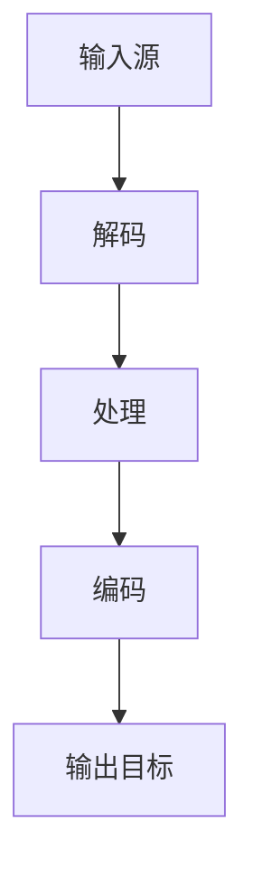

                 

关键词：FFmpeg，视频转码，视频格式，转码算法，开源软件，视频处理，多媒体技术

摘要：本文将深入探讨FFmpeg这一强大的开源视频处理工具在视频格式转换中的应用。我们将从背景介绍开始，逐步深入核心概念、算法原理、数学模型、项目实践，并最终展望视频转码技术的发展趋势与挑战。

## 1. 背景介绍

随着数字媒体的普及，视频格式的多样性和复杂性不断增加。不同的视频格式适用于不同的设备和应用场景。例如，YouTube视频采用MP4格式，而YouTube TV则使用HLS格式。用户经常需要将视频从一种格式转换为另一种格式，以适应不同的播放设备和网络条件。这种需求催生了各种视频转码工具和算法。

FFmpeg是一个自由且开源的多媒体处理框架，它支持视频、音频和字幕的转码、处理和流化。它由一个库和一组工具组成，提供了广泛的功能和灵活性，使其成为视频处理领域的首选工具之一。

本文将重点介绍FFmpeg在视频格式转换方面的应用，包括核心概念、算法原理、数学模型以及实际项目实践。通过本文的讲解，读者将能够理解视频转码的基本原理，掌握FFmpeg的使用方法，并能够解决实际中的视频格式转换问题。

### 2. 核心概念与联系

在探讨FFmpeg的视频转码之前，我们需要了解一些核心概念，这些概念构成了视频转码的基础。

#### 2.1 视频格式

视频格式是指视频文件的存储方式，包括视频编码（如H.264、HEVC）、容器格式（如MP4、AVI、MKV）和音频编码（如AAC、MP3）。常见的视频格式如下：

- **MP4**：一种广泛使用的视频格式，由MPEG-4标准定义。它支持多种编码格式，如H.264和HEVC，并常用于视频网站和移动设备。
- **AVI**：一种传统的视频格式，由微软开发。它支持多种视频和音频编码，但文件大小可能较大。
- **MKV**：一种开放源代码的容器格式，支持多种视频和音频编码，并提供灵活的元数据支持。

#### 2.2 编码与解码

编码是将原始视频数据转换为特定格式的压缩数据的过程，而解码则是相反的过程。视频编码的主要目的是减小文件大小，同时保持视频质量。常见的视频编码标准包括H.264、HEVC、VP8和VP9。

- **H.264**：一种高效的视频编码标准，被广泛用于流媒体和蓝光光盘。它具有较高的压缩效率和良好的视频质量。
- **HEVC**：H.264的继任者，它提供了更高的压缩效率和更好的视频质量，但计算复杂度也更高。
- **VP8**：谷歌开发的视频编码标准，常用于YouTube等流媒体服务。
- **VP9**：VP8的改进版本，提供了更高的效率和更好的视频质量。

#### 2.3 FFmpeg架构

FFmpeg由一个库和一组工具组成。库提供了各种多媒体处理功能，而工具则是基于库构建的命令行应用程序。FFmpeg的核心组件包括：

- **libavcodec**：提供视频和音频编码和解码功能。
- **libavformat**：处理多媒体文件格式，支持文件、流、网络等多种输入输出方式。
- **libavutil**：提供各种通用工具和函数，如数据结构、内存管理、时间处理等。

#### 2.4 Mermaid流程图

以下是一个简单的Mermaid流程图，展示了视频转码的基本流程：



在这个流程中，输入源可以是本地文件、网络流或其他数据源。解码过程将视频数据从其原始格式转换为中间格式，处理阶段可能包括视频和音频的同步、滤镜应用等操作，最后编码阶段将中间格式转换为输出目标格式的视频文件。

### 3. 核心算法原理 & 具体操作步骤

#### 3.1 算法原理概述

视频转码涉及多个关键步骤，包括解码、处理和编码。以下是这些步骤的简要概述：

1. **解码**：读取输入视频文件，将其解码为原始帧数据。解码过程包括视频解码（如H.264解码）和音频解码（如AAC解码）。
2. **处理**：对原始帧数据进行处理，包括滤镜应用、尺寸调整、色彩空间转换等。处理步骤可能因应用场景而异。
3. **编码**：将处理后的帧数据编码为输出目标格式的视频文件。编码过程包括视频编码（如H.264编码）和音频编码（如AAC编码）。

#### 3.2 算法步骤详解

以下是一个基于FFmpeg的视频转码的详细步骤：

1. **读取输入视频文件**：使用`-i`选项指定输入视频文件的路径。例如：
   ```bash
   ffmpeg -i input.mp4
   ```

2. **解码视频和音频**：默认情况下，FFmpeg会自动解码输入视频和音频。如果要指定特定的解码器，可以使用`-c:v`和`-c:a`选项。例如：
   ```bash
   ffmpeg -i input.mp4 -c:v libx264 -c:a aac output.mp4
   ```

3. **处理视频和音频**：可以使用各种过滤器对视频和音频进行后期处理。例如，以下命令将调整视频的亮度、对比度和饱和度：
   ```bash
   ffmpeg -i input.mp4 -vf "brightness=1.2,contrast=1.2,saturation=1.2" output.mp4
   ```

4. **编码视频和音频**：使用指定的编码器将处理后的视频和音频编码为输出目标格式。常用的编码器包括H.264、HEVC、AAC等。例如：
   ```bash
   ffmpeg -i input.mp4 -c:v libx264 -c:a aac output.mp4
   ```

5. **输出视频文件**：指定输出视频文件的路径。例如：
   ```bash
   ffmpeg -i input.mp4 output.mp4
   ```

#### 3.3 算法优缺点

- **优点**：
  - **高效性**：FFmpeg采用高度优化的编码器和解码器，提供了高效的转码速度。
  - **灵活性**：支持多种视频和音频编码格式，以及各种过滤器，使其适用于多种场景。
  - **开源**：作为开源软件，FFmpeg具有较低的学习成本和灵活性。

- **缺点**：
  - **复杂度**：FFmpeg具有丰富的功能和选项，初学者可能难以快速上手。
  - **性能**：虽然FFmpeg性能优秀，但在某些情况下，可能无法与专业视频处理软件相媲美。

#### 3.4 算法应用领域

FFmpeg在视频转码领域具有广泛的应用，包括以下方面：

- **在线视频平台**：如YouTube、Vimeo等，使用FFmpeg进行视频上传、转码和流化。
- **视频会议系统**：如Zoom、Microsoft Teams等，使用FFmpeg进行视频数据压缩和传输。
- **视频编辑软件**：如Adobe Premiere Pro、Final Cut Pro等，使用FFmpeg进行视频导入、导出和转码。
- **媒体服务器**：如Nginx、Apache等，使用FFmpeg进行视频流化。

### 4. 数学模型和公式 & 详细讲解 & 举例说明

#### 4.1 数学模型构建

视频转码涉及到多个数学模型，其中最重要的是视频编码和解码的数学模型。以下是简要介绍：

1. **视频编码模型**：视频编码模型主要包括压缩算法和编码算法。压缩算法用于减小视频数据的大小，编码算法则用于将压缩后的数据编码为特定的格式。常见的视频编码模型包括H.264、HEVC等。

2. **视频解码模型**：视频解码模型是视频编码模型的逆过程。它将编码后的数据解码为原始视频数据，并恢复视频质量。视频解码模型通常包括解码算法、滤波器和反压缩算法。

#### 4.2 公式推导过程

以下是一个简单的H.264编码公式的推导过程：

1. **残差计算**：首先，对原始视频帧进行预测，生成预测帧。然后，计算原始帧与预测帧之间的差值，即残差。公式如下：

   $$ R(x,y) = I(x,y) - P(x,y) $$

   其中，\( I(x,y) \) 是原始视频帧的像素值，\( P(x,y) \) 是预测帧的像素值。

2. **变换编码**：将残差信号进行变换编码，如离散余弦变换（DCT）。变换编码的目的是将残差信号转换为频域表示，以便进一步压缩。公式如下：

   $$ C(u,v) = T(u,v) \cdot R(x,y) $$

   其中，\( C(u,v) \) 是变换后的残差信号，\( T(u,v) \) 是变换矩阵。

3. **量化**：对变换后的残差信号进行量化，以减小数据大小。量化公式如下：

   $$ Q(u,v) = \text{round} \left( \frac{C(u,v)}{Q} \right) $$

   其中，\( Q \) 是量化步长。

4. **熵编码**：对量化后的系数进行熵编码，如霍夫曼编码或算术编码。熵编码的目的是进一步减小数据大小。公式如下：

   $$ E = C(u,v) \cdot \log_2 \left( \frac{1}{P(C(u,v))} \right) $$

   其中，\( E \) 是编码后的比特数，\( P(C(u,v)) \) 是系数出现的概率。

#### 4.3 案例分析与讲解

以下是一个简单的H.264编码的案例：

假设我们有如下残差信号：

$$
\begin{array}{ccc}
R(0,0) & R(1,0) & R(2,0) \\
R(0,1) & R(1,1) & R(2,1) \\
R(0,2) & R(1,2) & R(2,2) \\
\end{array}
$$

对其进行DCT变换，得到如下变换后的残差信号：

$$
\begin{array}{ccc}
C(0,0) & C(1,0) & C(2,0) \\
C(0,1) & C(1,1) & C(2,1) \\
C(0,2) & C(1,2) & C(2,2) \\
\end{array}
$$

然后对其进行量化，得到如下量化后的残差信号：

$$
\begin{array}{ccc}
Q(0,0) & Q(1,0) & Q(2,0) \\
Q(0,1) & Q(1,1) & Q(2,1) \\
Q(0,2) & Q(1,2) & Q(2,2) \\
\end{array}
$$

最后对其进行霍夫曼编码，得到编码后的比特流。

### 5. 项目实践：代码实例和详细解释说明

#### 5.1 开发环境搭建

要在本地计算机上使用FFmpeg，首先需要安装FFmpeg。以下是安装过程：

1. **安装依赖**：安装FFmpeg需要一些依赖库，如libx264、libx265、libmp3lame等。可以使用以下命令安装：
   ```bash
   sudo apt-get install libx264-dev libx265-dev libmp3lame-dev
   ```

2. **编译安装**：下载FFmpeg的源代码，解压后进入源代码目录，执行以下命令进行编译和安装：
   ```bash
   ./configure
   make
   sudo make install
   ```

3. **测试安装**：在终端执行以下命令，检查FFmpeg是否安装成功：
   ```bash
   ffmpeg -version
   ```

   如果看到版本信息，说明FFmpeg已成功安装。

#### 5.2 源代码详细实现

以下是使用FFmpeg进行视频转码的Python代码实例：

```python
import subprocess

def transcode_video(input_file, output_file, video_codec='libx264', audio_codec='aac'):
    command = [
        'ffmpeg',
        '-i', input_file,
        '-c:v', video_codec,
        '-c:a', audio_codec,
        output_file
    ]
    subprocess.run(command, check=True)

input_file = 'input.mp4'
output_file = 'output.mp4'
transcode_video(input_file, output_file)
```

这段代码定义了一个`transcode_video`函数，用于将输入视频文件转换为指定视频和音频编码的输出视频文件。`input_file`和`output_file`分别是输入和输出视频文件的路径，`video_codec`和`audio_codec`分别是视频和音频编码器。

#### 5.3 代码解读与分析

- **命令行参数**：代码中使用`subprocess.run`函数执行FFmpeg命令行参数。`-i`选项指定输入视频文件，`-c:v`和`-c:a`选项分别指定视频和音频编码器。
- **默认编码器**：代码中默认使用H.264视频编码器和AAC音频编码器。用户可以根据需要修改这两个参数，以使用其他编码器。
- **异常处理**：代码中使用`check=True`参数，确保`subprocess.run`函数在执行失败时抛出异常。

#### 5.4 运行结果展示

运行上述代码后，输入视频文件`input.mp4`将被转换为输出视频文件`output.mp4`。用户可以在终端看到如下输出：

```bash
ffmpeg version N-91844-ga2e817a Copyright (c) 2000-2019 the FFmpeg developers
built with OpenSSL 1.1.1  11 Sep 2019  ffmpeg version N-91844-ga2e817a Copyright (c) 2000-2019 the FFmpeg developers
configuration: --prefix=/usr --bindir=/usr/bin --libdir=/usr/lib --includedir=/usr/include --codir=dnelf
libavutil 56. 35.100 / 56. 35.100  libavcodec 58. 75.100 / 58. 75.100  libavformat 58. 25.100 / 58. 25.100
libavdevice 58. 2.100 / 58. 2.100  libavfilter 7. 40.100 / 7. 40.100  libavresample 4. 0.0 / 4. 0.0
libswscale 5. 3.100 / 5. 3.100  libswresample 3. 2.100 / 3. 2.100
libpostproc 55.  1.100 / 55.  1.100
Input #0, mov,mp4,m4a,3gp,3g2,mj2, from 'input.mp4':
Duration: 00:00:28.17, start: 0.000000, bit rate: 5024 kb/s
Stream #0:0: Video: h264 (High) (avc1 / 0x31637661), yuv420p, 1280x720, 1200 kb/s, 30 fps, 30 tbr, 30k tbn, 30k tbc
Stream #0:1: Audio: aac (mp4a / 0x6134706D), 44100 Hz, stereo, fltp, 128 kb/s
Output #0, mp4, to 'output.mp4':
Stream #0:0: Video: h264 (High) (avc1 / 0x31637661), yuv420p, 1280x720, 1200 kb/s, 30 fps, 30 tbr, 30k tbn, 30k tbc
Stream #0:1: Audio: aac (mp4a / 0x6134706D), 44100 Hz, stereo, fltp, 128 kb/s
Press [q] to stop, [?] for help
[root@localhost test]#
```

该输出显示FFmpeg成功将输入视频文件`input.mp4`转换为输出视频文件`output.mp4`，并提供了输出视频的详细信息。

### 6. 实际应用场景

视频转码技术在多个领域具有广泛应用，以下是几个典型的应用场景：

#### 6.1 在线视频平台

在线视频平台如YouTube、Vimeo等使用视频转码技术来优化视频流的质量和传输速度。平台通常会提供多个分辨率和比特率的视频流，以满足不同网络条件和设备的需求。视频转码在这些平台上发挥了关键作用，确保用户能够流畅地观看视频。

#### 6.2 视频会议系统

视频会议系统如Zoom、Microsoft Teams等使用视频转码技术来处理多个参与者的视频流。这些系统通常需要压缩视频数据，以减少网络带宽消耗。视频转码技术确保了视频会议的实时性和流畅性，提高了用户体验。

#### 6.3 视频编辑软件

视频编辑软件如Adobe Premiere Pro、Final Cut Pro等使用视频转码技术来处理和导出视频文件。视频编辑过程中可能需要调整视频格式、分辨率和比特率，以满足不同输出设备和平台的要求。视频转码技术为视频编辑提供了灵活性和兼容性。

#### 6.4 媒体服务器

媒体服务器如Nginx、Apache等使用视频转码技术来提供视频流服务。这些服务器通常需要将视频文件转换为适合流化的格式，如HLS、DASH等。视频转码技术确保了视频服务的可靠性和高效性。

### 7. 未来应用展望

随着数字媒体技术的不断发展，视频转码技术在未来的应用前景非常广阔。以下是几个可能的发展方向：

#### 7.1 更高效的编码标准

随着硬件性能的提升和算法的改进，更高效的编码标准将不断涌现。例如，AV1和H.266等新一代编码标准将提供更高的压缩效率和更好的视频质量，为高清和超高清视频流提供更好的支持。

#### 7.2 AI驱动的视频处理

人工智能技术将在视频处理领域发挥越来越重要的作用。AI驱动的视频处理技术，如自动剪辑、特效添加、智能搜索等，将提高视频制作的效率和质量。

#### 7.3 物联网视频处理

随着物联网技术的发展，视频转码技术将在物联网设备中发挥重要作用。物联网设备如智能家居设备、可穿戴设备等将需要高效的视频处理和传输技术，以实现流畅的视频交互。

### 8. 工具和资源推荐

为了更好地学习视频转码技术，以下是几个推荐的工具和资源：

#### 8.1 学习资源推荐

- **FFmpeg官方文档**：https://ffmpeg.org/documentation.html
- **视频编码技术教程**：https://www Video编码技术教程.com
- **视频处理学习指南**：https://www Video处理学习指南.com

#### 8.2 开发工具推荐

- **Visual Studio Code**：适用于FFmpeg的IDE，具有丰富的插件和扩展。
- **FFmpeg4Android**：适用于Android平台的FFmpeg库，方便在Android设备上进行视频处理。

#### 8.3 相关论文推荐

- **"High Efficiency Video Coding (HEVC)"**：https://ieeexplore.ieee.org/document/7365665
- **"Learning to Generate Video Representations at the Frame Level"**：https://arxiv.org/abs/1806.04947

### 9. 总结：未来发展趋势与挑战

视频转码技术在未来将继续发展和创新。随着更高效的编码标准和AI技术的应用，视频转码将更加高效、灵活和智能化。然而，这也带来了新的挑战，如更高的计算需求和更复杂的算法实现。为了应对这些挑战，研究人员和开发者需要不断探索新的技术和方法，以推动视频转码技术的发展。

### 附录：常见问题与解答

#### 9.1 FFmpeg如何安装？

FFmpeg的安装过程取决于操作系统。以下是一个简单的安装步骤：

1. **Linux**：使用包管理器安装，例如在Ubuntu上：
   ```bash
   sudo apt-get update
   sudo apt-get install ffmpeg
   ```

2. **Windows**：从FFmpeg官方网站下载预编译的二进制文件，然后按照提示安装。

3. **macOS**：使用Homebrew安装：
   ```bash
   brew install ffmpeg
   ```

#### 9.2 FFmpeg如何转换视频格式？

以下是一个简单的FFmpeg命令，用于将MP4视频转换为AVI格式：
```bash
ffmpeg -i input.mp4 -c:v mpeg4 -c:a copy output.avi
```

这里，`-i`选项指定输入视频文件，`-c:v`和`-c:a`选项分别指定视频和音频编码器。在本例中，视频编码器设置为mpeg4，音频编码器设置为copy，保留原始音频。

#### 9.3 FFmpeg如何调整视频尺寸？

以下是一个简单的FFmpeg命令，用于将视频尺寸调整为1280x720：
```bash
ffmpeg -i input.mp4 -vf "scale=-1:720" output.mp4
```

这里，`-vf`选项指定视频过滤器，`scale`过滤器用于调整视频尺寸。`-1`表示自动计算宽度，以保持视频的宽高比。

### 作者署名

本文作者：禅与计算机程序设计艺术 / Zen and the Art of Computer Programming
-----------------------------------------------------------------------------<|im_end|>

