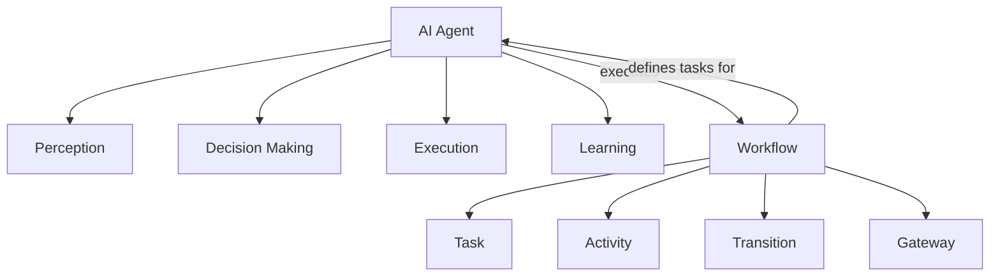
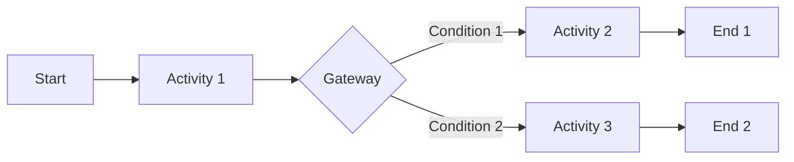

# AI人工智能代理工作流 AI Agent WorkFlow：在航空领域中的应用

## 1. 背景介绍
### 1.1 人工智能在航空领域的发展历程
#### 1.1.1 早期人工智能在航空领域的应用
#### 1.1.2 近年来人工智能技术的快速发展
#### 1.1.3 人工智能在航空领域的广泛应用前景

### 1.2 AI Agent工作流的概念
#### 1.2.1 AI Agent的定义
#### 1.2.2 工作流的基本概念
#### 1.2.3 AI Agent工作流的内涵

### 1.3 航空领域对AI Agent工作流的需求
#### 1.3.1 提高航空运营效率的需求
#### 1.3.2 保障飞行安全的需求  
#### 1.3.3 优化旅客体验的需求

## 2. 核心概念与联系
### 2.1 AI Agent的核心概念
#### 2.1.1 感知(Perception)
#### 2.1.2 决策(Decision Making)
#### 2.1.3 执行(Execution)
#### 2.1.4 学习(Learning)

### 2.2 工作流的核心概念  
#### 2.2.1 任务(Task)
#### 2.2.2 活动(Activity) 
#### 2.2.3 转移(Transition)
#### 2.2.4 网关(Gateway)

### 2.3 AI Agent与工作流的关系
#### 2.3.1 AI Agent作为工作流的执行者
#### 2.3.2 工作流定义AI Agent的任务
#### 2.3.3 AI Agent与工作流的交互



## 3. 核心算法原理具体操作步骤
### 3.1 基于规则的推理
#### 3.1.1 规则表示
#### 3.1.2 前向推理
#### 3.1.3 后向推理

### 3.2 基于案例的推理
#### 3.2.1 案例表示  
#### 3.2.2 案例检索
#### 3.2.3 案例复用与修改

### 3.3 深度强化学习
#### 3.3.1 马尔可夫决策过程
#### 3.3.2 Q-Learning算法
#### 3.3.3 Deep Q-Network(DQN)算法

### 3.4 工作流建模与执行
#### 3.4.1 BPMN建模
#### 3.4.2 Petri网建模  
#### 3.4.3 工作流执行引擎

## 4. 数学模型和公式详细讲解举例说明
### 4.1 马尔可夫决策过程(MDP)
一个MDP由一个四元组 $<S, A, P, R>$ 定义：

- $S$：状态集合
- $A$：动作集合
- $P$：状态转移概率矩阵，$P(s'|s,a)$表示在状态$s$下执行动作$a$后转移到状态$s'$的概率
- $R$：奖励函数，$R(s,a)$表示在状态$s$下执行动作$a$获得的即时奖励

求解MDP的目标是找到一个最优策略$\pi^*$，使得期望累积奖励最大化：

$$\pi^* = \arg\max_\pi E[\sum_{t=0}^{\infty} \gamma^t R(s_t,a_t)]$$

其中$\gamma \in [0,1]$是折扣因子，$t$是时间步。

### 4.2 Q-Learning算法
Q-Learning是一种常用的无模型强化学习算法，用于求解MDP。它通过不断更新状态-动作值函数$Q(s,a)$来逼近最优策略。

Q-Learning的更新规则为：

$$Q(s_t,a_t) \leftarrow Q(s_t,a_t) + \alpha[r_t + \gamma \max_a Q(s_{t+1},a) - Q(s_t,a_t)]$$

其中$\alpha \in (0,1]$是学习率，$r_t$是在时间步$t$获得的即时奖励。

### 4.3 Deep Q-Network(DQN)算法
DQN将深度神经网络与Q-Learning相结合，用于处理高维状态空间。它使用神经网络$Q(s,a;\theta)$来逼近状态-动作值函数，其中$\theta$是网络参数。

DQN的损失函数定义为：

$$L(\theta) = E[(r + \gamma \max_{a'} Q(s',a';\theta^-) - Q(s,a;\theta))^2]$$

其中$\theta^-$是目标网络的参数，用于计算目标Q值，以提高训练稳定性。

DQN的训练过程通过最小化损失函数来更新网络参数：

$$\theta \leftarrow \theta - \alpha \nabla_\theta L(\theta)$$

### 4.4 BPMN工作流建模
BPMN(Business Process Model and Notation)是一种标准的工作流建模语言，用于描述业务流程。它包含以下主要元素：

- 活动(Activity)：表示工作流中的任务
- 事件(Event)：表示工作流中的事件，如开始事件、结束事件等
- 网关(Gateway)：表示工作流中的分支与聚合
- 顺序流(Sequence Flow)：表示活动之间的执行顺序
- 消息流(Message Flow)：表示不同参与者之间的消息传递

下图是一个简单的BPMN工作流示例：



## 5. 项目实践：代码实例和详细解释说明
下面是一个使用Python实现的简单Q-Learning代码示例：

```python
import numpy as np

class QLearning:
    def __init__(self, num_states, num_actions, alpha, gamma):
        self.num_states = num_states
        self.num_actions = num_actions
        self.alpha = alpha
        self.gamma = gamma
        self.Q = np.zeros((num_states, num_actions))

    def choose_action(self, state, epsilon):
        if np.random.uniform(0, 1) < epsilon:
            action = np.random.randint(self.num_actions)
        else:
            action = np.argmax(self.Q[state, :])
        return action

    def update_q(self, state, action, reward, next_state):
        td_error = reward + self.gamma * np.max(self.Q[next_state, :]) - self.Q[state, action]
        self.Q[state, action] += self.alpha * td_error

# 初始化Q-Learning代理
num_states = 10
num_actions = 4
alpha = 0.1
gamma = 0.9
agent = QLearning(num_states, num_actions, alpha, gamma)

# 训练代理
num_episodes = 1000
epsilon = 0.1
for episode in range(num_episodes):
    state = np.random.randint(num_states)
    done = False
    while not done:
        action = agent.choose_action(state, epsilon)
        next_state = np.random.randint(num_states)
        reward = np.random.randn()
        agent.update_q(state, action, reward, next_state)
        state = next_state
        if np.random.uniform(0, 1) < 0.1:
            done = True

# 测试代理
state = np.random.randint(num_states)
done = False
while not done:
    action = agent.choose_action(state, 0)
    print(f"State: {state}, Action: {action}")
    next_state = np.random.randint(num_states)
    state = next_state
    if np.random.uniform(0, 1) < 0.1:
        done = True
```

这个示例中，我们定义了一个`QLearning`类，包含以下主要方法：

- `__init__(self, num_states, num_actions, alpha, gamma)`：初始化Q-Learning代理，包括状态数、动作数、学习率和折扣因子。
- `choose_action(self, state, epsilon)`：根据 $\epsilon$-贪心策略选择动作，以 $\epsilon$ 的概率随机探索，否则选择Q值最大的动作。
- `update_q(self, state, action, reward, next_state)`：根据Q-Learning的更新规则更新状态-动作值函数。

在训练阶段，我们让代理与环境进行交互，不断更新Q值。在测试阶段，我们让代理根据学习到的Q值选择动作，并观察其行为。

这只是一个简单的示例，实际应用中需要根据具体问题设计状态空间、动作空间和奖励函数，并使用更高效的算法和技巧来训练智能体。

## 6. 实际应用场景
### 6.1 航班调度优化
#### 6.1.1 问题描述
#### 6.1.2 基于AI Agent工作流的解决方案
#### 6.1.3 实际应用效果

### 6.2 飞机维修预测
#### 6.2.1 问题描述
#### 6.2.2 基于AI Agent工作流的解决方案
#### 6.2.3 实际应用效果

### 6.3 旅客行为分析与个性化服务
#### 6.3.1 问题描述
#### 6.3.2 基于AI Agent工作流的解决方案
#### 6.3.3 实际应用效果

## 7. 工具和资源推荐
### 7.1 工作流建模与执行工具
#### 7.1.1 Activiti
#### 7.1.2 JBPM
#### 7.1.3 Camunda

### 7.2 机器学习与深度学习框架
#### 7.2.1 TensorFlow
#### 7.2.2 PyTorch
#### 7.2.3 Scikit-learn

### 7.3 知识图谱构建工具
#### 7.3.1 Neo4j
#### 7.3.2 Apache Jena
#### 7.3.3 GraphDB

## 8. 总结：未来发展趋势与挑战
### 8.1 AI Agent工作流的发展趋势
#### 8.1.1 与区块链技术的结合
#### 8.1.2 与物联网技术的结合
#### 8.1.3 与云计算技术的结合

### 8.2 AI Agent工作流面临的挑战
#### 8.2.1 数据质量与安全问题
#### 8.2.2 算法的可解释性问题
#### 8.2.3 人机协作与伦理问题

## 9. 附录：常见问题与解答
### 9.1 如何选择合适的工作流建模语言？
### 9.2 如何处理航空领域的大规模数据？
### 9.3 如何保证AI Agent的决策可解释性？
### 9.4 如何设计AI Agent的奖励函数？
### 9.5 如何评估AI Agent工作流的性能？

作者：禅与计算机程序设计艺术 / Zen and the Art of Computer Programming