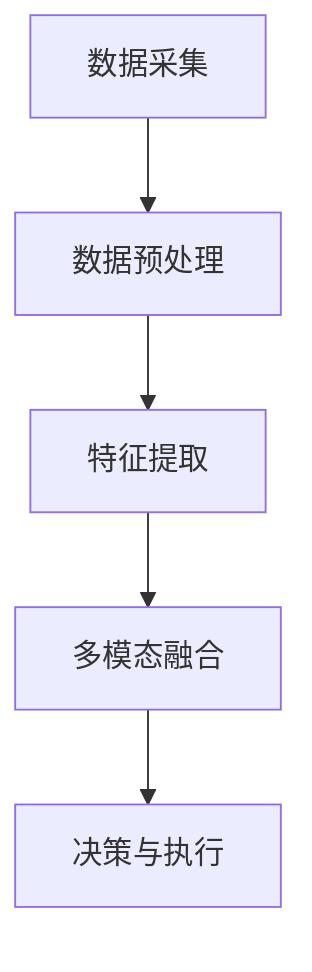

# AI人工智能代理工作流AI Agent WorkFlow：AI代理的多模态感知与处理能力

## 1.背景介绍

在当今的科技时代，人工智能（AI）已经成为推动各行各业变革的核心力量。AI代理作为一种智能系统，能够自主执行任务、做出决策，并与人类和其他系统进行交互。随着技术的不断进步，AI代理的多模态感知与处理能力成为了研究的热点。多模态感知指的是AI代理能够同时处理来自多个感知通道（如视觉、听觉、触觉等）的信息，从而更全面地理解和应对复杂的环境。

## 2.核心概念与联系

### 2.1 多模态感知

多模态感知是指AI代理能够同时处理和整合来自多个感知通道的信息。这些感知通道包括但不限于视觉、听觉、触觉、嗅觉和味觉。通过多模态感知，AI代理可以获得更全面和准确的环境信息，从而提高其决策和执行能力。

### 2.2 感知与处理的联系

感知与处理是AI代理工作的两个关键环节。感知是信息获取的过程，而处理是对获取的信息进行分析、理解和决策的过程。多模态感知与处理的紧密结合，使得AI代理能够在复杂环境中表现出更高的智能水平。

### 2.3 多模态感知与处理的优势

多模态感知与处理的主要优势包括：
- **信息丰富性**：通过多种感知通道获取的信息更加全面和丰富。
- **鲁棒性**：多模态感知可以提高系统的鲁棒性，减少单一感知通道失效带来的影响。
- **智能决策**：多模态信息的融合可以提高AI代理的决策质量和准确性。

## 3.核心算法原理具体操作步骤

### 3.1 数据采集与预处理

多模态感知的第一步是数据采集与预处理。不同感知通道的数据格式和特性各不相同，需要进行相应的预处理。



### 3.2 特征提取

特征提取是将原始数据转换为具有代表性的特征向量的过程。对于不同的感知通道，特征提取的方法也不同。例如，视觉数据可以通过卷积神经网络（CNN）进行特征提取，而听觉数据可以通过频谱分析进行特征提取。

### 3.3 多模态融合

多模态融合是将来自不同感知通道的特征进行整合的过程。常见的多模态融合方法包括：
- **早期融合**：在特征提取阶段进行融合。
- **中期融合**：在特征提取后、决策前进行融合。
- **晚期融合**：在决策阶段进行融合。

### 3.4 决策与执行

在多模态信息融合后，AI代理需要根据融合后的信息进行决策和执行。常见的决策算法包括决策树、支持向量机（SVM）和深度学习模型等。

## 4.数学模型和公式详细讲解举例说明

### 4.1 多模态感知的数学模型

多模态感知可以用数学模型来描述。假设有 $n$ 个感知通道，每个通道的输入数据为 $X_i$，特征提取函数为 $f_i$，则特征向量 $F_i$ 可以表示为：

$$
F_i = f_i(X_i)
$$

多模态融合函数为 $g$，则融合后的特征向量 $F$ 可以表示为：

$$
F = g(F_1, F_2, \ldots, F_n)
$$

### 4.2 决策模型

决策模型可以用函数 $h$ 来表示，输入为融合后的特征向量 $F$，输出为决策结果 $Y$：

$$
Y = h(F)
$$

### 4.3 实例说明

假设有两个感知通道：视觉和听觉。视觉数据 $X_1$ 通过卷积神经网络提取特征 $F_1$，听觉数据 $X_2$ 通过频谱分析提取特征 $F_2$。多模态融合函数 $g$ 可以是简单的特征拼接：

$$
F = [F_1, F_2]
$$

决策模型 $h$ 可以是一个简单的神经网络：

$$
Y = h(F)
$$

## 5.项目实践：代码实例和详细解释说明

### 5.1 数据采集与预处理

以下是一个简单的Python代码示例，展示了如何进行数据采集与预处理：

```python
import cv2
import numpy as np
import librosa

# 视觉数据采集与预处理
def preprocess_image(image_path):
    image = cv2.imread(image_path)
    image = cv2.resize(image, (224, 224))
    image = image / 255.0
    return image

# 听觉数据采集与预处理
def preprocess_audio(audio_path):
    y, sr = librosa.load(audio_path, sr=16000)
    mfccs = librosa.feature.mfcc(y=y, sr=sr, n_mfcc=13)
    return mfccs

image = preprocess_image('image.jpg')
audio = preprocess_audio('audio.wav')
```

### 5.2 特征提取

以下是特征提取的代码示例：

```python
from keras.applications.vgg16 import VGG16
from keras.models import Model

# 视觉特征提取
def extract_image_features(image):
    base_model = VGG16(weights='imagenet', include_top=False)
    model = Model(inputs=base_model.input, outputs=base_model.output)
    features = model.predict(np.expand_dims(image, axis=0))
    return features

# 听觉特征提取
def extract_audio_features(mfccs):
    return np.mean(mfccs, axis=1)

image_features = extract_image_features(image)
audio_features = extract_audio_features(audio)
```

### 5.3 多模态融合与决策

以下是多模态融合与决策的代码示例：

```python
from keras.models import Sequential
from keras.layers import Dense, Flatten

# 多模态融合
def fuse_features(image_features, audio_features):
    return np.concatenate((image_features.flatten(), audio_features))

# 决策模型
def build_decision_model(input_shape):
    model = Sequential()
    model.add(Dense(128, activation='relu', input_shape=input_shape))
    model.add(Dense(64, activation='relu'))
    model.add(Dense(1, activation='sigmoid'))
    model.compile(optimizer='adam', loss='binary_crossentropy', metrics=['accuracy'])
    return model

fused_features = fuse_features(image_features, audio_features)
decision_model = build_decision_model((fused_features.shape[0],))
decision_model.summary()
```

## 6.实际应用场景

### 6.1 智能家居

在智能家居中，AI代理可以通过多模态感知技术来实现更智能的家居控制。例如，通过视觉和听觉感知，AI代理可以识别家庭成员的身份和情绪，从而调整家居设备的设置。

### 6.2 医疗诊断

在医疗诊断中，多模态感知技术可以帮助医生更准确地诊断疾病。例如，通过结合影像数据和生理信号，AI代理可以提供更全面的诊断信息。

### 6.3 自动驾驶

在自动驾驶中，多模态感知技术可以提高车辆的感知能力和安全性。例如，通过结合视觉、雷达和激光雷达数据，自动驾驶系统可以更准确地感知周围环境，从而做出更安全的驾驶决策。

## 7.工具和资源推荐

### 7.1 开源工具

- **TensorFlow**：一个开源的机器学习框架，支持多模态感知和处理。
- **PyTorch**：另一个流行的开源机器学习框架，具有强大的多模态处理能力。
- **OpenCV**：一个开源的计算机视觉库，支持视觉数据的处理和特征提取。
- **Librosa**：一个开源的音频处理库，支持听觉数据的处理和特征提取。

### 7.2 数据集

- **ImageNet**：一个大型的视觉数据集，常用于图像分类和特征提取。
- **AudioSet**：一个大型的音频数据集，常用于音频分类和特征提取。
- **KITTI**：一个自动驾驶数据集，包含多模态感知数据，如图像、雷达和激光雷达数据。

## 8.总结：未来发展趋势与挑战

### 8.1 未来发展趋势

多模态感知与处理技术在未来有着广阔的发展前景。随着传感器技术和计算能力的不断提升，AI代理将能够处理更加复杂和多样化的感知数据，从而实现更高水平的智能化。

### 8.2 挑战

尽管多模态感知与处理技术有着巨大的潜力，但也面临着一些挑战：
- **数据融合**：如何有效地融合来自不同感知通道的数据是一个重要的研究课题。
- **计算资源**：多模态感知与处理需要大量的计算资源，如何提高计算效率是一个关键问题。
- **鲁棒性**：如何提高系统的鲁棒性，减少单一感知通道失效带来的影响，是一个重要的挑战。

## 9.附录：常见问题与解答

### 9.1 多模态感知与单模态感知的区别是什么？

多模态感知是指AI代理能够同时处理来自多个感知通道的信息，而单模态感知则只处理来自单一感知通道的信息。多模态感知可以提供更全面和准确的环境信息，从而提高AI代理的决策和执行能力。

### 9.2 多模态感知技术的应用场景有哪些？

多模态感知技术的应用场景包括智能家居、医疗诊断、自动驾驶等。在这些场景中，多模态感知技术可以提高系统的智能化水平和鲁棒性。

### 9.3 如何选择合适的多模态融合方法？

选择合适的多模态融合方法需要考虑具体的应用场景和数据特性。早期融合适用于特征提取阶段的数据融合，中期融合适用于特征提取后、决策前的数据融合，晚期融合适用于决策阶段的数据融合。

### 9.4 多模态感知技术的未来发展趋势是什么？

多模态感知技术在未来有着广阔的发展前景。随着传感器技术和计算能力的不断提升，AI代理将能够处理更加复杂和多样化的感知数据，从而实现更高水平的智能化。

---

作者：禅与计算机程序设计艺术 / Zen and the Art of Computer Programming