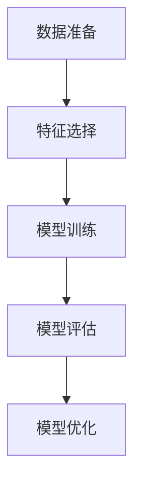

# AI人工智能核心算法原理与代码实例讲解：机器智能

## 1.背景介绍

人工智能（AI）作为当今科技领域最前沿的技术之一，已经在各个行业中展现出其强大的潜力和应用价值。从自动驾驶汽车到智能语音助手，AI正在改变我们的生活方式和工作方式。本文将深入探讨AI的核心算法原理，并通过具体的代码实例来帮助读者更好地理解这些复杂的技术。

## 2.核心概念与联系

在深入探讨AI算法之前，我们需要了解一些基本的核心概念：

### 2.1 机器学习

机器学习是AI的一个子领域，旨在通过数据训练模型，使其能够自动改进和预测。常见的机器学习算法包括线性回归、决策树、支持向量机等。

### 2.2 深度学习

深度学习是机器学习的一个分支，主要使用神经网络来处理复杂的数据。深度学习在图像识别、自然语言处理等领域表现尤为突出。

### 2.3 强化学习

强化学习是一种通过奖励和惩罚机制来训练模型的方法，常用于游戏AI和机器人控制。

### 2.4 数据预处理

数据预处理是机器学习和深度学习中不可或缺的一部分，涉及数据清洗、归一化、特征提取等步骤。

### 2.5 模型评估

模型评估是衡量模型性能的重要步骤，常用的评估指标包括准确率、精确率、召回率、F1分数等。

## 3.核心算法原理具体操作步骤

### 3.1 线性回归

线性回归是一种最简单的监督学习算法，用于预测连续值。其基本思想是找到一个最佳拟合直线，使得数据点到直线的距离最小。

#### 操作步骤：

1. **数据准备**：收集和清洗数据。
2. **特征选择**：选择相关的特征变量。
3. **模型训练**：使用最小二乘法来拟合直线。
4. **模型评估**：使用均方误差（MSE）来评估模型性能。

### 3.2 决策树

决策树是一种树形结构的监督学习算法，适用于分类和回归任务。其基本思想是通过一系列的决策规则将数据分割成不同的类别。

#### 操作步骤：

1. **数据准备**：收集和清洗数据。
2. **特征选择**：选择相关的特征变量。
3. **树的构建**：使用信息增益或基尼指数来选择最佳分割点。
4. **模型评估**：使用准确率或均方误差来评估模型性能。

### 3.3 神经网络

神经网络是深度学习的基础结构，模拟人脑的神经元连接。其基本思想是通过多层神经元的连接和激活函数来处理复杂的数据。

#### 操作步骤：

1. **数据准备**：收集和清洗数据。
2. **特征选择**：选择相关的特征变量。
3. **模型构建**：定义神经网络的层数和每层的神经元数量。
4. **模型训练**：使用反向传播算法来调整权重。
5. **模型评估**：使用准确率或均方误差来评估模型性能。

## 4.数学模型和公式详细讲解举例说明

### 4.1 线性回归

线性回归的数学模型可以表示为：

$$
y = \beta_0 + \beta_1 x_1 + \beta_2 x_2 + \cdots + \beta_n x_n + \epsilon
$$

其中，$y$ 是预测值，$\beta_0$ 是截距，$\beta_1, \beta_2, \cdots, \beta_n$ 是回归系数，$x_1, x_2, \cdots, x_n$ 是特征变量，$\epsilon$ 是误差项。

### 4.2 决策树

决策树的分割规则可以通过信息增益来确定，信息增益的公式为：

$$
IG(D, A) = Entropy(D) - \sum_{v \in Values(A)} \frac{|D_v|}{|D|} Entropy(D_v)
$$

其中，$D$ 是数据集，$A$ 是特征，$D_v$ 是特征$A$取值为$v$的子集，$Entropy$ 是熵的计算公式。

### 4.3 神经网络

神经网络的激活函数常用的有Sigmoid函数和ReLU函数，Sigmoid函数的公式为：

$$
\sigma(x) = \frac{1}{1 + e^{-x}}
$$

ReLU函数的公式为：

$$
ReLU(x) = \max(0, x)
$$

## 5.项目实践：代码实例和详细解释说明

### 5.1 线性回归代码实例

```python
import numpy as np
import matplotlib.pyplot as plt
from sklearn.linear_model import LinearRegression

# 生成数据
X = np.array([1, 2, 3, 4, 5]).reshape(-1, 1)
y = np.array([1, 3, 2, 3, 5])

# 创建线性回归模型
model = LinearRegression()
model.fit(X, y)

# 预测
y_pred = model.predict(X)

# 可视化
plt.scatter(X, y, color='blue')
plt.plot(X, y_pred, color='red')
plt.xlabel('X')
plt.ylabel('y')
plt.title('Linear Regression')
plt.show()
```

### 5.2 决策树代码实例

```python
import numpy as np
from sklearn.tree import DecisionTreeClassifier
from sklearn import datasets
import matplotlib.pyplot as plt
from sklearn.tree import plot_tree

# 加载数据集
iris = datasets.load_iris()
X = iris.data
y = iris.target

# 创建决策树模型
model = DecisionTreeClassifier()
model.fit(X, y)

# 可视化决策树
plt.figure(figsize=(20,10))
plot_tree(model, filled=True, feature_names=iris.feature_names, class_names=iris.target_names)
plt.show()
```

### 5.3 神经网络代码实例

```python
import tensorflow as tf
from tensorflow.keras.models import Sequential
from tensorflow.keras.layers import Dense

# 生成数据
X = np.array([[0,0], [0,1], [1,0], [1,1]])
y = np.array([[0], [1], [1], [0]])

# 创建神经网络模型
model = Sequential()
model.add(Dense(2, input_dim=2, activation='relu'))
model.add(Dense(1, activation='sigmoid'))

# 编译模型
model.compile(loss='binary_crossentropy', optimizer='adam', metrics=['accuracy'])

# 训练模型
model.fit(X, y, epochs=1000, verbose=0)

# 预测
y_pred = model.predict(X)
print(y_pred)
```

## 6.实际应用场景

### 6.1 线性回归的应用

线性回归广泛应用于经济学、金融学和社会科学中，用于预测房价、股票价格和市场需求等。

### 6.2 决策树的应用

决策树在医疗诊断、金融风险评估和市场营销中有广泛应用。例如，决策树可以用于预测患者是否患有某种疾病，评估贷款申请人的信用风险等。

### 6.3 神经网络的应用

神经网络在图像识别、语音识别和自然语言处理等领域表现出色。例如，卷积神经网络（CNN）在图像分类和目标检测中取得了显著成果，循环神经网络（RNN）在语音识别和机器翻译中表现优异。

## 7.工具和资源推荐

### 7.1 编程语言和库

- **Python**：Python是AI和机器学习领域最常用的编程语言，拥有丰富的库和工具。
- **TensorFlow**：一个开源的深度学习框架，广泛应用于神经网络的研究和开发。
- **scikit-learn**：一个简单高效的机器学习库，适用于数据挖掘和数据分析。

### 7.2 在线课程和书籍

- **Coursera**：提供丰富的AI和机器学习课程，如Andrew Ng的机器学习课程。
- **《深度学习》**：由Ian Goodfellow等人编写，是深度学习领域的经典教材。
- **《机器学习实战》**：Peter Harrington编写，提供了丰富的机器学习算法和代码实例。

### 7.3 数据集

- **Kaggle**：一个数据科学竞赛平台，提供丰富的数据集和竞赛机会。
- **UCI机器学习库**：一个广泛使用的机器学习数据集库，适用于各种机器学习任务。

## 8.总结：未来发展趋势与挑战

### 8.1 未来发展趋势

- **自动化机器学习（AutoML）**：通过自动化的方式来选择和优化机器学习模型，降低了使用门槛。
- **联邦学习**：一种分布式机器学习方法，能够在保护数据隐私的前提下进行模型训练。
- **解释性AI**：随着AI应用的广泛，解释性AI变得越来越重要，旨在使AI决策过程透明化和可解释。

### 8.2 挑战

- **数据隐私和安全**：随着数据量的增加，如何保护用户隐私和数据安全成为一个重要挑战。
- **模型的公平性和偏见**：AI模型可能会存在偏见，如何确保模型的公平性是一个亟待解决的问题。
- **计算资源和能耗**：深度学习模型的训练需要大量的计算资源和能耗，如何提高效率和降低能耗是一个重要的研究方向。

## 9.附录：常见问题与解答

### 9.1 什么是过拟合和欠拟合？

- **过拟合**：模型在训练数据上表现很好，但在测试数据上表现较差，说明模型过于复杂，捕捉到了数据中的噪声。
- **欠拟合**：模型在训练数据和测试数据上都表现较差，说明模型过于简单，无法捕捉到数据中的模式。

### 9.2 如何选择合适的机器学习算法？

选择合适的机器学习算法需要考虑数据的特性、任务的类型和模型的性能。可以通过交叉验证和网格搜索来选择和优化模型。

### 9.3 什么是梯度下降算法？

梯度下降算法是一种优化算法，用于最小化损失函数。其基本思想是通过迭代更新模型参数，使得损失函数逐渐减小。



作者：禅与计算机程序设计艺术 / Zen and the Art of Computer Programming