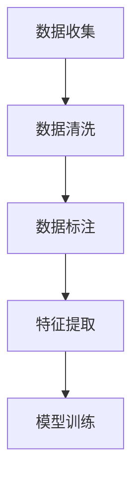
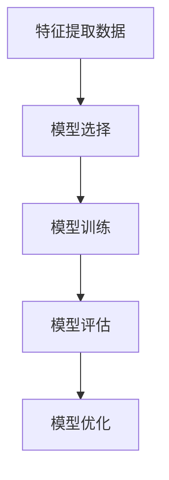
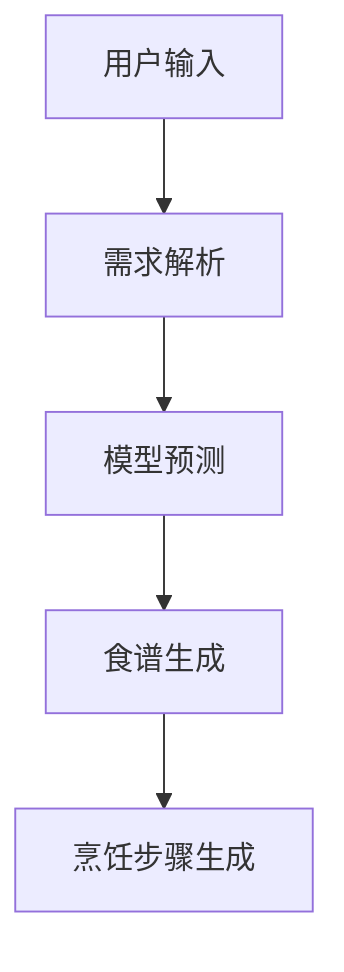
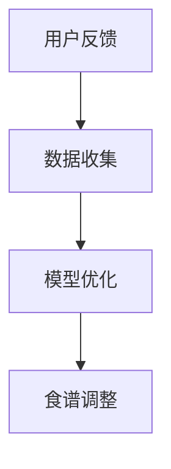

# AI系统Chef原理与代码实战案例讲解

## 1.背景介绍

在现代科技的推动下，人工智能（AI）已经渗透到各个领域，从医疗诊断到自动驾驶，无处不在。而在日常生活中，AI也在逐步改变我们的饮食习惯和烹饪方式。AI系统Chef正是这样一个创新的应用，它利用深度学习和自然语言处理技术，帮助用户生成个性化的食谱，优化烹饪流程，并提供智能化的烹饪指导。

AI系统Chef不仅仅是一个简单的食谱生成器，它还能够根据用户的饮食偏好、健康状况和现有食材，提供个性化的烹饪建议。这一系统的核心在于其强大的算法和数据处理能力，使其能够在海量数据中提取有用信息，并进行智能化的决策。

## 2.核心概念与联系

在深入探讨AI系统Chef的实现原理之前，我们需要了解一些核心概念和它们之间的联系。

### 2.1 深度学习

深度学习是AI系统Chef的核心技术之一。它通过多层神经网络来模拟人脑的工作方式，从而实现复杂数据的处理和分析。深度学习在图像识别、语音识别和自然语言处理等领域表现出色。

### 2.2 自然语言处理（NLP）

自然语言处理是AI系统Chef用来理解和生成人类语言的技术。通过NLP，系统能够解析用户输入的文本信息，如食材、口味偏好等，并生成相应的食谱和烹饪步骤。

### 2.3 数据挖掘

数据挖掘技术用于从大量的食谱和用户数据中提取有用的信息。这些信息包括食材的搭配、烹饪时间、营养成分等。通过数据挖掘，AI系统Chef能够提供更加精准和个性化的烹饪建议。

### 2.4 机器学习

机器学习是AI系统Chef的基础，通过训练模型，系统能够不断优化其推荐算法，提高食谱生成的准确性和用户满意度。

### 2.5 用户界面（UI）和用户体验（UX）

一个好的AI系统不仅需要强大的后台算法，还需要友好的用户界面和良好的用户体验。AI系统Chef通过直观的界面和交互设计，使用户能够轻松地输入需求并获取烹饪建议。

## 3.核心算法原理具体操作步骤

AI系统Chef的核心算法主要包括数据预处理、模型训练、食谱生成和用户反馈四个步骤。下面我们将详细介绍每个步骤的具体操作。

### 3.1 数据预处理

数据预处理是整个系统的基础，它包括数据清洗、数据标注和特征提取等步骤。通过数据预处理，我们能够将原始数据转化为适合模型训练的格式。



### 3.2 模型训练

模型训练是AI系统Chef的核心步骤。我们使用深度学习和机器学习算法，对预处理后的数据进行训练，生成能够进行食谱推荐的模型。



### 3.3 食谱生成

食谱生成是AI系统Chef的关键功能。通过训练好的模型，系统能够根据用户输入的需求，生成个性化的食谱和烹饪步骤。



### 3.4 用户反馈

用户反馈是系统优化的重要环节。通过收集用户的反馈信息，系统能够不断调整和优化其推荐算法，提高用户满意度。



## 4.数学模型和公式详细讲解举例说明

在AI系统Chef中，数学模型和公式是实现食谱推荐和优化的关键。下面我们将详细介绍一些核心的数学模型和公式。

### 4.1 神经网络模型

神经网络是深度学习的基础。一个典型的神经网络由输入层、隐藏层和输出层组成。每一层的神经元通过权重和偏置连接，形成一个复杂的网络结构。

$$
y = f(Wx + b)
$$

其中，$W$ 是权重矩阵，$x$ 是输入向量，$b$ 是偏置向量，$f$ 是激活函数。

### 4.2 损失函数

损失函数用于衡量模型预测值与真实值之间的差距。在AI系统Chef中，我们常用的损失函数是均方误差（MSE）。

$$
L = \frac{1}{n} \sum_{i=1}^{n} (y_i - \hat{y}_i)^2
$$

其中，$y_i$ 是真实值，$\hat{y}_i$ 是预测值，$n$ 是样本数量。

### 4.3 优化算法

优化算法用于调整模型的参数，使损失函数达到最小值。常用的优化算法有梯度下降（Gradient Descent）。

$$
\theta = \theta - \alpha \nabla L(\theta)
$$

其中，$\theta$ 是模型参数，$\alpha$ 是学习率，$\nabla L(\theta)$ 是损失函数的梯度。

### 4.4 自然语言处理模型

在自然语言处理方面，我们常用的模型是循环神经网络（RNN）和长短期记忆网络（LSTM）。这些模型能够处理序列数据，如文本和时间序列。

$$
h_t = f(W_h h_{t-1} + W_x x_t + b)
$$

其中，$h_t$ 是当前时刻的隐藏状态，$h_{t-1}$ 是前一时刻的隐藏状态，$x_t$ 是当前时刻的输入，$W_h$ 和 $W_x$ 是权重矩阵，$b$ 是偏置向量。

## 5.项目实践：代码实例和详细解释说明

为了更好地理解AI系统Chef的实现原理，我们将通过一个具体的代码实例来展示其核心功能。以下是一个简单的食谱生成示例。

### 5.1 数据预处理

首先，我们需要对原始数据进行预处理。假设我们有一个包含食谱和食材的CSV文件。

```python
import pandas as pd

# 读取数据
data = pd.read_csv('recipes.csv')

# 数据清洗
data.dropna(inplace=True)

# 数据标注
data['label'] = data['recipe'].apply(lambda x: 1 if 'chicken' in x else 0)

# 特征提取
from sklearn.feature_extraction.text import CountVectorizer

vectorizer = CountVectorizer()
X = vectorizer.fit_transform(data['ingredients'])
y = data['label']
```

### 5.2 模型训练

接下来，我们使用一个简单的逻辑回归模型进行训练。

```python
from sklearn.model_selection import train_test_split
from sklearn.linear_model import LogisticRegression
from sklearn.metrics import accuracy_score

# 划分训练集和测试集
X_train, X_test, y_train, y_test = train_test_split(X, y, test_size=0.2, random_state=42)

# 训练模型
model = LogisticRegression()
model.fit(X_train, y_train)

# 模型评估
y_pred = model.predict(X_test)
print(f'Accuracy: {accuracy_score(y_test, y_pred)}')
```

### 5.3 食谱生成

通过训练好的模型，我们可以根据用户输入的食材生成食谱。

```python
def generate_recipe(ingredients):
    input_data = vectorizer.transform([ingredients])
    prediction = model.predict(input_data)
    if prediction == 1:
        return "Chicken Recipe"
    else:
        return "Non-Chicken Recipe"

# 示例
user_ingredients = "chicken, garlic, onion"
print(generate_recipe(user_ingredients))
```

### 5.4 用户反馈

最后，我们收集用户的反馈信息，并用于模型的优化。

```python
def collect_feedback(recipe, feedback):
    # 假设我们将反馈信息存储在一个CSV文件中
    feedback_data = pd.read_csv('feedback.csv')
    feedback_data = feedback_data.append({'recipe': recipe, 'feedback': feedback}, ignore_index=True)
    feedback_data.to_csv('feedback.csv', index=False)

# 示例
collect_feedback("Chicken Recipe", "Delicious!")
```

## 6.实际应用场景

AI系统Chef在实际应用中有广泛的场景。以下是一些典型的应用场景。

### 6.1 个性化食谱推荐

通过分析用户的饮食偏好和健康状况，AI系统Chef能够生成个性化的食谱，满足用户的个性化需求。

### 6.2 健康饮食指导

AI系统Chef能够根据用户的健康数据，如体重、血糖等，提供健康饮食指导，帮助用户保持健康。

### 6.3 食材管理和优化

通过分析用户的食材库存，AI系统Chef能够提供食材管理和优化建议，减少食材浪费。

### 6.4 烹饪指导

AI系统Chef能够提供详细的烹饪步骤和技巧，帮助用户提高烹饪技能。

## 7.工具和资源推荐

在实现AI系统Chef的过程中，我们可以使用一些开源工具和资源来提高开发效率。

### 7.1 开源框架

- TensorFlow：一个开源的深度学习框架，适用于大规模机器学习任务。
- PyTorch：另一个流行的深度学习框架，具有灵活性和易用性。
- Scikit-learn：一个简单高效的机器学习工具包，适用于数据挖掘和数据分析。

### 7.2 数据集

- Recipe1M：一个包含百万级食谱和食材的数据集，适用于食谱生成和推荐任务。
- Food-101：一个包含10万张食物图片的数据集，适用于图像识别和分类任务。

### 7.3 在线资源

- Kaggle：一个数据科学竞赛平台，提供丰富的数据集和代码示例。
- GitHub：一个开源代码托管平台，提供大量的开源项目和代码库。

## 8.总结：未来发展趋势与挑战

AI系统Chef作为一个创新的应用，已经在个性化食谱推荐、健康饮食指导和烹饪指导等方面展现出巨大的潜力。然而，未来的发展仍然面临一些挑战。

### 8.1 数据隐私和安全

在收集和处理用户数据的过程中，数据隐私和安全是一个重要的问题。如何保护用户的隐私，防止数据泄露，是未来需要解决的关键问题。

### 8.2 模型的可解释性

当前的深度学习模型往往是黑箱模型，缺乏可解释性。如何提高模型的可解释性，使用户能够理解和信任系统的推荐结果，是一个重要的研究方向。

### 8.3 多模态数据融合

未来的AI系统Chef需要能够处理多模态数据，如文本、图像和语音等。如何有效地融合和处理这些多模态数据，是一个重要的技术挑战。

### 8.4 用户体验的提升

一个成功的AI系统不仅需要强大的后台算法，还需要良好的用户体验。如何设计直观友好的用户界面，提高用户的使用体验，是未来需要关注的重点。

## 9.附录：常见问题与解答

### 9.1 AI系统Chef能否处理多种语言的食谱？

是的，AI系统Chef可以通过自然语言处理技术，处理多种语言的食谱。只需要对不同语言的数据进行预处理和标注，即可实现多语言支持。

### 9.2 如何提高AI系统Chef的推荐准确性？

提高推荐准确性的方法包括：增加数据量、优化模型结构、调整超参数、引入用户反馈等。

### 9.3 AI系统Chef是否能够实时生成食谱？

是的，通过优化算法和提高计算效率，AI系统Chef可以实现实时生成食谱，满足用户的即时需求。

### 9.4 AI系统Chef是否能够处理图像数据？

是的，通过引入图像识别技术，AI系统Chef可以处理图像数据，如识别食材、分析菜品等。

### 9.5 如何保护用户的隐私？

保护用户隐私的方法包括：数据加密、匿名化处理、严格的访问控制等。

---

作者：禅与计算机程序设计艺术 / Zen and the Art of Computer Programming