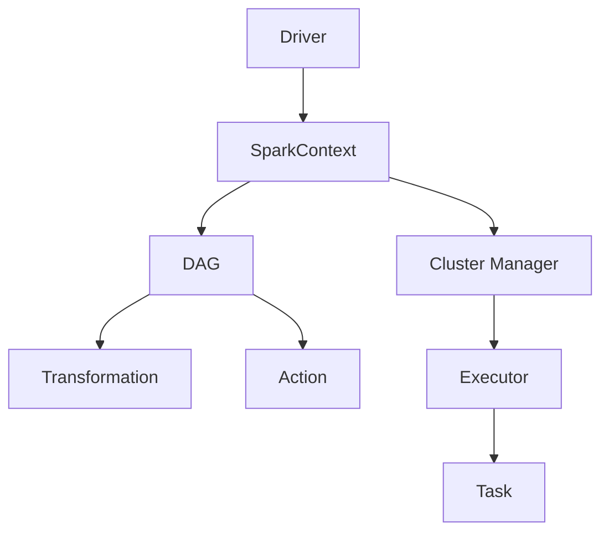
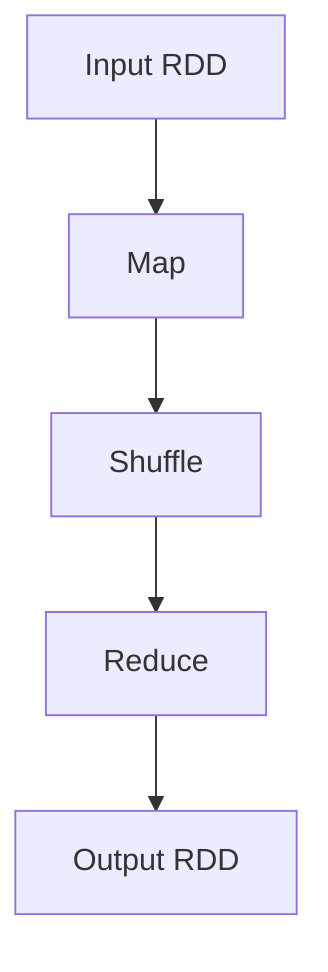

# Apache Spark 原理与代码实战

## 1.背景介绍

Apache Spark 是一个开源的分布式计算系统，旨在以高效、可扩展的方式处理大规模数据。自2014年正式发布以来，Spark 已成为大数据处理领域的核心工具之一。其主要特点包括内存计算、丰富的API、强大的生态系统和广泛的社区支持。本文将深入探讨 Spark 的核心概念、算法原理、数学模型、实际应用场景以及代码实例，帮助读者全面理解和掌握 Spark。

## 2.核心概念与联系

### 2.1 RDD（弹性分布式数据集）

RDD 是 Spark 的核心抽象，代表一个不可变的分布式对象集合。RDD 提供了两类操作：转换（Transformation）和行动（Action）。转换操作生成新的 RDD，而行动操作则触发实际计算。

### 2.2 DAG（有向无环图）

Spark 使用 DAG 来表示计算任务的依赖关系。每个 RDD 的转换操作都会生成一个新的节点，形成一个 DAG。行动操作会触发 DAG 的执行。

### 2.3 SparkContext

SparkContext 是 Spark 应用的入口点，负责与集群管理器（如 YARN、Mesos）通信，分配资源并启动任务。

### 2.4 Executor

Executor 是在工作节点上运行的进程，负责执行任务并将结果返回给驱动程序。

### 2.5 Driver

Driver 是运行 SparkContext 的进程，负责将用户的代码转换为任务，并将任务分发给 Executor。

### 2.6 核心组件关系图



## 3.核心算法原理具体操作步骤

### 3.1 MapReduce

MapReduce 是一种编程模型，用于处理大规模数据。Spark 提供了对 MapReduce 的支持，但其内存计算模型使得 Spark 比传统的 MapReduce 更高效。

#### 3.1.1 Map 操作

Map 操作将一个函数应用于 RDD 的每个元素，生成一个新的 RDD。

#### 3.1.2 Reduce 操作

Reduce 操作将 RDD 的元素合并，生成一个单一的结果。

### 3.2 Shuffle

Shuffle 是指在不同节点之间重新分配数据的过程。Shuffle 操作通常会导致性能瓶颈，因此需要优化。

### 3.3 Join

Join 操作用于合并两个 RDD。Spark 提供了多种 Join 算法，如 Hash Join 和 Sort-Merge Join。

### 3.4 核心算法流程图



## 4.数学模型和公式详细讲解举例说明

### 4.1 RDD 的数学表示

RDD 可以表示为一个集合 $ R = \{r_1, r_2, \ldots, r_n\} $，其中 $ r_i $ 是 RDD 的一个元素。

### 4.2 Map 操作的数学表示

Map 操作可以表示为一个函数 $ f $ 应用于 RDD 的每个元素：

$$
R' = \{f(r_1), f(r_2), \ldots, f(r_n)\}
$$

### 4.3 Reduce 操作的数学表示

Reduce 操作可以表示为一个二元操作 $ g $ 应用于 RDD 的所有元素：

$$
R' = g(g(\ldots g(r_1, r_2) \ldots), r_n)
$$

### 4.4 具体示例

假设我们有一个 RDD $ R = \{1, 2, 3, 4, 5\} $，我们希望计算其平方和。

#### 4.4.1 Map 操作

$$
R' = \{1^2, 2^2, 3^2, 4^2, 5^2\} = \{1, 4, 9, 16, 25\}
$$

#### 4.4.2 Reduce 操作

$$
R'' = 1 + 4 + 9 + 16 + 25 = 55
$$

## 5.项目实践：代码实例和详细解释说明

### 5.1 环境配置

首先，我们需要配置 Spark 环境。可以使用以下命令安装 Spark：

```bash
wget https://archive.apache.org/dist/spark/spark-3.0.1/spark-3.0.1-bin-hadoop2.7.tgz
tar -xzf spark-3.0.1-bin-hadoop2.7.tgz
export SPARK_HOME=$(pwd)/spark-3.0.1-bin-hadoop2.7
export PATH=$SPARK_HOME/bin:$PATH
```

### 5.2 代码实例

以下是一个简单的 Spark 应用程序，用于计算 RDD 的平方和：

```python
from pyspark import SparkContext

# 初始化 SparkContext
sc = SparkContext("local", "SquareSum")

# 创建 RDD
rdd = sc.parallelize([1, 2, 3, 4, 5])

# 计算平方和
squares = rdd.map(lambda x: x * x)
result = squares.reduce(lambda x, y: x + y)

print("Square Sum:", result)

# 停止 SparkContext
sc.stop()
```

### 5.3 详细解释

1. **初始化 SparkContext**：`sc = SparkContext("local", "SquareSum")` 创建一个本地模式的 SparkContext。
2. **创建 RDD**：`rdd = sc.parallelize([1, 2, 3, 4, 5])` 创建一个包含 1 到 5 的 RDD。
3. **计算平方和**：
   - `squares = rdd.map(lambda x: x * x)` 计算每个元素的平方。
   - `result = squares.reduce(lambda x, y: x + y)` 计算所有平方的和。
4. **输出结果**：`print("Square Sum:", result)` 输出结果。
5. **停止 SparkContext**：`sc.stop()` 停止 SparkContext。

## 6.实际应用场景

### 6.1 数据处理

Spark 常用于大规模数据处理任务，如 ETL（抽取、转换、加载）过程。其内存计算模型使得数据处理速度显著提升。

### 6.2 机器学习

Spark 提供了 MLlib 库，支持多种机器学习算法，如回归、分类、聚类等。MLlib 可以处理大规模数据，适用于分布式环境。

### 6.3 实时数据流处理

Spark Streaming 是 Spark 的扩展，用于处理实时数据流。它将实时数据分成小批次，并使用 Spark 的 API 进行处理。

### 6.4 图计算

GraphX 是 Spark 的图计算库，支持图的创建、操作和分析。GraphX 提供了多种图算法，如 PageRank、连通组件等。

## 7.工具和资源推荐

### 7.1 工具

- **Apache Zeppelin**：一个基于 Web 的笔记本，支持交互式数据分析。
- **Jupyter Notebook**：一个开源的 Web 应用程序，支持创建和共享包含代码、方程、可视化和文本的文档。
- **Hadoop**：一个分布式存储和处理框架，Spark 可以与 Hadoop 集成，使用 HDFS 作为存储层。

### 7.2 资源

- **官方文档**：Spark 官方文档是学习 Spark 的最佳资源，提供了详细的 API 说明和使用示例。
- **书籍**：《Learning Spark》是一本经典的 Spark 入门书籍，适合初学者。
- **在线课程**：Coursera 和 Udacity 提供了多种 Spark 相关的在线课程，适合不同水平的学习者。

## 8.总结：未来发展趋势与挑战

### 8.1 未来发展趋势

- **统一数据处理平台**：Spark 正在向统一数据处理平台发展，支持批处理、流处理、机器学习和图计算。
- **性能优化**：随着硬件和网络技术的发展，Spark 的性能将进一步提升。
- **生态系统扩展**：Spark 的生态系统将继续扩展，支持更多的数据源和计算框架。

### 8.2 挑战

- **资源管理**：在大规模集群中，资源管理和调度是一个重要的挑战。
- **数据安全**：随着数据隐私和安全问题的日益重要，Spark 需要提供更强的数据安全保障。
- **复杂性**：Spark 的功能越来越强大，但也带来了使用上的复杂性，需要更好的工具和文档支持。

## 9.附录：常见问题与解答

### 9.1 如何优化 Spark 性能？

- **使用缓存**：将频繁使用的 RDD 缓存到内存中，减少重复计算。
- **优化 Shuffle**：减少 Shuffle 操作，使用合适的分区策略。
- **调整并行度**：根据集群资源调整任务的并行度，避免资源浪费。

### 9.2 如何处理内存不足问题？

- **增加内存**：为 Executor 分配更多内存。
- **使用磁盘存储**：将部分数据存储到磁盘，减少内存占用。
- **优化数据结构**：使用更高效的数据结构，减少内存占用。

### 9.3 如何调试 Spark 应用？

- **使用日志**：查看 Spark 日志，了解任务执行情况。
- **使用 Web UI**：Spark 提供了 Web UI，可以查看任务的执行计划和状态。
- **使用调试工具**：如 Apache Zeppelin 和 Jupyter Notebook，进行交互式调试。

---

作者：禅与计算机程序设计艺术 / Zen and the Art of Computer Programming