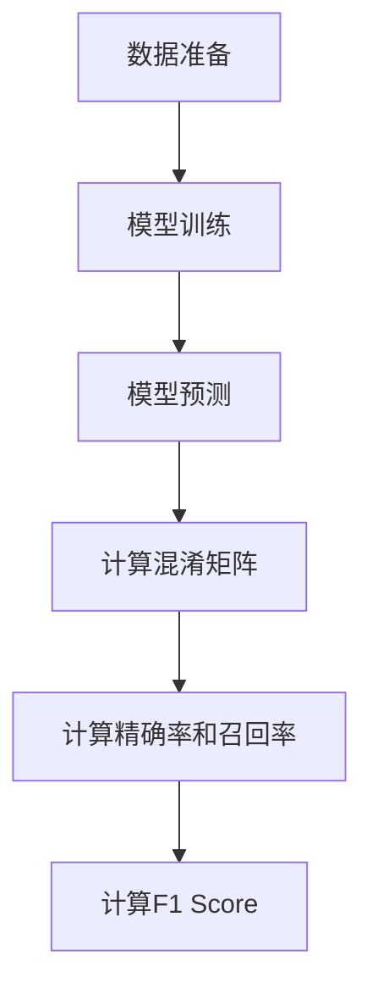

# F1 Score原理与代码实例讲解

## 1.背景介绍

在机器学习和数据科学领域，评估模型性能是一个至关重要的环节。无论是分类问题还是回归问题，选择合适的评估指标都能帮助我们更好地理解模型的表现。对于分类问题，尤其是不平衡数据集，F1 Score 是一个非常重要的评估指标。它综合了精确率（Precision）和召回率（Recall），提供了一个更全面的模型性能评估。

## 2.核心概念与联系

### 2.1 精确率（Precision）

精确率是指在所有被预测为正类的样本中，实际为正类的比例。公式如下：

$$
\text{Precision} = \frac{TP}{TP + FP}
$$

其中，TP（True Positive）表示真正类，FP（False Positive）表示假正类。

### 2.2 召回率（Recall）

召回率是指在所有实际为正类的样本中，被正确预测为正类的比例。公式如下：

$$
\text{Recall} = \frac{TP}{TP + FN}
$$

其中，FN（False Negative）表示假负类。

### 2.3 F1 Score

F1 Score 是精确率和召回率的调和平均数，公式如下：

$$
\text{F1 Score} = 2 \times \frac{\text{Precision} \times \text{Recall}}{\text{Precision} + \text{Recall}}
$$

F1 Score 的取值范围是 0 到 1，值越大表示模型性能越好。

### 2.4 精确率、召回率与F1 Score的联系

精确率和召回率是两个相互制约的指标，通常在提高一个指标时会降低另一个指标。F1 Score 通过调和平均数的方式，综合了这两个指标，提供了一个平衡的评估。

## 3.核心算法原理具体操作步骤

### 3.1 数据准备

首先，我们需要准备一个分类数据集，并将其划分为训练集和测试集。

### 3.2 模型训练

使用训练集训练一个分类模型，例如逻辑回归、支持向量机或神经网络。

### 3.3 模型预测

使用训练好的模型对测试集进行预测，得到预测结果。

### 3.4 计算混淆矩阵

根据预测结果和实际标签，计算混淆矩阵，包括 TP、FP、FN 和 TN（True Negative）。

### 3.5 计算精确率和召回率

根据混淆矩阵，计算精确率和召回率。

### 3.6 计算F1 Score

最后，根据精确率和召回率，计算 F1 Score。

以下是一个简化的 Mermaid 流程图，展示了上述步骤：



## 4.数学模型和公式详细讲解举例说明

### 4.1 数学模型

假设我们有一个二分类问题，数据集包含 N 个样本，每个样本有一个实际标签和一个预测标签。我们可以构建一个混淆矩阵，如下所示：

|          | 预测正类 | 预测负类 |
|----------|----------|----------|
| 实际正类 | TP       | FN       |
| 实际负类 | FP       | TN       |

### 4.2 公式推导

#### 4.2.1 精确率

$$
\text{Precision} = \frac{TP}{TP + FP}
$$

#### 4.2.2 召回率

$$
\text{Recall} = \frac{TP}{TP + FN}
$$

#### 4.2.3 F1 Score

$$
\text{F1 Score} = 2 \times \frac{\text{Precision} \times \text{Recall}}{\text{Precision} + \text{Recall}}
$$

### 4.3 举例说明

假设我们有以下混淆矩阵：

|          | 预测正类 | 预测负类 |
|----------|----------|----------|
| 实际正类 | 50       | 10       |
| 实际负类 | 5        | 35       |

根据公式计算：

$$
\text{Precision} = \frac{50}{50 + 5} = 0.909
$$

$$
\text{Recall} = \frac{50}{50 + 10} = 0.833
$$

$$
\text{F1 Score} = 2 \times \frac{0.909 \times 0.833}{0.909 + 0.833} = 0.870
$$

## 5.项目实践：代码实例和详细解释说明

### 5.1 数据准备

我们将使用 Python 和 scikit-learn 库来实现 F1 Score 的计算。首先，导入必要的库并准备数据集。

```python
import numpy as np
from sklearn.model_selection import train_test_split
from sklearn.datasets import make_classification

# 生成一个二分类数据集
X, y = make_classification(n_samples=1000, n_features=20, n_classes=2, random_state=42)

# 划分训练集和测试集
X_train, X_test, y_train, y_test = train_test_split(X, y, test_size=0.3, random_state=42)
```

### 5.2 模型训练

使用逻辑回归模型进行训练。

```python
from sklearn.linear_model import LogisticRegression

# 初始化并训练模型
model = LogisticRegression()
model.fit(X_train, y_train)
```

### 5.3 模型预测

使用训练好的模型对测试集进行预测。

```python
# 预测测试集
y_pred = model.predict(X_test)
```

### 5.4 计算混淆矩阵

使用 scikit-learn 提供的混淆矩阵函数。

```python
from sklearn.metrics import confusion_matrix

# 计算混淆矩阵
cm = confusion_matrix(y_test, y_pred)
print(cm)
```

### 5.5 计算精确率和召回率

使用 scikit-learn 提供的精确率和召回率函数。

```python
from sklearn.metrics import precision_score, recall_score

# 计算精确率和召回率
precision = precision_score(y_test, y_pred)
recall = recall_score(y_test, y_pred)
print(f'Precision: {precision}')
print(f'Recall: {recall}')
```

### 5.6 计算F1 Score

使用 scikit-learn 提供的 F1 Score 函数。

```python
from sklearn.metrics import f1_score

# 计算F1 Score
f1 = f1_score(y_test, y_pred)
print(f'F1 Score: {f1}')
```

## 6.实际应用场景

### 6.1 医疗诊断

在医疗诊断中，错误分类可能会导致严重的后果。F1 Score 可以帮助评估模型在检测疾病时的性能，确保模型在精确率和召回率之间取得平衡。

### 6.2 欺诈检测

在金融领域，欺诈检测是一个重要的应用场景。F1 Score 可以帮助评估模型在检测欺诈交易时的性能，减少误报和漏报。

### 6.3 自然语言处理

在自然语言处理任务中，如文本分类和情感分析，F1 Score 是一个常用的评估指标，帮助评估模型在处理不平衡数据集时的性能。

## 7.工具和资源推荐

### 7.1 scikit-learn

scikit-learn 是一个强大的机器学习库，提供了丰富的评估指标和工具，适用于各种机器学习任务。

### 7.2 TensorFlow 和 PyTorch

TensorFlow 和 PyTorch 是两个流行的深度学习框架，提供了丰富的评估指标和工具，适用于深度学习任务。

### 7.3 Kaggle

Kaggle 是一个数据科学竞赛平台，提供了丰富的数据集和竞赛，适合练习和提升机器学习技能。

## 8.总结：未来发展趋势与挑战

### 8.1 发展趋势

随着机器学习和人工智能技术的不断发展，评估指标也在不断演进。未来，可能会出现更多综合性和适应性更强的评估指标，帮助我们更好地评估模型性能。

### 8.2 挑战

在实际应用中，选择合适的评估指标仍然是一个挑战。不同的应用场景和数据集可能需要不同的评估指标，如何在复杂的应用场景中选择和使用合适的评估指标，是一个需要持续探索的问题。

## 9.附录：常见问题与解答

### 9.1 为什么选择F1 Score而不是精确率或召回率？

F1 Score 综合了精确率和召回率，提供了一个平衡的评估，适用于不平衡数据集。

### 9.2 F1 Score 的取值范围是多少？

F1 Score 的取值范围是 0 到 1，值越大表示模型性能越好。

### 9.3 如何在多分类问题中使用F1 Score？

在多分类问题中，可以使用宏平均（macro-average）或微平均（micro-average）来计算 F1 Score。

### 9.4 F1 Score 是否适用于所有分类问题？

F1 Score 主要适用于不平衡数据集，对于平衡数据集，精确率和召回率也可以提供有价值的评估。

### 9.5 如何提高模型的F1 Score？

可以通过调整模型参数、使用更复杂的模型或增加数据集的多样性来提高模型的 F1 Score。

---

作者：禅与计算机程序设计艺术 / Zen and the Art of Computer Programming