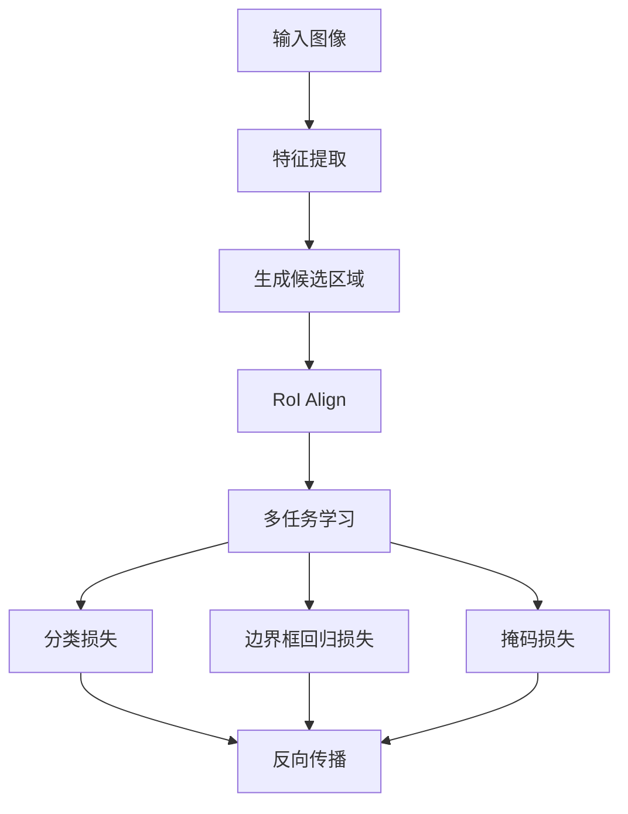

# MaskR-CNN原理与代码实例讲解

## 1.背景介绍

在计算机视觉领域，目标检测和图像分割是两个重要的任务。目标检测旨在识别图像中的物体并确定其位置，而图像分割则是将图像中的每个像素分类到不同的对象或背景中。Mask R-CNN 是一种结合了这两种任务的强大模型，它不仅能够检测图像中的物体，还能为每个物体生成高质量的分割掩码。

Mask R-CNN 是在 Faster R-CNN 的基础上发展而来的。Faster R-CNN 是一种流行的目标检测模型，它通过区域建议网络（RPN）生成候选区域，并使用这些区域进行目标检测。Mask R-CNN 在此基础上增加了一个分支，用于生成像素级的分割掩码。

## 2.核心概念与联系

在深入探讨 Mask R-CNN 的具体实现之前，我们需要了解一些核心概念和它们之间的联系。

### 2.1 区域建议网络（RPN）

RPN 是 Faster R-CNN 的核心组件之一。它通过滑动窗口机制在特征图上生成一系列候选区域（anchor），并对这些区域进行分类和回归，以生成最终的候选区域。

### 2.2 RoI Pooling 和 RoI Align

RoI Pooling 是 Faster R-CNN 中用于将候选区域映射到固定大小特征图的操作。然而，RoI Pooling 存在量化误差，导致精度下降。为了解决这个问题，Mask R-CNN 引入了 RoI Align，它通过双线性插值消除了量化误差。

### 2.3 多任务学习

Mask R-CNN 采用多任务学习的方式，同时进行目标检测和图像分割。它在 Faster R-CNN 的基础上增加了一个分支，用于生成分割掩码。

### 2.4 损失函数

Mask R-CNN 的损失函数包括三个部分：分类损失、边界框回归损失和掩码损失。分类损失和边界框回归损失与 Faster R-CNN 相同，而掩码损失则是对每个像素进行二分类。

## 3.核心算法原理具体操作步骤

Mask R-CNN 的核心算法可以分为以下几个步骤：

### 3.1 特征提取

首先，使用卷积神经网络（如 ResNet）提取图像的特征图。

### 3.2 生成候选区域

通过 RPN 在特征图上生成一系列候选区域，并对这些区域进行分类和回归。

### 3.3 RoI Align

使用 RoI Align 将候选区域映射到固定大小的特征图。

### 3.4 多任务学习

在固定大小的特征图上进行多任务学习，包括目标检测和图像分割。

### 3.5 损失计算

计算分类损失、边界框回归损失和掩码损失，并进行反向传播。

以下是 Mask R-CNN 的流程图：



## 4.数学模型和公式详细讲解举例说明

Mask R-CNN 的数学模型和公式主要包括以下几个部分：

### 4.1 分类损失

分类损失使用交叉熵损失函数，定义如下：

$$
L_{cls} = -\sum_{i=1}^{N} y_i \log(p_i)
$$

其中，$N$ 是样本数量，$y_i$ 是第 $i$ 个样本的真实标签，$p_i$ 是第 $i$ 个样本的预测概率。

### 4.2 边界框回归损失

边界框回归损失使用平滑 $L_1$ 损失函数，定义如下：

$$
L_{bbox} = \sum_{i=1}^{N} \text{smooth}_{L_1}(t_i - t_i^*)
$$

其中，$t_i$ 是第 $i$ 个样本的预测边界框，$t_i^*$ 是第 $i$ 个样本的真实边界框。

### 4.3 掩码损失

掩码损失使用二分类交叉熵损失函数，定义如下：

$$
L_{mask} = -\sum_{i=1}^{N} \sum_{j=1}^{M} y_{ij} \log(p_{ij})
$$

其中，$N$ 是样本数量，$M$ 是掩码中的像素数量，$y_{ij}$ 是第 $i$ 个样本第 $j$ 个像素的真实标签，$p_{ij}$ 是第 $i$ 个样本第 $j$ 个像素的预测概率。

### 4.4 总损失

总损失是分类损失、边界框回归损失和掩码损失的加权和，定义如下：

$$
L = L_{cls} + L_{bbox} + L_{mask}
$$

## 5.项目实践：代码实例和详细解释说明

在这一部分，我们将通过一个具体的代码实例来展示如何使用 Mask R-CNN 进行目标检测和图像分割。

### 5.1 环境准备

首先，我们需要安装必要的库：

```bash
pip install tensorflow keras opencv-python
```

### 5.2 数据准备

我们将使用 COCO 数据集进行训练和测试。可以从 COCO 官方网站下载数据集，并将其解压到指定目录。

### 5.3 模型定义

接下来，我们定义 Mask R-CNN 模型：

```python
import tensorflow as tf
from tensorflow.keras import layers, models

def build_mask_rcnn(input_shape, num_classes):
    inputs = tf.keras.Input(shape=input_shape)
    
    # 特征提取
    base_model = tf.keras.applications.ResNet50(include_top=False, input_tensor=inputs)
    feature_map = base_model.output
    
    # RPN
    rpn = layers.Conv2D(256, (3, 3), padding='same', activation='relu')(feature_map)
    rpn_class = layers.Conv2D(2, (1, 1), activation='softmax')(rpn)
    rpn_bbox = layers.Conv2D(4, (1, 1))(rpn)
    
    # RoI Align
    roi_align = layers.Lambda(lambda x: tf.image.resize(x, (14, 14)))(feature_map)
    
    # 多任务学习
    classifier = layers.Dense(num_classes, activation='softmax')(roi_align)
    bbox_regressor = layers.Dense(4)(roi_align)
    mask = layers.Conv2D(num_classes, (1, 1), activation='sigmoid')(roi_align)
    
    model = models.Model(inputs, [classifier, bbox_regressor, mask])
    return model

input_shape = (224, 224, 3)
num_classes = 80
model = build_mask_rcnn(input_shape, num_classes)
model.summary()
```

### 5.4 模型训练

定义好模型后，我们可以开始训练：

```python
model.compile(optimizer='adam', 
              loss=['categorical_crossentropy', 'mse', 'binary_crossentropy'], 
              metrics=['accuracy'])

# 加载数据
train_data, train_labels = load_coco_data('path/to/train')
val_data, val_labels = load_coco_data('path/to/val')

# 训练模型
model.fit(train_data, train_labels, 
          validation_data=(val_data, val_labels), 
          epochs=50, 
          batch_size=32)
```

### 5.5 模型评估

训练完成后，我们可以使用测试数据集评估模型的性能：

```python
test_data, test_labels = load_coco_data('path/to/test')
results = model.evaluate(test_data, test_labels)
print(f"Test Loss: {results[0]}, Test Accuracy: {results[1]}")
```

### 5.6 模型预测

最后，我们可以使用训练好的模型进行预测：

```python
import cv2

def predict_and_visualize(image_path, model):
    image = cv2.imread(image_path)
    image_resized = cv2.resize(image, (224, 224))
    image_resized = image_resized / 255.0
    image_resized = image_resized[np.newaxis, ...]
    
    predictions = model.predict(image_resized)
    class_pred, bbox_pred, mask_pred = predictions
    
    # 可视化结果
    visualize_results(image, class_pred, bbox_pred, mask_pred)

predict_and_visualize('path/to/image.jpg', model)
```

## 6.实际应用场景

Mask R-CNN 在多个实际应用场景中表现出色，以下是一些典型的应用场景：

### 6.1 自动驾驶

在自动驾驶中，车辆需要实时检测和分割道路上的各种物体，如行人、车辆、交通标志等。Mask R-CNN 可以提供高精度的目标检测和分割结果，帮助自动驾驶系统做出更准确的决策。

### 6.2 医学影像分析

在医学影像分析中，医生需要对各种医学图像（如CT、MRI）进行精确的分割，以便诊断和治疗。Mask R-CNN 可以自动分割出感兴趣的区域，如肿瘤、器官等，辅助医生进行诊断。

### 6.3 安防监控

在安防监控中，系统需要实时检测和跟踪监控区域内的可疑物体和人员。Mask R-CNN 可以提供高精度的目标检测和分割结果，帮助安防系统提高监控效果。

### 6.4 图像编辑

在图像编辑中，用户需要对图像中的特定物体进行编辑和处理。Mask R-CNN 可以自动分割出图像中的物体，方便用户进行后续的编辑操作。

## 7.工具和资源推荐

在使用 Mask R-CNN 进行项目开发时，以下工具和资源可以提供很大的帮助：

### 7.1 框架和库

- **TensorFlow**：一个开源的机器学习框架，支持深度学习模型的构建和训练。
- **Keras**：一个高级神经网络API，能够快速构建和训练深度学习模型。
- **OpenCV**：一个开源的计算机视觉库，提供了丰富的图像处理和计算机视觉功能。

### 7.2 数据集

- **COCO**：一个大规模的图像数据集，包含丰富的目标检测和分割标注。
- **Pascal VOC**：一个经典的目标检测和分割数据集，广泛用于计算机视觉研究。

### 7.3 预训练模型

- **Mask R-CNN 预训练模型**：可以从 TensorFlow Model Zoo 或其他开源平台下载预训练的 Mask R-CNN 模型，进行迁移学习和微调。

### 7.4 在线资源

- **TensorFlow 官方文档**：提供了详细的 TensorFlow 使用指南和 API 参考。
- **Keras 官方文档**：提供了详细的 Keras 使用指南和 API 参考。
- **OpenCV 官方文档**：提供了详细的 OpenCV 使用指南和 API 参考。

## 8.总结：未来发展趋势与挑战

Mask R-CNN 作为一种强大的目标检测和图像分割模型，在多个领域取得了显著的成果。然而，随着技术的发展，Mask R-CNN 也面临一些挑战和未来的发展趋势。

### 8.1 计算效率

Mask R-CNN 的计算复杂度较高，尤其是在处理高分辨率图像时，计算效率成为一个瓶颈。未来的研究可以致力于优化模型结构和算法，提高计算效率。

### 8.2 模型鲁棒性

在实际应用中，图像质量和环境变化可能会影响模型的性能。未来的研究可以致力于提高模型的鲁棒性，使其在各种复杂环境下都能保持高精度。

### 8.3 多任务学习

Mask R-CNN 采用多任务学习的方式，同时进行目标检测和图像分割。未来的研究可以探索更多的多任务学习方法，进一步提高模型的性能。

### 8.4 应用场景扩展

Mask R-CNN 在多个领域取得了显著的成果，未来的研究可以探索更多的应用场景，如视频分析、3D 图像分割等。

## 9.附录：常见问题与解答

### 9.1 Mask R-CNN 与 Faster R-CNN 有何区别？

Mask R-CNN 是在 Faster R-CNN 的基础上发展而来的。Faster R-CNN 主要用于目标检测，而 Mask R-CNN 在此基础上增加了一个分支，用于生成像素级的分割掩码。

### 9.2 如何提高 Mask R-CNN 的计算效率？

可以通过以下几种方法提高 Mask R-CNN 的计算效率：
- 使用更高效的特征提取网络，如 MobileNet。
- 优化模型结构，减少计算复杂度。
- 使用硬件加速，如 GPU 或 TPU。

### 9.3 Mask R-CNN 可以处理视频吗？

Mask R-CNN 主要用于处理静态图像，但可以通过帧处理的方式应用于视频。可以将视频分解为帧，对每一帧进行处理，然后将处理结果合成为视频。

### 9.4 如何处理 Mask R-CNN 的过拟合问题？

可以通过以下几种方法处理 Mask R-CNN 的过拟合问题：
- 增加数据量，进行数据增强。
- 使用正则化方法，如 Dropout。
- 进行模型微调，选择合适的超参数。

### 9.5 Mask R-CNN 可以用于 3D 图像分割吗？

Mask R-CNN 主要用于 2D 图像分割，但可以通过扩展模型结构应用于 3D 图像分割。可以将 3D 图像分解为多个 2D 切片，对每个切片进行处理，然后将处理结果合成为 3D 分割结果。

---

作者：禅与计算机程序设计艺术 / Zen and the Art of Computer Programming