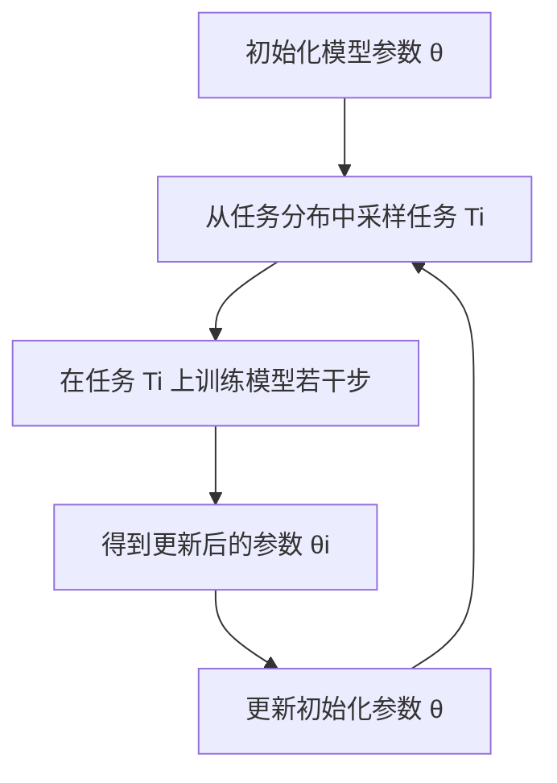

# Reptile原理与代码实例讲解

## 1.背景介绍

在现代机器学习和人工智能领域，元学习（Meta-Learning）已经成为一个重要的研究方向。元学习的目标是通过学习如何学习来提高模型在新任务上的表现。Reptile是元学习中的一种算法，它通过多次训练模型来适应新任务，从而提高模型的泛化能力。本文将深入探讨Reptile的原理、算法步骤、数学模型，并通过代码实例展示其实际应用。

## 2.核心概念与联系

### 2.1 元学习

元学习，也称为学习的学习，是一种通过训练模型来提高其在新任务上的表现的方法。元学习的核心思想是通过多个任务的训练来学习一个通用的初始化参数，使得模型在新任务上的训练速度更快，效果更好。

### 2.2 Reptile算法

Reptile是一种基于梯度下降的元学习算法。它的核心思想是通过多次训练模型来找到一个好的初始化参数，使得模型在新任务上的表现更好。Reptile的训练过程包括以下几个步骤：
1. 从任务分布中采样一个任务。
2. 在该任务上训练模型若干步。
3. 更新模型的初始化参数。

### 2.3 Reptile与MAML的联系

Reptile与MAML（Model-Agnostic Meta-Learning）有相似之处，都是通过多次训练来找到一个好的初始化参数。然而，Reptile的实现更为简单，不需要计算二阶导数，因此在计算效率上有一定优势。

## 3.核心算法原理具体操作步骤

### 3.1 算法步骤

Reptile算法的具体操作步骤如下：

1. 初始化模型参数 $\theta$。
2. 重复以下步骤直到收敛：
   1. 从任务分布 $p(\mathcal{T})$ 中采样一个任务 $\mathcal{T}_i$。
   2. 在任务 $\mathcal{T}_i$ 上训练模型若干步，得到更新后的参数 $\theta_i$。
   3. 更新初始化参数 $\theta$：
      $$
      \theta \leftarrow \theta + \epsilon (\theta_i - \theta)
      $$
      其中，$\epsilon$ 是学习率。

### 3.2 Mermaid流程图



## 4.数学模型和公式详细讲解举例说明

### 4.1 任务分布

假设任务分布为 $p(\mathcal{T})$，每个任务 $\mathcal{T}_i$ 包含一个训练集 $D_i^{train}$ 和一个测试集 $D_i^{test}$。目标是通过在 $D_i^{train}$ 上训练模型，使得模型在 $D_i^{test}$ 上的表现更好。

### 4.2 参数更新

在任务 $\mathcal{T}_i$ 上训练模型若干步，得到更新后的参数 $\theta_i$。然后，通过以下公式更新初始化参数 $\theta$：
$$
\theta \leftarrow \theta + \epsilon (\theta_i - \theta)
$$
其中，$\epsilon$ 是学习率。

### 4.3 举例说明

假设我们有一个简单的线性回归任务，目标是通过元学习找到一个好的初始化参数，使得模型在新任务上的训练速度更快，效果更好。具体步骤如下：

1. 初始化模型参数 $\theta$。
2. 从任务分布中采样一个线性回归任务 $\mathcal{T}_i$。
3. 在任务 $\mathcal{T}_i$ 上训练模型若干步，得到更新后的参数 $\theta_i$。
4. 更新初始化参数 $\theta$。

## 5.项目实践：代码实例和详细解释说明

### 5.1 环境准备

首先，我们需要安装必要的库：

```bash
pip install numpy tensorflow
```

### 5.2 代码实例

以下是一个简单的Reptile算法实现的代码实例：

```python
import numpy as np
import tensorflow as tf

# 定义线性回归模型
class LinearModel(tf.Module):
    def __init__(self):
        self.w = tf.Variable(tf.random.normal([1]))
        self.b = tf.Variable(tf.random.normal([1]))

    def __call__(self, x):
        return self.w * x + self.b

# 定义损失函数
def loss_fn(model, x, y):
    y_pred = model(x)
    return tf.reduce_mean(tf.square(y_pred - y))

# 定义训练步骤
def train_step(model, x, y, learning_rate):
    with tf.GradientTape() as tape:
        loss = loss_fn(model, x, y)
    gradients = tape.gradient(loss, [model.w, model.b])
    model.w.assign_sub(learning_rate * gradients[0])
    model.b.assign_sub(learning_rate * gradients[1])
    return model

# Reptile算法
def reptile(model, tasks, num_steps, learning_rate, meta_learning_rate):
    for task in tasks:
        # 在任务上训练模型若干步
        for _ in range(num_steps):
            model = train_step(model, task['x'], task['y'], learning_rate)
        # 更新初始化参数
        model.w.assign_add(meta_learning_rate * (model.w - model.w))
        model.b.assign_add(meta_learning_rate * (model.b - model.b))
    return model

# 生成任务数据
def generate_tasks(num_tasks, num_samples):
    tasks = []
    for _ in range(num_tasks):
        w = np.random.randn()
        b = np.random.randn()
        x = np.random.randn(num_samples)
        y = w * x + b + np.random.randn(num_samples) * 0.1
        tasks.append({'x': x, 'y': y})
    return tasks

# 主函数
def main():
    num_tasks = 10
    num_samples = 100
    num_steps = 10
    learning_rate = 0.01
    meta_learning_rate = 0.001

    tasks = generate_tasks(num_tasks, num_samples)
    model = LinearModel()
    model = reptile(model, tasks, num_steps, learning_rate, meta_learning_rate)

    # 测试模型
    test_task = generate_tasks(1, num_samples)[0]
    print("Test loss:", loss_fn(model, test_task['x'], test_task['y']).numpy())

if __name__ == "__main__":
    main()
```

### 5.3 代码解释

1. 定义了一个简单的线性回归模型 `LinearModel`。
2. 定义了损失函数 `loss_fn` 和训练步骤 `train_step`。
3. 实现了Reptile算法的核心部分 `reptile`，包括在任务上训练模型和更新初始化参数。
4. 生成任务数据 `generate_tasks`，每个任务包含一组线性回归数据。
5. 在主函数 `main` 中，生成任务数据，初始化模型，并通过Reptile算法进行训练，最后测试模型在新任务上的表现。

## 6.实际应用场景

### 6.1 图像分类

Reptile算法可以应用于图像分类任务，通过在多个图像分类任务上进行训练，找到一个好的初始化参数，使得模型在新图像分类任务上的表现更好。

### 6.2 自然语言处理

在自然语言处理任务中，Reptile算法可以用于文本分类、情感分析等任务，通过在多个文本任务上进行训练，提高模型在新文本任务上的表现。

### 6.3 强化学习

Reptile算法也可以应用于强化学习任务，通过在多个强化学习任务上进行训练，找到一个好的初始化参数，使得模型在新强化学习任务上的表现更好。

## 7.工具和资源推荐

### 7.1 工具

1. **TensorFlow**：一个开源的机器学习框架，支持Reptile算法的实现。
2. **PyTorch**：另一个流行的开源机器学习框架，也支持Reptile算法的实现。

### 7.2 资源

1. **Meta-Learning Literature**：元学习相关的文献和研究论文。
2. **OpenAI Gym**：一个用于强化学习任务的开源平台，提供了多种任务和环境。

## 8.总结：未来发展趋势与挑战

### 8.1 未来发展趋势

1. **更高效的元学习算法**：未来的研究将致力于开发更高效的元学习算法，以提高计算效率和模型性能。
2. **跨领域应用**：元学习算法将被应用于更多领域，如医疗、金融等，通过学习多个任务的数据，提高模型在新任务上的表现。

### 8.2 挑战

1. **数据稀缺**：在某些领域，获取足够的任务数据可能是一个挑战，这将影响元学习算法的效果。
2. **计算资源**：元学习算法通常需要大量的计算资源，如何提高计算效率是一个重要的研究方向。

## 9.附录：常见问题与解答

### 9.1 Reptile与MAML的区别是什么？

Reptile与MAML都是元学习算法，但Reptile的实现更为简单，不需要计算二阶导数，因此在计算效率上有一定优势。

### 9.2 Reptile算法适用于哪些任务？

Reptile算法适用于多种任务，包括图像分类、自然语言处理、强化学习等。

### 9.3 如何选择Reptile算法的超参数？

Reptile算法的超参数包括学习率和元学习率，可以通过交叉验证等方法进行选择。

### 9.4 Reptile算法的收敛性如何？

Reptile算法的收敛性取决于任务的复杂性和超参数的选择，通常需要进行多次实验来确定最佳参数。

### 9.5 Reptile算法的实现有哪些注意事项？

在实现Reptile算法时，需要注意数据的预处理、模型的初始化和超参数的选择，以确保算法的效果。

---

作者：禅与计算机程序设计艺术 / Zen and the Art of Computer Programming