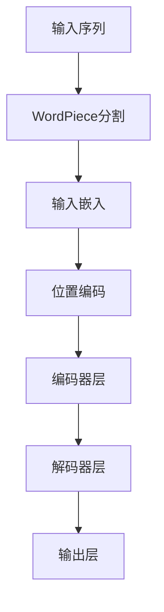

# Transformer大模型实战 WordPiece

## 1.背景介绍

在自然语言处理（NLP）领域，Transformer模型已经成为了主流架构。自从Vaswani等人在2017年提出Transformer以来，它在多个NLP任务中取得了显著的成功。Transformer的核心优势在于其并行处理能力和长距离依赖捕捉能力。然而，Transformer的成功不仅仅依赖于其架构设计，还依赖于其输入表示方法。WordPiece是一种常用的子词分割方法，它在Transformer模型中扮演了重要角色。

WordPiece最初由Google在其BERT模型中引入，用于将词汇表大小控制在合理范围内，同时处理未登录词（OOV）问题。通过将词汇分割成子词单元，WordPiece能够有效地平衡词汇表大小和模型性能。

## 2.核心概念与联系

### 2.1 Transformer模型

Transformer模型由编码器和解码器组成，每个编码器和解码器包含多个层。每一层由多头自注意力机制和前馈神经网络组成。Transformer的核心在于其自注意力机制，它能够捕捉输入序列中任意位置的依赖关系。

### 2.2 WordPiece

WordPiece是一种子词分割算法，它将词汇表中的词分割成更小的子词单元。通过这种方式，WordPiece能够处理未登录词，并且在保持词汇表大小可控的同时，捕捉词汇的细粒度信息。

### 2.3 Transformer与WordPiece的联系

在Transformer模型中，输入序列首先通过WordPiece进行分割，然后再输入到模型中。通过这种方式，Transformer能够处理更大范围的词汇，同时保持模型的高效性和准确性。

## 3.核心算法原理具体操作步骤

### 3.1 Transformer的工作流程

Transformer的工作流程可以分为以下几个步骤：

1. **输入嵌入**：将输入序列通过嵌入层转换为向量表示。
2. **位置编码**：为每个输入向量添加位置编码，以保留序列信息。
3. **编码器层**：通过多头自注意力机制和前馈神经网络对输入进行编码。
4. **解码器层**：通过多头自注意力机制、编码器-解码器注意力机制和前馈神经网络对编码结果进行解码。
5. **输出层**：将解码结果通过线性变换和softmax函数转换为最终输出。

### 3.2 WordPiece的工作流程

WordPiece的工作流程可以分为以下几个步骤：

1. **初始化词汇表**：从初始词汇表开始，通常包含所有单字符词。
2. **统计词对频率**：统计词汇表中所有词对的频率。
3. **合并词对**：选择频率最高的词对进行合并，并将其添加到词汇表中。
4. **重复步骤2和3**：重复上述步骤，直到词汇表达到预定大小。

### 3.3 Mermaid流程图



## 4.数学模型和公式详细讲解举例说明

### 4.1 Transformer的数学模型

Transformer的核心在于自注意力机制。自注意力机制的计算公式如下：

$$
\text{Attention}(Q, K, V) = \text{softmax}\left(\frac{QK^T}{\sqrt{d_k}}\right)V
$$

其中，$Q$、$K$和$V$分别表示查询、键和值矩阵，$d_k$表示键的维度。

### 4.2 WordPiece的数学模型

WordPiece的核心在于词对的合并过程。假设当前词汇表为$V$，词对的频率为$f(w_i, w_j)$，则每次迭代选择频率最高的词对$(w_i, w_j)$进行合并：

$$
V \leftarrow V \cup \{w_iw_j\}
$$

### 4.3 举例说明

假设输入序列为"playing"，通过WordPiece分割后得到["play", "##ing"]。然后将其输入到Transformer模型中进行处理。

## 5.项目实践：代码实例和详细解释说明

### 5.1 WordPiece分割代码实例

```python
from transformers import BertTokenizer

# 初始化BERT分词器
tokenizer = BertTokenizer.from_pretrained('bert-base-uncased')

# 输入序列
text = "playing"

# WordPiece分割
tokens = tokenizer.tokenize(text)
print(tokens)
```

### 5.2 Transformer模型代码实例

```python
import torch
from transformers import BertModel

# 初始化BERT模型
model = BertModel.from_pretrained('bert-base-uncased')

# 输入序列
input_ids = tokenizer.encode(text, return_tensors='pt')

# 模型推理
outputs = model(input_ids)
last_hidden_states = outputs.last_hidden_state
print(last_hidden_states)
```

### 5.3 详细解释说明

上述代码首先使用BERT分词器对输入序列进行WordPiece分割，然后将分割后的子词输入到BERT模型中进行推理，最终得到最后一层的隐藏状态。

## 6.实际应用场景

### 6.1 机器翻译

Transformer模型在机器翻译任务中表现出色。通过WordPiece分割，模型能够处理多种语言的词汇，并且在翻译过程中捕捉到细粒度的词汇信息。

### 6.2 文本生成

在文本生成任务中，Transformer模型能够生成高质量的文本。通过WordPiece分割，模型能够生成更为自然和连贯的文本。

### 6.3 情感分析

Transformer模型在情感分析任务中也表现出色。通过WordPiece分割，模型能够捕捉到情感词汇的细粒度信息，从而提高情感分析的准确性。

## 7.工具和资源推荐

### 7.1 工具推荐

- **Hugging Face Transformers**：一个强大的NLP库，支持多种Transformer模型和分词器。
- **TensorFlow**：一个流行的深度学习框架，支持Transformer模型的训练和推理。
- **PyTorch**：另一个流行的深度学习框架，广泛用于NLP任务。

### 7.2 资源推荐

- **BERT论文**：Vaswani等人的《Attention is All You Need》论文，详细介绍了Transformer模型的架构和原理。
- **Hugging Face文档**：提供了详细的使用指南和示例代码，帮助开发者快速上手Transformer模型。

## 8.总结：未来发展趋势与挑战

### 8.1 未来发展趋势

Transformer模型和WordPiece分割方法在NLP领域取得了显著的成功。未来，随着计算资源的增加和算法的改进，Transformer模型有望在更多的应用场景中发挥作用。同时，新的分词方法和优化技术也将不断涌现，进一步提高模型的性能和效率。

### 8.2 挑战

尽管Transformer模型表现出色，但其计算复杂度较高，训练和推理过程需要大量的计算资源。此外，WordPiece分割方法在处理多语言和跨领域任务时仍面临一定的挑战。如何在保证模型性能的同时，降低计算复杂度和资源消耗，是未来研究的重点方向。

## 9.附录：常见问题与解答

### 9.1 什么是Transformer模型？

Transformer模型是一种基于自注意力机制的深度学习模型，广泛应用于自然语言处理任务。

### 9.2 什么是WordPiece？

WordPiece是一种子词分割算法，用于将词汇分割成更小的子词单元，以处理未登录词和控制词汇表大小。

### 9.3 如何使用WordPiece分割输入序列？

可以使用Hugging Face的BERT分词器对输入序列进行WordPiece分割，具体代码示例如上所示。

### 9.4 Transformer模型的计算复杂度如何？

Transformer模型的计算复杂度较高，尤其是在处理长序列时。其自注意力机制的计算复杂度为$O(n^2)$，其中$n$为序列长度。

### 9.5 如何提高Transformer模型的效率？

可以通过模型压缩、分布式训练和优化算法等方法提高Transformer模型的效率。

---

作者：禅与计算机程序设计艺术 / Zen and the Art of Computer Programming