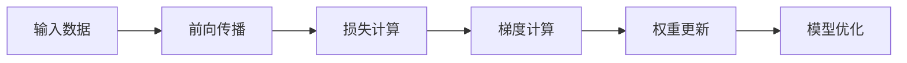

## 1. 背景介绍

在深度学习的世界里，TensorFlow和PyTorch无疑是两个巨头。TensorFlow由Google开发，自2015年以来一直是业界标准。而PyTorch，作为Facebook的产物，自2016年问世以来，以其直观的设计和动态计算图迅速获得了科研人员的青睐。这两个框架在设计哲学、接口风格、性能优化等方面各有千秋，但它们的共同目标是为机器学习提供强大、灵活且高效的计算能力。

## 2. 核心概念与联系

### 2.1 计算图的概念

TensorFlow和PyTorch都采用了计算图（Computation Graph）的概念。计算图是一种有向无环图（DAG），它将复杂的数学运算分解为一系列更简单的步骤。

### 2.2 动态与静态图的区别

TensorFlow最初采用静态计算图，即先定义后运行（Define-then-Run），而PyTorch采用动态计算图，即定义即运行（Define-by-Run）。这两种方式各有优势：静态图便于优化和部署，动态图则更加灵活和直观。

### 2.3 张量（Tensor）的映射

在这两个框架中，张量是基本的数据结构，它是一个多维数组，用于表示数据和参数。张量之间的操作，如加法、乘法等，都可以看作是映射。

## 3. 核心算法原理具体操作步骤

### 3.1 反向传播算法

反向传播（Backpropagation）是深度学习中最核心的算法之一。它通过链式法则逐层计算梯度，并更新模型的权重。



### 3.2 优化器的选择

优化器负责根据计算出的梯度更新模型的参数。常见的优化器有SGD、Adam等。

## 4. 数学模型和公式详细讲解举例说明

### 4.1 损失函数

损失函数（Loss Function）衡量模型预测值与真实值之间的差异。例如，均方误差（MSE）是回归任务中常用的损失函数：

$$
MSE = \frac{1}{n}\sum_{i=1}^{n}(Y_i - \hat{Y}_i)^2
$$

其中，$Y_i$ 是真实值，$\hat{Y}_i$ 是预测值，$n$ 是样本数量。

### 4.2 梯度下降

梯度下降（Gradient Descent）是一种优化算法，用于最小化损失函数。参数更新公式如下：

$$
\theta = \theta - \alpha \cdot \nabla_{\theta}J(\theta)
$$

其中，$\theta$ 是模型参数，$\alpha$ 是学习率，$\nabla_{\theta}J(\theta)$ 是损失函数$J$关于$\theta$的梯度。

## 5. 项目实践：代码实例和详细解释说明

### 5.1 TensorFlow实例

```python
import tensorflow as tf

# 定义模型
model = tf.keras.models.Sequential([
    tf.keras.layers.Dense(10, activation='relu', input_shape=(None, 20)),
    tf.keras.layers.Dense(1)
])

# 编译模型
model.compile(optimizer='adam', loss='mse')

# 训练模型
model.fit(x_train, y_train, epochs=10)
```

### 5.2 PyTorch实例

```python
import torch
import torch.nn as nn
import torch.optim as optim

# 定义模型
class Model(nn.Module):
    def __init__(self):
        super(Model, self).__init__()
        self.layer1 = nn.Linear(20, 10)
        self.layer2 = nn.Linear(10, 1)

    def forward(self, x):
        x = torch.relu(self.layer1(x))
        x = self.layer2(x)
        return x

model = Model()

# 定义损失函数和优化器
criterion = nn.MSELoss()
optimizer = optim.Adam(model.parameters())

# 训练模型
for epoch in range(10):
    optimizer.zero_grad()
    outputs = model(x_train)
    loss = criterion(outputs, y_train)
    loss.backward()
    optimizer.step()
```

## 6. 实际应用场景

深度学习框架在图像识别、自然语言处理、游戏AI等多个领域都有广泛应用。例如，在自动驾驶汽车中，深度学习模型可以用于识别行人和障碍物。

## 7. 工具和资源推荐

- TensorFlow官方文档：https://www.tensorflow.org/
- PyTorch官方文档：https://pytorch.org/
- Deep Learning Book by Ian Goodfellow, Yoshua Bengio, and Aaron Courville

## 8. 总结：未来发展趋势与挑战

深度学习框架的未来发展将更加注重易用性、性能优化和跨平台能力。同时，随着模型规模的增大，如何有效地进行模型压缩和加速也是一个重要的研究方向。

## 9. 附录：常见问题与解答

Q1: TensorFlow和PyTorch哪个更好？
A1: 这取决于具体的应用场景和个人偏好。TensorFlow在生产环境中更加成熟，而PyTorch在研究领域更受欢迎。

Q2: 动态图和静态图有什么本质区别？
A2: 动态图的结构更加灵活，可以在运行时改变，适合于复杂的模型结构和实验性研究。静态图则在图构建完成后就固定下来，便于优化和部署。

作者：禅与计算机程序设计艺术 / Zen and the Art of Computer Programming