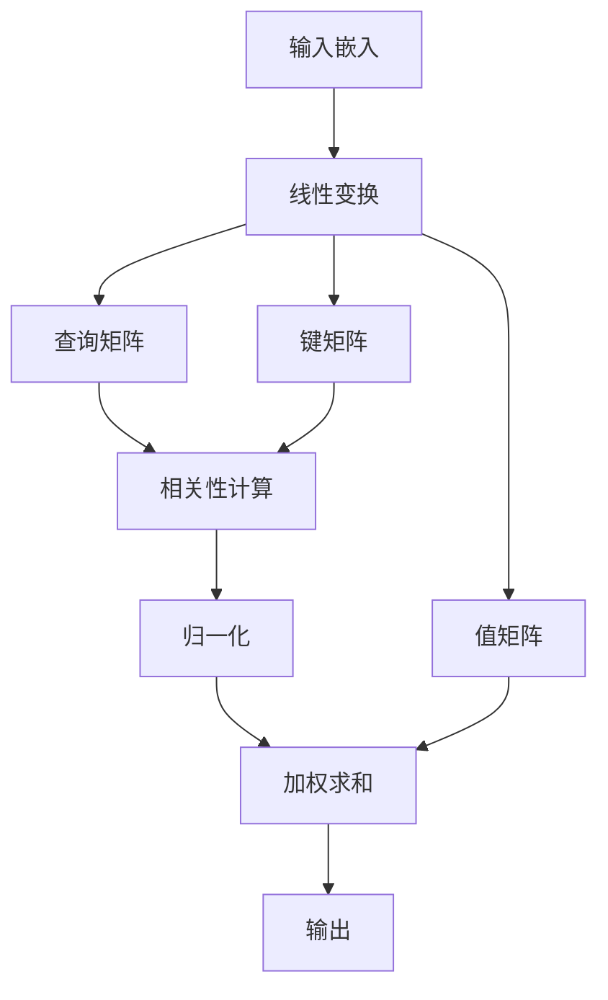
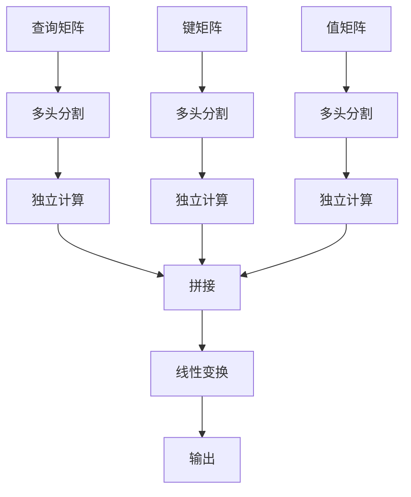

# 从零开始大模型开发与微调：编码器的核心—注意力模型

## 1.背景介绍

在自然语言处理（NLP）领域，注意力机制（Attention Mechanism）已经成为了现代深度学习模型的核心组件。自从Vaswani等人在2017年提出Transformer模型以来，注意力机制在各种任务中展现了其强大的性能和灵活性。本文将深入探讨注意力模型的核心概念、算法原理、数学模型，并通过实际代码示例和应用场景来帮助读者全面理解和掌握这一重要技术。

## 2.核心概念与联系

### 2.1 注意力机制的基本概念

注意力机制的核心思想是通过计算输入序列中各个元素之间的相关性，动态地调整每个元素的权重，从而更好地捕捉序列中的重要信息。注意力机制可以分为以下几种类型：

- **自注意力（Self-Attention）**：输入序列中的每个元素与自身序列中的其他元素进行相关性计算。
- **多头注意力（Multi-Head Attention）**：通过多个注意力头并行计算，捕捉不同的特征表示。
- **交叉注意力（Cross-Attention）**：在编码器-解码器结构中，解码器中的每个元素与编码器中的元素进行相关性计算。

### 2.2 编码器-解码器架构

编码器-解码器架构是许多NLP任务中的常见结构。编码器将输入序列编码为固定长度的向量表示，解码器则根据编码器的输出生成目标序列。注意力机制在这一架构中起到了桥梁作用，使得解码器能够动态地关注编码器输出的不同部分。

### 2.3 Transformer模型

Transformer模型是基于注意力机制的典型代表。其主要特点是完全摒弃了传统的循环神经网络（RNN）结构，采用了自注意力机制和多头注意力机制，从而大大提高了并行计算能力和模型性能。

## 3.核心算法原理具体操作步骤

### 3.1 自注意力机制

自注意力机制的计算过程可以分为以下几个步骤：

1. **输入嵌入**：将输入序列转换为向量表示。
2. **线性变换**：通过三个不同的线性变换，得到查询（Query）、键（Key）和值（Value）矩阵。
3. **相关性计算**：计算查询和键之间的点积，得到注意力得分。
4. **归一化**：对注意力得分进行Softmax归一化，得到注意力权重。
5. **加权求和**：将注意力权重与值矩阵相乘，得到最终的输出。

以下是自注意力机制的Mermaid流程图：



### 3.2 多头注意力机制

多头注意力机制通过并行计算多个注意力头，捕捉不同的特征表示。其计算过程如下：

1. **多头分割**：将查询、键、值矩阵分割为多个头。
2. **独立计算**：对每个头独立进行自注意力计算。
3. **拼接**：将所有头的输出拼接在一起。
4. **线性变换**：通过线性变换得到最终的输出。

以下是多头注意力机制的Mermaid流程图：



## 4.数学模型和公式详细讲解举例说明

### 4.1 自注意力机制的数学公式

自注意力机制的核心公式如下：

$$
\text{Attention}(Q, K, V) = \text{softmax}\left(\frac{QK^T}{\sqrt{d_k}}\right) V
$$

其中，$Q$、$K$、$V$分别表示查询、键、值矩阵，$d_k$表示键的维度。

### 4.2 多头注意力机制的数学公式

多头注意力机制的核心公式如下：

$$
\text{MultiHead}(Q, K, V) = \text{Concat}(\text{head}_1, \ldots, \text{head}_h) W^O
$$

其中，每个头的计算公式为：

$$
\text{head}_i = \text{Attention}(QW_i^Q, KW_i^K, VW_i^V)
$$

$W_i^Q$、$W_i^K$、$W_i^V$和$W^O$分别表示线性变换的权重矩阵。

### 4.3 示例说明

假设输入序列为 $X = [x_1, x_2, x_3]$，其对应的查询、键、值矩阵分别为 $Q, K, V$。通过上述公式计算得到注意力权重和最终输出。

## 5.项目实践：代码实例和详细解释说明

### 5.1 自注意力机制的实现

以下是自注意力机制的PyTorch实现代码：

```python
import torch
import torch.nn.functional as F

class SelfAttention(torch.nn.Module):
    def __init__(self, embed_size, heads):
        super(SelfAttention, self).__init__()
        self.embed_size = embed_size
        self.heads = heads
        self.head_dim = embed_size // heads

        assert (
            self.head_dim * heads == embed_size
        ), "Embedding size needs to be divisible by heads"

        self.values = torch.nn.Linear(self.head_dim, self.head_dim, bias=False)
        self.keys = torch.nn.Linear(self.head_dim, self.head_dim, bias=False)
        self.queries = torch.nn.Linear(self.head_dim, self.head_dim, bias=False)
        self.fc_out = torch.nn.Linear(heads * self.head_dim, embed_size)

    def forward(self, values, keys, query, mask):
        N = query.shape[0]
        value_len, key_len, query_len = values.shape[1], keys.shape[1], query.shape[1]

        # Split the embedding into self.heads different pieces
        values = values.reshape(N, value_len, self.heads, self.head_dim)
        keys = keys.reshape(N, key_len, self.heads, self.head_dim)
        queries = query.reshape(N, query_len, self.heads, self.head_dim)

        values = self.values(values)
        keys = self.keys(keys)
        queries = self.queries(queries)

        # Scaled dot-product attention
        energy = torch.einsum("nqhd,nkhd->nhqk", [queries, keys])
        if mask is not None:
            energy = energy.masked_fill(mask == 0, float("-1e20"))

        attention = torch.nn.functional.softmax(energy / (self.embed_size ** (1 / 2)), dim=3)

        out = torch.einsum("nhql,nlhd->nqhd", [attention, values]).reshape(
            N, query_len, self.heads * self.head_dim
        )

        out = self.fc_out(out)
        return out
```

### 5.2 多头注意力机制的实现

以下是多头注意力机制的PyTorch实现代码：

```python
class MultiHeadAttention(torch.nn.Module):
    def __init__(self, embed_size, heads):
        super(MultiHeadAttention, self).__init__()
        self.embed_size = embed_size
        self.heads = heads
        self.head_dim = embed_size // heads

        assert (
            self.head_dim * heads == embed_size
        ), "Embedding size needs to be divisible by heads"

        self.values = torch.nn.Linear(self.head_dim, self.head_dim, bias=False)
        self.keys = torch.nn.Linear(self.head_dim, self.head_dim, bias=False)
        self.queries = torch.nn.Linear(self.head_dim, self.head_dim, bias=False)
        self.fc_out = torch.nn.Linear(heads * self.head_dim, embed_size)

    def forward(self, values, keys, query, mask):
        N = query.shape[0]
        value_len, key_len, query_len = values.shape[1], keys.shape[1], query.shape[1]

        # Split the embedding into self.heads different pieces
        values = values.reshape(N, value_len, self.heads, self.head_dim)
        keys = keys.reshape(N, key_len, self.heads, self.head_dim)
        queries = query.reshape(N, query_len, self.heads, self.head_dim)

        values = self.values(values)
        keys = self.keys(keys)
        queries = self.queries(queries)

        # Scaled dot-product attention
        energy = torch.einsum("nqhd,nkhd->nhqk", [queries, keys])
        if mask is not None:
            energy = energy.masked_fill(mask == 0, float("-1e20"))

        attention = torch.nn.functional.softmax(energy / (self.embed_size ** (1 / 2)), dim=3)

        out = torch.einsum("nhql,nlhd->nqhd", [attention, values]).reshape(
            N, query_len, self.heads * self.head_dim
        )

        out = self.fc_out(out)
        return out
```

### 5.3 代码解释

上述代码实现了自注意力机制和多头注意力机制。通过线性变换、相关性计算、归一化和加权求和等步骤，最终得到注意力机制的输出。

## 6.实际应用场景

### 6.1 机器翻译

注意力机制在机器翻译任务中得到了广泛应用。通过动态地关注源语言序列的不同部分，解码器能够生成更加准确和流畅的目标语言序列。

### 6.2 文本摘要

在文本摘要任务中，注意力机制可以帮助模型从长文本中提取出关键信息，从而生成简洁的摘要。

### 6.3 情感分析

注意力机制在情感分析任务中也表现出色。通过关注文本中的情感词汇和句子结构，模型能够更准确地判断文本的情感倾向。

### 6.4 图像处理

注意力机制不仅在NLP领域表现出色，在图像处理任务中也有广泛应用。例如，图像分类、目标检测等任务中，注意力机制可以帮助模型更好地捕捉图像中的重要特征。

## 7.工具和资源推荐

### 7.1 深度学习框架

- **PyTorch**：灵活且易于使用的深度学习框架，适合研究和开发。
- **TensorFlow**：功能强大且广泛应用的深度学习框架，适合大规模生产环境。

### 7.2 开源项目

- **Hugging Face Transformers**：提供了丰富的预训练模型和工具，方便进行大模型开发和微调。
- **OpenNMT**：一个开源的神经机器翻译框架，支持多种注意力机制。

### 7.3 学习资源

- **《Attention Is All You Need》**：Vaswani等人提出的Transformer模型论文，是理解注意力机制的经典文献。
- **《Deep Learning》**：Ian Goodfellow等人编写的深度学习教材，涵盖了广泛的深度学习知识。

## 8.总结：未来发展趋势与挑战

### 8.1 未来发展趋势

注意力机制在未来将继续发展，并在更多领域中得到应用。以下是一些可能的发展趋势：

- **更高效的注意力机制**：研究人员将继续探索更高效的注意力机制，以减少计算复杂度和内存消耗。
- **跨模态注意力**：注意力机制在跨模态任务中的应用将进一步扩展，例如图像-文本联合理解。
- **自监督学习**：注意力机制在自监督学习中的应用将进一步提升模型的泛化能力和性能。

### 8.2 挑战

尽管注意力机制在许多任务中表现出色，但仍然面临一些挑战：

- **计算复杂度**：注意力机制的计算复杂度较高，尤其是在处理长序列时，可能导致计算资源的瓶颈。
- **解释性**：注意力机制的黑箱特性使得模型的解释性较差，难以理解其内部工作原理。
- **数据依赖性**：注意力机制在大规模数据上的表现优异，但在小数据集上的表现可能不尽如人意。

## 9.附录：常见问题与解答

### 9.1 什么是注意力机制？

注意力机制是一种通过计算输入序列中各个元素之间的相关性，动态调整每个元素权重的技术，从而更好地捕捉序列中的重要信息。

### 9.2 自注意力和多头注意力有什么区别？

自注意力是指输入序列中的每个元素与自身序列中的其他元素进行相关性计算；多头注意力是通过多个注意力头并行计算，捕捉不同的特征表示。

### 9.3 Transformer模型的优势是什么？

Transformer模型完全摒弃了传统的循环神经网络结构，采用了自注意力机制和多头注意力机制，从而大大提高了并行计算能力和模型性能。

### 9.4 如何实现自注意力机制？

自注意力机制的实现包括输入嵌入、线性变换、相关性计算、归一化和加权求和等步骤。可以使用深度学习框架如PyTorch进行实现。

### 9.5 注意力机制的应用场景有哪些？

注意力机制在机器翻译、文本摘要、情感分析和图像处理等任务中得到了广泛应用。

---

作者：禅与计算机程序设计艺术 / Zen and the Art of Computer Programming