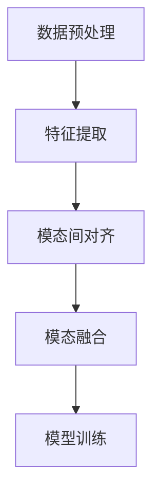

# 多模态大模型：技术原理与实战 多模态模型的发展历史

## 1.背景介绍

多模态大模型（Multimodal Large Models）是近年来人工智能领域的一个重要发展方向。随着深度学习技术的不断进步，单一模态（如文本、图像、音频等）的处理能力已经取得了显著的突破。然而，现实世界中的信息往往是多模态的，即同一事件或对象可以通过多种感官（如视觉、听觉、触觉等）来感知和描述。因此，如何有效地融合和处理多模态信息，成为了人工智能研究中的一个重要课题。

多模态大模型的研究不仅涉及到深度学习、计算机视觉、自然语言处理等多个领域，还需要解决跨模态信息融合、模态间对齐、模态间互补等一系列复杂问题。本文将详细介绍多模态大模型的技术原理、发展历史、核心算法、数学模型、实际应用场景、工具和资源推荐等内容，帮助读者全面了解这一前沿技术。

## 2.核心概念与联系

### 2.1 多模态数据

多模态数据是指包含多种类型信息的数据，例如图像、文本、音频、视频等。每种模态的数据都能提供不同的视角和信息，从而使得整体信息更加丰富和全面。

### 2.2 多模态学习

多模态学习是指通过学习算法来处理和融合多种模态的数据，以实现更高效的信息提取和决策。多模态学习的目标是通过融合不同模态的信息，提升模型的性能和泛化能力。

### 2.3 模态间对齐

模态间对齐是指在多模态数据中，找到不同模态之间的对应关系。例如，在图像和文本数据中，找到图像中的物体与文本描述之间的对应关系。模态间对齐是多模态学习中的一个关键问题。

### 2.4 模态间互补

模态间互补是指不同模态的数据可以互相补充，从而提供更全面的信息。例如，图像数据可以提供视觉信息，而文本数据可以提供语义信息，两者结合可以更好地理解和描述一个对象或事件。

## 3.核心算法原理具体操作步骤

### 3.1 数据预处理

数据预处理是多模态学习的第一步，包括数据清洗、数据增强、特征提取等步骤。对于不同模态的数据，预处理方法也有所不同。例如，图像数据需要进行图像增强和特征提取，文本数据需要进行分词和词向量表示。

### 3.2 特征提取

特征提取是指从原始数据中提取出有用的特征，以便后续的模型训练。对于图像数据，可以使用卷积神经网络（CNN）进行特征提取；对于文本数据，可以使用词向量（如Word2Vec、GloVe）或预训练语言模型（如BERT）进行特征提取。

### 3.3 模态间对齐

模态间对齐是多模态学习中的一个关键步骤。常用的方法包括基于注意力机制的方法、基于对比学习的方法等。例如，基于注意力机制的方法可以通过计算不同模态之间的注意力权重，找到模态间的对应关系。

### 3.4 模态融合

模态融合是指将不同模态的特征进行融合，以便后续的模型训练。常用的模态融合方法包括特征级融合、决策级融合等。例如，特征级融合可以通过将不同模态的特征拼接在一起，形成一个综合特征向量。

### 3.5 模型训练

模型训练是多模态学习的最后一步。常用的模型包括多模态神经网络、图神经网络等。模型训练的目标是通过最小化损失函数，学习到最优的模型参数。

以下是一个多模态学习的流程图：



## 4.数学模型和公式详细讲解举例说明

### 4.1 特征提取

对于图像数据，常用的特征提取方法是卷积神经网络（CNN）。假设输入图像为 $X \in \mathbb{R}^{H \times W \times C}$，其中 $H$ 为图像高度，$W$ 为图像宽度，$C$ 为通道数。通过卷积操作，可以得到特征图 $F \in \mathbb{R}^{H' \times W' \times D}$，其中 $H'$ 和 $W'$ 为特征图的高度和宽度，$D$ 为特征图的通道数。

$$
F = \text{Conv}(X)
$$

对于文本数据，常用的特征提取方法是词向量表示。假设输入文本为 $T = \{w_1, w_2, \ldots, w_n\}$，其中 $w_i$ 为第 $i$ 个词。通过词向量表示，可以得到词向量矩阵 $E \in \mathbb{R}^{n \times d}$，其中 $n$ 为词的数量，$d$ 为词向量的维度。

$$
E = \text{Embedding}(T)
$$

### 4.2 模态间对齐

模态间对齐可以通过注意力机制来实现。假设图像特征为 $F \in \mathbb{R}^{H' \times W' \times D}$，文本特征为 $E \in \mathbb{R}^{n \times d}$。通过计算注意力权重，可以得到模态间的对齐关系。

$$
A = \text{softmax}(QK^T / \sqrt{d_k})
$$

其中，$Q = W_Q E$，$K = W_K F$，$W_Q$ 和 $W_K$ 为可学习的权重矩阵，$d_k$ 为特征维度。

### 4.3 模态融合

模态融合可以通过特征拼接来实现。假设图像特征为 $F \in \mathbb{R}^{H' \times W' \times D}$，文本特征为 $E \in \mathbb{R}^{n \times d}$。通过特征拼接，可以得到综合特征向量 $Z \in \mathbb{R}^{(H'W' + n) \times (D + d)}$。

$$
Z = \text{concat}(F, E)
$$

### 4.4 模型训练

模型训练的目标是通过最小化损失函数，学习到最优的模型参数。常用的损失函数包括交叉熵损失、均方误差损失等。假设模型的输出为 $\hat{y}$，真实标签为 $y$，损失函数为 $L$，则模型训练的目标是最小化损失函数 $L(\hat{y}, y)$。

$$
\theta^* = \arg\min_{\theta} L(\hat{y}, y)
$$

## 5.项目实践：代码实例和详细解释说明

### 5.1 数据预处理

以下是一个简单的图像和文本数据预处理的代码示例：

```python
import cv2
import numpy as np
from sklearn.feature_extraction.text import CountVectorizer

# 图像数据预处理
def preprocess_image(image_path):
    image = cv2.imread(image_path)
    image = cv2.resize(image, (224, 224))
    image = image / 255.0
    return image

# 文本数据预处理
def preprocess_text(text):
    vectorizer = CountVectorizer()
    text_vector = vectorizer.fit_transform([text])
    return text_vector.toarray()

image_path = 'path/to/image.jpg'
text = 'This is a sample text.'

image = preprocess_image(image_path)
text_vector = preprocess_text(text)
```

### 5.2 特征提取

以下是一个使用预训练模型进行特征提取的代码示例：

```python
import torch
import torchvision.models as models
from transformers import BertTokenizer, BertModel

# 图像特征提取
def extract_image_features(image):
    model = models.resnet50(pretrained=True)
    model.eval()
    with torch.no_grad():
        features = model(torch.tensor(image).unsqueeze(0))
    return features

# 文本特征提取
def extract_text_features(text):
    tokenizer = BertTokenizer.from_pretrained('bert-base-uncased')
    model = BertModel.from_pretrained('bert-base-uncased')
    inputs = tokenizer(text, return_tensors='pt')
    with torch.no_grad():
        outputs = model(**inputs)
    return outputs.last_hidden_state

image_features = extract_image_features(image)
text_features = extract_text_features(text)
```

### 5.3 模态间对齐

以下是一个使用注意力机制进行模态间对齐的代码示例：

```python
import torch.nn.functional as F

def attention(query, key, value):
    d_k = query.size(-1)
    scores = torch.matmul(query, key.transpose(-2, -1)) / np.sqrt(d_k)
    attn = F.softmax(scores, dim=-1)
    output = torch.matmul(attn, value)
    return output

query = text_features
key = image_features
value = image_features

aligned_features = attention(query, key, value)
```

### 5.4 模态融合

以下是一个特征拼接进行模态融合的代码示例：

```python
def concatenate_features(image_features, text_features):
    image_features = image_features.view(image_features.size(0), -1)
    text_features = text_features.view(text_features.size(0), -1)
    combined_features = torch.cat((image_features, text_features), dim=1)
    return combined_features

combined_features = concatenate_features(image_features, text_features)
```

### 5.5 模型训练

以下是一个简单的多模态模型训练的代码示例：

```python
import torch.nn as nn
import torch.optim as optim

class MultimodalModel(nn.Module):
    def __init__(self, input_dim, output_dim):
        super(MultimodalModel, self).__init__()
        self.fc = nn.Linear(input_dim, output_dim)

    def forward(self, x):
        return self.fc(x)

model = MultimodalModel(input_dim=combined_features.size(1), output_dim=10)
criterion = nn.CrossEntropyLoss()
optimizer = optim.Adam(model.parameters(), lr=0.001)

# 假设训练数据为 train_data，标签为 train_labels
for epoch in range(10):
    for data, labels in zip(train_data, train_labels):
        optimizer.zero_grad()
        outputs = model(data)
        loss = criterion(outputs, labels)
        loss.backward()
        optimizer.step()
```

## 6.实际应用场景

### 6.1 图像和文本的联合理解

多模态大模型可以用于图像和文本的联合理解，例如图像描述生成、图像问答等任务。通过融合图像和文本信息，可以更好地理解和描述图像内容。

### 6.2 视频分析

多模态大模型可以用于视频分析，例如视频内容理解、视频摘要生成等任务。通过融合视频中的图像、音频和文本信息，可以更全面地理解视频内容。

### 6.3 医疗诊断

多模态大模型可以用于医疗诊断，例如结合医学影像和病历文本进行疾病诊断。通过融合多种模态的信息，可以提高诊断的准确性和可靠性。

### 6.4 多模态推荐系统

多模态大模型可以用于推荐系统，例如结合用户的浏览历史、购买记录、评论文本等信息进行个性化推荐。通过融合多种模态的信息，可以提高推荐的准确性和用户满意度。

## 7.工具和资源推荐

### 7.1 开源框架

- **TensorFlow**：一个广泛使用的深度学习框架，支持多模态学习。
- **PyTorch**：一个灵活且易于使用的深度学习框架，支持多模态学习。
- **Hugging Face Transformers**：一个强大的自然语言处理库，支持多模态模型的训练和推理。

### 7.2 数据集

- **COCO**：一个常用的图像和文本数据集，包含大量的图像和对应的文本描述。
- **Flickr30k**：一个图像和文本数据集，包含大量的图像和对应的文本描述。
- **YouTube-8M**：一个大规模的视频数据集，包含大量的视频和对应的标签。

### 7.3 预训练模型

- **BERT**：一个强大的预训练语言模型，支持文本特征提取。
- **ResNet**：一个强大的预训练图像模型，支持图像特征提取。
- **CLIP**：一个多模态预训练模型，支持图像和文本的联合理解。

## 8.总结：未来发展趋势与挑战

多模态大模型是人工智能领域的一个重要发展方向，具有广泛的应用前景。未来，多模态大模型的发展将面临以下几个挑战：

### 8.1 数据标注

多模态数据的标注成本较高，如何高效地获取和标注多模态数据是一个重要挑战。

### 8.2 模态间对齐

模态间对齐是多模态学习中的一个关键问题，如何高效地找到不同模态之间的对应关系是一个重要挑战。

### 8.3 模态融合

模态融合是多模态学习中的一个关键问题，如何高效地融合不同模态的信息是一个重要挑战。

### 8.4 模型解释性

多模态大模型的复杂性较高，如何提高模型的解释性和可解释性是一个重要挑战。

### 8.5 计算资源

多模态大模型的训练和推理需要大量的计算资源，如何高效地利用计算资源是一个重要挑战。

## 9.附录：常见问题与解答

### 9.1 多模态大模型的优势是什么？

多模态大模型可以融合多种模态的信息，从而提供更全面和准确的理解和决策能力。

### 9.2 多模态大模型的应用场景有哪些？

多模态大模型的应用场景包括图像和文本的联合理解、视频分析、医疗诊断、多模态推荐系统等。

### 9.3 多模态大模型的主要挑战是什么？

多模态大模型的主要挑战包括数据标注、模态间对齐、模态融合、模型解释性、计算资源等。

### 9.4 如何选择合适的多模态大模型？

选择合适的多模态大模型需要根据具体的应用场景和需求，考虑模型的性能、计算资源、数据量等因素。

### 9.5 多模态大模型的未来发展方向是什么？

多模态大模型的未来发展方向包括提高数据标注效率、优化模态间对齐和融合方法、提高模型的解释性和可解释性、优化计算资源利用等。

---

作者：禅与计算机程序设计艺术 / Zen and the Art of Computer Programming