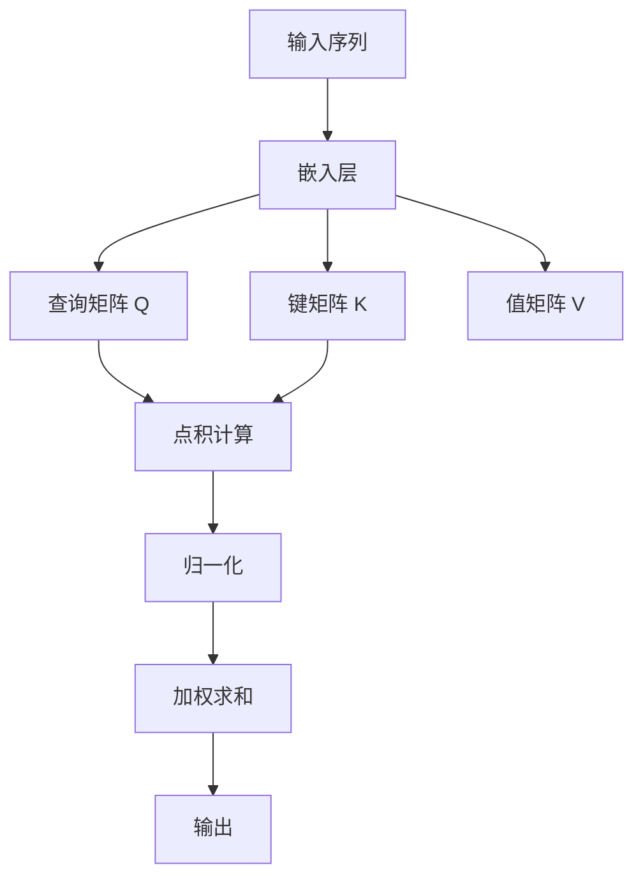

# 大规模语言模型从理论到实践 代码结构

## 1.背景介绍

大规模语言模型（Large Language Models, LLMs）近年来在自然语言处理（NLP）领域取得了显著的进展。诸如GPT-3、BERT等模型在各种任务中表现出色，从文本生成到翻译，再到情感分析和问答系统。这些模型的成功不仅依赖于庞大的数据集和计算资源，还依赖于复杂的算法和精巧的代码结构。

在这篇文章中，我们将深入探讨大规模语言模型的核心概念、算法原理、数学模型、实际应用以及代码实现。通过详细的解释和实际示例，我们希望能够帮助读者更好地理解和应用这些先进的技术。

## 2.核心概念与联系

### 2.1 语言模型的定义

语言模型是一种能够理解和生成自然语言文本的模型。其核心任务是预测给定上下文中下一个词的概率。形式化地，给定一个词序列 $w_1, w_2, ..., w_{n-1}$，语言模型的目标是计算 $P(w_n | w_1, w_2, ..., w_{n-1})$。

### 2.2 大规模语言模型的特点

大规模语言模型通常具有以下几个特点：
- **庞大的参数量**：例如，GPT-3拥有1750亿个参数。
- **海量的训练数据**：这些模型通常在数百GB甚至TB级别的数据上进行训练。
- **复杂的架构**：如Transformer架构，包含多层的自注意力机制和前馈神经网络。

### 2.3 核心组件

大规模语言模型的核心组件包括：
- **嵌入层**：将词汇映射到高维向量空间。
- **编码器和解码器**：处理输入序列和生成输出序列。
- **自注意力机制**：捕捉序列中不同位置之间的依赖关系。

## 3.核心算法原理具体操作步骤

### 3.1 Transformer架构

Transformer架构是大规模语言模型的基础。其核心思想是通过自注意力机制来捕捉序列中不同位置之间的依赖关系。

#### 3.1.1 自注意力机制

自注意力机制的计算过程如下：
1. **输入嵌入**：将输入序列 $X = [x_1, x_2, ..., x_n]$ 映射到高维向量空间。
2. **计算查询、键和值**：通过线性变换得到查询矩阵 $Q$、键矩阵 $K$ 和值矩阵 $V$。
3. **计算注意力权重**：通过点积计算注意力权重，并进行归一化。
4. **加权求和**：使用注意力权重对值矩阵进行加权求和，得到输出。



### 3.2 训练过程

大规模语言模型的训练过程通常包括以下几个步骤：
1. **数据预处理**：清洗和标注训练数据。
2. **模型初始化**：初始化模型参数。
3. **前向传播**：计算模型的输出和损失。
4. **反向传播**：计算梯度并更新模型参数。
5. **模型评估**：在验证集上评估模型性能。

## 4.数学模型和公式详细讲解举例说明

### 4.1 自注意力机制的数学公式

自注意力机制的核心公式如下：

$$
\text{Attention}(Q, K, V) = \text{softmax}\left(\frac{QK^T}{\sqrt{d_k}}\right)V
$$

其中，$Q$ 是查询矩阵，$K$ 是键矩阵，$V$ 是值矩阵，$d_k$ 是键的维度。

### 4.2 损失函数

大规模语言模型通常使用交叉熵损失函数来衡量预测结果与真实标签之间的差异：

$$
\mathcal{L} = -\sum_{i=1}^{N} y_i \log(\hat{y}_i)
$$

其中，$y_i$ 是真实标签，$\hat{y}_i$ 是模型的预测概率。

### 4.3 示例

假设我们有一个简单的输入序列 $X = [x_1, x_2]$，其嵌入向量分别为 $e_1$ 和 $e_2$。通过线性变换得到查询矩阵 $Q$、键矩阵 $K$ 和值矩阵 $V$：

$$
Q = W_Q \cdot [e_1, e_2], \quad K = W_K \cdot [e_1, e_2], \quad V = W_V \cdot [e_1, e_2]
$$

计算注意力权重：

$$
\text{Attention}(Q, K, V) = \text{softmax}\left(\frac{QK^T}{\sqrt{d_k}}\right)V
$$

## 5.项目实践：代码实例和详细解释说明

### 5.1 环境配置

首先，我们需要配置开发环境。推荐使用Python和PyTorch框架。

```bash
pip install torch transformers
```

### 5.2 数据预处理

```python
from transformers import BertTokenizer

tokenizer = BertTokenizer.from_pretrained('bert-base-uncased')
text = "Hello, how are you?"
tokens = tokenizer.tokenize(text)
input_ids = tokenizer.convert_tokens_to_ids(tokens)
```

### 5.3 模型定义

```python
import torch
from transformers import BertModel

model = BertModel.from_pretrained('bert-base-uncased')
input_ids = torch.tensor([input_ids])
outputs = model(input_ids)
```

### 5.4 训练过程

```python
from transformers import AdamW

optimizer = AdamW(model.parameters(), lr=1e-5)
loss_fn = torch.nn.CrossEntropyLoss()

for epoch in range(num_epochs):
    model.train()
    optimizer.zero_grad()
    outputs = model(input_ids)
    loss = loss_fn(outputs.logits, labels)
    loss.backward()
    optimizer.step()
```

### 5.5 模型评估

```python
model.eval()
with torch.no_grad():
    outputs = model(input_ids)
    predictions = torch.argmax(outputs.logits, dim=-1)
```

## 6.实际应用场景

### 6.1 文本生成

大规模语言模型可以用于生成高质量的文本。例如，GPT-3可以生成新闻文章、故事和代码片段。

### 6.2 机器翻译

通过训练在多语言数据集上，大规模语言模型可以实现高精度的机器翻译。

### 6.3 问答系统

大规模语言模型可以用于构建智能问答系统，提供准确的答案和建议。

## 7.工具和资源推荐

### 7.1 开发工具

- **PyTorch**：一个灵活且高效的深度学习框架。
- **Transformers**：Hugging Face提供的预训练模型库。

### 7.2 数据集

- **Common Crawl**：一个包含海量网页数据的公开数据集。
- **Wikipedia**：一个高质量的百科全书数据集。

### 7.3 学习资源

- **《深度学习》**：Ian Goodfellow等人编写的经典教材。
- **Hugging Face文档**：提供了详细的API文档和教程。

## 8.总结：未来发展趋势与挑战

大规模语言模型在NLP领域展现了巨大的潜力，但也面临一些挑战和未来发展方向：

### 8.1 模型压缩

大规模语言模型的参数量巨大，如何在保证性能的前提下进行模型压缩是一个重要的研究方向。

### 8.2 数据隐私

大规模语言模型需要大量的数据进行训练，如何保护用户隐私是一个亟待解决的问题。

### 8.3 多模态学习

未来的语言模型可能不仅仅局限于文本，还会结合图像、音频等多种模态进行学习和推理。

## 9.附录：常见问题与解答

### 9.1 如何选择合适的预训练模型？

选择预训练模型时，需要考虑任务的具体需求和模型的性能。例如，BERT适用于文本分类和问答任务，而GPT-3更适合文本生成任务。

### 9.2 如何处理训练数据不足的问题？

可以通过数据增强、迁移学习等方法来缓解训练数据不足的问题。

### 9.3 如何优化模型的训练速度？

可以通过使用分布式训练、混合精度训练等技术来加速模型的训练过程。

---

作者：禅与计算机程序设计艺术 / Zen and the Art of Computer Programming