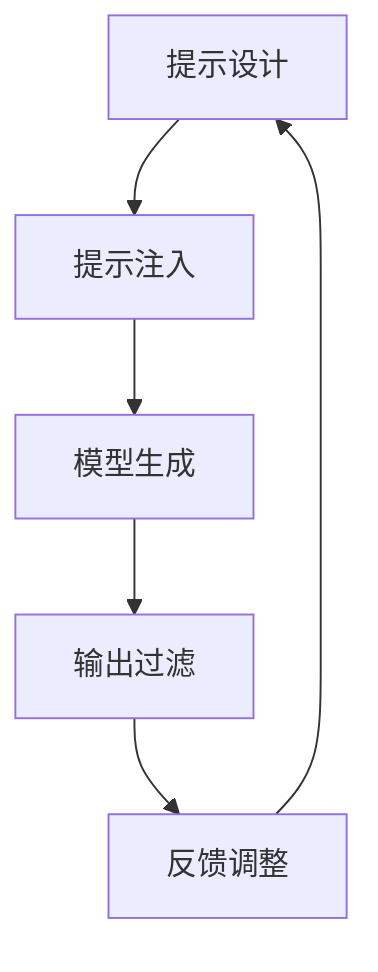

# 大语言模型原理基础与前沿 基于提示的脱毒

## 1.背景介绍

大语言模型（Large Language Models, LLMs）是近年来人工智能领域的重大突破之一。它们通过训练海量文本数据，能够生成高质量的自然语言文本，广泛应用于机器翻译、文本生成、对话系统等领域。然而，随着大语言模型的广泛应用，模型生成的文本中可能包含有害内容（如仇恨言论、虚假信息等）的问题也逐渐显现。为了应对这一挑战，基于提示的脱毒技术应运而生。

## 2.核心概念与联系

### 2.1 大语言模型

大语言模型是基于深度学习技术，特别是基于Transformer架构的模型。它们通过大量的文本数据进行训练，能够理解和生成自然语言文本。常见的大语言模型包括GPT-3、BERT等。

### 2.2 脱毒技术

脱毒技术旨在过滤或修改模型生成的文本，以去除其中的有害内容。基于提示的脱毒技术通过在输入提示中加入特定的指令，引导模型生成无害的文本。

### 2.3 基于提示的脱毒

基于提示的脱毒技术利用提示（Prompt）来控制模型的输出。通过设计合适的提示，可以引导模型生成符合预期的无害文本。这种方法具有灵活性和高效性，能够在不改变模型结构的情况下实现脱毒。

## 3.核心算法原理具体操作步骤

### 3.1 提示设计

设计提示是基于提示的脱毒技术的关键步骤。提示可以是明确的指令，如“生成无害的文本”或“避免使用仇恨言论”。提示的设计需要考虑模型的理解能力和生成能力。

### 3.2 提示注入

将设计好的提示注入到模型的输入中。提示可以作为输入文本的一部分，或者通过特定的标记来引导模型生成无害文本。

### 3.3 输出过滤

对模型生成的文本进行过滤，确保其符合预期的无害标准。可以使用预训练的分类器或规则来检测和过滤有害内容。

### 3.4 反馈调整

根据输出结果的质量，调整提示的设计和注入方式。通过不断的反馈和调整，优化提示的效果。



## 4.数学模型和公式详细讲解举例说明

### 4.1 语言模型的数学基础

语言模型的核心是通过最大化条件概率 $P(w_i | w_{i-1}, w_{i-2}, ..., w_1)$ 来生成文本。对于给定的输入提示 $P$ 和上下文 $C$，模型生成下一个词 $w_i$ 的概率可以表示为：

$$
P(w_i | P, C) = \frac{\exp(s(w_i, P, C))}{\sum_{w \in V} \exp(s(w, P, C))}
$$

其中，$s(w_i, P, C)$ 是词 $w_i$ 在提示 $P$ 和上下文 $C$ 下的得分，$V$ 是词汇表。

### 4.2 提示的影响

提示 $P$ 的设计直接影响模型的生成结果。通过调整提示，可以改变 $s(w_i, P, C)$ 的值，从而引导模型生成无害的文本。

### 4.3 过滤器的数学模型

输出过滤器可以使用分类器来检测有害内容。假设 $x$ 是生成的文本，$y$ 是标签（0 表示无害，1 表示有害），分类器的目标是最大化条件概率 $P(y | x)$。可以使用逻辑回归、SVM 或神经网络等方法来实现分类器。

## 5.项目实践：代码实例和详细解释说明

### 5.1 环境准备

首先，确保安装了必要的库，如 transformers 和 torch。

```python
!pip install transformers torch
```

### 5.2 模型加载

加载预训练的大语言模型，如 GPT-3。

```python
from transformers import GPT3Tokenizer, GPT3Model

tokenizer = GPT3Tokenizer.from_pretrained("gpt3")
model = GPT3Model.from_pretrained("gpt3")
```

### 5.3 提示设计与注入

设计提示并将其注入到模型的输入中。

```python
prompt = "请生成无害的文本："
input_text = prompt + "这是一个示例文本。"
input_ids = tokenizer.encode(input_text, return_tensors="pt")
```

### 5.4 模型生成

使用模型生成文本。

```python
output = model.generate(input_ids, max_length=50)
generated_text = tokenizer.decode(output[0], skip_special_tokens=True)
print(generated_text)
```

### 5.5 输出过滤

使用预训练的分类器过滤有害内容。

```python
from transformers import pipeline

classifier = pipeline("text-classification", model="text-classifier")
result = classifier(generated_text)
if result[0]['label'] == '有害':
    print("生成的文本包含有害内容")
else:
    print("生成的文本无害")
```

## 6.实际应用场景

### 6.1 社交媒体内容生成

在社交媒体平台上，基于提示的脱毒技术可以用于生成无害的用户评论和帖子，减少仇恨言论和虚假信息的传播。

### 6.2 客服对话系统

在客服对话系统中，基于提示的脱毒技术可以确保生成的回复内容无害，提升用户体验。

### 6.3 教育和培训

在教育和培训领域，基于提示的脱毒技术可以用于生成无害的学习材料和考试题目，确保内容的安全性。

## 7.工具和资源推荐

### 7.1 预训练模型

- GPT-3: OpenAI 提供的强大语言模型，适用于各种生成任务。
- BERT: Google 提供的预训练模型，适用于文本分类和问答任务。

### 7.2 开源库

- Transformers: Hugging Face 提供的开源库，支持多种预训练模型的加载和使用。
- Torch: PyTorch 提供的深度学习框架，支持模型的训练和推理。

### 7.3 数据集

- OpenWebText: 包含大量高质量的网页文本数据，适用于语言模型的训练。
- Toxic Comment Classification Challenge: Kaggle 提供的有害评论分类数据集，适用于训练和评估脱毒模型。

## 8.总结：未来发展趋势与挑战

### 8.1 未来发展趋势

基于提示的脱毒技术在未来有广阔的发展前景。随着大语言模型的不断进步，提示设计和注入方法将更加精细和智能，能够更好地引导模型生成无害文本。同时，结合多模态技术，可以实现文本、图像、音频等多种形式的脱毒。

### 8.2 挑战

尽管基于提示的脱毒技术具有很大的潜力，但仍面临一些挑战。首先，提示设计的效果依赖于模型的理解能力，不同模型对同一提示的响应可能不同。其次，输出过滤器的准确性和鲁棒性需要进一步提升，以确保能够有效检测和过滤有害内容。最后，如何在保持生成文本质量的同时实现脱毒，也是一个需要解决的问题。

## 9.附录：常见问题与解答

### 9.1 基于提示的脱毒技术是否适用于所有大语言模型？

基于提示的脱毒技术适用于大多数基于Transformer架构的大语言模型，如GPT-3、BERT等。然而，不同模型对提示的响应可能不同，需要根据具体情况进行调整。

### 9.2 如何设计有效的提示？

设计有效的提示需要考虑模型的理解能力和生成能力。可以通过实验和反馈不断优化提示的设计，确保其能够引导模型生成无害文本。

### 9.3 输出过滤器的准确性如何保证？

输出过滤器的准确性可以通过使用高质量的训练数据和先进的分类算法来提升。同时，可以结合多种过滤方法，如规则和机器学习模型，确保过滤效果。

### 9.4 基于提示的脱毒技术是否会影响生成文本的质量？

基于提示的脱毒技术可能会对生成文本的质量产生一定影响。为了在保持文本质量的同时实现脱毒，需要在提示设计和输出过滤方面进行优化和平衡。

作者：禅与计算机程序设计艺术 / Zen and the Art of Computer Programming