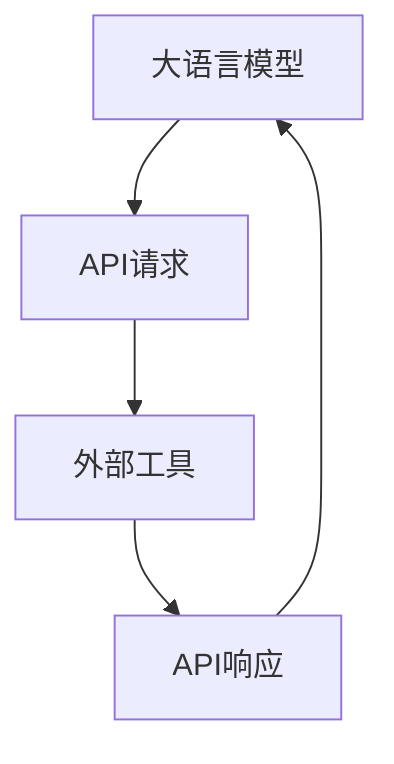

# 大语言模型应用指南：什么是外部工具

## 1.背景介绍

在人工智能和自然语言处理领域，大语言模型（Large Language Models, LLMs）如GPT-4已经展示了其强大的能力。这些模型不仅能够生成高质量的文本，还能理解和处理复杂的语言任务。然而，单纯依靠语言模型本身有时并不能满足所有应用需求，这时我们需要借助外部工具来扩展其功能和应用范围。

外部工具可以是各种形式的，包括但不限于数据库、API、计算引擎、数据分析工具等。通过与这些工具的集成，语言模型可以实现更复杂的任务，如实时数据查询、复杂计算、图像处理等。

## 2.核心概念与联系

### 2.1 大语言模型

大语言模型是基于深度学习的自然语言处理模型，通常由数十亿甚至上百亿参数组成。它们通过大量的文本数据进行训练，能够生成和理解自然语言。

### 2.2 外部工具

外部工具是指那些可以与大语言模型集成使用的独立系统或服务。这些工具可以提供额外的功能，如数据存储、计算能力、特定领域的知识等。

### 2.3 集成方式

大语言模型与外部工具的集成通常通过API调用、插件或中间件实现。这种集成方式使得语言模型能够在处理复杂任务时调用外部工具的功能，从而提高其应用范围和效率。

## 3.核心算法原理具体操作步骤

### 3.1 API调用

API（Application Programming Interface）是最常见的集成方式。通过API，大语言模型可以发送请求并接收外部工具的响应。



### 3.2 插件机制

插件机制允许在大语言模型的基础上添加额外的功能模块。这些模块可以是预先编写好的代码库，能够在特定任务中调用外部工具。

### 3.3 中间件

中间件是一种在大语言模型和外部工具之间的桥梁，负责处理数据传输、格式转换和任务调度等工作。

## 4.数学模型和公式详细讲解举例说明

### 4.1 语言模型的数学基础

大语言模型通常基于变分自编码器（Variational Autoencoder, VAE）或生成对抗网络（Generative Adversarial Network, GAN）等深度学习模型。其核心是通过最大化似然估计来生成符合输入数据分布的文本。

$$
P(X) = \prod_{t=1}^{T} P(x_t | x_{1:t-1})
$$

### 4.2 API调用的数学描述

API调用可以看作是一个函数 $f$，其输入是请求参数，输出是响应结果。

$$
f: X \rightarrow Y
$$

其中，$X$ 是请求参数的集合，$Y$ 是响应结果的集合。

### 4.3 插件机制的数学描述

插件机制可以看作是一个扩展函数 $g$，其作用是将大语言模型的输出 $O$ 转换为外部工具的输入 $I$。

$$
g: O \rightarrow I
$$

## 5.项目实践：代码实例和详细解释说明

### 5.1 API调用实例

以下是一个通过Python调用外部API的示例代码：

```python
import requests

def call_external_api(query):
    url = "https://api.example.com/data"
    params = {"query": query}
    response = requests.get(url, params=params)
    return response.json()

query = "current weather in New York"
result = call_external_api(query)
print(result)
```

### 5.2 插件机制实例

以下是一个通过Python实现插件机制的示例代码：

```python
class ExternalToolPlugin:
    def __init__(self, tool):
        self.tool = tool

    def process(self, input_data):
        return self.tool.execute(input_data)

class ExampleTool:
    def execute(self, data):
        # 处理数据的逻辑
        return data.upper()

plugin = ExternalToolPlugin(ExampleTool())
result = plugin.process("hello world")
print(result)
```

## 6.实际应用场景

### 6.1 数据查询

通过集成数据库查询工具，大语言模型可以实现实时数据查询。例如，用户可以询问当前的股票价格，模型通过API调用获取最新数据并返回结果。

### 6.2 复杂计算

集成计算引擎如Wolfram Alpha，可以让大语言模型处理复杂的数学计算和科学问题。

### 6.3 图像处理

通过集成图像处理工具，如OpenCV或TensorFlow，大语言模型可以处理图像识别、分类等任务。

## 7.工具和资源推荐

### 7.1 API资源

- [OpenAI API](https://openai.com/api/)
- [Google Cloud API](https://cloud.google.com/apis)

### 7.2 插件框架

- [Flask](https://flask.palletsprojects.com/)
- [Django](https://www.djangoproject.com/)

### 7.3 中间件

- [Apache Kafka](https://kafka.apache.org/)
- [RabbitMQ](https://www.rabbitmq.com/)

## 8.总结：未来发展趋势与挑战

大语言模型与外部工具的集成是未来人工智能应用的重要方向。通过这种集成，语言模型可以实现更复杂和多样化的任务。然而，这也带来了新的挑战，如数据安全、隐私保护、系统稳定性等。

未来，我们可以预见更多的自动化工具和智能系统将通过这种方式实现更高效的工作流程和更智能的决策支持。

## 9.附录：常见问题与解答

### 9.1 如何选择合适的外部工具？

选择外部工具时，应考虑其功能、性能、兼容性和安全性。根据具体应用需求，选择最适合的工具。

### 9.2 如何确保数据安全？

在集成外部工具时，应采取必要的安全措施，如数据加密、访问控制、日志监控等，以确保数据安全。

### 9.3 如何处理系统故障？

系统故障是不可避免的，应设计健壮的错误处理机制和备份方案，以确保系统的稳定性和可靠性。

---

作者：禅与计算机程序设计艺术 / Zen and the Art of Computer Programming