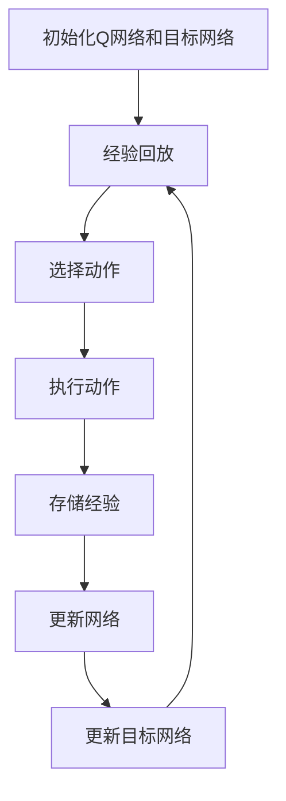
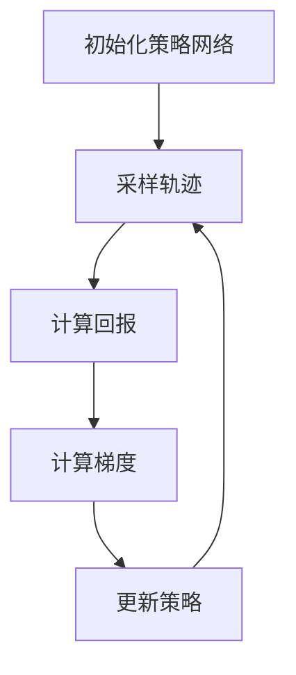
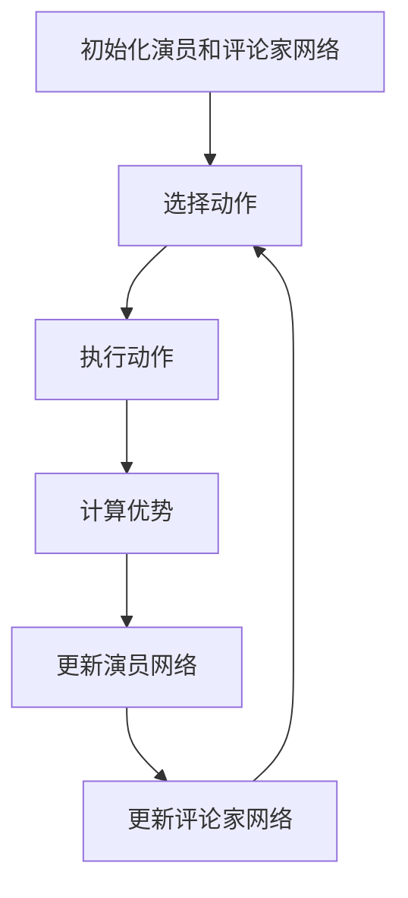

# 深度强化学习 原理与代码实例讲解

## 1.背景介绍

深度强化学习（Deep Reinforcement Learning, DRL）是人工智能领域的一个重要分支，它结合了深度学习和强化学习的优势，能够在复杂环境中实现智能体的自主学习和决策。近年来，DRL在游戏、机器人控制、自动驾驶等领域取得了显著的成果，吸引了大量研究者和工程师的关注。

强化学习的核心思想是通过与环境的交互，学习一个策略，使得智能体在长期内获得最大的累积奖励。而深度学习则通过神经网络的强大表示能力，解决了传统强化学习在高维状态空间中的局限性。两者的结合，使得DRL能够处理更加复杂和高维的任务。

## 2.核心概念与联系

在深入探讨DRL之前，我们需要了解一些基本概念和它们之间的联系。

### 2.1 强化学习基本概念

- **智能体（Agent）**：在环境中执行动作的实体。
- **环境（Environment）**：智能体所处的外部世界。
- **状态（State, s）**：环境在某一时刻的描述。
- **动作（Action, a）**：智能体在某一状态下可以执行的操作。
- **奖励（Reward, r）**：智能体执行某一动作后，环境反馈的信号。
- **策略（Policy, π）**：智能体在每个状态下选择动作的规则。
- **值函数（Value Function, V）**：在某一状态下，智能体未来累积奖励的期望。
- **动作值函数（Action-Value Function, Q）**：在某一状态执行某一动作后，智能体未来累积奖励的期望。

### 2.2 深度学习基本概念

- **神经网络（Neural Network）**：由多个层组成的计算模型，每一层包含若干神经元。
- **前向传播（Forward Propagation）**：输入数据通过神经网络层层传递，最终输出结果。
- **反向传播（Backward Propagation）**：通过计算损失函数的梯度，调整神经网络的权重。

### 2.3 深度强化学习的联系

深度强化学习通过神经网络来近似值函数或策略函数，从而解决高维状态空间中的决策问题。常见的DRL算法包括深度Q网络（DQN）、策略梯度（Policy Gradient）和演员-评论家（Actor-Critic）等。

## 3.核心算法原理具体操作步骤

### 3.1 深度Q网络（DQN）

DQN是DRL中最经典的算法之一，它通过神经网络来近似Q值函数。其核心思想是使用经验回放和目标网络来稳定训练过程。

#### 3.1.1 算法步骤

1. **初始化**：初始化Q网络和目标网络的参数。
2. **经验回放**：使用一个回放缓冲区存储智能体的经验。
3. **选择动作**：使用 $\epsilon$-贪婪策略选择动作。
4. **执行动作**：在环境中执行动作，获得新的状态和奖励。
5. **存储经验**：将经验存储到回放缓冲区。
6. **更新网络**：从回放缓冲区中随机采样经验，计算损失并更新Q网络。
7. **更新目标网络**：定期将Q网络的参数复制到目标网络。



### 3.2 策略梯度（Policy Gradient）

策略梯度方法直接优化策略函数，通过梯度上升的方法最大化累积奖励。

#### 3.2.1 算法步骤

1. **初始化**：初始化策略网络的参数。
2. **采样**：在当前策略下采样多个轨迹。
3. **计算回报**：计算每个轨迹的累积回报。
4. **计算梯度**：计算策略梯度。
5. **更新策略**：使用梯度上升更新策略网络。



### 3.3 演员-评论家（Actor-Critic）

演员-评论家方法结合了值函数和策略函数，通过两个网络分别表示策略和值函数。

#### 3.3.1 算法步骤

1. **初始化**：初始化演员网络和评论家网络的参数。
2. **选择动作**：使用演员网络选择动作。
3. **执行动作**：在环境中执行动作，获得新的状态和奖励。
4. **计算优势**：使用评论家网络计算优势函数。
5. **更新网络**：使用优势函数更新演员网络，使用TD误差更新评论家网络。



## 4.数学模型和公式详细讲解举例说明

### 4.1 深度Q网络（DQN）

DQN的核心是使用神经网络来近似Q值函数。其损失函数定义为：

$$
L(\theta) = \mathbb{E}_{(s, a, r, s') \sim D} \left[ \left( r + \gamma \max_{a'} Q(s', a'; \theta^-) - Q(s, a; \theta) \right)^2 \right]
$$

其中，$\theta$ 是Q网络的参数，$\theta^-$ 是目标网络的参数，$D$ 是经验回放缓冲区，$\gamma$ 是折扣因子。

### 4.2 策略梯度（Policy Gradient）

策略梯度方法的目标是最大化累积回报，其梯度定义为：

$$
\nabla_\theta J(\theta) = \mathbb{E}_{\tau \sim \pi_\theta} \left[ \sum_{t=0}^T \nabla_\theta \log \pi_\theta(a_t | s_t) R(\tau) \right]
$$

其中，$\theta$ 是策略网络的参数，$\tau$ 是轨迹，$R(\tau)$ 是轨迹的累积回报。

### 4.3 演员-评论家（Actor-Critic）

演员-评论家方法结合了策略梯度和值函数，其更新规则为：

$$
\nabla_\theta J(\theta) = \mathbb{E}_{s \sim d^\pi, a \sim \pi_\theta} \left[ \nabla_\theta \log \pi_\theta(a | s) A^\pi(s, a) \right]
$$

其中，$A^\pi(s, a)$ 是优势函数，定义为：

$$
A^\pi(s, a) = Q^\pi(s, a) - V^\pi(s)
$$

## 5.项目实践：代码实例和详细解释说明

### 5.1 深度Q网络（DQN）代码实例

以下是一个简单的DQN实现示例，使用Python和TensorFlow库。

```python
import tensorflow as tf
import numpy as np
import gym

class DQN:
    def __init__(self, state_dim, action_dim):
        self.state_dim = state_dim
        self.action_dim = action_dim
        self.model = self.build_model()
        self.target_model = self.build_model()
        self.optimizer = tf.keras.optimizers.Adam(learning_rate=0.001)
        self.loss_fn = tf.keras.losses.MeanSquaredError()
        self.replay_buffer = []

    def build_model(self):
        model = tf.keras.Sequential([
            tf.keras.layers.Dense(24, activation='relu', input_shape=(self.state_dim,)),
            tf.keras.layers.Dense(24, activation='relu'),
            tf.keras.layers.Dense(self.action_dim, activation='linear')
        ])
        model.compile(optimizer=self.optimizer, loss=self.loss_fn)
        return model

    def update_target_model(self):
        self.target_model.set_weights(self.model.get_weights())

    def select_action(self, state, epsilon):
        if np.random.rand() <= epsilon:
            return np.random.choice(self.action_dim)
        q_values = self.model.predict(state[np.newaxis])
        return np.argmax(q_values[0])

    def store_experience(self, state, action, reward, next_state, done):
        self.replay_buffer.append((state, action, reward, next_state, done))
        if len(self.replay_buffer) > 2000:
            self.replay_buffer.pop(0)

    def train(self, batch_size):
        minibatch = np.random.choice(self.replay_buffer, batch_size)
        for state, action, reward, next_state, done in minibatch:
            target = reward
            if not done:
                target += 0.99 * np.amax(self.target_model.predict(next_state[np.newaxis])[0])
            target_f = self.model.predict(state[np.newaxis])
            target_f[0][action] = target
            self.model.fit(state[np.newaxis], target_f, epochs=1, verbose=0)

env = gym.make('CartPole-v1')
state_dim = env.observation_space.shape[0]
action_dim = env.action_space.n
dqn = DQN(state_dim, action_dim)

episodes = 1000
for e in range(episodes):
    state = env.reset()
    for time in range(500):
        action = dqn.select_action(state, 1.0 / (e + 1))
        next_state, reward, done, _ = env.step(action)
        dqn.store_experience(state, action, reward, next_state, done)
        state = next_state
        if done:
            print(f"Episode: {e}/{episodes}, Score: {time}")
            break
        if len(dqn.replay_buffer) > 32:
            dqn.train(32)
    dqn.update_target_model()
```

### 5.2 代码解释

1. **DQN类**：定义了DQN算法的核心，包括模型构建、动作选择、经验存储和训练方法。
2. **build_model方法**：构建一个简单的神经网络模型。
3. **update_target_model方法**：将Q网络的参数复制到目标网络。
4. **select_action方法**：使用 $\epsilon$-贪婪策略选择动作。
5. **store_experience方法**：将经验存储到回放缓冲区。
6. **train方法**：从回放缓冲区中采样经验，更新Q网络。
7. **主循环**：在环境中运行多个回合，训练DQN模型。

## 6.实际应用场景

### 6.1 游戏AI

DRL在游戏AI中取得了显著的成果，例如AlphaGo、Dota 2和Atari游戏。通过与环境的不断交互，智能体能够学习到复杂的策略，击败人类玩家。

### 6.2 机器人控制

在机器人控制领域，DRL被用于解决复杂的运动控制问题。例如，机器人手臂的抓取和操作任务，通过DRL算法，机器人能够自主学习如何完成这些任务。

### 6.3 自动驾驶

自动驾驶是DRL的另一个重要应用场景。通过在模拟环境中训练，自动驾驶系统能够学习到如何在复杂的交通环境中安全驾驶。

## 7.工具和资源推荐

### 7.1 开源框架

- **TensorFlow**：一个广泛使用的深度学习框架，支持DRL算法的实现。
- **PyTorch**：另一个流行的深度学习框架，具有灵活的动态计算图。
- **OpenAI Gym**：一个用于开发和比较强化学习算法的工具包，提供了多种环境。

### 7.2 书籍和教程

- **《深度强化学习》**：一本详细介绍DRL理论和实践的书籍。
- **Coursera上的强化学习课程**：由知名教授讲授的在线课程，涵盖了强化学习的基本概念和算法。

### 7.3 研究论文

- **"Playing Atari with Deep Reinforcement Learning"**：DQN算法的开创性论文。
- **"Asynchronous Methods for Deep Reinforcement Learning"**：A3C算法的介绍论文。

## 8.总结：未来发展趋势与挑战

### 8.1 未来发展趋势

1. **多智能体强化学习**：研究多个智能体在同一环境中的协作和竞争。
2. **元强化学习**：研究智能体在不同任务之间的快速适应能力。
3. **安全性和鲁棒性**：确保DRL算法在实际应用中的安全性和鲁棒性。

### 8.2 挑战

1. **样本效率**：DRL算法通常需要大量的样本进行训练，如何提高样本效率是一个重要挑战。
2. **稳定性**：DRL算法的训练过程可能不稳定，如何设计稳定的算法是一个研究热点。
3. **可解释性**：DRL算法的决策过程通常是黑箱的，如何提高其可解释性是一个重要问题。

## 9.附录：常见问题与解答

### 9.1 什么是深度强化学习？

深度强化学习是结合了深度学习和强化学习的技术，通过神经网络来近似值函数或策略函数，从而解决高维状态空间中的决策问题。

### 9.2 深度Q网络（DQN）如何工作？

DQN通过神经网络来近似Q值函数，使用经验回放和目标网络来稳定训练过程。其核心步骤包括初始化网络、选择动作、执行动作、存储经验和更新网络。

### 9.3 如何选择合适的DRL算法？

选择合适的DRL算法取决于具体的应用场景和问题复杂度。对于离散动作空间，DQN是一个常见选择；对于连续动作空间，策略梯度和演员-评论家方法更为适用。

### 9.4 DRL在实际应用中有哪些挑战？

DRL在实际应用中面临样本效率、稳定性和可解释性等挑战。提高样本效率、设计稳定的算法和提高可解释性是当前研究的热点。

---

作者：禅与计算机程序设计艺术 / Zen and the Art of Computer Programming