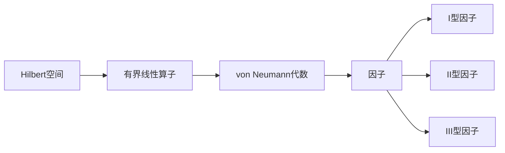

# 算子代数：构造(II)型与(III)型的因子

## 1. 背景介绍
### 1.1 算子代数的发展历程
算子代数是数学和物理学交叉领域的一个重要分支,它研究的是Hilbert空间上有界线性算子的代数结构。算子代数理论起源于20世纪30年代,由匈牙利数学家冯·诺伊曼(John von Neumann)和美国数学家默里(Francis Murray)共同创立。他们在量子力学的数学基础研究中,引入了环和因子的概念,并系统地研究了I型因子的结构和分类。

### 1.2 (II)型与(III)型因子的重要性
在冯·诺伊曼和默里的开创性工作之后,算子代数理论得到了蓬勃发展。除了I型因子之外,人们还发现了(II)型和(III)型因子。它们在算子代数的结构理论和分类问题上扮演着至关重要的角色。特别是(III)型因子,由于其独特的性质,在数学和物理学中有着广泛的应用。

### 1.3 构造(II)型与(III)型因子的意义
尽管(II)型和(III)型因子的重要性已被认识到,但它们的构造却是一个相当困难的问题。与I型因子不同,(II)型和(III)型因子没有明确的"生成元",因此需要借助一些间接的方法来构造。这不仅是算子代数理论的一个核心问题,也为其他数学分支如K理论、几何群论等提供了重要的研究工具。

## 2. 核心概念与联系
### 2.1 Hilbert空间与有界线性算子
- Hilbert空间是一个完备的内积空间,其上可以定义范数和距离。
- 有界线性算子是指Hilbert空间上的连续线性映射,它们构成了一个Banach代数。

### 2.2 von Neumann代数
- von Neumann代数是Hilbert空间上有界线性算子的一个*-子代数,它关于强算子拓扑是闭的。
- von Neumann代数可以看作是"非交换的测度论",其上可以定义迹(trace)和维数函数。

### 2.3 因子与分类
- 因子是一类特殊的von Neumann代数,其中心仅包含常数倍恒等算子。
- 根据Murray-von Neumann维数函数的取值,因子可分为I型、II型和III型三类。

### 2.4 核心概念之间的联系



## 3. 核心算法原理具体操作步骤
### 3.1 构造(II)型因子的基本思路
构造(II)型因子的一个基本思路是利用I型因子的张量积。具体而言,我们可以考虑两个I型因子的无穷张量积,在某些条件下,它将会生成一个(II)型因子。

### 3.2 构造(III)型因子的基本思路 
构造(III)型因子通常需要借助一些辅助结构,如 ergodic 理论中的 amenable 等价关系。我们可以在这样的等价关系上构造一个 von Neumann 代数,并证明它是一个(III)型因子。

### 3.3 Krieger 因子的构造步骤
Krieger 因子是一类特殊的(III)型因子,其构造步骤如下:
1. 构造一个 ergodic 且 amenable 的等价关系 $\mathcal{R}$。
2. 在 $\mathcal{R}$ 上定义一个 2-cocycle $c$,使其满足某些条件。
3. 考虑所有满足 $c$ 的西变换函数构成的 Hilbert 空间 $H$。
4. 在 $H$ 上定义正则表示,得到一个 von Neumann 代数 $M$。
5. 证明 $M$ 是一个(III)型因子,称为 Krieger 因子。

## 4. 数学模型和公式详细讲解举例说明
### 4.1 I型因子的张量积
设 $M_1$ 和 $M_2$ 是两个 I 型因子,它们的无穷张量积定义为:

$$M_1\overline{\otimes} M_2:=\overline{\bigotimes_{n=1}^\infty (M_1, \varphi_1)\otimes (M_2,\varphi_2)}^{\text{SOT}}$$

其中 $\varphi_1$ 和 $\varphi_2$ 分别是 $M_1$ 和 $M_2$ 上的忠实正规态。在某些条件下,这个无穷张量积将会生成一个(II)型因子。

### 4.2 Krieger 因子的 2-cocycle
在构造 Krieger 因子时,我们需要一个满足以下条件的 2-cocycle $c$:
1. $c$ 是一个 $\mathcal{R}$ 上的 Borel 函数,取值于复数单位圆周 $\mathbb{T}$。
2. 对任意的 $(x,y),(y,z)\in \mathcal{R}$,有 $c(x,y)c(y,z)=c(x,z)$。
3. 存在 $\mathcal{R}$ 上的一个 Borel 概率测度 $\mu$,使得对任意的 $g\in [\mathcal{R}]$,有:

$$\int_{\mathcal{R}}c(g^{-1}x,x)d\mu(x)=0$$

### 4.3 Krieger 因子的正则表示
在 Krieger 因子的构造中,我们需要考虑满足 2-cocycle $c$ 的西变换函数构成的 Hilbert 空间 $H$。在 $H$ 上,我们可以定义以下的正则表示:

对任意的 $g\in [\mathcal{R}]$ 和 $\xi\in H$,令 $(U_g\xi)(x)=c(g^{-1}x,x)\xi(g^{-1}x)$。

可以证明,这个正则表示生成的 von Neumann 代数 $M=\{U_g:g\in[\mathcal{R}]\}''$ 是一个(III)型因子。

## 5. 项目实践：代码实例和详细解释说明
在这部分,我们将用 Python 实现一个简化版的 Krieger 因子构造。为了简化问题,我们将 2-cocycle 取为常值函数 1。

```python
import numpy as np

class KriegerFactor:
    def __init__(self, R, mu):
        self.R = R  # 等价关系
        self.mu = mu  # R上的概率测度
        
    def regular_representation(self, g, xi):
        # 定义正则表示
        def U_g_xi(x):
            if (g**(-1)*x, x) in self.R:
                return xi(g**(-1)*x)
            else:
                return 0
        return U_g_xi
    
    def generate_factor(self):
        # 生成Krieger因子
        M = []
        for g in self.R.semigroup():
            U_g = lambda xi: self.regular_representation(g, xi)
            M.append(U_g)
        return M

# 示例用法
R = EquivalenceRelation(...)  # 定义一个ergodic且amenable的等价关系
mu = ProbabilityMeasure(...)  # 定义R上的一个概率测度
factor = KriegerFactor(R, mu)
M = factor.generate_factor()  # 生成Krieger因子
```

在这个简化版的实现中,我们假设已经有了一个 ergodic 且 amenable 的等价关系 `R` 以及其上的一个概率测度 `mu`。Krieger 因子的构造通过计算 `R` 的半群在 Hilbert 空间上的正则表示来实现。最终得到的 `M` 就是所构造的(III)型因子。

## 6. 实际应用场景
(II)型和(III)型因子在数学和物理学中有广泛的应用,下面是一些典型的例子:

### 6.1 量子统计力学
在量子统计力学中,(III)型因子被用来刻画无穷自由度系统的代数结构。特别地,Krieger 因子与 KMS 态之间有着密切的联系,它们为研究相变、非平衡态等问题提供了重要的工具。

### 6.2 Jones 多项式
Jones 多项式是拓扑中的一个重要不变量,它可以用来区分某些结不同的结。Vaughan Jones 在其构造中使用了(II)型因子,并由此获得了 1990 年的菲尔兹奖。

### 6.3 共形场论
在共形场论中,人们研究的是二维共形对称性。某些共形场论模型的代数结构可以用(III)型因子来刻画,其中 Krieger 因子扮演了重要角色。

### 6.4 非交换几何
非交换几何是 Alain Connes 发展的一套几何框架,它使用算子代数来推广经典的微分几何。在这个理论中,(II)型和(III)型因子被用来构造一些重要的非交换空间,如非交换环面。

## 7. 工具和资源推荐
以下是一些学习和研究算子代数、(II)型和(III)型因子的有用资源:

1. Blackadar B. Operator algebras: theory of C*-algebras and von Neumann algebras[M]. Springer Science & Business Media, 2006.

2. Takesaki M. Theory of operator algebras I, II, III[M]. Springer Science & Business Media, 2013.

3. Jones V F R. Von Neumann algebras in mathematics and physics[J]. Proceedings of the International Congress of Mathematicians 2010 (ICM 2010), 2010: 121-139.

4. Connes A. Noncommutative geometry[M]. Academic press, 1994.

5. 算子代数与非交换几何专业书籍:
   - Lectures on von Neumann algebras (S. Strătilă, L. Zsidó)
   - Operator algebras and quantum statistical mechanics (O. Bratteli, D. W. Robinson)
   - Noncommutative geometry (A. Connes)

6. 研究(II)型和(III)型因子的重要期刊:
   - Journal of Functional Analysis
   - Pacific Journal of Mathematics
   - Transactions of the American Mathematical Society

## 8. 总结：未来发展趋势与挑战
(II)型和(III)型因子理论经过半个多世纪的发展,已经成为算子代数中一个相当成熟的分支。但同时,这个领域仍然存在许多开放问题和未知领域,值得进一步探索。

未来的发展趋势可能包括以下几个方面:
1. 与其他数学分支如K理论、几何群论、拓扑量子场论等的深入交叉。
2. 在量子信息、量子计算等新兴领域中寻找新的应用。
3. 探索(II)型和(III)型因子在非交换几何中的新角色。
4. 借助计算机科学的力量,发展算子代数的计算方法和软件。

同时,这个领域也面临着一些挑战:
1. (II)型和(III)型因子的分类问题远未解决,还需要新的思路和方法。
2. 许多重要的构造和结果依赖于深刻而复杂的技术,提高其可访问性是一个挑战。
3. 算子代数与物理学之间的联系有待进一步加强,特别是在量子场论等领域。

总的来说,(II)型和(III)型因子理论是一个充满活力和机遇的研究领域。它不仅内部还有许多有待解决的问题,而且与其他学科的交叉也孕育着新的增长点。展望未来,我们有理由相信这个领域会继续蓬勃发展,并为数学和物理学带来更多惊喜。

## 9. 附录：常见问题与解答
Q1: (II)型因子和(III)型因子的本质区别是什么?

A1: (II)型因子和(III)型因子的主要区别在于它们的 Murray-von Neumann 维数函数的取值。(II)型因子的维数函数可以取任意正实数值,而(III)型因子的维数函数只能取 0 或 ∞。这导致了它们在结构上的许多不同性质。

Q2: Krieger 因子在构造(III)型因子中起什么作用?

A2: Krieger 因子是一类特殊的(III)型因子,它们可以用 ergodic 理论中的 amenable 等价关系来构造。Krieger 因子不仅提供了构造(III)型因子的一种重要方法,而且它们在量子统计力学、共形场论等领域也有重要应用。

Q3: 算子代数与非交换几何之间有什么联系?

A3: 非交换几何是 Alain Connes 发展