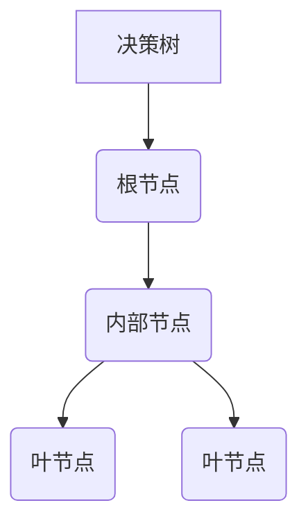
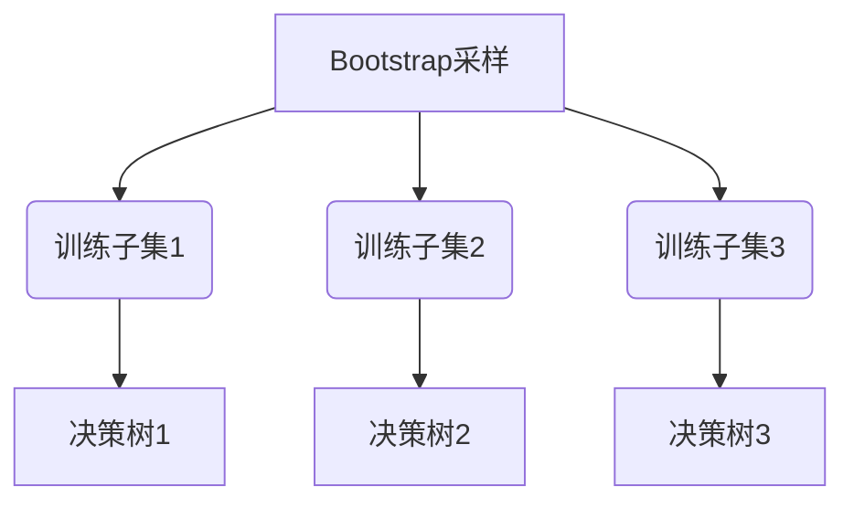
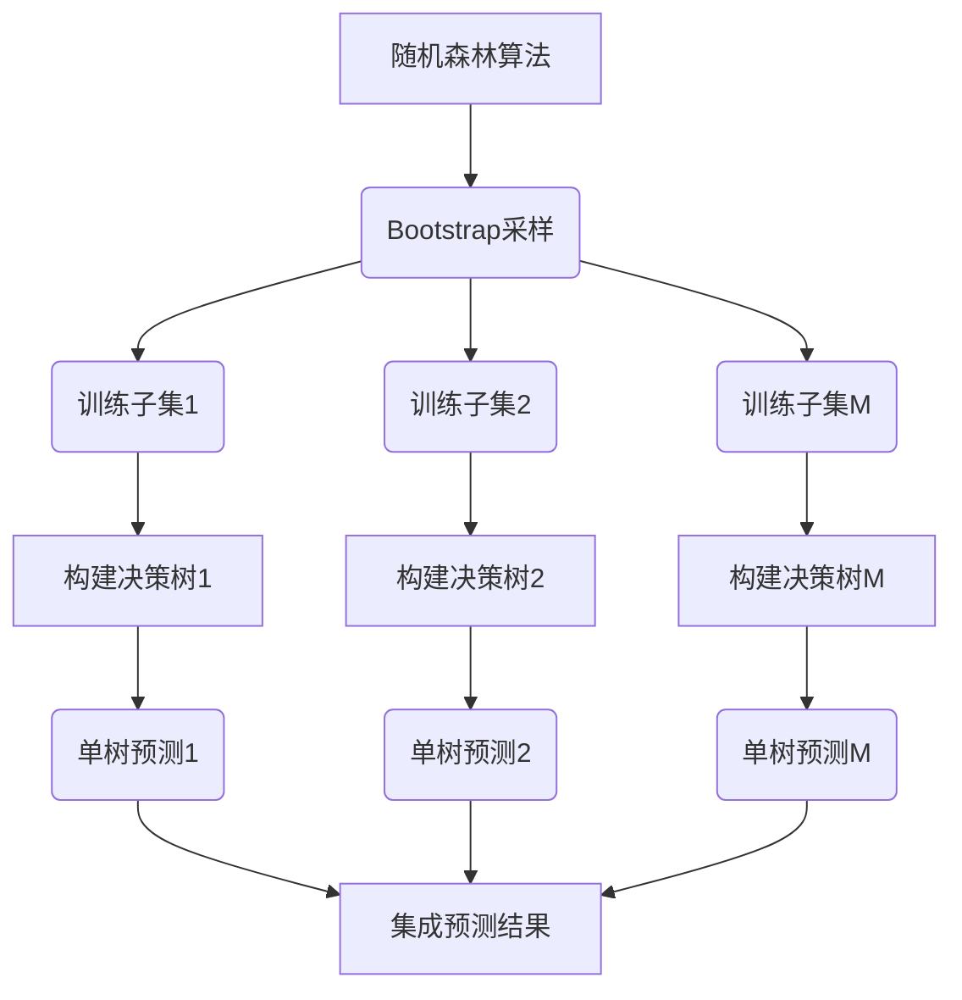

# 随机森林原理与代码实例讲解

## 1.背景介绍

随机森林(Random Forest)是一种流行的集成学习算法,它通过构建多个决策树,并将它们的结果进行综合,从而提高了预测的准确性和鲁棒性。随机森林在解决分类和回归问题时都表现出色,并且具有不易过拟合的优点。它已广泛应用于多个领域,如计算机视觉、自然语言处理、生物信息学等。

### 1.1 集成学习的概念

集成学习(Ensemble Learning)是一种将多个学习器(如决策树)结合起来,以提高整体预测性能的技术。其核心思想是通过构建并结合多个学习器来减少过拟合风险,从而获得比单个学习器更好的泛化能力。

### 1.2 为什么使用随机森林?

- **提高准确性**: 随机森林通过集成多个决策树的预测结果,能够显著提高整体模型的准确性。
- **处理高维数据**: 随机森林能够高效地处理高维特征数据,而不会遇到维数灾难问题。
- **鲁棒性强**: 由于集成了多个决策树,随机森林对于噪声和异常值的影响较小,因此具有很强的鲁棒性。
- **并行化**: 随机森林中的每棵树可以独立构建,因此可以很好地利用多核CPU进行并行计算。

## 2.核心概念与联系

### 2.1 决策树

决策树是随机森林的基础组件。它是一种监督学习算法,通过递归地划分特征空间,将样本数据划分到不同的叶节点上,从而实现对样本的分类或回归。



### 2.2 Bootstrap 采样

Bootstrap 采样(Bootstrapping)是随机森林中的一个关键步骤。它通过从原始数据集中有放回地随机抽取样本,构建出多个训练子集,每个子集用于训练一棵决策树。这种采样方式使得每棵树的训练数据略有不同,从而增加了随机性和差异性。



### 2.3 随机特征选择

在构建每个决策树时,随机森林还引入了随机特征选择(Random Subspace Method)的策略。对于每个节点的分裂,算法不是从所有特征中选择最优分裂特征,而是从特征的一个随机子集中选取。这种策略进一步增加了树与树之间的差异性,减少了单个树的影响,从而提高了整体模型的泛化能力。

## 3.核心算法原理具体操作步骤

随机森林算法的核心步骤如下:

1. **Bootstrap 采样**: 从原始数据集中有放回地随机抽取 N 个训练样本,构建出一个训练子集。重复该过程 M 次,得到 M 个不同的训练子集。

2. **构建决策树**: 对于每个训练子集,使用随机特征选择策略构建一棵决策树。具体做法是:在每个节点分裂时,从所有特征中随机选择一个固定数量的特征子集,并从这个子集中选择最优分裂特征。

3. **集成预测结果**: 对于新的测试样本,将其输入到每一棵决策树中,得到每棵树的预测结果。对于分类问题,采用投票法(majority voting)确定最终的类别预测;对于回归问题,则取所有树的预测值的平均作为最终预测结果。



## 4.数学模型和公式详细讲解举例说明

### 4.1 Gini 系数

在构建决策树时,我们需要一个指标来评估节点的不纯度,从而选择最优的分裂特征和分裂点。Gini 系数是一种常用的不纯度评估指标,它反映了一个节点中各个类别的混杂程度。

对于二分类问题,给定一个节点 $t$,其中有 $p_t$ 比例的样本属于正类,$(1-p_t)$ 比例的样本属于负类,则该节点的 Gini 系数定义为:

$$
\begin{aligned}
Gini(t) &= 2p_t(1-p_t) \\
        &= 2p_t(1-p_t) \\
        &= 1 - p_t^2 - (1-p_t)^2
\end{aligned}
$$

对于多分类问题,给定一个节点 $t$,其中有 $K$ 个类别,第 $k$ 个类别的样本比例为 $p_{tk}$,则该节点的 Gini 系数定义为:

$$
Gini(t) = 1 - \sum_{k=1}^{K}p_{tk}^2
$$

在选择最优分裂特征和分裂点时,我们希望使得分裂后的子节点的加权 Gini 系数之和最小。

### 4.2 袋外估计 (Out-of-Bag Estimation)

在随机森林中,由于每棵决策树都是基于 Bootstrap 采样的训练子集构建的,因此总会有一部分样本没有被用于训练该树。这些未被使用的样本就称为袋外样本(Out-of-Bag Samples)。

袋外估计是一种利用这些袋外样本来评估随机森林模型性能的技术。具体做法是:对于每一棵决策树,使用该树的袋外样本进行预测,然后将所有树的袋外预测结果汇总,计算出模型的准确率或其他评估指标。

袋外估计的优点是:

1. 无需额外的测试集,可以利用训练数据本身进行模型评估。
2. 每个样本都会被用作袋外样本多次,从而获得更加可靠的评估结果。

## 5.项目实践:代码实例和详细解释说明

下面是使用 Python 中的 scikit-learn 库实现随机森林分类器的代码示例:

```python
from sklearn.ensemble import RandomForestClassifier
from sklearn.datasets import make_classification
from sklearn.model_selection import train_test_split
from sklearn.metrics import accuracy_score

# 生成模拟数据
X, y = make_classification(n_samples=1000, n_features=10, n_informative=5, random_state=42)

# 划分训练集和测试集
X_train, X_test, y_train, y_test = train_test_split(X, y, test_size=0.2, random_state=42)

# 创建随机森林分类器
rf_clf = RandomForestClassifier(n_estimators=100, max_depth=10, random_state=42)

# 训练模型
rf_clf.fit(X_train, y_train)

# 在测试集上进行预测
y_pred = rf_clf.predict(X_test)

# 计算准确率
accuracy = accuracy_score(y_test, y_pred)
print(f"Accuracy: {accuracy:.2f}")
```

代码解释:

1. 首先,我们从 `sklearn.datasets` 模块中导入 `make_classification` 函数,用于生成模拟的分类数据集。
2. 使用 `train_test_split` 函数将数据集划分为训练集和测试集。
3. 创建 `RandomForestClassifier` 对象,设置参数 `n_estimators=100` (森林中树的数量)和 `max_depth=10` (每棵树的最大深度)。
4. 调用 `fit` 方法,使用训练集训练随机森林模型。
5. 在测试集上进行预测,得到预测标签 `y_pred`。
6. 使用 `accuracy_score` 函数计算预测准确率。

该示例仅展示了如何使用 scikit-learn 库构建和训练一个基本的随机森林分类器。在实际应用中,您可能需要调整模型参数、进行特征工程等,以获得更好的性能。

## 6.实际应用场景

随机森林由于其优秀的性能和易用性,在各个领域都有广泛的应用,包括但不限于:

1. **计算机视觉**: 在图像分类、目标检测等任务中,随机森林常被用作基线模型或特征提取器。
2. **自然语言处理**: 在文本分类、情感分析等任务中,随机森林也有不错的表现。
3. **生物信息学**: 在基因表达数据分析、蛋白质结构预测等任务中,随机森林是一种常用的机器学习方法。
4. **金融**: 在信用评分、欺诈检测等金融应用中,随机森林可以提供准确的预测。
5. **推荐系统**: 随机森林可用于构建个性化推荐引擎,预测用户的偏好。
6. **异常检测**: 随机森林能够有效地检测数据中的异常值和离群点。

## 7.工具和资源推荐

如果您想进一步学习和使用随机森林算法,以下是一些推荐的工具和资源:

- **Python 库**:
  - scikit-learn: 提供了高效的随机森林实现,是最常用的机器学习库之一。
  - XGBoost: 一种高效的梯度提升决策树库,也支持随机森林模式。
  - LightGBM: 另一种高性能的梯度提升决策树库,同样支持随机森林。

- **R 包**:
  - randomForest: 一个流行的 R 语言随机森林包。
  - ranger: 一个快速、高效的随机森林实现。

- **在线课程**:
  - Coursera 上的 "Machine Learning" 课程,由 Andrew Ng 教授授课,包含随机森林的介绍。
  - edX 上的 "Data Science and Machine Learning Essentials" 课程,涵盖了随机森林等多种机器学习算法。

- **书籍**:
  - 《An Introduction to Statistical Learning》,由 Gareth James 等人撰写,对随机森林等多种机器学习算法进行了全面介绍。
  - 《Pattern Recognition and Machine Learning》,由 Christopher Bishop 撰写,是机器学习领域的经典著作之一。

## 8.总结:未来发展趋势与挑战

随机森林算法已经成为机器学习领域中一种成熟且广泛使用的技术,但它仍然面临一些挑战和发展方向:

1. **可解释性**: 虽然随机森林模型通常具有较好的预测性能,但它们的内部机理往往是一个黑箱,缺乏可解释性。未来需要开发新的技术来提高随机森林模型的可解释性。

2. **在线学习**: 目前的随机森林算法主要是基于批量学习的,无法有效地处理动态变化的数据流。发展在线随机森林算法,以适应持续到来的新数据,是一个重要的研究方向。

3. **高维数据处理**: 虽然随机森林能够处理高维数据,但当特征数量极其庞大时,它的性能可能会下降。需要探索新的特征选择和降维技术,以提高随机森林在高维数据上的表现。

4. **异构数据融合**: 现实世界中的数据通常来自多个异构源,包括结构化数据、非结构化数据等。如何有效地将这些异构数据融合到随机森林模型中,是一个值得关注的挑战。

5. **硬件加速**: 随着数据量的不断增长,训练随机森林模型的计算开销也在增加。利用 GPU、FPGA 等硬件加速技术,可以显著提高随机森林的训练和推理速度。

6. **隐私保护**: 在一些隐私敏感的应用场景中,需要开发能够保护个人隐私的隐私保护随机森林算法,以满足相关法规和伦理要求。

总的来说,随机森林算法虽然已经取得了巨大的成功,但仍有许多值得探索和改进的空间,以适应不断变化的数据和应用需求。

## 9.附录:常见问题与解答

1. **随机森林和决策树有什么区别?**

   随机森林是一种集成学习