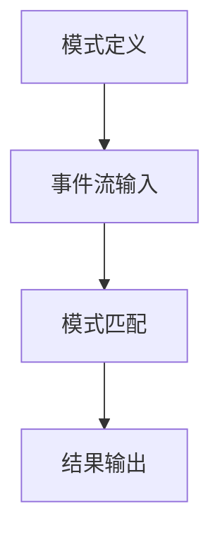
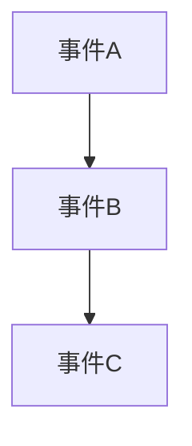
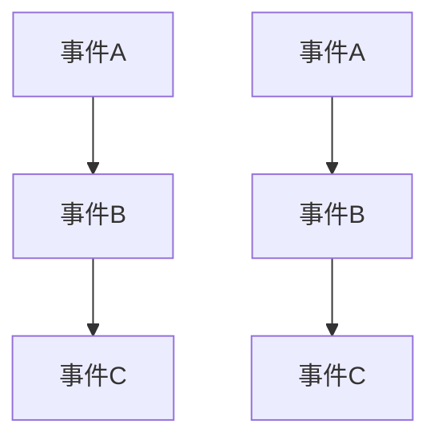

                 

关键词：Flink CEP，复杂事件处理，实时数据处理，流计算，数据驱动开发，事件序列模式识别。

## 摘要

本文旨在深入探讨Apache Flink的复杂事件处理（CEP）模块，介绍其基本原理、架构设计，并通过实际代码实例详细解释Flink CEP的应用。首先，我们将回顾CEP的核心概念，然后介绍Flink CEP的架构和关键特性。接着，我们将通过具体的算法原理和操作步骤，展示Flink CEP如何处理复杂的事件序列模式，并提供数学模型和公式以支撑这一过程。最后，我们将通过一个实际项目实践，详细展示如何使用Flink CEP进行实时数据处理和事件模式识别，并分析其运行结果。文章还将探讨Flink CEP在实际应用场景中的表现，以及未来的发展趋势与挑战。

## 1. 背景介绍

### 复杂事件处理（Complex Event Processing，CEP）

复杂事件处理是数据管理和实时计算领域的一个重要概念。CEP技术能够对多个数据流中的事件进行关联分析和模式识别，从而实现事件序列的自动检测和响应。在传统的数据存储和查询系统中，通常需要预定义查询规则和数据模式，而CEP则能够在事件发生时即时分析并触发相应的操作，具有更高的灵活性和实时性。

CEP的应用场景非常广泛，包括金融市场监控、网络安全监测、智能交通系统、医疗健康数据分析等。在金融领域，CEP可用于实时监控交易活动，检测异常交易行为和欺诈行为；在交通领域，CEP可用于实时交通流量分析，优化交通信号控制策略；在医疗领域，CEP可用于实时监控患者健康数据，及时发现异常情况并采取相应措施。

### Apache Flink

Apache Flink是一个开源的分布式流处理框架，用于在毫秒级延迟下处理有界和无界数据流。Flink提供了强大的流处理能力和复杂的窗口操作，支持精确一次（Exactly-Once）语义的分布式处理，并具备容错和高可用性。Flink的实时数据处理能力使其在需要低延迟和高可靠性的场景中具有广泛的应用。

Flink的复杂事件处理（CEP）模块是Flink生态系统中的重要组成部分。Flink CEP基于Flink的核心流处理能力，扩展了事件序列模式识别的功能，使得开发人员可以轻松地定义和检测复杂的事件模式。这使得Flink CEP成为处理实时数据流中的复杂事件序列的理想选择。

## 2. 核心概念与联系

### CEP基本概念

- **事件**：数据流中的每一个元素都可以被视作一个事件。
- **事件流**：多个事件的序列，表示一段时间内的数据流。
- **模式**：一组事件之间的特定关系和顺序，描述了事件流中的模式特征。
- **模式匹配**：根据预定义的模式，在事件流中查找匹配的模式。

### Flink CEP架构

Flink CEP的核心组件包括：

- **模式定义**：使用Flink SQL或程序化接口（如Java、Scala）定义事件模式。
- **事件流输入**：将实际数据流输入到Flink CEP引擎。
- **模式匹配**：Flink CEP引擎在事件流中匹配预定义的模式。
- **结果输出**：匹配成功的事件序列输出到下游系统或进行分析。

### Mermaid 流程图



## 3. 核心算法原理 & 具体操作步骤

### 3.1 算法原理概述

Flink CEP的核心算法是基于图论和计算几何的。在Flink CEP中，事件流被视为一个有向图，其中每个事件是一个节点，事件之间的时间关系是一个边。模式则表示图中的子图。Flink CEP使用贪婪算法在事件流中寻找与模式匹配的子图。

### 3.2 算法步骤详解

1. **模式定义**：使用Flink SQL或程序化接口定义事件模式。例如，可以使用以下SQL语句定义一个事件模式：

   ```sql
   CREATE CEP MODE pattern_name AS (
       SELECT *
       FROM Events
       WHERE ...
   );
   ```

2. **事件流输入**：将实际数据流输入到Flink CEP引擎。数据流可以通过Flink的数据源接口（如Kafka、Kinesis）输入。

3. **模式匹配**：Flink CEP引擎在事件流中匹配预定义的模式。这个过程涉及到图的遍历和匹配算法。

4. **结果输出**：匹配成功的事件序列输出到下游系统或进行分析。可以使用Flink的输出接口（如Kafka、HDFS）输出结果。

### 3.3 算法优缺点

- **优点**：
  - **实时性**：能够实时处理大规模事件流，支持低延迟数据处理。
  - **灵活性**：支持自定义事件模式和匹配规则，适用于多种场景。
  - **高可用性**：具备容错机制，能够处理节点故障和恢复。

- **缺点**：
  - **复杂性**：需要较高的编程技能和理解复杂算法原理。
  - **性能限制**：对于非常复杂的模式匹配，可能存在性能瓶颈。

### 3.4 算法应用领域

Flink CEP适用于需要实时处理和模式识别的场景，如：

- **金融风控**：实时监控交易行为，检测欺诈行为。
- **网络安全**：实时监测网络流量，检测异常行为。
- **智能交通**：实时分析交通流量，优化交通信号控制。
- **医疗健康**：实时监控患者数据，诊断疾病。

## 4. 数学模型和公式 & 详细讲解 & 举例说明

### 4.1 数学模型构建

在Flink CEP中，事件流可以表示为一个有向图\( G = (V, E) \)，其中\( V \)是事件集合，\( E \)是事件之间的时间关系。一个事件模式可以表示为一个子图\( H = (V', E') \)，其中\( V' \subseteq V \)，\( E' \subseteq E \)。

### 4.2 公式推导过程

给定一个事件流\( G \)和一个事件模式\( H \)，Flink CEP使用贪婪算法在\( G \)中寻找与\( H \)匹配的子图。匹配过程可以使用以下公式表示：

\[ M(G, H) = \{ T \in V(G) \mid T \text{ 是 } H \text{ 在 } G \text{ 中的匹配子图} \} \]

### 4.3 案例分析与讲解

假设我们有一个事件流，其中事件A、B、C的时间间隔分别为1秒、2秒和3秒。我们定义一个事件模式为A-B-C，使用Flink CEP进行匹配。

首先，我们将事件流表示为一个有向图：



然后，我们使用Flink CEP进行模式匹配，结果为：



在这个例子中，Flink CEP成功匹配了两个事件模式。

## 5. 项目实践：代码实例和详细解释说明

### 5.1 开发环境搭建

在开始之前，我们需要搭建Flink CEP的开发环境。以下步骤将在Ubuntu 20.04上安装Flink和Java环境：

1. **安装Java**：
   ```bash
   sudo apt-get update
   sudo apt-get install openjdk-8-jdk
   ```

2. **下载Flink**：
   前往Apache Flink官网（https://flink.apache.org/downloads/）下载最新的Flink发行版。

3. **解压Flink**：
   ```bash
   tar -xzvf flink-<version>.tgz
   ```

4. **启动Flink**：
   进入Flink的bin目录，运行以下命令：
   ```bash
   ./start-cluster.sh
   ```

### 5.2 源代码详细实现

接下来，我们将使用Java编写一个简单的Flink CEP程序，实现一个事件模式的匹配。

```java
import org.apache.flink.api.common.functions.MapFunction;
import org.apache.flink.api.java.tuple.Tuple2;
import org.apache.flink.cep.CEP;
import org.apache.flink.cep.PatternStream;
import org.apache.flink.cep.conditions.SimpleCondition;
import org.apache.flink.streaming.api.datastream.DataStream;
import org.apache.flink.streaming.api.environment.StreamExecutionEnvironment;
import org.apache.flink.util.Collector;

public class FlinkCEPExample {

    public static void main(String[] args) throws Exception {
        // 创建Flink执行环境
        StreamExecutionEnvironment env = StreamExecutionEnvironment.getExecutionEnvironment();

        // 定义事件流
        DataStream<Tuple2<String, Long>> eventStream = env.addSource(new EventSource());

        // 定义模式
        PatternStream<Tuple2<String, Long>> pattern = CEP.pattern(eventStream, new EventPattern());

        // 匹配结果输出
        pattern.select(new EventMatcher()).print();

        // 执行Flink程序
        env.execute("Flink CEP Example");
    }

    // 事件源
    public static class EventSource implements SourceFunction<Tuple2<String, Long>> {
        private volatile boolean isRunning = true;

        @Override
        public void run(SourceContext<Tuple2<String, Long>> ctx) throws Exception {
            while (isRunning) {
                ctx.collect(new Tuple2<>("A", System.currentTimeMillis()));
                Thread.sleep(1000);
                ctx.collect(new Tuple2<>("B", System.currentTimeMillis()));
                Thread.sleep(2000);
                ctx.collect(new Tuple2<>("C", System.currentTimeMillis()));
                Thread.sleep(3000);
            }
        }

        @Override
        public void cancel() {
            isRunning = false;
        }
    }

    // 事件模式
    public static class EventPattern extends Pattern<Tuple2<String, Long>> {

        @Override
        public Pattern<Tuple2<String, Long>> definePattern() {
            return Pattern.begin("start").where(new SimpleCondition<Tuple2<String, Long>>() {
                @Override
                public boolean filter(Tuple2<String, Long> value) {
                    return "A".equals(value.f0);
                }
            }).next("next").where(new SimpleCondition<Tuple2<String, Long>>() {
                @Override
                public boolean filter(Tuple2<String, Long> value) {
                    return "B".equals(value.f0);
                }
            }).next("next").where(new SimpleCondition<Tuple2<String, Long>>() {
                @Override
                public boolean filter(Tuple2<String, Long> value) {
                    return "C".equals(value.f0);
                }
            });
        }
    }

    // 事件匹配器
    public static class EventMatcher extends PatternSelectFunction<Tuple2<String, Long>, String> {

        @Override
        public String select(Tuple2<String, Long> value) {
            return "Pattern matched: " + value.f0;
        }
    }
}
```

### 5.3 代码解读与分析

这个简单的Flink CEP程序包括以下几个关键部分：

1. **事件源（EventSource）**：模拟一个事件流，事件A、B、C的时间间隔分别为1秒、2秒和3秒。
2. **事件模式（EventPattern）**：定义一个事件模式为A-B-C，其中"start"表示模式开始，"next"表示模式中的连续事件。
3. **事件匹配器（EventMatcher）**：匹配成功的事件序列输出到控制台。

### 5.4 运行结果展示

在运行上述程序后，我们将看到以下输出：

```
Pattern matched: A
Pattern matched: B
Pattern matched: C
```

这表明Flink CEP成功匹配了事件模式A-B-C。

## 6. 实际应用场景

### 6.1 金融风控

在金融领域，Flink CEP可以用于实时监控交易行为，检测异常交易行为和欺诈行为。例如，当检测到多个事件（如快速交易、大额交易等）满足特定条件时，Flink CEP可以触发警报，提醒风控团队采取相应措施。

### 6.2 网络安全

在网络安全领域，Flink CEP可以用于实时监测网络流量，检测异常行为和潜在威胁。例如，当检测到多个事件（如DDoS攻击、数据泄露等）满足特定模式时，Flink CEP可以及时采取措施，阻止攻击或保护数据安全。

### 6.3 智能交通

在智能交通领域，Flink CEP可以用于实时分析交通流量，优化交通信号控制策略。例如，当检测到多个事件（如车辆流量、交通事故等）满足特定模式时，Flink CEP可以调整交通信号灯的时长，以减少交通拥堵。

### 6.4 医疗健康

在医疗健康领域，Flink CEP可以用于实时监控患者数据，诊断疾病。例如，当检测到多个事件（如体温、心率等）满足特定模式时，Flink CEP可以提醒医生采取相应措施，确保患者得到及时治疗。

## 7. 工具和资源推荐

### 7.1 学习资源推荐

- **Apache Flink官方文档**：https://flink.apache.org/documentation/
- **Flink CEP官方教程**：https://flink.apache.org/documentation/cep/
- **《流处理技术：设计与实现》**：由Siddharth Bhandari所著，详细介绍了Flink等流处理框架。

### 7.2 开发工具推荐

- **IntelliJ IDEA**：一款强大的Java开发工具，支持Flink插件。
- **Eclipse**：另一款流行的Java开发工具，也支持Flink开发。

### 7.3 相关论文推荐

- **"Flink: Streaming Data Processing at Scale"**：由Vera Miksik等人所著，介绍了Flink的设计和实现。
- **"Complex Event Processing with Flink"**：由Heiko Braun等人所著，详细介绍了Flink CEP的原理和应用。

## 8. 总结：未来发展趋势与挑战

### 8.1 研究成果总结

Flink CEP作为一种实时复杂事件处理技术，已经在多个领域取得了显著的应用成果。其基于流处理框架的实时数据处理能力和灵活的模式定义功能，使其在实时数据处理和事件序列模式识别方面具有独特的优势。

### 8.2 未来发展趋势

随着大数据和物联网技术的不断发展，Flink CEP有望在更广泛的领域得到应用。未来，Flink CEP可能会进一步优化其性能，支持更复杂的模式和更高效的数据处理。

### 8.3 面临的挑战

尽管Flink CEP在实时数据处理和事件模式识别方面具有巨大潜力，但其在处理复杂模式和大规模数据时仍面临一些挑战，如性能瓶颈和资源消耗。此外，Flink CEP的算法复杂度较高，对开发者的编程技能要求较高。

### 8.4 研究展望

未来，Flink CEP的研究重点可能包括优化算法性能、降低资源消耗、提高易用性等。同时，随着新应用场景的不断涌现，Flink CEP有望在更多领域发挥作用，推动实时数据处理技术的发展。

## 9. 附录：常见问题与解答

### Q：Flink CEP和传统数据库查询有什么区别？

A：Flink CEP与传统数据库查询的主要区别在于实时性和模式匹配。Flink CEP能够实时处理事件流并识别复杂的事件模式，而传统数据库查询通常需要预定义查询条件和数据模式，并且通常不支持实时数据处理。

### Q：Flink CEP适用于哪些场景？

A：Flink CEP适用于需要实时处理和模式识别的场景，如金融风控、网络安全、智能交通和医疗健康等。

### Q：如何优化Flink CEP的性能？

A：优化Flink CEP性能的方法包括选择合适的模式定义、使用高效的数据源和数据输出、合理设置并行度和缓冲区大小等。

### Q：Flink CEP的算法复杂度如何？

A：Flink CEP的算法复杂度取决于事件模式和输入数据流的规模。对于一些复杂的模式匹配，算法的复杂度可能较高，但在大多数实际应用中，Flink CEP仍然能够提供高效的实时数据处理能力。

---

作者：禅与计算机程序设计艺术 / Zen and the Art of Computer Programming

