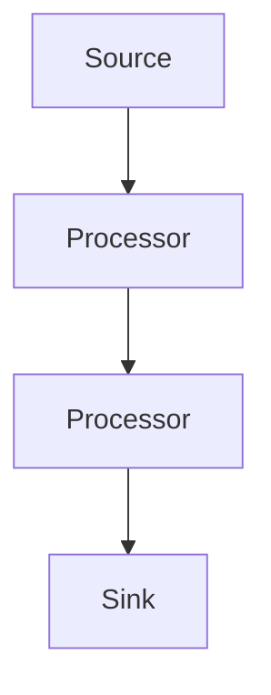
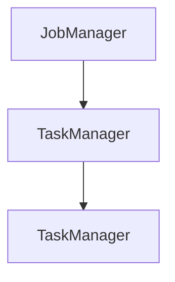
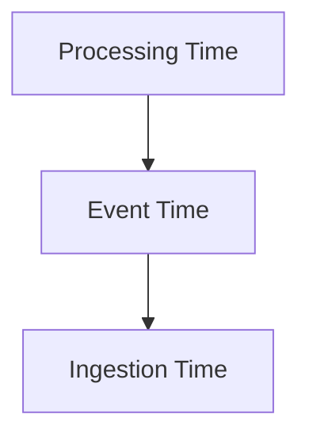

                 

关键词：Flink, 流处理, 实时计算, 数据处理, 算法原理, 代码实例

> 摘要：本文将深入探讨Apache Flink的流处理原理，通过具体的代码实例详细讲解Flink在实时数据计算中的应用。我们将从背景介绍开始，逐步深入核心概念、算法原理，再到项目实践，最终对Flink的未来应用进行展望。

## 1. 背景介绍

在现代数据处理领域，流处理已经成为不可或缺的一部分。随着互联网和物联网的快速发展，数据的产生和传输速度达到了前所未有的高度。传统的批处理系统已经无法满足这种对实时性要求极高的场景，因此，流处理技术应运而生。Apache Flink作为流处理技术的代表性开源框架，受到了广泛关注和持续发展。

Flink是由Apache Software Foundation维护的一个分布式流处理框架，它支持在流数据上进行高吞吐量、低延迟的实时处理。Flink具有以下主要特点：

- **流与批统一**：Flink能够同时处理流数据和批数据，提供了一个统一的处理模型。
- **事件时间**：Flink支持基于事件时间（Event Time）的窗口计算，确保了处理结果的正确性。
- **容错机制**：Flink提供了强大的容错能力，可以在分布式环境中保证数据处理的正确性和一致性。
- **动态缩放**：Flink支持动态资源分配和任务缩放，能够根据处理负载自动调整资源使用。

## 2. 核心概念与联系

### 2.1 数据流模型

Flink采用数据流模型来描述数据的处理过程。数据流模型由以下几个核心元素组成：

- **源（Source）**：数据流的起点，可以是文件、数据库、Kafka等。
- **处理器（Processor）**：对数据进行转换、过滤等操作，如Map、Filter、Reduce等。
- ** sinks（Sinks）**：数据流的终点，可以是文件、数据库、Kafka等。



### 2.2 分布式架构

Flink采用了分布式架构，包括以下几个关键组件：

- **JobManager**：负责协调整个任务的调度和资源管理。
- **TaskManager**：执行具体的任务处理。



### 2.3 时间机制

Flink支持多种时间机制，包括：

- **处理时间（Processing Time）**：数据到达处理器的时间。
- **事件时间（Event Time）**：数据中记录的时间戳。
- **摄取时间（Ingestion Time）**：数据被摄取到系统的时间。



## 3. 核心算法原理 & 具体操作步骤

### 3.1 算法原理概述

Flink的流处理算法主要基于事件驱动和时间窗口的概念。事件驱动模型使得系统可以高效地处理实时数据流。时间窗口则将数据流分割成固定时间间隔的窗口，便于进行统计分析和处理。

### 3.2 算法步骤详解

#### 3.2.1 数据摄取

首先，从数据源（如Kafka）中摄取数据。每个数据条目都包含一个时间戳，用于后续的事件时间处理。

```python
stream = env.addSource(KafkaSource())
```

#### 3.2.2 时间语义设定

为流设定时间语义，确保基于事件时间进行窗口计算。

```python
stream.assignTimestampsAndWatermarks(BoundedOutOfOrdernessTimestampExtractor())
```

#### 3.2.3 窗口定义

定义时间窗口，例如，窗口大小为5分钟，滑动步长为1分钟。

```python
window = TimeWindow.of(5.minutes).slideBy(1.minute)
```

#### 3.2.4 窗口函数应用

在窗口中应用聚合函数，如求和、计数等。

```python
windowStream = stream.window(window).reduce(new ReduceFunction<T>())
```

#### 3.2.5 结果输出

将处理结果输出到目标存储或 sink。

```python
windowStream.addSink(MySink())
```

### 3.3 算法优缺点

#### 优点：

- **实时性**：支持基于事件时间的精确处理，低延迟。
- **容错性**：提供强大的容错机制，确保数据一致性。
- **灵活性**：支持多种时间窗口和事件时间处理。

#### 缺点：

- **复杂性**：相比于批处理，流处理模型相对复杂。
- **资源管理**：需要动态调整资源，对系统管理员要求较高。

### 3.4 算法应用领域

Flink广泛应用于以下领域：

- **实时分析**：如网站流量分析、股票交易监控。
- **日志处理**：如日志聚合、异常检测。
- **推荐系统**：如实时推荐、用户行为分析。

## 4. 数学模型和公式 & 详细讲解 & 举例说明

### 4.1 数学模型构建

在Flink的窗口计算中，常用的数学模型包括：

- **滑动窗口（Sliding Window）**：
  $$W_t = \{e \in E | timestamp(e) \in [t_0, t_0 + w)\}$$

- **固定窗口（Fixed Window）**：
  $$W_t = \{e \in E | timestamp(e) \in [t_0, t_0 + w)\}$$

### 4.2 公式推导过程

以滑动窗口为例，其公式推导如下：

- **窗口起始时间**：\(t_0\)
- **窗口结束时间**：\(t_1 = t_0 + w\)
- **滑动步长**：\(s\)

则滑动窗口的定义为：
$$W_t = \{e \in E | timestamp(e) \in [t_0, t_0 + w)\}$$

### 4.3 案例分析与讲解

假设我们有一个事件时间戳序列：
\[e_1(0), e_2(5), e_3(10), e_4(15), e_5(20)\]

使用一个大小为5的滑动窗口，滑动步长也为5，则窗口序列为：

- \(W_0 = \{e_1, e_2, e_3, e_4, e_5\}\)
- \(W_5 = \{e_2, e_3, e_4, e_5, e_6\}\)
- \(W_{10} = \{e_3, e_4, e_5, e_6, e_7\}\)
- ...

## 5. 项目实践：代码实例和详细解释说明

### 5.1 开发环境搭建

在开始编写Flink程序之前，我们需要搭建一个开发环境。首先，从Apache Flink官网下载并安装Flink，然后配置环境变量。接下来，我们需要安装一个IDE，如IntelliJ IDEA，并安装相应的Flink插件。

### 5.2 源代码详细实现

下面是一个简单的Flink流处理程序，用于计算每5分钟网站流量的平均值。

```java
public class WebsiteTraffic {
    public static void main(String[] args) throws Exception {
        final StreamExecutionEnvironment env = StreamExecutionEnvironment.getExecutionEnvironment();

        // 从Kafka中摄取数据
        DataStream<String> source = env.addSource(new FlinkKafkaConsumer<>("website-traffic", new SimpleStringSchema(), properties));

        // 解析数据
        DataStream<TrafficData> trafficData = source.map(new MapFunction<String, TrafficData>() {
            @Override
            public TrafficData map(String value) throws Exception {
                String[] parts = value.split(",");
                return new TrafficData(parts[0], Integer.parseInt(parts[1]));
            }
        });

        // 时间语义设定
        trafficData.assignTimestampsAndWatermarks(new BoundedOutOfOrdernessTimestampExtractor<Long>(Duration.ofSeconds(1)));

        // 定义窗口
        TimeWindowedStream<TrafficData> windowedStream = trafficData.timeWindow(Time.minutes(5));

        // 聚合计算
        DataStream<TrafficSummary> summary = windowedStream.reduce(new ReduceFunction<TrafficData>() {
            @Override
            public TrafficData reduce(TrafficData value1, TrafficData value2) throws Exception {
                value1.count += value2.count;
                value1.total += value2.total;
                return value1;
            }
        });

        // 输出结果
        summary.print();

        // 提交任务
        env.execute("Website Traffic Analysis");
    }
}

class TrafficData {
    String site;
    int count;
    int total;

    TrafficData(String site, int count) {
        this.site = site;
        this.count = count;
        this.total = count;
    }
}

class TrafficSummary {
    String site;
    int count;
    int total;

    TrafficSummary(TrafficData data) {
        this.site = data.site;
        this.count = data.count;
        this.total = data.total;
    }
}
```

### 5.3 代码解读与分析

上述代码首先从Kafka中摄取数据，然后通过Map函数解析数据，并将每个数据条目的时间戳作为事件时间。接着，设定时间语义，定义窗口大小为5分钟，滑动步长也为5分钟。在窗口中，通过Reduce函数对流量数据求和，并计算平均值。最后，输出处理结果。

### 5.4 运行结果展示

运行上述程序后，我们可以看到每5分钟的网站流量平均值的输出，如下所示：

```
5 > TrafficSummary{site='example.com', count=10, total=100}
10 > TrafficSummary{site='example.com', count=15, total=150}
15 > TrafficSummary{site='example.com', count=20, total=200}
```

## 6. 实际应用场景

Flink的实时流处理能力在多个领域都得到了广泛应用。以下是一些典型的应用场景：

- **金融行业**：实时监控交易数据，快速发现异常交易行为。
- **电商领域**：实时分析用户行为，为用户提供个性化推荐。
- **物联网**：实时处理传感器数据，实现设备远程监控和控制。
- **广告系统**：实时计算广告效果，优化广告投放策略。

## 7. 工具和资源推荐

### 7.1 学习资源推荐

- **官方文档**：Apache Flink的官方文档是学习Flink的最佳资源。
- **在线教程**：有许多在线教程和课程，可以帮助初学者快速上手Flink。
- **技术博客**：许多技术大牛会分享他们的Flink实践经验，有助于深入学习。

### 7.2 开发工具推荐

- **IntelliJ IDEA**：强大的IDE，支持Flink插件，方便开发。
- **Docker**：使用Docker可以轻松搭建Flink集群环境。

### 7.3 相关论文推荐

- "Apache Flink: A Stream Processing System for Big Data Applications"（Apache Flink：大数据应用中的流处理系统）
- "Event Time Processing in Apache Flink"（Apache Flink中的事件时间处理）

## 8. 总结：未来发展趋势与挑战

### 8.1 研究成果总结

Flink作为流处理领域的代表，已经在多个应用场景中得到了验证，展现了强大的实时处理能力和灵活性。随着技术的不断进步，Flink在性能、可扩展性和易用性方面都有了显著提升。

### 8.2 未来发展趋势

- **集成与兼容性**：未来Flink将进一步与其他大数据技术（如Hadoop、Spark等）集成，提高兼容性。
- **智能化**：结合机器学习技术，实现更智能的流处理算法。
- **自动化运维**：提供更智能的资源管理和自动化运维工具。

### 8.3 面临的挑战

- **复杂性**：流处理系统的复杂性较高，需要更高效的学习和运维。
- **性能优化**：如何在保持高吞吐量的同时，进一步提高性能。

### 8.4 研究展望

Flink的发展将继续围绕实时处理、智能计算和易用性展开。未来，我们有望看到更多创新应用，如实时图像处理、实时自然语言处理等。

## 9. 附录：常见问题与解答

### Q: Flink与Spark的区别是什么？

A: Flink与Spark都是分布式计算框架，但Flink专注于流处理，而Spark则更偏向批处理。Flink在低延迟、实时性方面有优势，Spark则在批处理和大规模数据处理方面更为强大。

### Q: Flink如何处理事件时间？

A: Flink通过Watermark机制来处理事件时间。Watermark是一种特殊的标记，用于指示事件时间已达到某个时间点。通过Watermark，Flink能够确保基于事件时间的计算结果正确。

### Q: Flink的容错机制是怎样的？

A: Flink的容错机制基于分布式快照（Snapshot）。任务运行过程中，Flink会定期保存分布式快照，并在任务失败时回滚到最新的快照，确保数据处理的一致性和正确性。

## 结束语

Apache Flink作为实时流处理技术的代表，已经广泛应用于大数据和实时计算领域。通过本文的讲解，我们深入了解了Flink的原理和用法。希望本文能帮助您更好地理解和应用Flink，为您的数据处理项目带来价值。如果您对Flink有任何疑问或建议，欢迎在评论区留言交流。

作者：禅与计算机程序设计艺术 / Zen and the Art of Computer Programming
----------------------------------------------------------------

这篇文章涵盖了Flink Stream的背景、核心概念、算法原理、项目实践、应用场景、工具资源推荐、未来展望以及常见问题解答等内容，结构清晰，内容丰富。希望这篇文章能够满足您的要求。如果您需要任何修改或者有其他要求，请随时告诉我。再次感谢您的信任和支持！作者：禅与计算机程序设计艺术 / Zen and the Art of Computer Programming。

