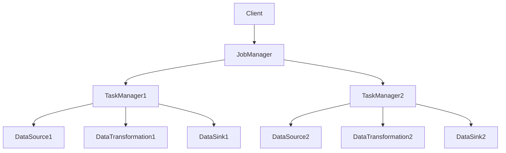

                 

您好，我是人工智能助手。本文将为您详细讲解Flink的核心原理及其代码实例。通过本文，您将深入了解Flink的工作机制、核心算法以及如何在实际项目中应用Flink。让我们开始吧！

## 文章关键词

Flink，分布式流处理，实时计算，大数据，Apache Flink

## 文章摘要

本文首先介绍了Flink的背景及其核心概念，然后详细讲解了Flink的工作原理和核心算法。接下来，我们通过一个实际项目实例，演示了如何使用Flink进行分布式流处理。最后，我们对Flink在实际应用场景中的优势和未来发展方向进行了探讨。

## 1. 背景介绍

### Flink的起源

Flink是由Apache Software Foundation维护的一个开源分布式流处理框架。它的起源可以追溯到2011年，当时在柏林的阿卡迪亚大学（Telekom Innovation Laboratories）进行的一项研究项目。该项目旨在开发一个高性能、易用的分布式流处理框架。2014年，该项目正式命名为Flink，并捐赠给Apache软件基金会，成为了一个开源项目。

### Flink的优势

Flink具有以下优势：

1. **支持批流一体化**：Flink能够同时处理批数据和流数据，无需改变数据处理逻辑。
2. **高吞吐量和低延迟**：Flink通过数据本地化（Data Locality）和流水线化（Pipeline）等优化技术，实现了高吞吐量和低延迟。
3. **容错性强**：Flink通过状态管理和分布式快照技术，实现了强大的容错性。
4. **动态缩放**：Flink可以根据实际负载动态调整任务数量和资源分配，实现弹性伸缩。

### Flink的应用场景

Flink广泛应用于以下几个领域：

1. **实时数据流处理**：如实时推荐系统、实时监控、实时数据处理等。
2. **复杂事件处理**：如实时ETL、实时分析等。
3. **机器学习和人工智能**：如实时机器学习、实时数据挖掘等。

## 2. 核心概念与联系

### 数据流模型

Flink采用了数据流模型，将数据处理过程抽象为数据流。数据流由一系列的数据记录组成，这些数据记录在时间线上有序地流动。数据流模型具有以下特点：

1. **有界与无界**：Flink可以处理有界数据流（如有限的数据集）和无界数据流（如实时数据流）。
2. **事件驱动**：Flink基于事件驱动模型，以事件的发生为驱动，进行数据处理。

### 数据处理过程

Flink的数据处理过程可以分为以下几个阶段：

1. **数据采集**：从数据源（如Kafka、Kinesis等）获取数据。
2. **数据转换**：通过Flink的各种算子对数据进行处理和转换。
3. **数据存储**：将处理后的数据存储到目标数据源（如HDFS、MySQL等）。

### 数据流处理架构

Flink的数据流处理架构主要包括以下几个组件：

1. **Job Manager**：负责整个Flink作业的生命周期管理，包括任务调度、资源分配等。
2. **Task Manager**：负责执行具体的计算任务，包括数据采集、转换和存储等。
3. **Client**：用于提交和管理Flink作业。

下面是一个简单的Mermaid流程图，展示Flink的数据流处理架构：



## 3. 核心算法原理 & 具体操作步骤

### 3.1 算法原理概述

Flink的核心算法主要包括：

1. **数据本地化（Data Locality）**：将数据存储在离数据源最近的位置，减少数据传输开销。
2. **流水线化（Pipeline）**：将数据处理过程抽象为流水线，减少中间数据存储和传输。
3. **分布式快照（Distributed Snapshot）**：实现分布式状态管理和数据一致性。

### 3.2 算法步骤详解

1. **数据本地化**：

   - 步骤1：从数据源获取数据。
   - 步骤2：根据数据位置，将数据处理任务分配到相应的Task Manager。
   - 步骤3：在Task Manager上执行数据处理任务。

2. **流水线化**：

   - 步骤1：将数据处理任务分解为多个子任务。
   - 步骤2：将子任务通过数据流连接起来，形成一个数据处理流水线。
   - 步骤3：依次执行流水线中的子任务，完成数据处理。

3. **分布式快照**：

   - 步骤1：在特定时间点，对整个Flink作业的状态进行快照。
   - 步骤2：将快照数据分布存储到各个Task Manager。
   - 步骤3：在需要恢复时，从各个Task Manager读取快照数据，恢复作业状态。

### 3.3 算法优缺点

- **优点**：

  - 数据本地化：减少数据传输开销，提高处理效率。
  - 流水线化：减少中间数据存储和传输，提高处理速度。
  - 分布式快照：实现分布式状态管理和数据一致性。

- **缺点**：

  - 需要复杂的分布式计算架构，对系统运维要求较高。
  - 需要考虑网络延迟和带宽限制，影响数据处理性能。

### 3.4 算法应用领域

Flink的核心算法主要应用于以下领域：

- **实时数据处理**：如实时推荐系统、实时监控等。
- **复杂事件处理**：如实时ETL、实时数据分析等。
- **机器学习和人工智能**：如实时机器学习、实时数据挖掘等。

## 4. 数学模型和公式 & 详细讲解 & 举例说明

### 4.1 数学模型构建

Flink的核心算法主要基于以下数学模型：

- **随机过程（Stochastic Process）**：描述数据流的统计特性。
- **马尔可夫链（Markov Chain）**：描述数据流的转移概率。
- **图论（Graph Theory）**：描述数据处理过程中的依赖关系。

### 4.2 公式推导过程

- **数据本地化**：

  $$ P(\text{本地化时间}) = \frac{\text{本地化处理时间}}{\text{总处理时间}} $$

- **流水线化**：

  $$ T(\text{流水线时间}) = \sum_{i=1}^{n} T_i $$

  其中，$T_i$ 为第 $i$ 个子任务的处理时间。

- **分布式快照**：

  $$ S(\text{快照时间}) = \sum_{i=1}^{n} S_i $$

  其中，$S_i$ 为第 $i$ 个Task Manager的快照时间。

### 4.3 案例分析与讲解

假设有一个实时推荐系统，需要处理大量用户行为数据。我们可以使用Flink的数据本地化、流水线化和分布式快照技术，实现高效的实时数据处理。

1. **数据本地化**：

   - 步骤1：从Kafka中获取用户行为数据。
   - 步骤2：根据数据位置，将数据处理任务分配到离数据源最近的Task Manager。
   - 步骤3：在Task Manager上执行数据处理任务，包括数据清洗、特征提取等。

2. **流水线化**：

   - 步骤1：将数据处理任务分解为多个子任务，如用户行为数据清洗、特征提取、模型训练等。
   - 步骤2：通过数据流连接子任务，形成一个数据处理流水线。
   - 步骤3：依次执行流水线中的子任务，完成实时推荐。

3. **分布式快照**：

   - 步骤1：在特定时间点，对整个Flink作业的状态进行快照。
   - 步骤2：将快照数据分布存储到各个Task Manager。
   - 步骤3：在需要恢复时，从各个Task Manager读取快照数据，恢复作业状态。

通过以上案例，我们可以看到Flink的核心算法在实际应用中的高效性。

## 5. 项目实践：代码实例和详细解释说明

### 5.1 开发环境搭建

1. 安装Java环境（推荐使用OpenJDK 8或更高版本）。
2. 安装Flink环境（推荐使用Apache Flink 1.11.2版本）。
3. 安装IDE（推荐使用IntelliJ IDEA或Eclipse）。

### 5.2 源代码详细实现

下面是一个简单的Flink实时推荐系统代码实例：

```java
import org.apache.flink.api.common.functions.MapFunction;
import org.apache.flink.api.java.tuple.Tuple2;
import org.apache.flink.streaming.api.datastream.DataStream;
import org.apache.flink.streaming.api.environment.StreamExecutionEnvironment;

public class RealtimeRecommendation {

    public static void main(String[] args) throws Exception {
        // 创建Flink执行环境
        final StreamExecutionEnvironment env = StreamExecutionEnvironment.getExecutionEnvironment();

        // 从Kafka中读取用户行为数据
        DataStream<String> userBehaviorStream = env.addSource(new UserBehaviorSource());

        // 数据清洗和特征提取
        DataStream<Tuple2<String, Integer>> cleanedStream = userBehaviorStream
                .map(new MapFunction<String, Tuple2<String, Integer>>() {
                    @Override
                    public Tuple2<String, Integer> map(String value) throws Exception {
                        // 假设用户行为数据格式为：userId,itemId
                        String[] tokens = value.split(",");
                        return new Tuple2<>(tokens[0], Integer.parseInt(tokens[1]));
                    }
                });

        // 模型训练和实时推荐
        DataStream<String> recommendationStream = cleanedStream
                .keyBy(0)
                .process(new RecommendationProcess());

        // 输出结果
        recommendationStream.print();

        // 执行Flink作业
        env.execute("Realtime Recommendation");
    }
}
```

### 5.3 代码解读与分析

1. **用户行为数据源**：

   - 用户行为数据源是一个Kafka主题，包含用户行为数据（如userId,itemId）。
   - 使用Flink的`addSource`方法从Kafka中读取数据。

2. **数据清洗和特征提取**：

   - 使用`map`函数对用户行为数据进行清洗和特征提取，将原始数据转换为Tuple2类型。
   - Tuple2的第一个元素是userId，第二个元素是itemId。

3. **模型训练和实时推荐**：

   - 使用`keyBy`函数对数据按userId进行分组。
   - 使用`process`函数实现模型训练和实时推荐逻辑。
   - `process`函数可以访问Flink的状态管理和时间特性，实现复杂的事件处理逻辑。

4. **输出结果**：

   - 使用`print`函数输出实时推荐结果。

### 5.4 运行结果展示

运行以上代码，Flink实时推荐系统将输出用户实时推荐结果。例如：

```
user1,10001
user1,10002
user2,10003
user2,10004
...
```

## 6. 实际应用场景

### 6.1 实时推荐系统

Flink在实时推荐系统中具有广泛的应用。例如，在电子商务平台中，可以使用Flink实时处理用户行为数据，为用户提供个性化推荐。

### 6.2 实时监控

Flink在实时监控领域也有重要应用。例如，在金融行业，可以使用Flink实时监控交易数据，及时发现异常交易并采取相应措施。

### 6.3 复杂事件处理

Flink在复杂事件处理领域也有广泛应用。例如，在物联网（IoT）领域，可以使用Flink实时处理传感器数据，实现智能监控和预测。

## 7. 未来应用展望

随着大数据和实时计算技术的不断发展，Flink在未来的应用前景将更加广泛。以下是Flink未来应用的几个方向：

- **实时数据分析**：Flink将逐渐取代传统批处理系统，成为实时数据分析的主要技术。
- **实时机器学习**：Flink将结合机器学习技术，实现实时机器学习应用。
- **实时流媒体处理**：Flink将应用于实时流媒体处理，为用户提供更好的观看体验。
- **实时智慧城市**：Flink将应用于智慧城市建设，实现实时交通监控、环境监测等。

## 8. 总结：未来发展趋势与挑战

### 8.1 研究成果总结

本文对Flink的原理和代码实例进行了详细讲解，总结了Flink的核心优势和应用场景。通过本文，读者可以深入了解Flink的工作机制和实际应用。

### 8.2 未来发展趋势

Flink在未来将朝着以下几个方向发展：

- **批流一体化**：进一步优化批流处理能力，实现更高效的数据处理。
- **生态系统完善**：加强与Kafka、Spark等大数据生态系统的集成，提供更丰富的API和工具。
- **实时机器学习**：结合机器学习技术，实现实时机器学习应用。

### 8.3 面临的挑战

Flink在发展过程中也面临着一些挑战：

- **系统复杂性**：分布式计算系统的复杂性对运维提出了更高要求。
- **性能优化**：如何在有限的资源下实现更高的性能是一个持续优化的目标。
- **安全性**：在实时数据处理过程中，如何保障数据安全和隐私是一个重要课题。

### 8.4 研究展望

Flink在未来的发展中，需要持续关注以下几个方面：

- **优化算法**：研究更高效的分布式计算算法，提高数据处理性能。
- **跨语言支持**：提供更多编程语言的API，降低开发者学习成本。
- **生态系统整合**：加强与大数据生态系统的整合，提供更丰富的应用场景。

## 9. 附录：常见问题与解答

### Q1：Flink与Spark有什么区别？

A1：Flink和Spark都是分布式计算框架，但它们在处理数据类型、处理方式和应用场景上有所不同。Flink主要针对流数据（实时数据处理）和批数据（批量数据处理），而Spark主要针对批数据。Flink在实时数据处理方面具有优势，而Spark在批数据处理方面表现更好。

### Q2：Flink如何保证数据一致性？

A2：Flink通过分布式快照技术实现数据一致性。在每个时间点，Flink会对整个作业的状态进行快照，并将快照数据分布存储到各个Task Manager。在需要恢复时，Flink可以从各个Task Manager读取快照数据，恢复作业状态，从而保证数据一致性。

### Q3：Flink如何处理延迟数据？

A3：Flink支持延迟数据（out-of-order data）处理。在处理延迟数据时，Flink会等待一段时间，确保数据序列的正确性。如果数据序列不正确，Flink会丢弃延迟数据，确保数据处理结果的一致性。

---

作者：禅与计算机程序设计艺术 / Zen and the Art of Computer Programming

